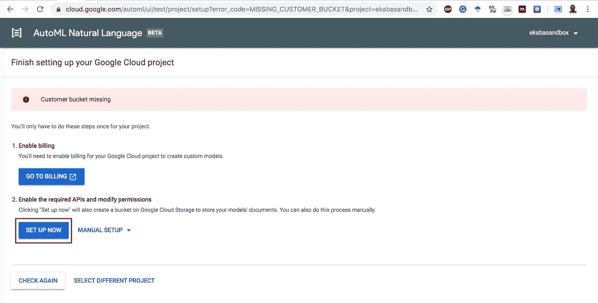
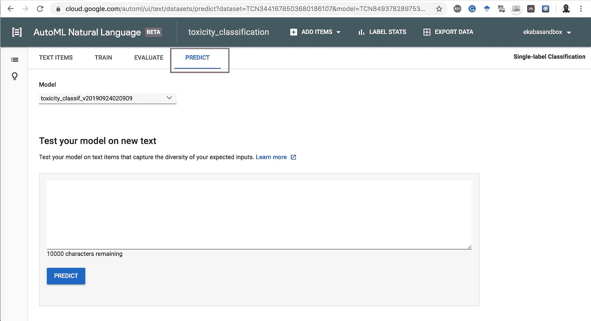

# 建立语言毒性分类模型

> 原文：<https://towardsdatascience.com/building-a-language-toxicity-classification-model-b006ae6981a4?source=collection_archive---------30----------------------->

## 使用谷歌云自动语言


Left: Jigsaw (Conservation AI). Right: AutoML for Natural Language

在线社区是互联网互动的重要组成部分。这种社区的兴起伴随着对社区节制的需要，以确保参与者遵守他们规定的指导方针，并避免“清楚和明显”的和客观的政策违反。

由于存在怀有恶意的不良行为者，节制工作带来了特殊的挑战。其中之一是由于不良行为者的规模，花费在调节在线社区上的时间。更重要的是，这些违规行为的数量可能会导致他们中的一些人越过版主，并且在特定的社区中可能是极其危险的。一个例子是一个淫秽文本在一个 K-12 儿童的在线社区中通过了版主。

此外，适度的工作可能会导致其他挑战，如判断的一致性，更重要的是，由于不断接触图形和淫秽材料，心理上的危险。

Google Cloud AutoML for Natural Language 为语言识别用例提供了设计和开发定制语言模型的平台。本文使用 Google Cloud AutoML for Natural Language 开发了一个端到端的语言毒性分类模型来识别淫秽文本。使用神经架构搜索和转移学习的概念来寻找最佳网络架构和最佳超参数设置，以提高模型的性能。

# 关于数据集

这个项目使用的数据来自 Jigsaw 和 Google 在 Kaggle 上发起的[有毒评论分类挑战。数据被修改为具有 16，000 个有毒和 16，000 个无毒单词的样本作为输入，以在 AutoML NLP 上构建模型。](https://www.kaggle.com/c/jigsaw-toxic-comment-classification-challenge)

# 第 1 部分:在 GCP 上启用自动语言

(1).去云控制台:【https://cloud.google.com/ 


Google Cloud Homepage

(2).通过单击 GCP 仪表盘左上角的三连破折号打开 Cloud AutoML 自然语言。选择人工智能产品部分下的 ***自然语言*** 。


Open AutoML Natural Language

(3).选择自动自然语言下的文本分类。


Text Classification under AutoML Natural Language

(4).设置项目 API、权限和云存储桶，以存储用于建模和其他 AutoML 资产的文本文件。



Setup Project APIs and Permissions

(5).询问时，从下拉列表中选择您的 GCP 帐单项目。现在我们准备创建一个数据集，用于在 AutoML 上构建定制分类模型。在将原始数据集从 Kaggle 下载到云存储并准备好用于 AutoML 建模的数据后，我们将返回这里。

在这种情况下，自动创建的 bucket 被称为:g **s://ekabasandbox-lcm** 。

# 第 2 部分:将数据集下载到 Google 云存储中

(1).激活**云外壳**(红色圆圈中)以启动临时 VM 实例来存放从 Kaggle 下载的数据集，将其解压缩并上传到存储桶。


Activate Cloud Shell

(2).安装 Kaggle 命令行界面。这个工具将允许我们从 Kaggle 下载数据集。运行以下代码:

```
sudo pip install kaggle
```

但是，请注意，云外壳实例是短暂的，当会话结束时，它不会保存系统范围内的更改。此外，如果数据集特别大，还有其他选择，例如启动计算虚拟机，下载数据集，将其解压缩，然后上传到云存储。可以设计其他高级数据管道，将数据输入 GCP 进行分析/机器学习。

(3).下载 Kaggle API 令牌密钥，使 Kaggle CLI 能够针对 Kaggle 进行身份验证/授权，以下载所需的数据集。

*   登录您的 Kaggle 帐户。
*   前往:[https://www . ka ggle . com/[ka ggle _ USER _ NAME]/账号](https://www.kaggle.com/[KAGGLE_USER_NAME]/account)
*   点击:创建新的 API 令牌。


Create API Token

*   将令牌下载到您的本地机器，并将其上传到云 shell。


*   将上传的`.json`键移动到目录`.kaggle`中。使用下面的代码:

```
mv kaggle.json .kaggle/kaggle.json
```

(4).从 Kaggle 下载数据集到 Google 云存储。

```
kaggle competitions download -c jigsaw-toxic-comment-classification-challenge
```

(5).解压缩下载的数据集

```
unzip jigsaw-toxic-comment-classification-challenge.zip
```

(6).将数据集从临时云外壳实例移动到创建的云存储桶。在此插入您的存储桶名称。

```
gsutil -m cp -r train.csv test.csv gs://**ekabasandbox-lcm**/toxicity/
```

# 第 3 部分:为建模准备数据集

(1).在谷歌云 AI 平台上推出 Jupyter 笔记本。


Notebooks of GCP AI Platform

(2).创建新的笔记本实例。


Start a new JupyterLab instance

(3).选择实例名称并创建。


Choose an instance name and create

(4).打开 JupyterLab。


Open JupyterLab

(5).在使用 AutoML Cloud 自然语言构建自定义语言分类模型之前，必须以特定格式准备数据集:

1.  培训输入可以是(.txt)格式或作为(.csv)文件。多个文本可以组合成一个压缩的(。zip)文件。
2.  对于此项目，文本文件放置在子文件夹中，其输出标签作为文件夹名称。这在以后用于创建包含数据文件路径及其标签的 CSV 文件。文件夹结构示例如下所示:
    →【文件】
    — →【有毒】
    — →【干净】
3.  接下来，生成一个指向文本路径及其相应标签的 CSV。云 NLP 使用 CSV 文件指向训练文档或单词的位置及其对应的标签。CSV 文件放在配置 AutoML NLP 时创建的同一个 GCS 存储桶中。在我们的例子中，这个桶被命名为 gs:// **ekabasandbox-lcm** 。

(6).从 Github 克隆预处理脚本。点击用红色圈出的图标，输入 Github URL[https://Github . com/dvdbisong/automl-toxity-classification . git](https://github.com/dvdbisong/automl-toxicity-classification.git)，用预处理代码克隆 repo。


Clone preprocessing script

(7).运行笔记本`nlp_preprocessing.ipynb`中的所有单元格，创建包含图像路径和标签的 CSV 文件，并将该文件上传到云存储。


Run notebook cells

# 第 4 部分:用 Cloud AutoML 自然语言建模

(1).从 AutoML 自然语言仪表板中单击“新建数据集”。


Create New Dataset

(2).填写数据集名称，并从 AutoML 创建的云存储桶中选择 CSV 文件。


Create Dataset

(3).现在，如果您看到错误消息“找到重复的文件”,您可以退出。据我所知，从文件名来看，情况并非如此。


Cloud AutoML Processed Text

(4).点击**列车**，如上图红色所示，启动 Cloud AutoML 建模。


Start AutoML Training

(5).开始模特训练。


Train the New Model

(6).模型训练完成后，单击“评估”查看模型的性能指标。


Evaluate model performance

(7).评估性能指标(精确度、召回率和混淆矩阵)。


Evaluation page. Left: Precision and Recall score. Right: Confusion matrix and precision, recall graphs

# 第 5 部分:测试模型

(1).点击**预测**选项卡测试模型。



Predict model

(2).我们可以通过从维基百科传入关于尼日利亚的介绍性文本来探索这个模型。我们期望模型预测是**干净的。**通过进一步探索，该模型在“清晰明显”的有毒样本上表现良好。


Model test: clean text prediction

定制语言分类模型也作为 REST 或 Python API 公开，用于集成到软件应用程序中，作为推理的预测服务。

# 第六部分:结论

本文提供了一个通过利用 Google 云平台 AutoML 自然语言为定制用例设计强大的语言分类模型的演练。此外，该模型托管在云上，用于作为预测服务进行推理。这是构建和部署语言分类产品的强大机制。我相信这个示例可以作为使用 AutoML 构建自然语言产品的模板。最后，确保删除不再需要的模型和数据集，这将节省云成本。

本文节选自 Apress (Springer Nature)出版的《在 Google 云平台上构建机器学习和深度学习模型》一书。