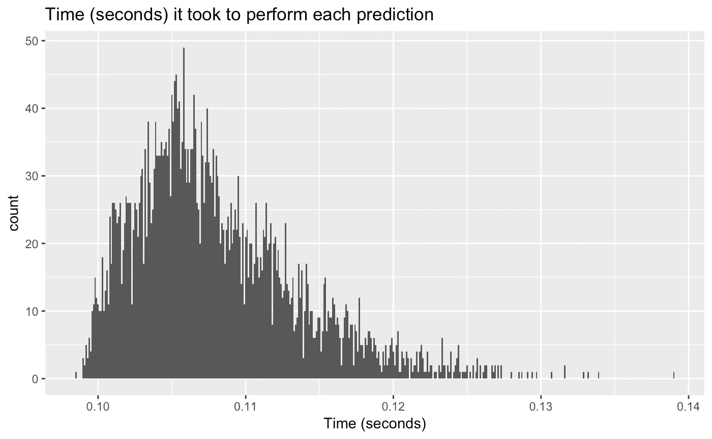

# 在 Go 中构建英雄联盟团队推荐器

> 原文：<https://towardsdatascience.com/building-a-league-of-legends-champions-recommender-system-in-go-and-how-to-deploy-it-in-the-cloud-1ee7a4fb55ee?source=collection_archive---------13----------------------->

## 如何从头开始构建推荐系统，并部署在云中

自从机器学习的热潮开始以来，我们在线生活的许多方面都成为了它的目标。特别是，它的主要用例之一——**推荐系统**——在我们的生活中变得如此普遍，以至于有时我们会忘记它们的存在。这些智能平台试图向我们推荐一些东西——在许多情况下，我们甚至不知道它的存在——基于我们以前互动过的其他东西，即购买、选择、看到的东西。购物、选择吃什么、浏览电影库等日常活动是智能推荐功能增强的部分任务。

尽管推荐系统隐约出现在我们数字生活的几个方面，但一个或多或少没有被它触及的领域是视频游戏领域。

迄今为止，一些作者和研究人员已经撰写和开发了关于游戏推荐系统的论文和项目。他们中的大多数探索概念，例如一个人基于其先前的游戏选择购买游戏的可能性有多大，例如，喜欢口袋妖怪的人可能喜欢马里奥，或者基于特征和概念的选择，例如，喜欢运动的人可能喜欢最新的篮球或足球游戏。这些项目的细节是，它们是围绕视频游戏作为一种产品，作为你购买的东西，更像是一个推荐电影的系统，它们都不是游戏本身的实现功能。

很久以前，游戏只是一个简单的软件，你可以把它交上去，完成故事，然后继续前进。今天的游戏已经变得更加**复杂**、**互联**和**社交**。对于复杂这个术语，我指的是玩家在游戏中必须做出的高级决策选择。关于连接性，我指的是每天都有更多的游戏是“仅限在线”的，甚至提供购买、广告和实施被称为*游戏即服务*的商业模式。最后，今天的游戏更加社会化——有些游戏在同一个区域有 100 名玩家，有些大型在线游戏有成千上万的用户共享一个世界，甚至有些游戏可以让我们将其体验带到其他外部平台，如专有的类似社交的中心。

将这三种属性混合在一起，我们就可以把它看作是一个数据生成器。诸如玩家在游戏中做出的决定，或者玩家参与的每个队友，以及比赛的每个结果都是我们可以跟踪、分析并最终从中学习的数据点。

在这篇文章中，我介绍了一个我用 **Go** 为游戏**英雄联盟** (LoL)从头开始构建的推荐系统。LoL 是一个多人在线战场游戏(MOBA ),有两个由五名玩家组成的队伍(默认模式)互相竞争。用通俗的话来说，我们可以把游戏的目标总结成下面这句话:每支队伍都必须在对方队伍消灭你的队伍之前到达对方队伍的中枢(被称为 Nexus)并摧毁它。这项任务并不容易，因为每一方都有防御建筑、物品和爪牙来阻碍你的每一步。然而，LoL 的真正复杂性在于战士，或者像他们在游戏中所说的**冠军**。


Choices

英雄联盟有 141 个冠军(实验时)，没有一个是完美的；他们有弱点，也有优点，有些擅长某些任务，有些则很糟糕。在每场比赛开始时，每个选手都要选出自己的冠军。然而，在游戏中选择冠军有特定的规则，更重要的是冠军不能被复制，也就是说每个冠军只能有一个副本。这个规则有一些罕见的例外，甚至更多的限制，例如每个玩家选择其冠军的顺序，但为了简单起见(在这个项目的第一个版本中)，系统不会考虑这些情况。

我创建的推荐系统处理那些冠军，它的目的是**推荐一个完整的团队组成**，也就是每个玩家应该选择的五个冠军。此外，除了拥有一个推荐系统之外，我的目标是构建一个完整的程序，通过 web 服务提供推荐服务。

在整篇文章中，我解释了设计系统的所有步骤，包括数据收集过程、基准测试和推荐算法。此外，我还描述了如何将项目转移到 Docker 容器中，并使用部署在云中的 web 服务公开建议。

哦，我不属于暴乱游戏。这个作品呈现了我为了好玩而做的一个项目:)。

# 这些建议

这个项目的中心愿景是为英雄联盟比赛推荐一个完整的团队组成，即由五个不同的冠军组成的团队。这些建议，基于以前看到的训练数据，应该(希望！)好到可以用在真实的游戏里。

# 该算法

该系统采用了一种基于邻域的协同过滤算法，该算法使用 **k-NN** (k-nearest neighbors)来查找其最近的对象。在训练时，因为 k-NN 是一个懒惰的学习者，所以模型不会学习一个目标函数。相反，一旦向系统发出预测请求，它将“记忆”数据并从中进行归纳。在这个预测阶段，该算法从它的搜索空间循环通过每一个训练样本，并计算它们和输入特征向量之间的距离。一旦完成距离的计算，它们将按降序排列，算法最终返回前 N 个项目。

该算法的输入是一个不完整的团队组成，换句话说，是一个冠军名单，由其中的一个、两个、三个或四个组成。输出是一个完整的团队组成，由算法认为最合适的五个冠军组成。例如，输入向量`[ashe, drmundo]`可能会返回`[ashe, drmundo, masteryi, yasuo, zyra]`。


The recommender system is wondering what’s the best recommendation. Champions images taken from [https://na.leagueoflegends.com/en/game-info/champions/](https://na.leagueoflegends.com/en/game-info/champions/). Robot icon was taken from [https://www.flaticon.com/authors/smashicons](https://www.flaticon.com/authors/smashicons)

# 数据

我通过 Python 包装库 [Riot-Watcher](https://github.com/pseudonym117/Riot-Watcher) 从 Riot Games 的英雄联盟 API 获得了用于训练系统的数据。获得最终的数据集并不是一个简单的过程，因为我需要的数据是获胜球队的组成，换句话说，我想知道哪五个冠军赢得了比赛。然而，除了返回当前正在进行的特征匹配的端点之外，没有从过去的随机匹配中获得数据的直接方法。那么，我们如何从这里着手呢？

这里的主要目标是获得许多比赛 id，这样我们就可以使用这些 id 来获得关于比赛的信息，特别是球队组成和比赛结果(谁赢了)。我的第一步是使用*“特色游戏”*端点来检索所述特色比赛的玩家的召唤师姓名。然后我调用了召唤师(玩家)端点，使用召唤师名字作为参数来获取它的匹配和参与者；这样做的目的是获得尽可能多的帐户 id。这些帐户 id 随后被用来获取更多的匹配 id，这些 id 最终在*“match”*端点中被用来获取我需要的数据。

顺便提一下，我应该提到 Riot API 有速率限制，所以收集数据的过程需要几天时间。我还想声明，我这样做是出于好意。在任何时候，我的目标都不是误用或滥用系统，所以这似乎是不道德的，或者如果有人——主要来自 Riot——认为我应该取消这个解释，请与我沟通。

所以，我们终于有了数据。然而，它不是有用的形状，因此作为所有与数据相关的东西，我不得不花一些时间处理我的数据，将它转换成一个由`N`行(每个观察)和`M`列组成的数据集，其中每一列代表一个冠军。如果所述冠军是团队配置的一部分，则这些行的值是`0`或`1`。我的最终数据集的形状是 110064 x 141。

# 推荐引擎

尽管推荐算法是该系统的核心，但其他几个功能改善了整个引擎。首先，在算法中，有距离的概念，这是一个对象(模型搜索空间中的一个团队)与另一个对象之间距离的度量。然后，我们有了我命名为**拦截**和**偶然发现**推荐以及**洗牌**操作的概念。这三个是我在系统中实现的增强技术，用于修改推荐输出。最后，该平台还包含一个 web 服务形式的抽象层，用于向用户提供推荐。在接下来的小节中，我将详述这些设计。

## 距离

在预测期间，该算法计算训练样本和给定输入向量之间的距离，以找到最接近的团队配置。因为这是算法的重要部分，所以我实现了四种不同的距离方法，用户可以在执行预测之前选择这四种方法。这些是**欧几里德**和**曼哈顿**距离、**余弦相似度**和**皮尔逊相关度**。对于后一个，皮尔逊相关性，我修改了它，因为我想和其他的保持一致，最小值为零。

## 洗牌

**shuffle** 是我添加的一个可选操作，它打乱了算法在向量空间中循环计算距离的顺序。否则，向量空间总是按照加载每个训练示例的顺序来遍历，例如，第 1 行、第 2 行、第 3 行等等。我将在下一个例子中解释我为什么这样做。

假设我们有由三个观察值组成数据集:X，Y，Z(按照精确的顺序)，且我们想要得到输入向量`I`的单个预测(用`k=1`)。系统所做的是计算`(X, I)`与`(Y,I)`和`(Z,I)`之间的距离。

现在想象一下`(X, I)`和`(Y, I)`之间的距离完全相同。在这种情况下，在对距离排序后(如算法部分所述)，算法总是推荐团队组成 X，因为它在 y 之前。

然而！如果我们打乱算法遍历训练集的顺序，我们可能会遇到算法首先计算`(Y, I)`而不是`(X, I)`之间的距离的情况，在这种情况下，推荐的团队是 y

这个有用吗？很难说。

## 拦截推荐

为了让推荐更容易阅读和理解，我实现了一个我称之为**截取推荐**的东西。通常，默认情况下，推荐的输出是 k 个团队组成的列表，其中 k 是所选邻居的数量。这个列表的问题是，它没有直接指出哪一个团队应该是最好的。相反，用户应该根据自己的知识最终决定应该使用 k 组中的哪一个。

截距推荐所做的是计算所有 k 个推荐团队的截距，以返回出现在所有 k 个推荐中的冠军，因此用户不是有几个可能的团队，而是收到一个可能的和最合适的冠军列表，这些冠军对于其团队来说应该是最佳的。

例如，假设一个带有`k=3`的普通推荐返回`[1,2,3,4,5`、`[29,10,2,3,8]`和`[3,4,2,22,81]`。在截距推荐下，输出将是`[2,3]`，因为这些冠军出现在三个原始推荐中。

## 偶然推荐

**偶然发现的推荐**是一种推荐模式，通过向算法的输出添加额外的团队组成(在预测步骤中计算)来增强。在推荐系统中，意外收获的概念代表了获得可能让用户感到惊讶的推荐的想法，或者如论文 [*通过协作方法引入意外收获*](https://digitalcommons.uri.edu/cgi/viewcontent.cgi?article=1455&context=theses) *，*“找到好的或有用的东西，而
没有专门搜索它。”

该算法获得特殊的偶然推荐(在已经计算了正常推荐的项目之后)所采取的步骤如下:

1.  获取下 k 个最接近的项目，其中 k 是邻居的数量。换句话说，如果是`k=3`，那么算法会在之前找到的推荐之后寻找三个推荐(有点像使用`k=6`)。
2.  构建一个包含所有冠军的频率(出现次数)的数组，以了解每个冠军的计数。
3.  根据频率使用前 5 名冠军创建新的推荐。

这个特性背后的直觉是增加搜索空间(通过上升`k`)来找到出现最多的冠军。这种方法的主要优点是，系统正在构建一个全新的团队，否则无法根据频率找到。然而，另一方面，配置可能是可怕的。

## 网络服务

这个项目的主要目标之一是向外界提供建议。因此，我编写了一个简单的 REST API，将系统的“推荐”组件包装在一个端点下。我命名为“推荐”的这个端点接收一个 JSON 作为输入，它应该遵循以下结构(这是 Go 代码):

```
type PredictionInput struct {
    Champions   []string `json:"champions"`
    Intercept   bool     `json:"intercept"`
    Shuffle     bool     `json:"shuffle"`
    Serendipity bool     `json:"serendipity"`
}
```

首先，JSON 需要一个冠军的列表，也就是我们当前的团队，或者我们希望使用推荐完成的团队。除此之外，JSON 接受三个布尔值，指定算法是否应该计算截距或意外发现推荐，或者执行洗牌。

为了编译和运行服务，从项目的根目录执行`make run-service-local`，或者如果你已经安装了 **Docker** ，命令`make run-service-docker`下载并运行图像。

当服务正在运行时(无论是在本地还是从 Docker)，执行如下命令以获得建议。：

```
$ curl -d '{"champions":["jax", "ashe"], "intercept": true}' -H "Content-Type: application/json" -X POST [http://localhost:8080/recommend](http://localhost:8080/recommend)
```

## 云部署

有了文档化的推荐引擎和服务于推荐的 web 服务，我的下一步是让每个人都可以访问这个系统。因此我选择将它部署在云平台应用程序 Heroku 中。

在 Heroku 中部署 Docker 映像是一个相当简单的过程。创建新帐户后，转到项目的根目录(或任何包含 docker 文件的目录)并执行:

`$ heroku container: login`登录注册表容器

这个命令用一个随机生成的名字命名应用程序(我的名字是 *evening-citadel*

`$ heroku container:push web -a name_of_app`推送 Docker 图像

`$ heroku container:release web -a name_of_app`释放它。

如需进一步说明，请访问:[https://dev center . heroku . com/articles/container-registry-and-runtime](https://devcenter.heroku.com/articles/container-registry-and-runtime)。

我的网络应用程序在 http://evening-citadel-74818.herokuapp.com[的](http://evening-citadel-74818.herokuapp.com)可用

要查询它，运行前面的命令，但是用地址替换 localhost。像这样:

```
$ curl -d '{"champions": ["ashe", "drmundo"], "intercept": false, "shuffle": true}' -H "Content-Type: application/json" -X POST [http://evening-citadel-74818.herokuapp.com:80/recommend](http://evening-citadel-74818.herokuapp.com:80/recommend)
```

注意:系统是在自由层机器上运行的，所以如果它关闭或变慢，请提前道歉。还有，不要滥用:)

## 基准

懒惰学习者算法，比如这个实验中使用的算法，通常比它的对手，渴望学习者要慢。这种系统不会从训练数据中进行归纳，因此出现了“懒惰”一词，直到收到预测请求。然后，在预测阶段，算法必须扫描完整的训练集来计算其结果。为了了解我的系统的延迟，我对一个 4000 行的测试数据集进行了测试，以收集关于预测每个建议所用时间的数据。在下图中，我们可以看到时间(以秒为单位)如何类似于右偏分布，这表明在一些情况下，预测时间远离平均值。然而，由于这些值本身非常小，几毫秒的差异是不明显的。



# 总结和结论

本文一步一步地解释了如何从头构建一个用 Golang 编写的基于邻居的推荐系统来预测英雄联盟冠军，以及如何在 Heroku 中部署它。首先，我提到了视频游戏中推荐系统的现状和这个项目的前景。接下来，我解释了算法、数据和获取数据的步骤。然后我们进入了系统的细节，了解了它的特性和云部署流程。最后，我展示了一些基准。

我应该提到的是，这个引擎既不完美也不完整，它是我们如何为视频游戏建立推荐系统的概念证明。英雄联盟和游戏的冠军选择组件涉及更复杂的过程，如禁止冠军(任何玩家都不能使用的冠军)，以及每个玩家选择其冠军的顺序。这些过程需要高水平的专业知识，这是不容易自动化或学习的。

在未来，我想添加更多的功能，如自动更新数据集，按游戏类型过滤推荐，甚至尝试在算法中添加“球员位置”的概念。

关于如何使用该服务的代码、脚本、说明以及本文中介绍的所有内容都可以在我的 GitHub 上获得(见下面的链接)，所以我想邀请人们贡献并试验这个项目或服务(同样，请不要滥用它)。

[](https://github.com/juandes/lol-recommendation-system) [## juandes/lol-推荐系统

### 用 Golang 写的基于邻居的推荐系统推荐英雄联盟的队伍…

github.com](https://github.com/juandes/lol-recommendation-system) 

感谢阅读，希望你从中有所收获。如果你有任何问题，评论，疑问，或者想聊天，请在这里留下评论，或者在 Twitter 上给我写信，我很乐意帮助你。

[](https://twitter.com/jdiossantos) [## 胡安·德迪奥斯·桑托斯(@ jdiosantos)|推特

### 胡安·德迪奥斯·桑托斯的最新推文(@ jdiossantos)。机器学习/数据工程师。还有，口袋妖怪大师，还有…

twitter.com](https://twitter.com/jdiossantos)