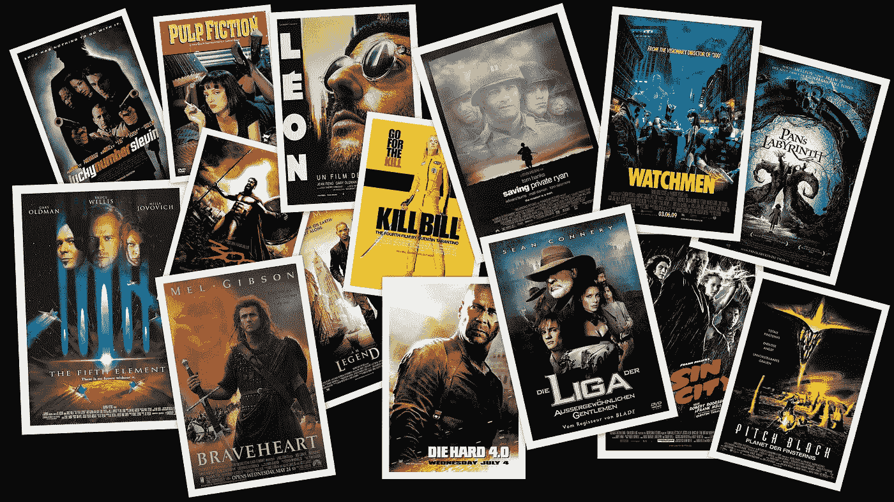
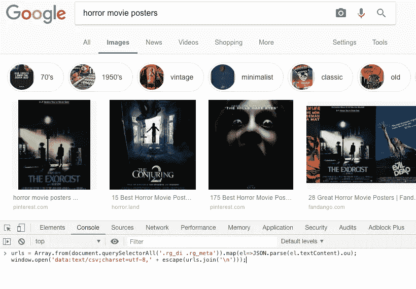
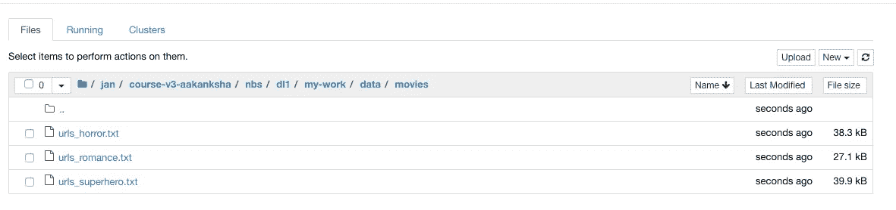
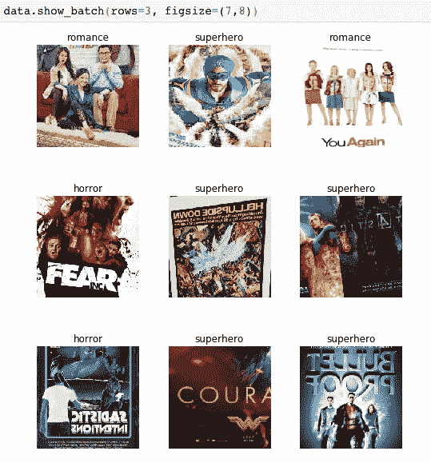
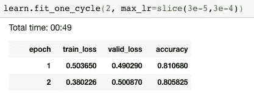
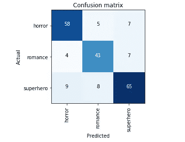
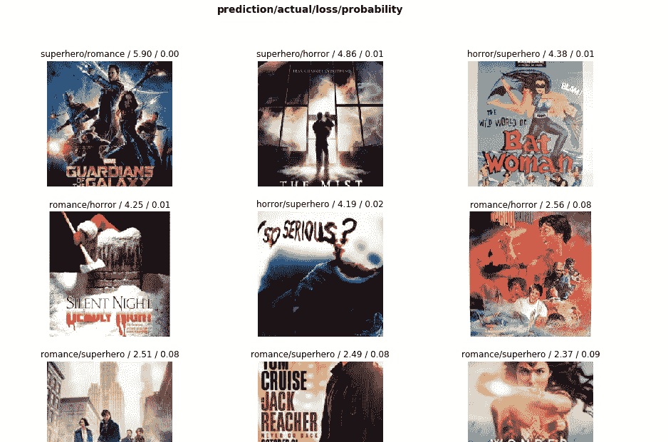
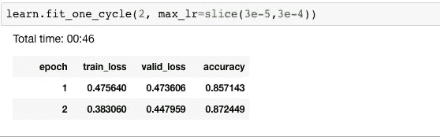
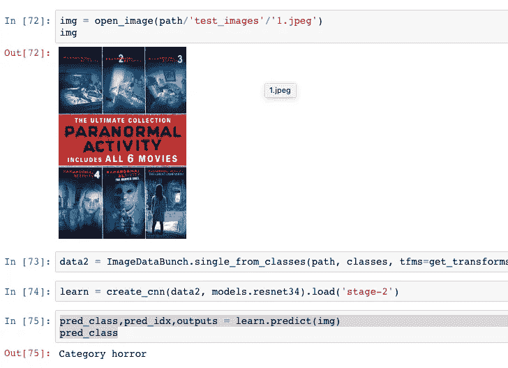
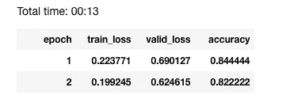

# 使用使用谷歌图像创建的数据集的电影流派分类器

> 原文：<https://towardsdatascience.com/building-a-movie-genre-classifier-using-a-dataset-created-using-google-images-4752f75a1d79?source=collection_archive---------20----------------------->

## 使用 fast-ai



source: [wallpaperup](https://www.wallpaperup.com/205901/movies_digital_art_collage_movie_posters_fan_art.html)

在为分类问题构建数据库时,“谷歌图片”是找到相关图片的绝佳来源。就拿电影海报按流派分类的问题来说吧。我们将选三门重叠最少的课:爱情、恐怖和超级英雄。

# 创建数据集

## 获取 URL 列表:

第一步是获取一个我们可以下载图片的 URL 列表。为此，进入[谷歌图片](http://images.google.com/)，搜索你感兴趣的图片。向下滚动，直到你看到所有你想下载的图片，或者直到你看到一个按钮，上面写着“显示更多结果”。你滚动过的所有图片现在都可以下载了。要了解更多信息，请点击按钮，然后继续滚动。Google Images 显示的最大图片数量为 700 张。

在 Windows/Linux 中按 Ctrl+Shift+J，在 Mac 中按 Cmd+Opt+J，打开 JavaScript 控制台。使用以下几行 JS 代码获取 URL 并将它们保存到一个文件中:

```
urls **=** Array.from(document.querySelectorAll('.rg_di .rg_meta')).map(el**=>**JSON.parse(el.textContent).ou);
window.open('data:text/csv;charset=utf-8,' **+** escape(urls.join('\n')));
```



Source: Horror movie posters on [Google images](https://www.google.com/imghp?hl=en)

然后，我们将 URL 的文件上传到我们的工作目录，在为我们的电影数据集创建的文件夹中:



## 下载图像和查看数据:

我们可以使用 fast.ai 提供的`download_images`函数下载所有使用 URL 文件的图像，并使用‘show _ batch’函数查看它们:



# 训练模型

既然我们的数据集已经准备好了，我们就可以训练模型了。我使用 ResNet-34 模型的预训练权重进行迁移学习。



我们现在有 80.5%的准确率。

# 解释

很多时候，低准确性是由于数据集的问题，例如训练或验证集中的错误标记的图像、可能属于多个高概率类的图像等。我们可以按如下方式查看混淆矩阵和最混淆的图像:



在大多数情况下，我们可以清楚地看到分类器混淆的原因。例如，第一张电影海报(银河护卫队)在我们的数据集中被错误地标记为“浪漫”，第二张图像没有任何恐怖的成分，因此被标记为“恐怖”，第五张海报(蝙蝠侠)看起来很像“恐怖”电影海报，第六张海报似乎有点不相关，第八张海报(侠探杰克)甚至对于一个人来说，仅仅看一眼海报(没有任何其他背景)并将其归类为“超级英雄”电影是不可能的。

# 清理

既然我们已经确定了导致问题的图像，我们可以通过删除问题图像来清理我们的数据集。我们可以使用 fast.ai 提供的“ [ImageCleaner](https://github.com/fastai/fastai/blob/master/fastai/widgets/image_cleaner.py#L81) ”小部件，或者编写一个自定义函数来查看损失最大的图像，并删除我们认为有问题的图像(确保不要删除您认为分类器分类错误的图像，尽管它们显然属于给定的标签)。此外，创建原始数据集的副本，以防万一你想回到旧版本。

完成清洁后，再次训练模型，看看是否有任何改进。

以下是我清理数据集并再次训练后的结果:



# 测试我们的分类器

找到一个不属于数据集的图像来测试您的分类器。将其上传到您的工作目录，并按如下方式进行测试:



# 实验:

为了尝试和改进分类器，我想到并尝试了一些技术:

1.  **减少训练图片的数量**:这背后的动机是当你在谷歌图片搜索中向下滚动时，图片变得不那么相关。因此，为了确保我不会在我的数据集中看到许多不相关的图片，我将每个类的图片数量限制为 80 张。解冻前我得到了 68.8%的准确率，解冻后得到了 82.2%的准确率。即使在清理之后，准确率也没有提高多少，事实上，因为图像的数量更少，所以准确率更低了。这清楚地表明，为了有一个训练有素的模型，我们需要有大量的数据。



2.**增加训练图像的数量**:通过使用 600 张图像，我注意到不解冻的准确率下降到 43%，解冻一次清理后，我能达到的最高准确率是 49.4%。低精度很可能是因为存在更多的不相关图像，如前一点所述。事实证明，最好有较少但相关的图片。

3.**精选图片:**尽管在大多数情况下非常不切实际，但尝试在每个类别中精选大约 100 张图片并观察结果会很有趣。

4.**用 resnet50 代替 resnet34 进行迁移学习**:在迁移学习中，我们使用的基础模型非常重要。我们可以尝试不同的模型，挑选最好的一个。

5.**增加/改变课程**:在这个实验中，我注意到恐怖和超级英雄电影海报有一个非常相似的主题(黑暗、阴郁、严肃)，尝试更多互斥的课程可能会得到更好的结果。

# 观察

我们的分类器已经大致了解了这三种类型的典型电影海报的外观。虽然我们已经尽量减少重叠课，但事实证明，很多超级英雄电影海报看起来很恐怖，恐怖电影海报看起来很浪漫等等。然而，87.2%的准确率已经相当不错了，因为我们是从零开始构建数据集的，而且类别重叠的几率很高。