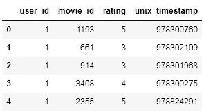
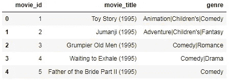
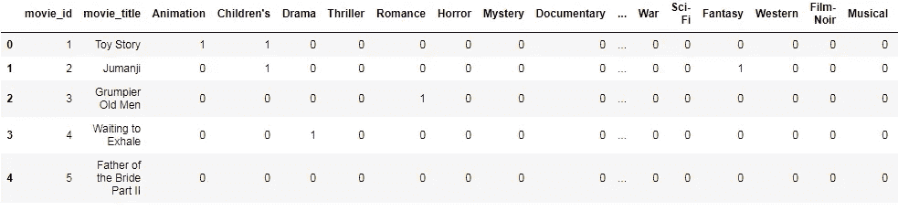
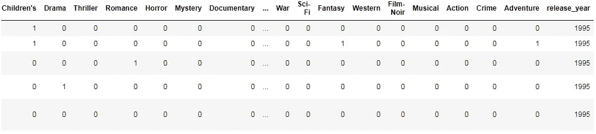

# 使用熊猫构建电影推荐引擎

> 原文：<https://towardsdatascience.com/building-a-movie-recommendation-engine-using-pandas-e0a105ed6762?source=collection_archive---------9----------------------->

## 探索推荐引擎背后的基本直觉。


# 概观

推荐引擎是基本上计算两个实体之间相似性的程序，在此基础上，它们给我们有针对性的输出。如果我们看看任何推荐引擎的根源，它们都试图找出两个实体之间的相似性。然后，所计算的相似性可以用于推导各种类型的推荐以及它们之间的关系。

**推荐引擎大多基于以下技术:**

1.  基于流行度的过滤。
2.  协作过滤(基于用户/基于项目)。
3.  基于混合用户项目的协同过滤。
4.  基于内容的过滤。

## **基于人气的过滤**

推荐引擎最基本的形式是引擎向所有用户推荐最受欢迎的项目。这将是普遍的，因为每个人都会得到类似的建议，因为我们没有个性化的建议。这些类型的推荐引擎是基于**的基于流行度的过滤**。这种模式的使用案例是新闻网站上当天的“头条新闻”部分，在这里，不管每个用户的兴趣如何，对每个人来说最受欢迎的新闻都是一样的，因为这符合逻辑，因为新闻是一种一般化的东西，与用户的兴趣无关。

## 协同过滤

在协同过滤中，两个实体基于它们之间的某些相似性来协作推断推荐。这些过滤技术大致有两种类型:

1.  **基于用户的协同过滤:**在基于用户的协同过滤中，我们找出两个用户之间的相似性得分。基于相似性得分，我们将一个用户购买/喜欢的项目推荐给其他用户，假设他可能基于相似性喜欢这些项目。当我们着手实施时，这一点会更加清楚。主要的在线流媒体服务，**网飞**都有基于用户协同过滤的推荐引擎。
2.  **基于项目的协同过滤:**在基于项目的协同过滤中，项目的相似度是用现有用户正在消费的现有项目来计算的。然后，基于相似性的数量，我们可以说，如果用户 X 喜欢项目 A，并且新的项目 P 与项目 A 最相似，那么我们向用户 X 推荐项目 P 是非常有意义的
3.  **基于混合用户项目的协同过滤:**这种技术基本上是上述两种技术的适当混合，其中推荐不仅仅基于任一种。像亚马逊这样的电子商务网站采用这种技术向顾客推荐商品。
4.  **基于内容的过滤:**在这种技术中，向用户推荐他们以前最用过/看过/喜欢的相似内容。例如，如果用户一直在听相似类型的歌曲(比特率、bps、曲调等)。)，他将被推荐属于基于某些特征决定的相同类别的歌曲。这一类别最好的例子是 **Pandora Radio** ，这是一个音乐流媒体和自动音乐推荐网络电台服务。

## 编码和实现

我们有一个电影镜头数据库，我们的目标是使用 pandas 从头开始应用各种推荐技术，并找出用户、最受欢迎的电影和基于基于用户的协同过滤的目标用户个性化推荐之间的相似性。(我们只探索其中一种类型，因为这些文章是关于获得推荐引擎背后的基本直觉。)

我们正在从**数学**库中导入**熊猫**和一些基本的数学函数，并将数据集导入 dataframe 对象。

```
**# Importing the required libraries.**
import pandas as pd
from math import pow, sqrt**# Reading ratings dataset into a pandas dataframe object.**
r_cols = ['user_id', 'movie_id', 'rating', 'unix_timestamp']
ratings = pd.read_csv('data/ratings.dat', sep='::', names=r_cols,
 encoding='latin-1')**# Getting number of users and movies from the dataset.**
user_ids = ratings.user_id.unique().tolist()
movie_ids = ratings.movie_id.unique().tolist()
print('Number of Users: {}'.format(len(user_ids)))
print('Number of Movies: {}'.format(len(movie_ids)))**Output:** Number of Users: **6040**
Number of Movies: **3706**
```

这是我们的数据集的前 5 行的样子。



Ratings Dataset

在这个数据集中，我们有 4 列和大约 1M 行。除了， **unix_timestamp，**所有的列都是自解释的。无论如何，我们不会在代码中使用这个列。接下来，让我们看看我们的电影数据集是什么样子的。

```
**# Reading movies dataset into a pandas dataframe object.**
m_cols = ['movie_id', 'movie_title', 'genre']
movies = pd.read_csv('data/movies.dat', sep='::', names=m_cols, encoding='latin-1')
```



Movie Dataset

所有的列名都是不言自明的。如上面的数据帧所示，**类型**列包含带有管道分隔符的数据，这些数据不能作为建议进行处理。因此，我们需要为每个流派类型生成列，这样，如果电影属于该流派，其值将为 1，否则为 0(类似于一种热门编码)。此外，我们需要从 **movie_title** 列中分离出年度发布，并为其生成一个新列，这也是一个新的重要特性。

```
**# Getting series of lists by applying split operation.**
movies.genre = movies.genre.str.split('|')**# Getting distinct genre types for generating columns of genre type.**
genre_columns = list(set([j for i in movies['genre'].tolist() for j in i]))**# Iterating over every list to create and fill values into columns.**
for j in genre_columns:
    movies[j] = 0
for i in range(movies.shape[0]):
    for j in genre_columns:
        if(j in movies['genre'].iloc[i]):
            movies.loc[i,j] = 1**# Separting movie title and year part using split function.**
split_values = movies['movie_title'].str.split("(", n = 1, expand = True)**# setting 'movie_title' values to title part.**
movies.movie_title = split_values[0]**# creating 'release_year' column.**
movies['release_year'] = split_values[1]**# Cleaning the release_year series.**
movies['release_year'] = movies.release_year.str.replace(')','')**# dropping 'genre' columns as it has already been one hot encoded.**
movies.drop('genre',axis=1,inplace=True)
```

以下是数据帧处理后的样子:



Data Frame View for Movies Dataset After Pre-Processing

现在，让我们写下一些在我们的代码中经常使用的 getter 函数，这样我们就不需要一遍又一遍地编写它们，这也增加了代码的可读性和可重用性。

```
**# Getting the rating given by a user to a movie.**
**def get_rating_(userid,movieid):**
    return (ratings.loc[(ratings.user_id==userid) & (ratings.movie_id == movieid),'rating'].iloc[0])**# Getting the list of all movie ids the specified user has rated.**
**def get_movieids_(userid):**
    return (ratings.loc[(ratings.user_id==userid),'movie_id'].tolist())**# Getting the movie titles against the movie id.**
**def get_movie_title_(movieid):**
    return (movies.loc[(movies.movie_id == movieid),'movie_title'].iloc[0])
```

## 相似性得分

在该实现中，将基于两个用户之间的距离(即欧几里德距离)并通过计算两个用户之间的皮尔逊相关来计算两个用户之间的相似性。

我们将编写两个函数，一个基于欧几里得距离计算相似性，另一个基于皮尔逊相关，这样你就知道我们为什么要编写两个函数了。

```
**def distance_similarity_score(user1,user2):**
    '''
    user1 & user2 : user ids of two users between which similarity        score is to be calculated.
    '''
    # Count of movies watched by both the users.
    both_watch_count = 0
    for element in ratings.loc[ratings.user_id==user1,'movie_id'].tolist():
        if element in ratings.loc[ratings.user_id==user2,'movie_id'].tolist():
            both_watch_count += 1
    if both_watch_count == 0 :
        return 0

    # Calculating distance based similarity between both the users.
    distance = []
    for element in ratings.loc[ratings.user_id==user1,'movie_id'].tolist():
        if element in ratings.loc[ratings.user_id==user2,'movie_id'].tolist():
            rating1 = get_rating_(user1,element)
            rating2 = get_rating_(user2,element)
            distance.append(pow(rating1 - rating2, 2))
    total_distance = sum(distance)

    # Adding one to the denominator to avoid divide by zero error.
    return 1/(1+sqrt(total_distance))print('Distance based similarity between user ids 1 & 310: {}'.format(distance_similarity_score(1,310)))Output:
Distance based similarity between user ids 1 & 310: **0.14459058185587106**
```

基于距离计算相似性得分有一个固有的问题。我们没有阈值来决定在计算用户是否足够近或足够远时要考虑两个用户之间的距离。另一方面，皮尔逊相关方法解决了这个问题，因为它总是返回-1 & 1 之间的值，这清楚地为我们提供了我们喜欢的接近度的边界。

```
**def pearson_correlation_score(user1,user2):**
    '''
    user1 & user2 : user ids of two users between which similarity score is to be calculated.
    '''
    # A list of movies watched by both the users.
    both_watch_count = []

    # Finding movies watched by both the users.
    for element in ratings.loc[ratings.user_id==user1,'movie_id'].tolist():
        if element in ratings.loc[ratings.user_id==user2,'movie_id'].tolist():
            both_watch_count.append(element)

    # Returning '0' correlation for bo common movies.
    if len(both_watch_count) == 0 :
        return 0

    # Calculating Co-Variances.
    rating_sum_1 = sum([get_rating_(user1,element) for element in both_watch_count])
    rating_sum_2 = sum([get_rating_(user2,element) for element in both_watch_count])
    rating_squared_sum_1 = sum([pow(get_rating_(user1,element),2) for element in both_watch_count])
    rating_squared_sum_2 = sum([pow(get_rating_(user2,element),2) for element in both_watch_count])
    product_sum_rating = sum([get_rating_(user1,element) * get_rating_(user2,element) for element in both_watch_count])

    # Returning pearson correlation between both the users.
    numerator = product_sum_rating - ((rating_sum_1 * rating_sum_2) / len(both_watch_count))
    denominator = sqrt((rating_squared_sum_1 - pow(rating_sum_1,2) / len(both_watch_count)) * (rating_squared_sum_2 - pow(rating_sum_2,2) / len(both_watch_count)))

    # Handling 'Divide by Zero' error.
    if denominator == 0:
        return 0
    return numerator/denominatorprint('Pearson Corelation between user ids 11 & 30: {}'.format(pearson_correlation_score(11,30)))Output:
Pearson Corelation between user ids 11 & 30: **0.2042571684752679**
```

## 最相似的用户

目标是找出与目标用户最相似的用户。这里，我们有两个指标来计算分数，即距离和相关性。现在，我们将为此编写一个函数。

```
def most_similar_users_(user1,number_of_users,metric='pearson'):
    '''
    user1 : Targeted User
    number_of_users : number of most similar users you want to user1.
    metric : metric to be used to calculate inter-user similarity score. ('pearson' or else)
    '''
    # Getting distinct user ids.
    user_ids = ratings.user_id.unique().tolist()

    # Getting similarity score between targeted and every other suer in the list(or subset of the list).
    if(metric == 'pearson'):
        similarity_score = [(pearson_correlation_score(user1,nth_user),nth_user) for nth_user in user_ids[:100] if nth_user != user1]
    else:
        similarity_score = [(distance_similarity_score(user1,nth_user),nth_user) for nth_user in user_ids[:100] if nth_user != user1]

    # Sorting in descending order.
    similarity_score.sort()
    similarity_score.reverse()

    # Returning the top most 'number_of_users' similar users. 
    return similarity_score[:number_of_users]print(most_similar_users_(23,5))Output:
**[(0.936585811581694, 61), (0.7076731463403717, 41), (0.6123724356957956, 21), (0.5970863767331771, 25), (0.5477225575051661, 64)]**
```

正如我们所看到的，输出是元组列表，指示使用用户 id 查询的前 5 个相似数量的用户相对于目标用户的相似性得分。这里使用的指标是皮尔逊相关。

我不知道是否很少有人注意到，最相似的用户的逻辑可以通过考虑其他因素，如年龄、性别、职业等来加强。这里，我们仅根据一个特征(即评级)创建了我们的逻辑。

## 为目标用户获取电影推荐

概念很简单。首先，我们需要只迭代那些没有被目标用户观看(或评级)的电影，以及基于与目标用户高度相关的用户的子设置项。这里，我们使用了加权相似性方法，其中我们考虑了评级和分数的乘积，以确保高度相似的用户比不太相似的用户对推荐的影响更大。然后，我们根据分数和电影 id 对列表进行排序，并根据这些电影 id 返回电影标题。让我们为此写一个函数。

```
def get_recommendation_(userid):
    user_ids = ratings.user_id.unique().tolist()
    total = {}
    similariy_sum = {}

    # Iterating over subset of user ids.
    for user in user_ids[:100]:

        # not comparing the user to itself (obviously!)
        if user == userid:
            continue

        # Getting similarity score between the users.
        score = pearson_correlation_score(userid,user)

        # not considering users having zero or less similarity score.
        if score <= 0:
            continue

        # Getting weighted similarity score and sum of similarities between both the users.
        for movieid in get_movieids_(user):
            # Only considering not watched/rated movies
            if movieid not in get_movieids_(userid) or get_rating_(userid,movieid) == 0:
                total[movieid] = 0
                total[movieid] += get_rating_(user,movieid) * score
                similariy_sum[movieid] = 0
                similariy_sum[movieid] += score

    # Normalizing ratings
    ranking = [(tot/similariy_sum[movieid],movieid) for movieid,tot in total.items()]
    ranking.sort()
    ranking.reverse()

    # Getting movie titles against the movie ids.
    recommendations = [get_movie_title_(movieid) for score,movieid in ranking]
    return recommendations[:10]print(get_recommendation_(32))Output:
**['Invisible Man, The ', 'Creature From the Black Lagoon, The ', 'Hellraiser ', 'Almost Famous ', 'Way of the Gun, The ', 'Shane ', 'Naked Gun 2 1/2: The Smell of Fear, The ', "Kelly's Heroes ", 'Official Story, The ', 'Everything You Always Wanted to Know About Sex ']**
```

正如我们在输出中看到的，我们已经使用度量皮尔逊相关性为用户 id 为 32 的用户获得了前 10 部强烈推荐的电影。你可以用欧几里得距离做同样的练习，我相信结果会不同。

## 学习和结论

我们通过使用熊猫和基本的数学库函数实现了一个电影推荐引擎。此外，我们了解了推荐引擎背后的基本直觉。显然，推荐引擎的功能远不止这些，因为有多种功能和因素会影响推荐，而不仅仅是评级。此外，在下一篇博客中，我们还将基于用户和电影的其他特征来实现和推断我们的推荐，并探索推荐引擎的臭名昭著的技术，即使用 **turicreate** 库的**矩阵分解**。

博客中代码的 GitHub 存储库可以在[这里](https://github.com/nishitjain/movie-recommendation-system-scratch)找到。