# 使用 BERT 和 TensorFlow 构建多标签文本分类器

> 原文：<https://towardsdatascience.com/building-a-multi-label-text-classifier-using-bert-and-tensorflow-f188e0ecdc5d?source=collection_archive---------1----------------------->

在**多标签分类**问题中，训练集由实例组成，每个实例可以被分配多个类别，这些类别被表示为一组目标标签，

*   一条短信可以同时涉及宗教、政治、金融或教育中的任何一个，也可以什么都不涉及。
*   一部电影可以根据其概要内容分为动作片、喜剧片和爱情片。一部电影有可能分成多种类型，比如浪漫喜剧。

[source](https://unsplash.com/photos/Ubhjpv7q0Pk)

与**多类**分类问题有何不同？

在**多类分类**中，每个样本被分配到一个且只有一个标签:水果可以是苹果或梨，但不能同时是两者。让我们考虑一个三类 C= ["太阳，"月亮，云"]的例子。在多类中，每个样本只能属于一个 C 类。在多标签情况下，每个样本可以属于一个或多个类别。

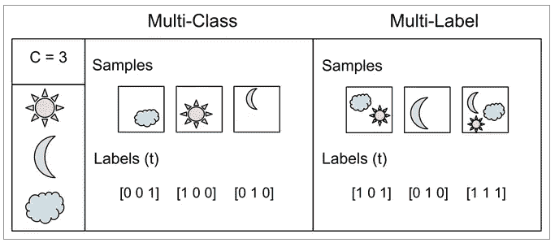

[Source](https://gombru.github.io/2018/05/23/cross_entropy_loss/)

## 资料组

对于我们的讨论，我们将使用 Kaggle 的 [***有毒评论分类挑战***](https://www.kaggle.com/c/jigsaw-toxic-comment-classification-challenge) 数据集，该数据集由大量维基百科评论组成，这些评论已被人类评级者标记为有毒行为。毒性的类型有:

`**toxic, severe_toxic, obscene, threat, insult, identity_hate**`

示例:

`“**Hi! I am back again! Last warning! Stop undoing my edits or die!**”`

被标记为[1，0，0，1，0，0]。意思是它既是`toxic` 又是`threat`。

关于数据集的详细 EDA，请参见此处的。

## 让我们简单地讨论一下伯特

2018 年 10 月，谷歌发布了一个新的语言表示模型，名为 **BERT** ，代表来自变形金刚的**双向编码器表示。** BERT 基于最近在预训练上下文表示方面的工作，包括[半监督序列学习](https://arxiv.org/abs/1511.01432)、[生成性预训练](https://blog.openai.com/language-unsupervised/)、 [ELMo](https://allennlp.org/elmo) 和 [ULMFit](http://nlp.fast.ai/classification/2018/05/15/introducting-ulmfit.html) 。然而，与这些之前的模型不同，BERT 是第一个*深度双向*、*无监督*语言表示，仅使用纯文本语料库([维基百科](https://www.wikipedia.org/))进行预训练。

预先训练的表示可以是 ***上下文无关的*** 或 ***上下文相关的***

1.  **上下文无关**模型，如 [word2vec](https://en.wikipedia.org/wiki/Word2vec) 或 [GloVe](https://nlp.stanford.edu/projects/glove/) 为词汇表中的每个单词生成单个[单词嵌入](https://www.tensorflow.org/tutorials/representation/word2vec)表示。例如，单词“ *bank* ”在“ *bank account* ”和“ *bank of the river”中具有相同的上下文无关的表示。*
2.  **上下文**模型代之以生成基于句子中其他单词的每个单词的表示。上下文表示还可以是单向的*或双向的*。例如，在句子“*我访问了银行账户*”中，基于“*我访问了*”而不是“*账户*”，单向上下文模型将表示“*银行*”然而，BERT 使用它的上一个和下一个上下文来表示“*银行*”——“我访问了 … *账户*”——从一个深度神经网络的最底层开始，使它成为深度双向的。

基于双向 LSTM 的语言模型训练标准的从左到右的语言模型，并且还训练从右到左(反向)的语言模型，该语言模型从随后的单词预测先前的单词，如在 ELMO。在 ELMo 中，前向语言模型和后向语言模型各有一个 LSTM。关键的区别在于，LSTM 没有同时考虑前一个和后一个记号。

## 为什么 BERT 优于其他双向模型？

直观地说，深度双向模型比从左到右模型或者从左到右和从右到左模型的结合更强大。不幸的是，标准的条件语言模型只能从左到右或从右到左进行训练，因为双向条件反射将允许每个单词在多层上下文中间接“看到自己”。

为了解决这个问题，BERT 使用“屏蔽”技术屏蔽掉输入中的一些单词，然后双向调节每个单词以预测被屏蔽的单词。例如:

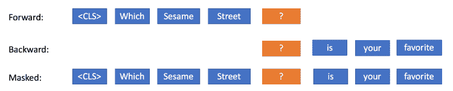

*Forward, Backward, and Masked Language Modeling*

BERT 还通过对一个非常简单的任务进行预训练来学习建立句子之间的关系模型，这个任务可以从任何文本语料库中生成:给定两个句子 A 和 B，B 是语料库中 A 后面的下一个句子，还是只是一个随机的句子？例如:

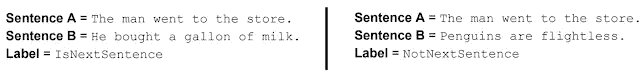

这只是对伯特的一个非常基本的概述。详细内容请参考最初的[论文](https://arxiv.org/pdf/1810.04805.pdf)和一些参考文献【1】、【2】。

**好消息:**谷歌已经将 BERT 上传到 [TensorFlow Hub](https://tfhub.dev/) 这意味着我们可以直接使用预先训练好的模型来解决我们的自然语言处理问题，无论是文本分类还是句子相似度等。

[预测电影评论](https://github.com/google-research/bert/blob/master/predicting_movie_reviews_with_bert_on_tf_hub.ipynb)的例子，二进制分类问题作为示例代码提供在存储库中。在本文中，我们将重点讨论 BERT 在多标签文本分类问题中的应用。因此，我们将基本上修改示例代码，并应用必要的更改，使其适用于多标签场景。

## 设置

使用`!pip install bert-tensorflow`安装 BERT

下载预训练的 BERT 模型:这些是权重和其他必要的文件，用于表示 BERT 在预训练中学习到的信息。你需要选择你想要的 BERT 预训练重量。有两种方法可以下载和使用预训练的 BERT 模型:

1.  直接使用 tensorflow-hub:

以下预先训练的模型可供选择。

1.  `BERT-Base, Uncased` : 12 层，768 隐，12 头，110M 参数
2.  `BERT-Large, Uncased` : 24 层，1024 隐，16 头，340 米参数
3.  `BERT-Base, Cased` : 12 层，768 隐，12 头，110M 参数
4.  `BERT-Large, Cased` : 24 层，1024 隐，16 头，340 米参数
5.  `BERT-Base, Multilingual Case` : 104 种语言，12 层，768 隐，12 头，110M 参数
6.  `BERT-Base, Chinese`:简体中文和繁体中文，12 层，768 隐藏，12 个头，110M 参数

我们将使用基本型号:**‘未装箱 _ L-12 _ H-768 _ A-12’**
`**BERT_MODEL_HUB** = “[https://tfhub.dev/google/bert_uncased_L-12_H-768_A-12/1](https://tfhub.dev/google/bert_uncased_L-12_H-768_A-12/1)"`

2.手动下载 BERT 模型文件:下载并保存到一个目录中，然后解压缩。以下是英文文件的链接:

*   `[BERT-Base, Uncased](https://storage.googleapis.com/bert_models/2018_10_18/uncased_L-12_H-768_A-12.zip), [BERT-Base, Cased](https://storage.googleapis.com/bert_models/2018_10_18/cased_L-12_H-768_A-12.zip),`
*   `[BERT-Large, Cased](https://storage.googleapis.com/bert_models/2018_10_18/cased_L-24_H-1024_A-16.zip), [BERT-Large, Uncased](https://storage.googleapis.com/bert_models/2018_10_18/uncased_L-24_H-1024_A-16.zip)`

您可以使用任何一种方式，但是让我们看看在预先训练的模型中实际上有哪些文件。当我下载`[BERT-Base, Uncased](https://storage.googleapis.com/bert_models/2018_10_18/uncased_L-12_H-768_A-12.zip),`时，有如下 3 个重要文件:

`**BERT_VOCAB**= ‘uncased-l12-h768-a12/vocab.txt'
**BERT_INIT_CHKPNT** = ‘uncased-l12-h768-a12/bert_model.ckpt’
**BERT_CONFIG** = ‘uncased-l12-h768-a12/bert_config.json’`

`**BERT_VOCAB**` **:** 包含模型词汇【单词到索引的映射】

`**BERT_INIT_CHKPNT**` : 包含预训练模型的权重

`**BERT_CONFIG**` : 包含 BERT 模型架构。

## **标记化**

标记化包括将输入文本分解成单个单词。为此，第一步是创建 tokenizer 对象。有两种方法可以做到这一点:

1.  直接来自张量流中心

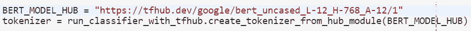

2.从手动下载的文件:

使用`**BERT_INIT_CHKPNT & BERT_VOCAB files**`

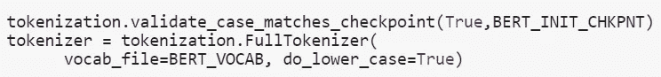

创建了记号赋予器之后，就该使用它了。让我们来修饰句子:`“This here’s an example of using the BERT tokenizer”`

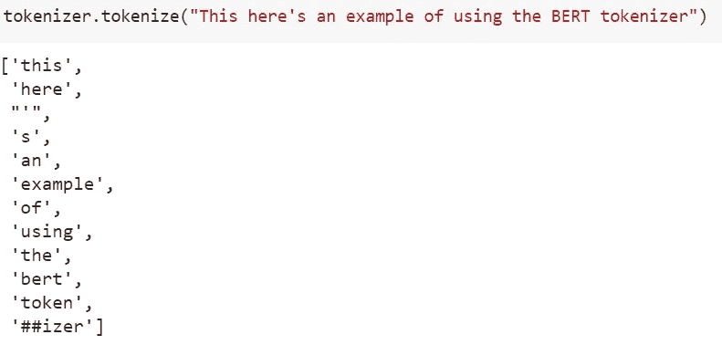

词汇表的大小:~30K

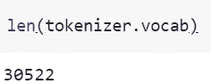

## **数据预处理:**

让我们首先阅读提供的数据集:

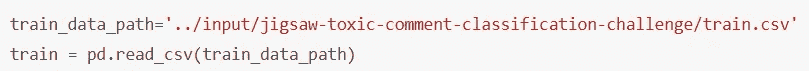

`**train.head()**`

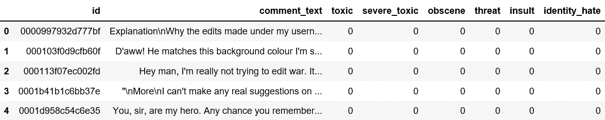

我们需要将数据转换成伯特能理解的格式。为此提供了一些实用函数。

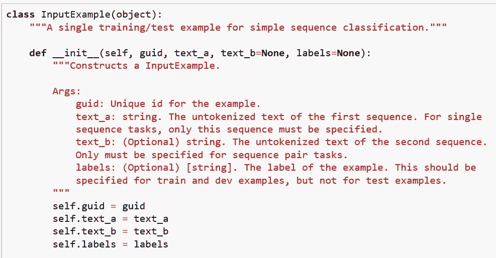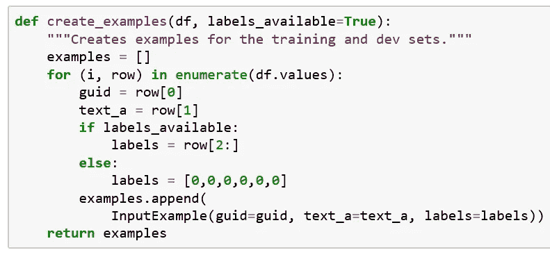

`**create_examples()**`，读取数据帧并将输入文本和相应的目标标签加载到`**InputExample**` 对象中。

使用 tokenizer，我们将在示例中调用`**convert_examples_to_features**` 方法，将它们转换成 BERT 理解的特性。这个方法添加了特殊的“CLS”和“SEP”标记，BERT 使用它们来标识句子的开始和结束。它还将“索引”和“段”标记附加到每个输入中。因此，根据 BERT 格式化输入的所有工作都由该函数完成。

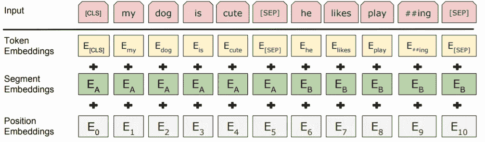

BERT input representation. The input embeddings is the sum of the token embeddings, the segmentation embeddings and the position embeddings.

## **创建模型**

这里，我们使用预训练的 BERT 模型，并针对我们的分类任务对其进行微调。基本上，我们加载预训练的模型，然后训练最后一层用于分类任务。

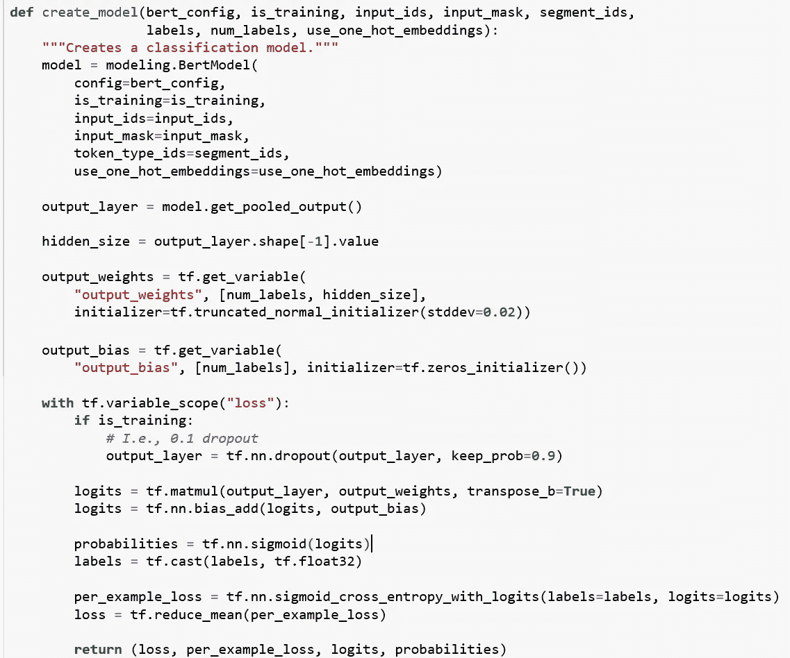

在多标签分类中，我们使用`**sigmoid()**`而不是`**softmax()**`来获得概率。

*   在简单的二进制分类中，两者之间没有太大的区别，但是在多国分类的情况下，sigmoid 允许处理非排他性标签(又名*多标签*)，而 softmax 处理排他性类别。
*   在计算概率之前， *logit* (也称为分数)是与类别相关联的[原始未缩放值。就神经网络架构而言，这意味着 logit 是密集(全连接)层的输出[3]。](https://stats.stackexchange.com/q/52825/130598)

因此，为了计算概率，我们做了如下改变:

`**### multi-class case: probabilities = tf.nn.softmax(logits)**
**### multi-label case: probabilities = tf.nn.sigmoid(logits)**`

为了计算每个示例的损失，tensorflow 提供了另一种方法:

`[**tf.nn.sigmoid_cross_entropy_with_logits**](https://www.tensorflow.org/api_docs/python/tf/nn/sigmoid_cross_entropy_with_logits)`测量离散分类任务中的概率误差，其中每个类别都是独立的且不互斥。这适用于多标签分类问题[4]。

其余的代码大部分来自 BERT 参考文献[5]。完整的代码可以在 [github](https://github.com/javaidnabi31/Multi-Label-Text-classification-Using-BERT/blob/master/multi-label-classification-bert.ipynb) 获得。

## Kaggle 提交分数:

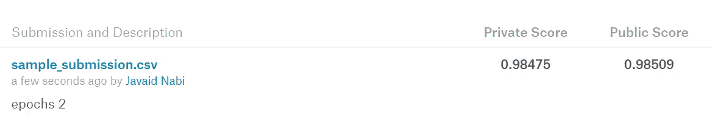

仅仅通过运行 2 个纪元，就获得了非常好的结果。这就是**迁移学习**的强大之处:使用在庞大数据集上训练过的预训练模型，然后针对特定任务对其进行微调。Kaggle 代码[这里](https://www.kaggle.com/javaidnabi/toxic-comment-classification-using-bert/)。

因此，在其他一些数据集上进行试验，运行几个时期[3–4]并查看结果。

感谢阅读。

# 参考

[1][https://ai . Google blog . com/2018/11/open-sourcing-Bert-state-of-art-pre . html](https://ai.googleblog.com/2018/11/open-sourcing-bert-state-of-art-pre.html)

[2][https://ml explained . com/2019/01/07/paper-parsed-Bert-pre-training-of-deep-bidirectional-transformers-for-language-understanding-explained/](https://mlexplained.com/2019/01/07/paper-dissected-bert-pre-training-of-deep-bidirectional-transformers-for-language-understanding-explained/)

[3][https://stack overflow . com/questions/47034888/how-to-choose-cross-entropy-loss-in-tensor flow](https://stackoverflow.com/questions/47034888/how-to-choose-cross-entropy-loss-in-tensorflow)

[4][https://www . tensor flow . org/API _ docs/python/TF/nn/sigmoid _ cross _ entropy _ with _ logits](https://www.tensorflow.org/api_docs/python/tf/nn/sigmoid_cross_entropy_with_logits)

[5][https://github . com/Google-research/Bert/blob/master/run _ classifier . py](https://github.com/google-research/bert/blob/master/run_classifier.py)

[6][https://www . depends-on-the-definition . com/guide-to-multi-label-class ification-with-neural-networks/](https://www.depends-on-the-definition.com/guide-to-multi-label-classification-with-neural-networks/)

[7][https://towards data science . com/journey-to-the-centre-of-multi-label-class ification-384 c 40229 BFF](/journey-to-the-center-of-multi-label-classification-384c40229bff)

[8]https://gombru.github.io/2018/05/23/cross_entropy_loss/