# 用 PyTorch 构建概率矩阵分解的音乐推荐引擎

> 原文：<https://towardsdatascience.com/building-a-music-recommendation-engine-with-probabilistic-matrix-factorization-in-pytorch-7d2934067d4a?source=collection_archive---------4----------------------->

推荐系统是现代社会中最广泛的机器学习形式之一。无论你是在网飞上寻找下一个节目，还是在 Spotify 上收听自动音乐播放列表，推荐系统几乎影响着现代用户体验的所有方面。构建推荐系统最常见的方法之一是使用矩阵分解，这种方法可以根据以前的评分和其他用户的偏好来预测用户对特定产品的评分。在本文中，我将使用一个音乐评级数据集，通过 PyTorch 构建一个音乐推荐引擎，试图阐明概率矩阵分解模型的理论和实现背后的细节。

# 推荐系统简介

在这一节中，在介绍音乐推荐项目的实际实现和结果之前，我将尝试快速而全面地介绍推荐系统和矩阵分解。

## 什么是推荐系统？

要创建一个推荐系统，我们需要一个包含用户、项目和评分的数据集。用户可以是从商店购买产品的顾客、从家里观看电影的家庭，或者在我们的例子中，甚至是听音乐的人。类似地，项目是用户正在购买、评级、收听等的产品。因此，推荐系统的数据集通常有许多条目，包括用户-项目对和表示用户对该项目的评级的值，例如下面看到的数据集:

Figure 1: Simple Data Set for Recommendation Systems

可以明确地收集用户评级(要求用户给出 5 星评级，要求用户是否喜欢某个产品，等等)。)或隐含地(检查购买历史、鼠标移动、收听历史等。).此外，评分值可以是二进制的(用户购买产品)、离散的(对产品的评分为 1-5 星)或几乎任何其他值。事实上，这个项目使用的数据集将评级表示为用户听一个艺术家的总分钟数(这是一个隐含的评级！).数据集中的每个条目代表具有已知评级的用户项目配对，并且从这些已知的用户项目配对中，推荐系统试图预测未知的用户项目评级。可以通过找到与用户喜欢的项目相似的项目(基于项目)、找到相似的用户并推荐他们喜欢的东西(基于用户)、或者找到用户-项目交互之间的整体关系来创建推荐。以这种方式，模型推荐它认为用户可能喜欢的、用户还没有看过的不同项目。

很容易理解一个好的推荐系统的目的和价值，但是这里有一个很好的图表，我认为它很好地总结了推荐系统:

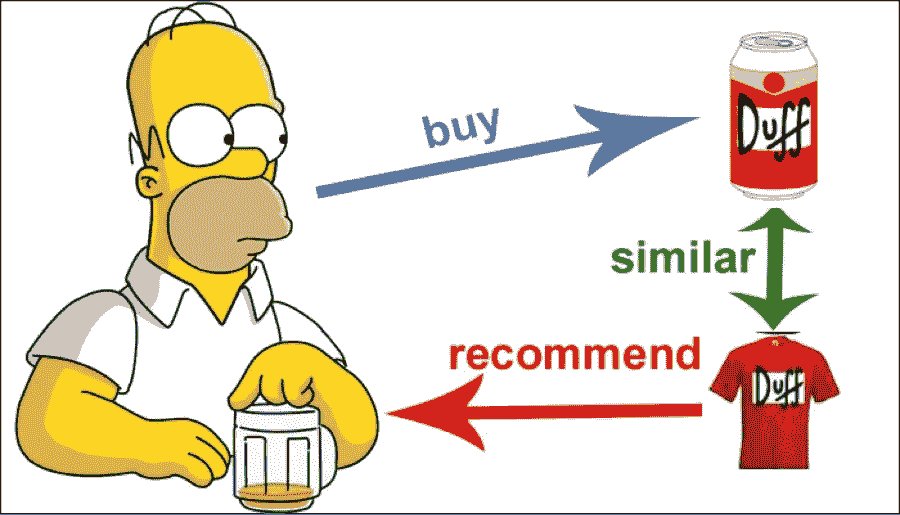

Figure 2: Recommender systems aim to find items that a user enjoys, but has not yet seen [1]

## 什么是矩阵分解？

矩阵分解是实现推荐系统的一种常用而有效的方法。使用前面提到的用户项目数据集(图 1)，矩阵分解试图学习在低维空间中定量表征用户和项目的方法(而不是查看用户曾经评级的每个项目)，以便这些表征可以用于预测用户行为和对一组已知的可能项目的偏好。近年来，矩阵分解由于其准确性和可扩展性而变得越来越流行。

使用用户-项目配对的数据集，可以创建一个矩阵，使所有行代表不同的用户，所有列代表不同的项目，矩阵中位置(I，j)处的每个条目代表用户 I 对项目 j 的评级。该矩阵如下图所示:

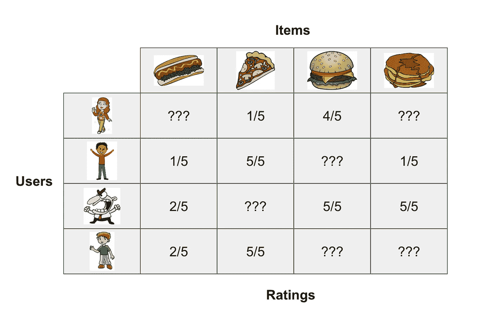

Figure 3: A User-Item Recommendation Matrix

在上图中，每一行都包含一个用户对可能项目集中的每个项目的评分。但是，其中一些评级可能是空的(用“？？?").这些空白点代表未知的或者推荐系统试图预测的用户-项目配对。此外，这个被称为稀疏矩阵的部分填充矩阵可以被认为是两个矩阵的乘积。例如，上述 4×4 矩阵可以通过将两个 4×4 矩阵彼此相乘、4×10 矩阵与 10×4 矩阵相乘、4×2 矩阵与 2×4 矩阵相乘等等来创建。将原始矩阵分解为两个矩阵的乘积的过程称为矩阵分解。

## 推荐系统的矩阵分解

所以，我们知道我们可以通过找到两个可以相乘的矩阵来分解一个矩阵。但是，矩阵分解在推荐系统中实际上是如何工作的呢？

当这两个单独的矩阵被创建时，它们各自携带关于用户、项目以及它们之间的关系的单独信息。也就是说，其中一个矩阵将存储表征用户的信息，而另一个矩阵将存储关于项目的信息。事实上，用户(左)矩阵的每一行都是一个大小为 k 的向量，用于定量描述单个用户，而项目(右)矩阵的每一列都是一个大小为 k 的向量，用于描述单个项目。这些向量的大小 k 被称为潜在维度(或嵌入大小)，是矩阵分解模型中必须调整的超参数，较大的潜在维度将允许模型捕捉更复杂的关系并存储更多信息，但也可能导致过度拟合。

这种想法乍一看似乎很奇怪，但如果您仔细研究矩阵如何相乘以创建用户-项目矩阵，它实际上很有意义—用户 I 对项目 j 的评级是通过从左矩阵中找到用户 I 的向量和从右矩阵中找到项目 j 的向量的内积来获得的。因此，如果每个用户和项目的这些矢量嵌入被训练来存储有用的特征信息，内积可以基于项目的特征和用户对这些特征的偏好来准确地预测用户-项目评级，这些都存储在嵌入矢量的值中。下图说明了这一概念:

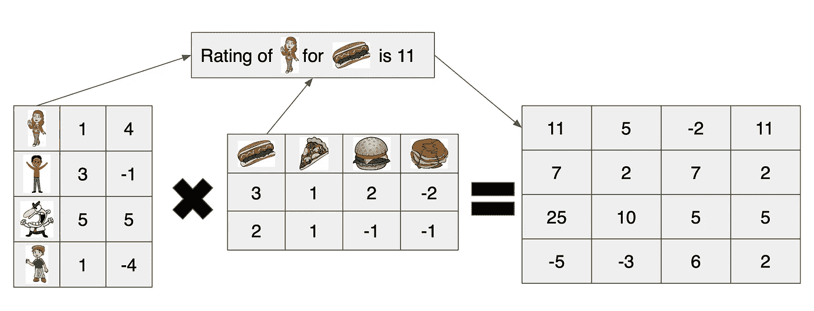

Figure 4: Matrix Factorization with User (left) and Item (right) Matrices

在上图中，请注意产品矩阵的每个条目是如何导出的。例如，表示用户 0 对项目 0 的评分的用户项目矩阵的条目(0，0)是通过取左侧矩阵的第 0 行(用户 0 的嵌入向量)和右侧矩阵的第 0 列(项目 0 的嵌入向量)的内积获得的，这种模式对用户项目矩阵中的每个评分都是如此。因此，如前所述，通过取相应用户和项目嵌入向量的内积来预测每个评级，这是矩阵分解如何为推荐系统工作的核心思想。使用常见的训练方法，如随机梯度下降或交替最小二乘法，可以训练这两个矩阵以及其中的嵌入向量，以产生与原始用户项目矩阵非常相似的产品，从而创建准确的推荐模型。

## 但是等等…你不是说概率矩阵分解吗

是的，我做到了！别担心，概率矩阵分解和我到目前为止一直在解释的很像。正规矩阵分解和概率矩阵分解的主要区别在于生成矩阵的方式。对于正常的矩阵分解，所有未知值(我们试图预测的等级)被设置为某个常数(通常为 0 ),并且分解的矩阵被训练以再现整个矩阵，包括未知值。不难理解为什么这可能成为一个问题，因为矩阵分解模型预测的是我们实际上不知道的值，而这些值可能是完全错误的。此外，当我们已经训练我们的模型来预测所有用户定义的随机常数时，我们如何预测未知的用户项目评级？

为了解决这个问题，我们有概率矩阵分解。概率矩阵分解不是试图再现整个结果矩阵，而是仅试图再现训练集或已知评级集中的评级。因此，仅使用已知评级来训练模型，并且可以通过取用户和项目嵌入向量的内积来预测未知评级。

# PyTorch 中的概率矩阵分解

现在您已经理解了推荐系统和概率矩阵分解背后的基础知识，我将概述如何使用 PyTorch 实现这种推荐系统的模型。如果您不熟悉 PyTorch，它是一个健壮的 python 框架，经常用于深度学习和科学计算。我鼓励任何对 PyTorch 感兴趣的人去查看一下，因为我在我的研究和个人项目中大量使用这个框架。

## **我们在努力实现什么？**

如图 4 所示，我们的概率矩阵分解模型只有两个矩阵——多么简单！其中一个矩阵将代表每个用户的嵌入，而另一个矩阵将包含每个项目的嵌入。每个嵌入是描述用户或项目的 k 个值(k 是潜在维度)的向量。使用这两个矩阵，可以通过取用户的嵌入向量和项目的嵌入向量的内积来获得对用户-项目配对的评级预测，从而产生表示预测评级的单个值。下图显示了这样一个过程:

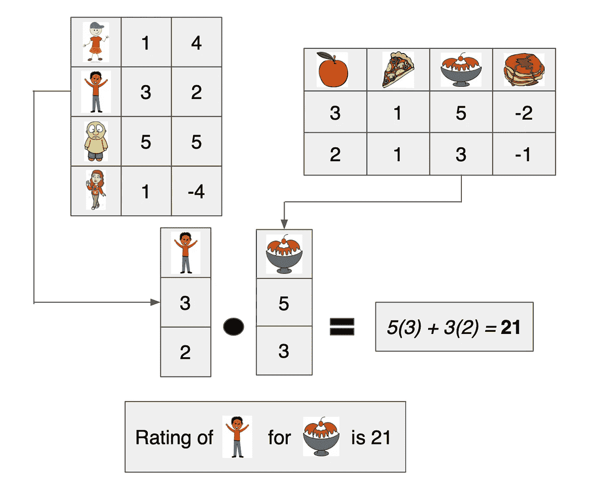

Figure 5: Predicting an unknown user-item rating

如上所述，可以通过从用户(左)和项目(右)矩阵中找到相应的用户和项目向量并计算它们的内积来确定单个评级。在这种情况下，结果显示选择的用户是冰淇淋的忠实粉丝——多么令人惊讶！然而，应该注意，这些矩阵中的每一个都是随机初始化的。因此，为了使这些预测和嵌入准确地表征用户和项目，必须使用一组已知的评级来训练它们，以便预测的准确性可以推广到未知的评级。

使用 PyTorch 中的嵌入类可以相对容易地实现这样一个模型，它创建了一个二维嵌入矩阵。使用这些嵌入中的两个，可以在 PyTorch 模块中创建概率矩阵分解模型，如下所示:

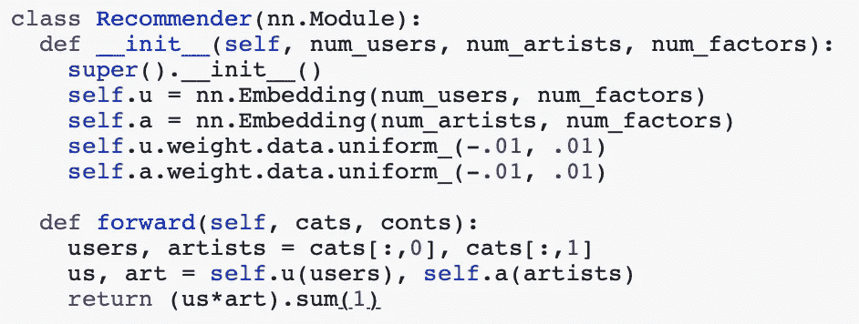

Figure 6: Simple matrix factorization implementation

矩阵分解模型包含两个嵌入矩阵，这两个嵌入矩阵在模型的构造函数中初始化，然后经过训练以准确预测未知的用户项目评分。在 forward 函数(用于预测评级)中，向模型传递一个小批量的索引值，这些值代表不同用户和项目的标识号(id)。使用这些作为用户-项目索引对传入的“cats”参数(一个 Nx2 矩阵)的索引，通过索引用户和项目嵌入矩阵并取相应向量的内积来获得预测的评级。

**添加偏置**

图 6 中的模型缺少一个创建强大的推荐系统所需要的重要特性——偏差项。偏差项基本上是分配给系统中每个用户和项目的常数值。当计算用户-项目配对的预测评级时，用户和项目的偏差都被添加到预测评级值中。这个过程可以从下面观察到:

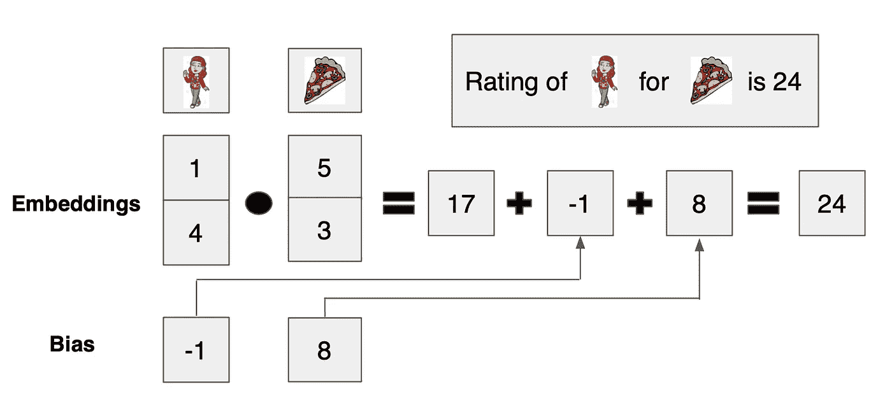

Figure 7: Adding bias to the Probabilistic Matrix Factorization Model

从上面可以看出，向模型中添加偏差所需的更改量非常小。必须跟踪每个用户/项目的额外值，并将其添加到模型做出的每个预测的结果中。这些偏差值将与实际嵌入一起训练，以产生准确的预测。

向 PyTorch 中的模型添加偏差需要创建两个额外的嵌入——一个用于用户偏差，一个用于项目偏差。这些嵌入将有一个单独的列，每行将代表用户或项目的偏差值，其 ID 对应于该行索引。类似于嵌入向量，这些偏差值应该使用正向方法中“cats”参数中传递的索引来找到。实现如下所示:

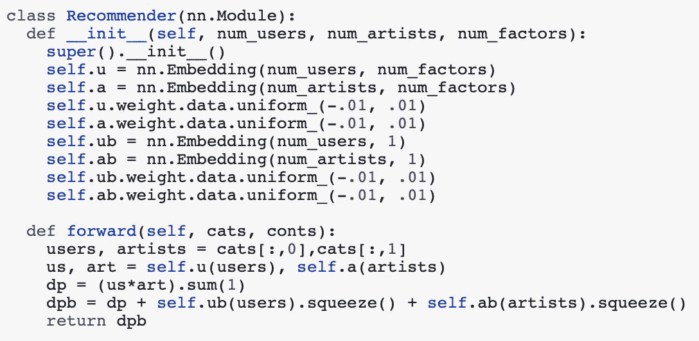

Figure 8: Implementing a Probabilistic Matrix Factorization Model with bias

从上面的实现中可以看出，针对用户和项目偏好，在模型中添加了两个新的嵌入。然后将这些偏差向量的值添加到正向方法中每个预测的结果中。

现在，已经实现了一个完整的概率矩阵分解模型——这可以用来创建非常强大的推荐系统，可以为几乎任何业务增加价值。然而，你可能会想，这个模型看起来和上一个非常相似，那么我们为什么要在模型中加入偏见呢？这真的会让事情变得更好吗？

## 为什么我们甚至需要偏见？

我们将首先考虑每个用户的偏差。如果一个用户有非常高的偏差值，这意味着什么？通常，如果用户经常给项目高的评级，则他们被分配高的偏差值，而经常分配低评级的用户被分配较低的偏差值。这是有意义的，因为一个平均评价很高的用户应该倾向于更高的评价，反之亦然。反过来，这种偏差可以允许模型通过学习适当的偏差值来将用户对项目进行评级的倾向与他们的实际项目偏好分开。

类似地，通常被给予高评级的项目被赋予大的偏差，而具有低平均评级的项目被给予低值。这使得被用户高度评价的项目偏向于高评价，因为大多数用户倾向于喜欢这样的项目，反之亦然。这可以在下图中看到:

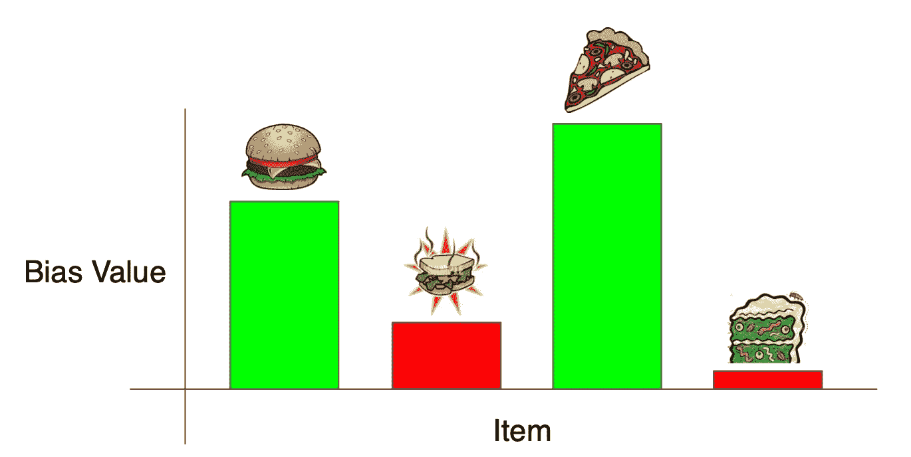

Figure 9: Bias values for different items. Highly-rated items are given high bias values and vice versa.

用户或项目的平均评级会在数据集中产生不必要的噪声。通过包括偏差，模型可以学习从这种噪声中分别表征用户和项目，允许用户和项目嵌入更准确地反映每个用户或项目的属性和偏好。

# 创建音乐推荐系统

现在模型已经创建好了，我准备用它来创建一个音乐推荐系统。在这个项目中，我利用了用户和音乐家的数据集，其中每个用户-音乐家配对都根据用户听一个艺术家的时间分配了一个值。然后，我使用图 8 中的概率矩阵分解模型，从这个数据集中创建一个音乐推荐模型。

## **简单 EDA**

我通过使用[熊猫](https://pandas.pydata.org)对数据集做一些简单的探索性数据分析(EDA)来开始这个实验。我分析的第一步是检查数据样本并检查是否有空值。不存在空值，数据如下所示:

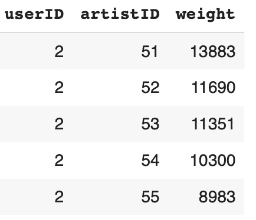

Figure 10: A sample from the original music data set

这个数据集看起来像一个普通的推荐系统数据集，它(显然)非常适合我们的模型。每个数据包含一个 userID、一个 artistID 和一个表示用户对该艺术家的评价的值。然而，这个数据集中代表用户-艺术家评级的权重值相当大，因为它们是由用户听一个艺术家所花的分钟数决定的。典型的推荐系统数据集包含 1-5 之间的评级、二进制评级(即 0 或 1)或类似的评级。因此，应该对该数据集中的评级值进行标准化，使其处于较小的范围内，具体做法如下:

Figure 11: Normalizing weight values within the data set

在权重值被标准化之后，我开始检查数据集的稀疏性，或者与可能的用户-项目组合的数量相比较的已知评级的数量。最初，数据集中只有 0.2%的可能评级是已知的，这是非常稀疏的，可能会对模型的准确性产生负面影响。因此，我选择过滤数据集，只包括至少评价了五位艺术家的用户。

Figure 12: Eliminating users with fewer than five ratings from data set

在数据集上执行上述操作后，它将数据集的密度增加到 1.3%，尽管仍然相对稀疏，但将允许矩阵分解模型做出更准确的预测。

完成这些更改后，在拟合模型之前，我还想做最后一项更改。在这个数据集中，每个用户和艺术家被分配一个唯一的 ID。然而，为了使推荐模型的使用更容易，我想让所有这些 id 都是连续的，这样它们就可以用于嵌入矩阵的索引。这可以通过下面的代码来实现，它确保所有用户和艺术家都有一个连续的、唯一的 ID:

Figure 13: Ensuring that user and item IDs are contiguous

该代码为用户和项目创建了从原始 ID 到新的连续 ID 的映射，使得所有 ID 都落在范围[0，用户/艺术家总数]内。通过执行这种转换，用户和艺术家的 id 可以用作嵌入矩阵的索引，以便于查找和快速预测。

**超参数选择/调整**

既然已经对数据进行了筛选和预处理，那么就可以实际训练推荐模型了。然而，训练模型有两个必须正确设置的超参数:学习速率和潜在维度。

为了确定最佳的学习速率，我利用了在 [fast.ai 深度学习课程](https://course.fast.ai)中描述的自适应学习速率选择技术。这种技术通过多次迭代训练模型，提高了每次迭代更新模型参数的学习率。然后记录每次迭代的损失，并显示在图表上，如下图所示:

Figure 14: Graph of the Loss (y-axis) vs. Learning Rate (x-axis)

在上图中，最佳初始学习率由损失开始增加之前的学习率的最大值表示，在本例中，该值约为 0.1。因此，在训练模型时，学习率最初被设置为. 1。

使用 20、30、40、50 和 60 的值通过网格搜索来确定最佳潜在维度。在使用这些嵌入大小中的每一个运行三个时期的训练之后，结果如下:

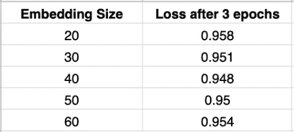

Figure 15: Grid Search for the Optimal Embedding Size

在执行网格搜索之后，为音乐推荐系统选择 40 的嵌入大小，因为它在三个时期的训练之后具有最小的验证损失。

## **拟合模型**

现在已经选择了超参数，可以训练模型了。一次进行三个时期的训练，并且每三个时期学习率降低约 2 倍，直到模型收敛。通过逐渐降低学习率，创建了一个简单的学习率调度程序，允许模型微调其参数，并尽可能减少损失。模型在整个训练过程中的损失可以在下图中看到:

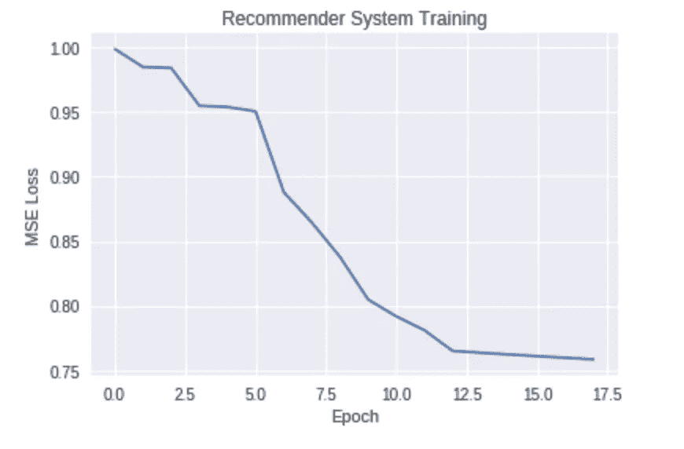

Figure 16: Training the Recommender Model with Multiple Learning Rates

该模型以 0.1、. 05、. 01、. 005 和 0.001 的学习率训练了 3 个时期，最终 MSE 损失为 0.75。换句话说，所有对用户-艺术家配对的预测平均误差约为 0.86。假设训练和测试数据集中的所有评级都在范围[0，~60]内，平均误差. 86 相对较低，这表明该模型与数据拟合得相对较好！

## 额外分析

虽然概率矩阵分解在预测用户项目评分方面效果很好，但该模型最有趣的方面之一是它创建的用于定量描述每个用户和项目的嵌入。这些嵌入可以用于获得关于用户或产品的见解，作为其他机器学习模型(如深度神经网络)的输入，甚至可以确定用户最喜欢哪些项目！只是为了好玩，我对通过训练这个模型创建的嵌入进行了一些额外的分析，以查看它们是否携带任何有趣的信息。更具体地说，我检查了为数据集中的每个艺术家产生的偏差值，这些偏差值概括了所有用户对每个艺术家的偏好。在对偏差值及其相关艺术家进行排序后，产生了以下结果:

Figure 17: Final Bias Values for Artists

可以看出，具有最高偏置值的艺术家是知名和成功的音乐家，如 Britney Spears 和 U2，从而证明了模型嵌入中包含的信息的有用性！

# 结论

非常感谢您的阅读，我希望您现在对推荐系统有了更好的理解，它们是如何工作的，以及您如何自己实现概率矩阵分解！如果你有兴趣探索这个项目的更多细节，我鼓励你去看看我创建的 [GitHub 库](https://github.com/wolfecameron/music_recommendation)，它包含了我在实现推荐系统中使用的所有代码的完整笔记本。此外，欢迎在 [LinkedIn](https://www.linkedin.com/in/cameron-wolfe-9b2511144/) 或 Medium 上关注我，了解我未来的文章和工作。

## 来源/引用

[1][https://johnolamendy . WordPress . com/2015/10/14/collaborative-filtering-in-Apache-spark/](https://johnolamendy.wordpress.com/2015/10/14/collaborative-filtering-in-apache-spark/)