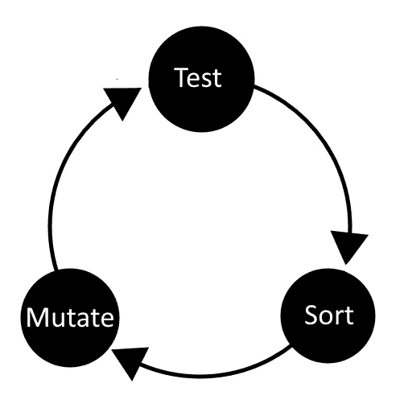

# 用 C#构建神经网络

> 原文：<https://towardsdatascience.com/building-a-neural-network-framework-in-c-16ef56ce1fef?source=collection_archive---------1----------------------->

## 创建具有反向传播能力和基于进化的训练的神经网络。

# 介绍

我们将建立一个能够通过反向传播和进化进行学习的深度神经网络。代码将是可扩展的，以允许网络架构的改变，允许通过代码容易地修改网络执行的方式。

该网络是一个最低限度的可行产品，但可以很容易地扩大。你可以在 GitHub 上找到所有可用的代码，这包括突变和反向传播变体。

我将解释我们将如何设置前馈功能，设置所有需要的数组，并允许突变驱动的学习。

如果你想了解神经网络的工作原理，你需要熟悉一些基本的编码。对于反向传播，你需要熟悉梯度下降和微积分。除非您只想将代码用于您的项目。

**概念时间！**

我们的深度神经网络由一个输入层、任意数量的隐藏层和一个输出层组成，为了简单起见，我将只使用完全连接的层，但这些可以有许多不同的风格。


A simple neural network model

# 神经网络体系结构

上面的模型在输入层上有 5 个神经元，如由 5 个实心圆组成的第一列所示。第二层有 4 个隐藏的神经元，输出层有 3 个输出神经元。这些层的大小和隐藏神经元的数量是任意的。但对于这种视觉模型，我选择了较小的尺寸。

其思想是，来自每个输入节点的值通过每个树突(模型上节点之间的连接线)并乘以相应树突持有的权重，然后传递并保存在下一层的神经元中，然后对每一层继续这一循环，直到获得输出；


每个节点还有一个bias(用 b 表示)，这有助于网络更好地运行。σ符号是这些乘积之和通过的激活函数**。其中 w =来自树突的权重，a =前一层中每个神经元的激活。这个过程在每个神经元上进行，直到到达输出层。**

**当我们到达编码部分时，我们将更详细地讨论每一步，但是如果你对它没有一个基本的了解，我建议你去 youtube 或 Wikipedia 尝试并找到更多。 [**这个视频可能会有帮助**](https://www.youtube.com/watch?v=aircAruvnKk)**

****

# **编码时间！**

**实现这种前馈功能的先决条件是一种存储所有数据的方法。我们将使用一系列阵列来存储所有数据，并确保网络性能始终处于最佳状态。**

****我们需要什么样的数据类型****

**一个输入数组来声明网络的大小，这将被标记为层。例如{5，4，3}，这将创建一个类似于上图的网络模型。**

**我们还需要一个神经元阵列，用于保存前馈算法产生的值。这将是一个二维交错数组的形式**

**我们还需要另一个 2d 交错数组来存储每一层的偏差。**

**最后，我们需要一个 3d 交错数组来存储与每个树突相关的权重。偏差和权重是可以学习的，所有这些数组都是浮点数。**

****初始化功能****

**每当我们创建这个类时，我们需要确保网络的维度已经定义，所有适当的数组都已经初始化。**

**该函数采用网络维度的输入数组，并填充所有数组**

```
private int[] layers;//layers    
private float[][] neurons;//neurons    
private float[][] biases;//biasses    
private float[][][] weights;//weights    
private int[] activations;//layerspublic float fitness = 0;//fitnesspublic NeuralNetwork(int[] layers)
{        
  this.layers = new int[layers.Length];        
  for (int i = 0; i < layers.Length; i++)        
  {            
    this.layers[i] = layers[i];        
  }        
  InitNeurons();        
  InitBiases();        
  InitWeights();    
}
```

**首先，让我们来处理神经元，它们不需要分配任何值，我们只需要分配存储空间，因为数组的长度是静态的。我们使用列表作为创建数组的临时媒介。**

```
//create empty storage array for the neurons in the network.
private void InitNeurons()
{        
  List<float[]> neuronsList = new List<float[]>();        
  for (int i = 0; i < layers.Length; i++)        
  {            
    neuronsList.Add(new float[layers[i]]);        
  }        
  neurons = neuronsList.ToArray();    
}
```

**然后，我们可以在那里初始化偏差，偏差的大小与神经元的大小相同，只是我们需要填充每个槽，我将生成平均值为 0、标准偏差为 0.5 的每个偏差。当进行反向传播(消失和爆炸)时，有更好的初始化权重和偏差的方法来避免梯度问题，但是这对于遗传实现是不需要的。**

```
//initializes and populates array for the biases being held within the network.
private void InitBiases()    
{        
  List<float[]> biasList = new List<float[]>();        
  for (int i = 0; i < layers.Length; i++)        
  {            
    float[] bias = new float[layers[i]];            
    for (int j = 0; j < layers[i]; j++)            
    {                
      bias[j] = UnityEngine.Random.Range(-0.5f, 0.5f);            
    }            
    biasList.Add(bias);        
  }        
  biases = biasList.ToArray();    
}
```

**权重的生成类似于偏差，只是我们为前一层中的每个神经元的数组添加了另一个维度，如下所示:**

****

**the hierarchy for weight storage**

```
//initializes random array for the weights being held in the network.
private void InitWeights()   
{        
  List<float[][]> weightsList = new List<float[][]>();        
  for (int i = 1; i < layers.Length; i++)        
  {            
    List<float[]> layerWeightsList = new List<float[]>();   
    int neuronsInPreviousLayer = layers[i - 1];            
    for (int j = 0; j < neurons[i].Length; j++)            
    {                 
      float[] neuronWeights = new float[neuronsInPreviousLayer];
      for (int k = 0; k < neuronsInPreviousLayer; k++)  
      {                                      
        neuronWeights[k] = UnityEngine.Random.Range(-0.5f, 0.5f); 
      }               
      layerWeightsList.Add(neuronWeights);            
    }            
    weightsList.Add(layerWeightsList.ToArray());        
  }        
  weights = weightsList.ToArray();    
}
```

# **前馈算法**

**前面所有的初始化函数都准备好了，是时候讨论实际的前馈算法和相关概念了。**

****

**如前所述，这是在网络的隐层和输出层中为每个神经元计算的内容。让我们解释一下每个术语。从**激活函数** σ开始，这背后的想法是，你传入**加权和**并返回非线性结果，这提高了性能并保持网络神经元在控制之下，在现实世界中，没有多少事情遵循线性，因此非线性可以帮助近似非线性现象，并允许反向传播。**

****加权和**，这是所有输入激活函数的数据。这是前一层中的每个节点乘以树突中的权重，数据通过该权重被传送到当前神经元。**

****激活功能**可由您选择，根据应用，不同的激活功能选择可能更有益。**

**该函数的常见变体包括:**

1.  **身份**
2.  **二进制步骤**
3.  **乙状结肠的**
4.  **双曲正切**
5.  **热卢**
6.  **泄漏 ReLU**
7.  **Softmax**

**现在，我将使用 Tanh 作为我选择的**激活函数**，因为它允许正值和负值。尽管其他的将适用于不同的应用。**

**Tanh 可以用以下格式表示**

****

**Tanh function**

**这个非线性函数返回以下结果**

****

**Tanh Graph**

```
public float activate(float value)    
{        
  return (float)Math.Tanh(value);    
}
//Luckily Unity provides a built in function for Tanh
```

**现在我们来看看前馈函数如何迭代神经元以产生输出。**

**该程序遍历每个神经元，获得前一层中每个神经元的值，并将该值乘以连接两者的权重，通过激活函数运行该值，然后将其值设置为激活值。这是节点 1 的一个示例**

****

**Example neuron calculation**

```
//feed forward, inputs >==> outputs.
public float[] FeedForward(float[] inputs)    
{        
  for (int i = 0; i < inputs.Length; i++)        
  {            
    neurons[0][i] = inputs[i];        
  }        
  for (int i = 1; i < layers.Length; i++)        
  {            
    int layer = i - 1;            
    for (int j = 0; j < neurons[i].Length; j++)            
    {                
      float value = 0f;               
      for (int k = 0; k < neurons[i - 1].Length; k++)  
      {                    
        value += weights[i - 1][j][k] * neurons[i - 1][k];      
      }                
    neurons[i][j] = activate(value + biases[i][j]);            
    }        
  }        
  return neurons[neurons.Length - 1];    
}
```

**有了它，我们就有了一个工作的神经网络，但目前它还没什么用，除非我们有一种方法来训练它。接下来让我们开始工作吧。**

# **培养**

**对于这个网络的实现，我们将使用遗传算法。它们非常容易编码，并且很少涉及数学方面，但是，如果您对这个实现不感兴趣，我已经包含了一个反向传播代码示例，并且可能会使用强化学习方法。**

**遗传算法是训练神经网络很好地执行给定任务的一种方式。它工作得很好，因为你可以给它一个非常简单的适应度函数，来决定网络运行得有多好。它的缺点是在处理大型网络时需要相对较长的训练时间，与反向传播相比可能相当慢，但如果您有大量的计算能力，它可以返回比反向传播更好的结果，因为它们几乎总是能够达到全局最小值。**

**遗传算法背后的想法是基于达尔文主义的**理论**和生物进化是如何发生的，尽管我们将实现一个稍微简化的模型，但同样的总体概念也适用。一个物种的生物，他们有一个衡量他们“适合”的标准，从历史上看，这可能是他们的狩猎能力和繁殖能力，但有了我们的网络，这将是它能走多远，例如。然后我们整理种群，将它们分成两半，将上半部分克隆到下半部分，并对它们进行变异，这样网络的性能就趋向于全局最大值。**

****

**Evolution algorithm**

# ****进化驱动的学习实现****

**网络的大部分管理将通过另一个脚本来完成。因此，目前我们需要添加到网络中的只是一种对网络进行分类的方法，一种将一个网络克隆到另一个网络上的方法，以及一种改变网络的方法。**

**对于排序，我们让类型 IComparable 的代码，这将允许我们在引用它时直接对它进行排序。它使用网络适应度作为网络排序的值**

```
//Comparing For NeuralNetworks performance.
public int CompareTo(NeuralNetwork other)    
{        
  if (other == null) 
    return 1;    
  if (fitness > other.fitness)            
    return 1;        
  else if (fitness < other.fitness)            
    return -1;        
  else            
    return 0;    
}
```

**我们还需要能够将可学习的值(权重和偏差)克隆到另一个神经网络上。**

```
//this loads the biases and weights from within a file into the neural network.
public void Load(string path)
{        
  TextReader tr = new StreamReader(path);        
  int NumberOfLines = (int)new FileInfo(path).Length;        
  string[] ListLines = new string[NumberOfLines];        
  int index = 1;        
  for (int i = 1; i < NumberOfLines; i++)        
  {            
    ListLines[i] = tr.ReadLine();        
  }        
  tr.Close();        
  if (new FileInfo(path).Length > 0)        
  {            
    for (int i = 0; i < biases.Length; i++)            
    {               
      for (int j = 0; j < biases[i].Length; j++)                
      {                    
        biases[i][j] = float.Parse(ListLines[index]); 
        index++;                                   
      }            
    }             
    for (int i = 0; i < weights.Length; i++)            
    {                
      for (int j = 0; j < weights[i].Length; j++)                
      {                    
        for (int k = 0; k < weights[i][j].Length; k++)
        {                        
          weights[i][j][k] = float.Parse(ListLines[index]);    
          index++;                                        
        }                
      }            
    }        
  }    
}
```

**最后，我们将需要在网络中轻微推动每个可学习的值的能力，这是通过变异来完成的。**

```
//used as a simple mutation function for any genetic implementations.
public void Mutate(int chance, float val)    
{        
  for (int i = 0; i < biases.Length; i++)        
  {            
    for (int j = 0; j < biases[i].Length; j++)            
    {                
      biases[i][j] = (UnityEngine.Random.Range(0f, chance) <= 5) ? biases[i][j] += UnityEngine.Random.Range(-val, val) : biases[i][j]; 
    }        
  }  

  for (int i = 0; i < weights.Length; i++)        
  {            
    for (int j = 0; j < weights[i].Length; j++)            
    {                
      for (int k = 0; k < weights[i][j].Length; k++)                
      {                    
        weights[i][j][k] = (UnityEngine.Random.Range(0f, chance) <= 5) ?  weights[i][j][k] += UnityEngine.Random.Range(-val, val) : weights[i]  [j][k];

      }            
    }        
  }    
}
```

**所有这些代码实现后，我们应该有一个能够学习的工作网络。**

****

# ****在 Unity 中实现网络****

**设置场景，这是我创建的一条赛道，带有检查点，我们的神经网络车必须通过这些检查点才能提高体能。在这种情况下，网络的目标是在轨道上导航，并在不与墙壁碰撞的情况下尽可能走远。**

****

**在场景中，我们有一个管理器，它产生、变异克隆体并破坏网络。网络的意义在于提高网络的性能。**

****

**时间框架是每一代机器人训练的时间，群体大小是一次训练多少个机器人，突变机会是每个权重或偏差发生突变的变化，突变强度是微移的标准偏差，游戏速度是游戏内的滴答率，如果你有适当的硬件，增加网络的训练时间。**

**管理者创建一群使用神经网络的预设，然后在每个预设中部署一个神经网络。一段时间后，测试将完成，网络将被分类，以便只有表现最好的被保留，没有表现最好的将被最好的网络复制并变异。然后再次部署，训练循环继续进行。**

**最后，我们需要制作学习者预置，它的功能有点类似于汽车，可以前后移动，也可以转弯；汽车的这两个输入将是网络的输出。网络的输入将是 5 个距离传感器。**

****

**经过几分钟的训练，我们得到了这个结果，这意味着所有的代码都工作了！**

**所有代码都可以在 GitHub 上找到，我应该注意到 GitHub 上的代码也有保存和加载功能，这些功能保存和加载网络的权重，以允许网络从它停止的地方恢复。**

********

**Google Drive 上的 [**项目**](https://drive.google.com/open?id=1ZMA-1FWaqmZ1bnv8oX6QnhfwWo68Uefj) **。****

**[**Github 上的突变项目。**](https://github.com/kipsterbro/MutationNetwork)**

**[**Github 上的反向传播项目。**](https://github.com/kipsterbro/BackPropNetwork)**

**非常感谢您的阅读，我希望它能有所帮助。我欢迎任何问题或反馈。敬请期待！**