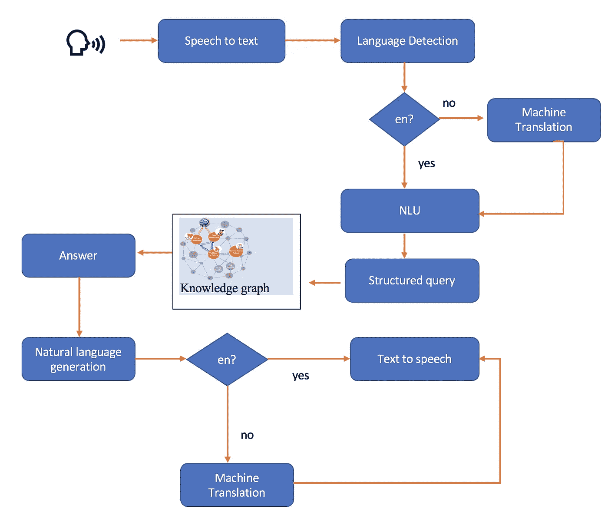
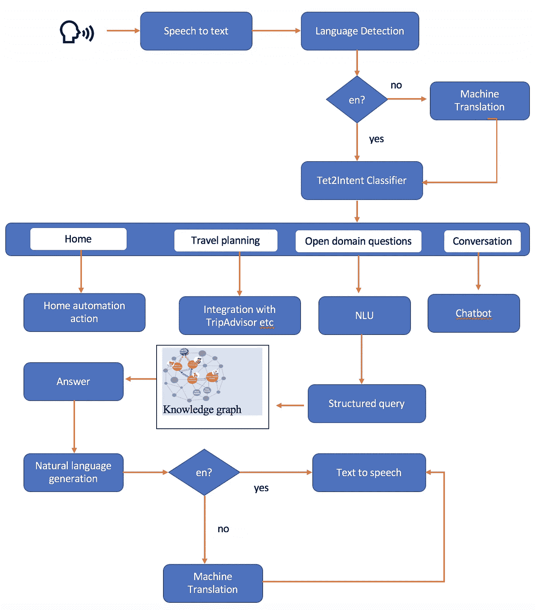
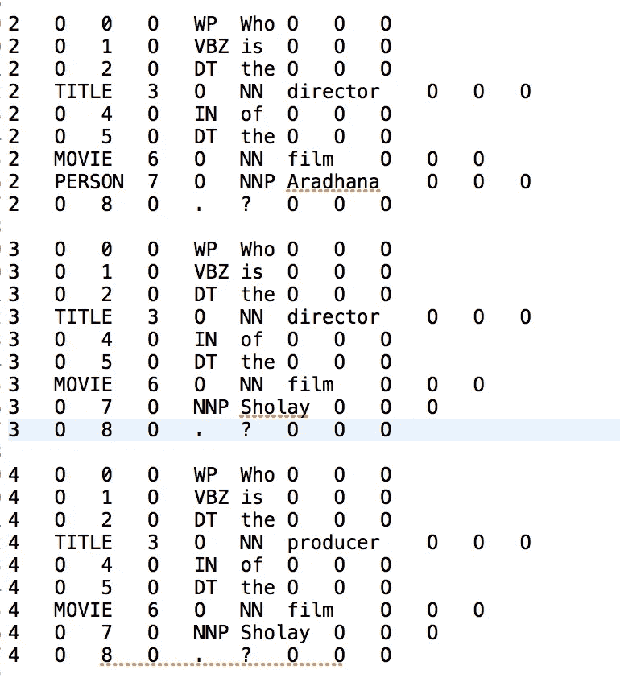
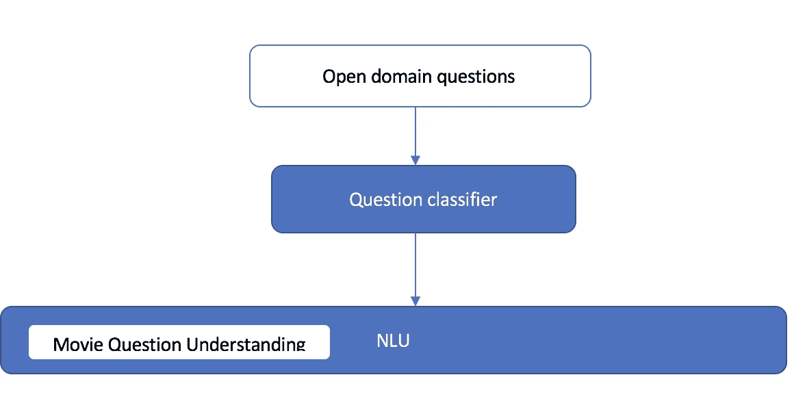
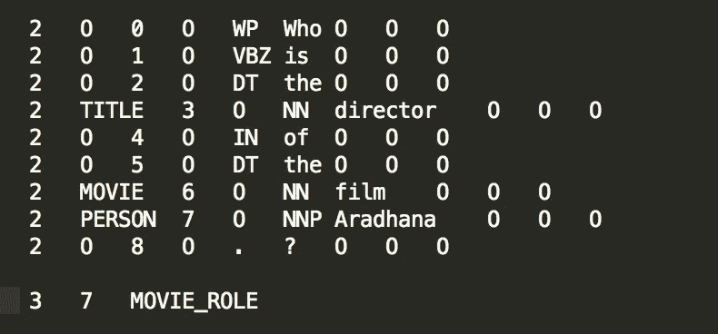

# 通过基于本体的知识搜索构建类似 Alexa 的个人助理

> 原文：<https://towardsdatascience.com/building-a-personal-assistant-like-alexa-open-domain-question-answering-7e9aa1e8ed90?source=collection_archive---------24----------------------->


personal assistant battle

你有没有想过“如何打造一个私人助理？”像 [Alexa](https://www.alexa.com/) 、[谷歌个人助理](https://assistant.google.com/#?modal_active=none)或[谷歌主页](https://store.google.com/product/google_home)覆盖多个意图以及开放领域问答视角。

在这篇文章中，我将尝试在更高的层次上介绍基于本体的问答知识搜索。

> 有两种广泛知识搜索方法

1.  基于本体的知识搜索(主要通过知识图)
2.  基于开放领域问答的知识搜索

在这篇文章中，我们将在更广的层面上讨论基于本体的知识搜索。

构建像 [alexa](https://www.alexa.com/) 这样的个人助理需要各种构建模块，我们将在本文中介绍核心组件的高级架构。并将在接下来的系列中深入探讨。

> 积木

1.  可扩展的[知识图](https://www.alexa.com/)
2.  从结构化和非结构化来源到[知识图](https://en.wikipedia.org/wiki/Knowledge_Graph)的知识消耗
3.  结构化查询的自然语言理解
4.  自然语言生成来回答问题
5.  语音转文本
6.  文本到语音
7.  文本 2 内容模块

> 问答模块的高级架构(还不包括家庭自动化等)。



Question Answering Architecture

该架构非常简单明了，目前还不包括可扩展性，但包含了问题回答模块的核心组件，如“谷歌个人助理”或“Alexa”。

> **NLU 层**

NLU 层的主要目的是从文本中构建图形查询。这是基于本体的知识搜索的瓶颈之一，即从自由文本流中进行结构化查询(在 GQL 中)(开放领域问答试图以神经方式解决这个问题)

> 机器翻译块

在语言不可知知识图的情况下，这也不是强制性的。有两种方法可以建立语言不可知和语言感知的知识图。大多数公共知识图是语言不可知的(超出了本文的范围。

> 步伐

1.  为支持的每种语言训练语音到文本模型
2.  将结构化知识(主语、谓语、宾语)如[维基数据](https://www.wikidata.org/wiki/Wikidata:Main_Page)或 dbpedia(抓取的维基百科)存储到[知识图](https://en.wikipedia.org/wiki/Knowledge_Graph)中
3.  将来自非结构化新闻文章和其他来源的知识丰富并存储到知识图中。
4.  [Text2Intent](https://medium.com/@brijrajsingh/chat-bots-designing-intents-and-entities-for-your-nlp-models-35c385b7730d) 层理解(分类)用户意图
5.  构建 [NLU](https://en.wikipedia.org/wiki/Natural-language_understanding) (自然语言理解)层，以理解用户查询或命令或意图(查看 [rasa](https://rasa.com/) )
6.  面向意向图查询语言(GQL)的知识图查询适配器层
7.  与家庭自动化或其他第三方应用程序的集成挂钩
8.  [NLG(自然语言生成)](https://en.wikipedia.org/wiki/Natural-language_generation)层
9.  对话聊天机器人设计
10.  机器翻译层将英语翻译成支持的语言(可选)。
11.  [支持的每种语言的 Text2Speech](https://en.wikipedia.org/wiki/Speech_synthesis) 型号

> 参考故事“[揭秘 wiki 本体](https://medium.com/@iitr.samrat/demystify-wiki-ontology-and-knowledge-graph-part-1-ba919b0d9ce4?source=friends_link&sk=c86df3f4bad504f9ef3f1f69697735e4) -part1”了解 wiki 本体，这有助于将 wiki 数据摄取到我们选择的[知识图](https://en.wikipedia.org/wiki/Knowledge_Graph)中。

## 个人助理的高级架构(基于本体的知识搜索)



Personal assistant architecture

上面是一个个人助理的高级架构，它不同于一个纯粹的开放领域的问题回答助理，因为它并不总是我们想问的问题。

> 我们还希望我们的助手“预订出租车”、“预订餐馆”、“告诉我我的约会”等。所以我们需要额外的一层意图分类。

让我们逐一探索每个模块，并深入了解可用的选项。前往[揭开维基本体和知识图的神秘面纱——第一部分](https://medium.com/@iitr.samrat/demystify-wiki-ontology-and-knowledge-graph-part-1-ba919b0d9ce4)，这将有助于从[维基数据](https://www.wikidata.org/wiki/Wikidata:Main_Page)中填充知识图。

## NLU 层

从上面的架构可以看出，NLU 层仅仅是为了理解开放领域的问题而构建的。文本 2 内容层过滤并仅将开放域问题传递给 NLU 层。

> **让我们使用 Stanford CoreNLP 来探索一个基于模式的简单 NLU 层，这将是一个** [**grpc**](https://grpc.io/) **微服务，并使用** [**google 协议缓冲区**](https://developers.google.com/protocol-buffers/docs/overview) **来交换消息。**

## 斯坦福大学 NLU 分校

让我们看看几个与电影相关的问题和相应的[集](https://universaldependencies.org/format.html)集。

> 电影《阿拉达纳》的导演是谁？
> 
> 电影《肖莱》的导演是谁？
> 
> 电影《肖莱》的制片人是谁？

这类问题可以归为一组，我们问的是在电影中扮演特定角色的人。

> 对应 [conll](https://universaldependencies.org/format.html) 文集



[conll](https://universaldependencies.org/format.html) corpus (9 columns for each sentence)

> 正如我们在上面看到的，在 [conll](https://universaldependencies.org/format.html) 语料库中的第二列是 [NER](https://en.wikipedia.org/wiki/Named-entity_recognition) 标签和使用 [regexner](https://nlp.stanford.edu/software/regexner.html) 分类为标题(自定义 NER)的导演、制片人等。



Modified architecture add a layer before NLU

如果你把领域压缩得足够小，以理解每个类别中的问题，比如电影问题，regexner 就很棒，如图所示。

人们可以把 regexner 放到斯坦福 corenlp 管道中，如下所示。

```
Properties props = new Properties();
props.put("annotators", "tokenize, ssplit, pos, lemma, ner, regexner");
props.put("regexner.mapping", "org/foo/resources/jg-regexner.txt");
StanfordCoreNLP pipeline = new StanfordCoreNLP(props);
```

## [TokenRegex](https://nlp.stanford.edu/software/tokensregex.html) 文件

TokensRegex 是一个通用框架，包含在 Stanford CoreNLP 中，用于定义文本(标记序列)的模式，并将其映射到表示为 Java 对象的语义对象。(摘自 S[tanford Corenlp token regex](https://nlp.stanford.edu/software/tokensregex.html))

```
//author samrat.saha
//tokensregex.extractor.rulesner = { type: "CLASS", value: "edu.stanford.nlp.ling.CoreAnnotations$NamedEntityTagAnnotation" }tag = { type: "CLASS", value: "edu.stanford.nlp.ling.CoreAnnotations$PartOfSpeechAnnotation" }normalized = { type: "CLASS", value: "edu.stanford.nlp.ling.CoreAnnotations$NormalizedNamedEntityTagAnnotation" }ENV.defaultStringPatternFlags = 2{ruleType: "tokens",pattern: ( ( [ { tag:WP } ] ) ( [ { ner:O} ]* ) ([ { ner:TITLE} ]+ ) ( [ { ner:O} ]* ) ( [ { ner:MOVIE} ]+  ) ( [ { tag:NNP } ]+ )   ),result: Format( "MOVIE_ROLE %s %s %s %s", "##", $$6.text, "##", $$3.text),stage: 1}
```

## Java 代码

```
**public** **static** **void** main(String[] args) **throws** Exception {String rules = "..../src/main/resources/tokenregexrule.txt";String exampleQuestions = IOUtils.*stringFromFile*("src/main/resources/question.txt");//pipeline have regexner as well as statistical nerProperties properties = PropertiesUtils.*asProperties*("annotators", "tokenize,ssplit,pos,lemma,ner,regexner");properties.setProperty("ssplit.eolonly", "true");properties.setProperty("regexner.mapping", "src/main/resources/movieregex.txt");//tokenregex rule file from above
properties.setProperty("tokensregex.extractor.rules", rules);StanfordCoreNLP pipeline = **new** StanfordCoreNLP(properties);Annotation annotation = **new** Annotation(exampleQuestions);*env* = TokenSequencePattern.*getNewEnv*();*extractor* = CoreMapExpressionExtractor.*createExtractorFromFiles*(*env*, properties.getProperty("tokensregex.extractor.rules"));pipeline.annotate(annotation);*extractConcepts*(annotation);}
```

## 使用 tokenregex 提取概念代码

代码会提取主语宾语和我们说的概念，这个叫做[关系提取](https://en.wikipedia.org/wiki/Relationship_extraction)(主语、谓语、宾语)。

在知识图中，主体和客体将是实体，谓词将是关系。

```
**public** **static** **void** extractConcepts(Annotation annotation) {**boolean** flag = Boolean.***FALSE***;List<CoreMap> sentences = annotation.get(CoreAnnotations.SentencesAnnotation.**class**);**int** id = 0;**for** (CoreMap sentence : sentences) {System.***out***.println(sentence.toString());List<CoreLabel> tokens = sentence.get(CoreAnnotations.TokensAnnotation.**class**);id++;List<MatchedExpression> matchedExpressions = *extractor*.extractExpressions(sentence);**for** (MatchedExpression matched:matchedExpressions) {// Print out matched text and valueSystem.***out***.println("--------------------");//System.out.println(matched.getText());//System.out.println(matched.getValue().toString());String subj = "";String obj = "";CoreMap cm = matched.getAnnotation();String matchedText = matched.getValue().toString();String matchedTextMod = matchedText.replace("(", " ").replace(")", "").replace("STRING", "");StringTokenizer st = **new** StringTokenizer(matchedTextMod);String predicate = st.nextToken("##").trim();subj = st.nextToken("##").trim();obj = st.nextToken("##").trim().replace("-LRB-", "(").replace("-RRB-", ")");**if**(obj.substring(0, obj.length()/2).replaceAll("\\s|\\W", "").equalsIgnoreCase(obj.substring(obj.length()/2, obj.length()).replaceAll("\\s|\\W", ""))){obj = obj.substring(0, obj.length()/2);}System.***out***.println(subj + "->" + predicate + "->" + obj);System.***out***.println("--------------------\n");}}annotation = **null**;**return**;}
```

> **输出:**

```
Who is the director of the film Aradhana ?--------------------Aradhana->MOVIE_ROLE->director--------------------Who is the director of the film Sholay ?--------------------Sholay->MOVIE_ROLE->director--------------------Who is the producer of the film Sholay?--------------------Sholay->MOVIE_ROLE->producer--------------------
```

可以注意到，这对于下面这样的复杂问题是绝对不够的。

多主题问题

> 汤姆·克鲁斯和布拉德·皮特主演的电影有哪些？

## 统计 CRF 关系提取器

Stanford coreNLP 还支持[关系提取](https://nlp.stanford.edu/software/relationExtractor.html)，可用于从简单问题中提取主语、宾语和谓语。

人们需要为他们感兴趣的关系注释 conll 语料库文件，例如参见下面的 conll 语料库。



movie role relation annotation

上面的注释说，在令牌 3 和 7 之间存在一个我们正在询问的 MOVIE_ROLE 关系。

> 也看到如何分类阿拉达纳被归类为我们需要为电影数据集定制 NER 模型的人。训练一个 NER 模型超出了这些博客的范围。

使用带注释的数据集训练一个定制模型，如这里提到的。

一旦模型训练完毕，加载模型并使用下面的代码从简单的问题中提取主客体谓词。

```
**public** CustomRelationExtractAnnotator(Properties props){ *verbose* = Boolean.*parseBoolean*(props.getProperty("sup.relation.verbose", "false"));//Load the model
String relationModel = props.getProperty("sup.relation.model", "model/simple-question-relation-model.ser");**try** {Extractor entityExtractor = **new** SimpleQuestionEntityExtractor();BasicRelationExtractor relationExtractor = BasicRelationExtractor.*load*(relationModel);System.***out***.println("Loading relation model " + relationModel + " and the features are " + relationExtractor.featureFactory);mr = MachineReading.*makeMachineReadingForAnnotation*(**new** SimpleQuestionConllReader(), entityExtractor, relationExtractor, **null**, **null**,**null**, **true**, *verbose*);} **catch**(Exception e){e.printStackTrace();**throw** **new** RuntimeException(e);}}@Override**public** **void** annotate(Annotation annotation) {// extract entities and relationsAnnotation output = mr.annotate(annotation);// transfer entities/relations back to the original annotationList<CoreMap> outputSentences = output.get(SentencesAnnotation.**class**);List<CoreMap> origSentences = annotation.get(SentencesAnnotation.**class**);**for**(**int** i = 0; i < outputSentences.size(); i ++){CoreMap outSent = outputSentences.get(i);CoreMap origSent = origSentences.get(i);// set entitiesList<EntityMention> entities = outSent.get(MachineReadingAnnotations.EntityMentionsAnnotation.**class**);origSent.set(MachineReadingAnnotations.EntityMentionsAnnotation.**class**, entities);**if**(*verbose* && entities != **null**){System.***err***.println("Extracted the following entities:");**for**(EntityMention e: entities){System.***err***.println("\t" + e);}}// set relationsList<RelationMention> relations = outSent.get(MachineReadingAnnotations.RelationMentionsAnnotation.**class**);origSent.set(MachineReadingAnnotations.RelationMentionsAnnotation.**class**, relations);**if**(*verbose* && relations != **null**){System.***err***.println("Extracted the following relations:");**for**(RelationMention r: relations){**if**(! r.getType().equals(RelationMention.***UNRELATED***)){System.***err***.println(r);}}}}}
```

以上是对 CoreNLP 如何用于从简单问题中提取关系的快速解释。

你会发现很多关于斯坦福 CoreNLP 的在线文章，如果有疑问，请在下面评论澄清。

在这篇文章中，我们使用 [tokenregex](https://nlp.stanford.edu/software/tokensregex.html) 和[Stanford relation extraction](https://nlp.stanford.edu/software/relationExtractor.html)介绍了一些架构选项和基本 NLU 程序块，它们可以提取单个主语、单个谓语和单个宾语。

> 注意，单个问题可以用多个关系来注释，也可以从单个问题中提取多个关系，这可能导致精度问题。基于你的训练数据有多好，统计的 CRF 方法一般会有较高的[召回较低的精度](https://en.wikipedia.org/wiki/Precision_and_recall)。

将在即将到来的博客中讨论高级 NLU 和问题理解。

感谢阅读..

[**Git Link**](https://github.com/iitrsamrat/nlp-stanford) :[https://github.com/iitrsamrat/nlp-stanford](https://github.com/iitrsamrat/nlp-stanford)

References:

[1] [https://www.wikidata.org/wiki/Wikidata:Main_Page](https://www.wikidata.org/wiki/Wikidata:Main_Page)

[2] [https://wiki.dbpedia.org/](https://wiki.dbpedia.org/)

[3] [https://en.wikipedia.org/wiki/Knowledge_Graph](https://en.wikipedia.org/wiki/Knowledge_Graph)

[4] [https://en.wikipedia.org/wiki/Question_answering](https://en.wikipedia.org/wiki/Question_answering)

[5] [https://www.conll.org/2019](https://www.conll.org/2019)

[6] [https://stanfordnlp.github.io/CoreNLP/](https://stanfordnlp.github.io/CoreNLP/)