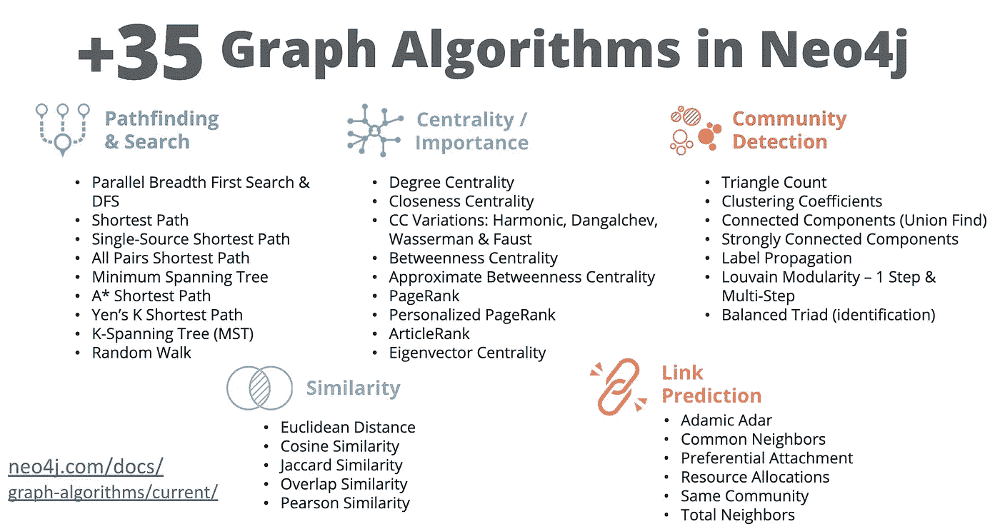

# 构建基于照片的个性化推荐应用程序

> 原文：<https://towardsdatascience.com/building-a-photo-based-personalized-recommendations-application-27029418d65e?source=collection_archive---------14----------------------->

## 使用 Neo4j、图形算法、Yelp 公共数据集和 React


The [Applied Graph Algorithms online training course](https://neo4j.com/graphacademy/online-training/applied-graph-algorithms/) shows how to enhance the functionality of a web application using Neo4j Graph Algorithms.

在设计[应用图算法在线培训课程](https://neo4j.com/graphacademy/online-training/applied-graph-algorithms/)时，我们认为展示如何构建利用图算法的应用程序以使用真实世界的数据集添加智能功能非常重要。这篇博文详细介绍了课程中一个练习背后的技术:构建一个基于照片的个性化推荐应用程序。

这只是练习之一，如果你对此感兴趣，[请查看免费的应用图算法在线课程！](https://neo4j.com/graphacademy/online-training/applied-graph-algorithms/)你可以在[这个概述视频](https://www.youtube.com/watch?v=fx5KefPFrJ8)中了解更多关于培训的信息。

# 图形算法

图形算法支持图形分析，分为 5 大类:寻路和搜索、中心性、社区检测、链接预测和相似性。你可以[在这里](https://neo4j.com/developer/graph-algorithms/)了解更多 Neo4j 图算法。



The five basic categories of graph algorithms available in Neo4j.

# Yelp 开放数据集

[Yelp 开放数据集](https://www.yelp.com/dataset)是 Yelp 公开提供的所有 Yelp 业务、评论和用户数据的子集，可以建模为图表并导入 Neo4j。对于熟悉构建应用程序和使用图表数据来说，这是一个很好的数据集。


The [Yelp Open Dataset](https://www.yelp.com/dataset) is a subset of Yelp data released publicly. This data can be modelled as a graph in Neo4j.

## 商业评论应用程序

我们从一个简单的 business reviews web 应用程序开始，目标是使用 Neo4j 图算法增强其功能。该应用程序的基本功能允许用户搜索企业和查看企业的评论。


A business reviews application using the Yelp Open Dataset. It allows the user to search for businesses and view reviews. We explore how to enhance the functionality of this application using Neo4j Graph Algorithms.

web 应用程序是一个 React 应用程序，它使用 Neo4j JavaScript 驱动程序对 Neo4j 数据库实例执行 Cypher 查询并处理结果。


Basic architecture of the business reviews application: a React frontend uses the Neo4j JavaScript driver to send Cypher queries to a Neo4j database instance.

# 个性化推荐

个性化推荐在许多行业和应用类型中都非常有用。通过推荐要购买的商品、要阅读的文章、要看的电影或要听的歌曲，用户很乐意拥有与他们的兴趣相关的内容，开发者也很乐意与他们的应用程序有更多的互动。

## 基于内容与协同过滤

基于内容的推荐和协同过滤是实现个性化推荐系统的两种基本方法。

**基于内容的**方法使用被推荐项目的属性(电影类型、菜肴类型等)，并将这些属性与用户的偏好进行比较，从而做出推荐。计算项目之间相似性的相似性度量对于这种方法是有用的。

**另一方面，协同过滤**基于用户与项目的交互，例如购买或评级来产生推荐。

在本例中，我们使用基于内容的方法，使用照片标签和 Neo4j 图形算法进行个性化推荐。

# 基于照片的推荐


Yelp 开放数据集包括 20 万张用户上传照片的档案，与企业相关。这些照片将作为我们个性化推荐方法的基础。

我们的应用程序将向用户随机显示照片，允许用户选择他们喜欢的照片。然后，我们会找到与用户喜欢的照片相似的照片，并推荐与这些照片相关的商家。

具体来说，这些步骤是:

1.  使用 Jaccard 相似度识别相似照片
2.  使用标签传播聚类相似照片
3.  通过遍历图表，推荐同一个社区中与照片相关的企业。

**寻找相似的照片**

我们将如何确定照片是否相似？Yelp 数据包括关于每张照片的最少元数据，但我们通过谷歌视觉 API 运行每张照片，该 API 使用机器学习来确定照片的标签。[我们的脚本](https://github.com/moxious/vision-api)获取每张照片的标签，并在图中创建`Label`节点:


Adding photos labels to the graph.


Jaccard similarity is defined as the size of the intersection of two sets divided by the size of the union of two sets.

我们可以使用 Jaccard 相似度来计算给定的一对照片有多相似。通常用于查找相似项目的推荐以及链接预测的一部分 Jaccard 相似性度量集合之间的相似性(在我们的例子中是附加到照片的标签集合)。

Jaccard 相似性是一种集合比较算法，通过将两个集合的交集大小除以它们的并集大小来计算。Jaccard 相似性算法在 Neo4j 图形算法库中可用。下面是我们如何在一个 Cypher 查询中使用它，计算所有照片对的相似度。

```
MATCH (p:Photo)-[:HAS_LABEL]->(label)
WITH {item: id(p), categories: COLLECT(id(label))} AS userData
WITH COLLECT(userData) AS data
CALL algo.similarity.jaccard(data, 
  {topK: 3, similarityCutoff: 0.9, write: true})
```

这个查询将在图中创建`SIMILAR_TO`关系，将相似性值存储在一个`score`属性中:


让我们看两张标签重叠的照片，看看 Jaccard 相似度得分是如何计算的。在下图中，两张照片有 9 个重叠标签，其中一个标签仅与一张照片相关联:


因此，Jaccard 相似分数为 9/10 或 0.9

# 使用标签传播聚类相似照片


标签传播是一种社区检测算法，它通过为每个节点分配分区值来将图形分割成分区或社区。它的工作方式是用社区分配播种节点，然后迭代，在每次迭代中将社区分配给相邻节点，直到整个图被划分。

为了在 Neo4j 中运行标签传播，我们传递定义了要在其上运行算法的子图的节点标签和关系类型。在这种情况下，我们希望对由`SIMILAR`关系定义的子图使用 run 算法:

```
CALL algo.labelPropagation("Photo", "SIMILAR", "BOTH")
```

该查询将添加一个`partition`属性来按社区对照片进行分组。然后我们可以通过社区查询查看`Photo`节点的分布:


我们可以通过选择一个社区并查看分配给该社区的照片来验证照片的社区分配。这里我们随机选取一个社区，对比照片:


看这些照片，他们似乎都是比萨饼，所以这似乎是一个“比萨饼”集群。看起来我们的方法非常有效！

# 通过遍历图表，推荐同一社区中与照片相关的业务

现在，我们已经使用标签传播算法将照片分组到社区中，我们准备好生成我们的个性化商业建议。给定用户选择的一些照片，我们从这些照片遍历到他们指定的社区，然后到同一社区中的其他照片，然后遍历到与照片相关的企业，这成为我们的推荐。我们使用一个简单的 Cypher 查询来定义这种遍历:


请注意我们是如何在这个操作中结合全局和局部图操作的，利用了图算法以及图数据库的近实时性能，即无索引邻接。

# 最后的结果

这是我们的新功能:

1.  向用户呈现随机照片的照片库
2.  用户选择 5 张他们觉得有吸引力的照片
3.  我们的应用程序遍历图表，找到所选照片的聚类，然后遍历相同聚类中的其他照片，最后遍历与这些照片相关的企业，这些照片成为推荐。


# 报名参加免费的应用图形算法课程

[Neo4j 应用图形算法免费在线培训](https://neo4j.com/graphacademy/online-training/applied-graph-algorithms/)教授如何利用图形算法来增强 web 应用程序的功能，包括这个基于照片的推荐示例。[立即注册](https://neo4j.com/graphacademy/online-training/applied-graph-algorithms/)了解更多有关 Neo4j 图算法的信息，如个性化页面排名、相似性度量、社区检测以及添加个性化、推荐和增强搜索结果等功能。

通过[注册应用图算法课程，你可以找到这部分提到的所有数据和代码！](https://neo4j.com/graphacademy/online-training/applied-graph-algorithms/)