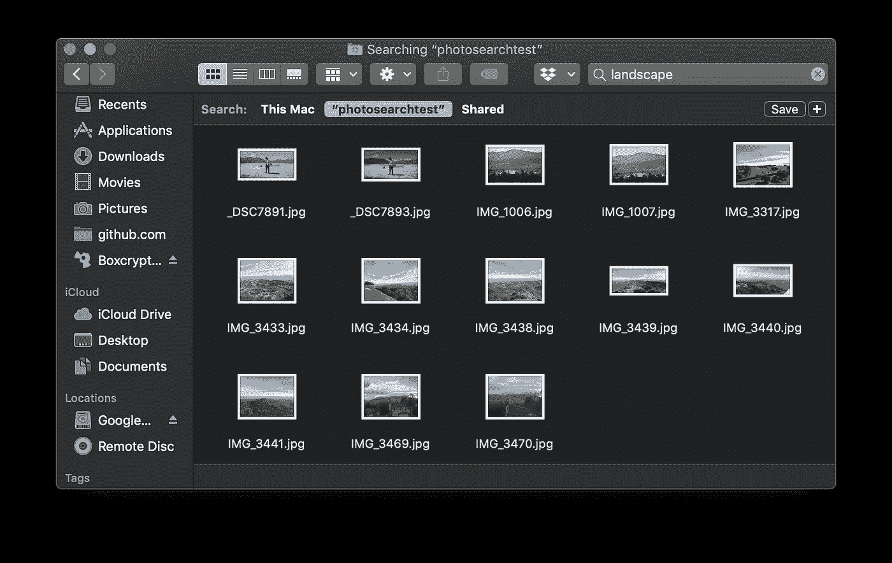
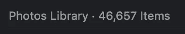
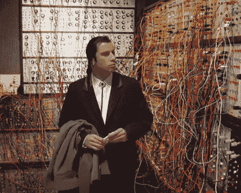
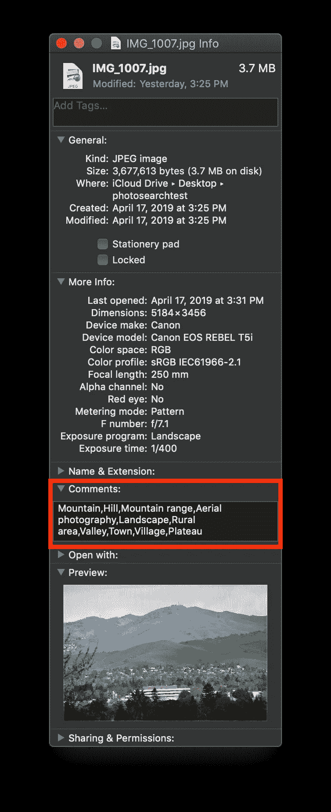
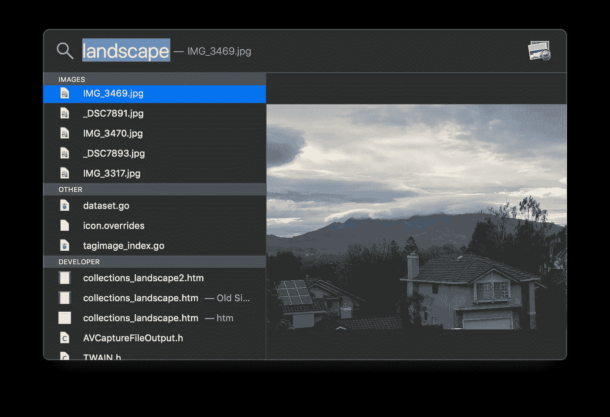

# 使用机器学习构建私人的本地照片搜索应用程序

> 原文：<https://towardsdatascience.com/building-a-private-local-photo-search-app-using-machine-learning-8aeeef8d245c?source=collection_archive---------14----------------------->

这就是了。这是我做过的最棒的事。我通常不喜欢吹牛，但我为这一点感到非常自豪，我觉得我需要分享它。他们说这是不可能的(实际上没有人这么说)，他们说这是不可能的(很多人说这是可能的)，但我做到了，而且效果很好！

## 背景

My wife’s library has the other 40,000

自从有了孩子，我就有一个问题。嗯……很多问题，但我会把重点放在与技术相关的问题上。问题是我有 8 万张照片。这并不夸张。在我妻子和我之间，在我们的第一个人类出生后，我们在短短几年内从大约 3000 张照片增加到 80000 张。

很快，我意识到拍照几乎没有任何意义，因为以后再也不可能找到它们了。当时，我所有的照片都在 Dropbox 里。Dropbox 没有任何照片管理功能(在撰写本文时仍然没有)，而这正是我迫切需要的。从我在机器学习领域的工作中，我知道你可以从一张照片中收集到很多信息，比如照片中的人是谁，照片是在哪里拍的，照片是什么样的场景；*例如，未来的超级恶棍恐吓父母*。

所以我做了唯一符合逻辑的事。将所有 80，000 张照片移植到 Apple Photos，以便可以运行一些 ML，我可以再次找到我的照片。它非常成功——结束了。再见！

## 错误的

假的。这不是结局。可以说，现在我被困在苹果的围墙花园里。我真的很喜欢这个花园，那里有很多漂亮的花，比如*的胭脂树*和*的胭脂树*。但并不是每个人都这样做，我的好朋友 Jaron Phillips 的一篇文章提醒我，总有另一种方法(除了谷歌有严重的隐私问题)。

## 在本地运行

让我们讨论一下为什么写这篇文章，以及我是如何以一种不可思议的方式解决了这个惊人的问题(以及你如何也能做到这一点，尽管是以一种远不那么有趣的方式)。

你的照片(可能)非常隐私，包含许多秘密，所以你可能想把它们存在你的本地计算机上*。但是它们是不可搜索的！让我们改变这一切！为了使这个过程有效，它们需要在一个文件夹中，所以只需将它们全部导出到一个文件夹中(如果还没有的话)。如果你对电脑很在行，你可以修改我的脚本，让它也适用于许多子文件夹中的照片。但是最关键的部分是机器学习。*

*我们将使用 [Tagbox](https://machinebox.io/docs/tagbox?utm_source=Medium&utm_medium=Blog%20Post&utm_campaign=Post%20about%20searching%20photos%20locally%20on%20your%20mac) ，它已经预先训练了成千上万的图像标签，例如，用照片中的内容来标记我们所有的照片；*海洋、日落、沙滩、雾、狗、生日蛋糕、厄运、*等。关于[标签盒](https://machinebox.io/docs/tagbox?utm_source=Medium&utm_medium=Blog%20Post&utm_campaign=Post%20about%20searching%20photos%20locally%20on%20your%20mac)的伟大之处在于它**在你的电脑**上本地运行。没有云公司窃取你的秘密。*

*我们要把这些标签存储在该死的文件里。想象一下。！我们为什么要这么做？所以你可以搜索。嘭！冰！其他声音！是不是很神奇？*

**

*Where?*

> *这些标签将进入 Spotlight 将索引的“评论”栏，以便您稍后可以搜索这些文件。*

## *该过程*

*这是我如何在大约一个小时内让它工作起来的。我做的第一件事是把一堆照片移到我电脑上的一个文件夹里，来模拟我以前的照片目录。*

*然后，我下载、安装并运行了 [Tagbox](https://machinebox.io/docs/tagbox?utm_source=Medium&utm_medium=Blog%20Post&utm_campaign=Post%20about%20searching%20photos%20locally%20on%20your%20mac) ，这花了几分钟，但那是因为它是我的公司的产品，我很了解它。如果你是一名开发人员或技术专家，这也不会花你太多时间。*

*接下来，我编写了一个 [Go](http://golang.org) 脚本，该脚本遍历目录，将每个图像发送到[标记框](https://machinebox.io/docs/tagbox?utm_source=Medium&utm_medium=Blog%20Post&utm_campaign=Post%20about%20searching%20photos%20locally%20on%20your%20mac)，取回标记，并将它们放入文件的注释字段。*

*然后我运行脚本，瞧——EXTEME EXCELLENCE。*

**

*现在，我可以通过 Mac 上的内容来搜索任何照片。没有必要把我的个人照片发到云上，或者发到谷歌上，或者发给……其他怪人。它在当地跑，跑得很快，跑得非常好。*

**

*这仅仅是一个开始——既然你是一个出色的开发人员，你可以把它带到下一个层次,构建一个具有其他特性的实际应用程序，或者探索在其他地方注入标签，比如 EXIF 数据或一个单独的 xml sidecar 文件。我在这里给你出主意，你在这里和他们一起做令人惊奇的事情，因为，让我们诚实地说，我是一个糟糕的开发者。*