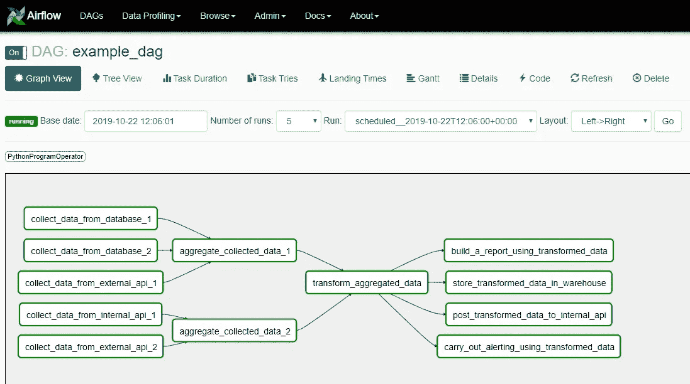
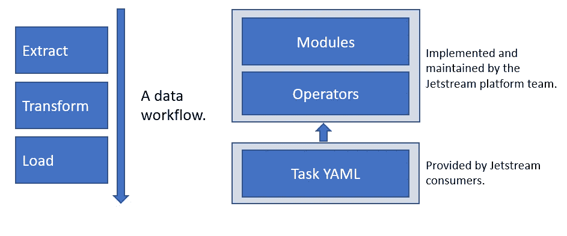
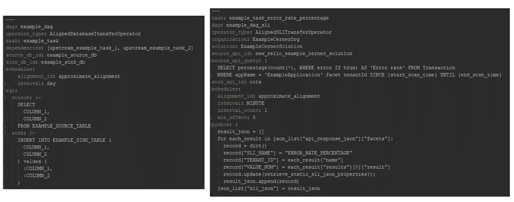
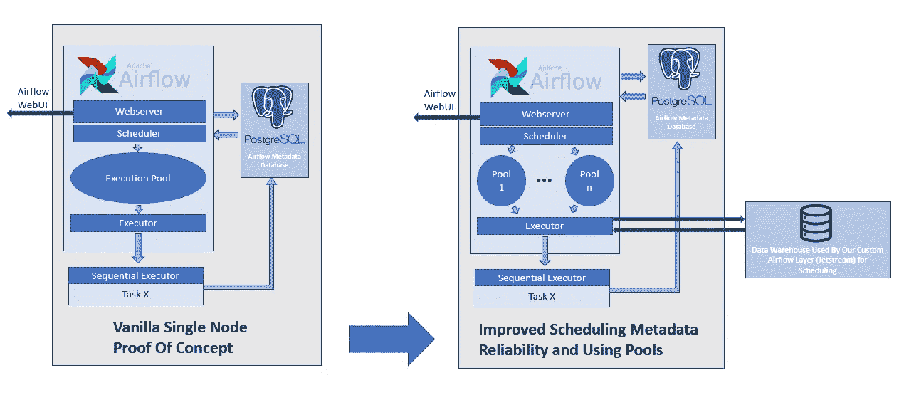
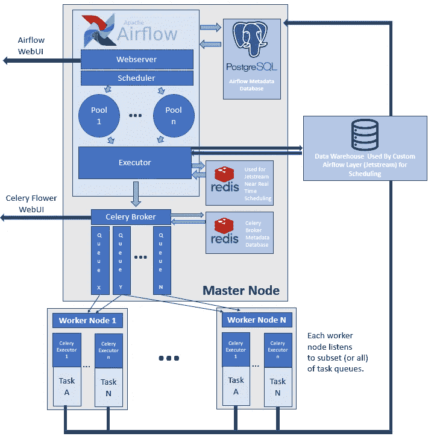

# 使用 Apache Airflow 构建生产级 ETL 管道平台

> 原文：<https://towardsdatascience.com/building-a-production-level-etl-pipeline-platform-using-apache-airflow-a4cf34203fbd?source=collection_archive---------3----------------------->

## 使用 Apache Airflow 管理 CernerWorks 中的数据工作流

[CernerWorks](https://www.cerner.com/solutions/hosting-monitoring) 企业系统管理团队负责从 Cerner 客户的系统中挖掘系统数据，为 Cerner 内部的各个团队提供所收集数据的可见性，并使用所收集的数据构建监控解决方案。我们的核心任务是帮助提高 Cerner 客户系统的可靠性和安全性。大约三年前，我们的团队开发了一个有效的系统数据收集遥测框架。与此同时，我们看到用例呈指数级增长，我们必须以各种方式转换收集的系统数据，以支持我们的可见性和监控工作。因此，我们迫切需要在我们的数据架构中引入一个专用的 ETL 管道平台。

经过一些研究，我们发现 [Apache Airflow](https://airflow.apache.org/) 开源框架非常适合我们的需求，因为它是为实现、调度和监控数据工作流而设计的。在 Airflow 上下文中，数据工作流由一个 [DAG(有向无环图)](https://airflow.apache.org/concepts.html)表示，它是一组具有无环依赖关系的任务，如下所示。

DAG 中的每个任务都使用一个[操作符](https://airflow.apache.org/howto/operator/index.html)来实现。Airflow 的开源代码库提供了一组通用的[操作符](https://github.com/apache/airflow/tree/master/airflow/operators)，然而，该框架对我们的主要吸引力在于，我们可以实现专门适合 Cerner 数据工作流的自定义操作符。除了能够编写自定义操作符，Airflow 作为一个框架被设计成高度可定制的。

我们的团队在两个方面的需求驱动下进行定制工作:( I)最大限度地减少在我们的平台上安排 Cerner 数据工作流的开发开销，以及(ii)采用健壮可靠的生产架构。我们将我们定制的气流实现命名为 Jetstream。

**Jetstream 高效支持 Cerner 数据工作流的设计模式。**

在 Jetstream 中实现给定数据工作流的逻辑的核心是它的操作符和模块。这些模块的逻辑可能适用于各种数据工作流。例如，连接到各种数据库、连接到各种外部和内部 API、调度逻辑、批处理逻辑等等。操作符是一类任务的一般化表示。它们从任务 YAML 加载配置数据，并利用模块来实现给定的任务。例如，DatabaseTransferOperator 允许使用者将数据从一个数据库转换和移动到另一个数据库。任务 YAML 捕获与给定任务相关联的专门的和基本的业务逻辑。

我们团队的系统数据可见性和监控工作涉及到与 Cerner 各种团队的合作。我们转换系统数据的许多需求来自这些团队。通过抽象出所涉及的逻辑，我们能够让这些团队以最小的开发开销成为我们的 ETL 平台的消费者。这就是为什么该平台在过去三年中持续显著增长，目前有超过 3000 个日常任务。下面包括几个示例任务 YAMLs，

特别是因为我们在 Airflow 的开源之旅中很早就引入了 Jetstream，所以开发一个健壮可靠的产品架构一直是一个迭代的过程。让我们讨论一下 Jetstream 架构在过去三年中的一些重大变化的设计动机。

**Jetstream 架构:提高调度元数据的可靠性并使用池**

上图显示了我们对最初的概念验证设置所做的两个重要的架构更改。

(1)使用我们的数据仓库存储重要的任务调度元数据。

拥有可靠的定制调度元数据是我们团队的一个重要需求。我们特别希望消除对 Airflow 存储调度元数据的本地选项的依赖。作为气流的早期采用者，我们希望避免重大的气流设计变化，这些变化可能会影响我们利用的任何本机调度元数据逻辑。此外，由于 Cerner 的客户遍布世界各地，我们的许多任务严重依赖建立在我们的调度元数据之上的逻辑来正确处理。例如，Airflow 在其 1.9 版本中采用了 UTC 时间标准( [AIRFLOW-289](https://issues.apache.org/jira/browse/AIRFLOW-289) )，如果我们非常依赖 AIRFLOW 的本地调度选项，这将打破我们的逻辑。

另一个重要的考虑是日程安排元数据的绝对价值。该元数据本质上捕获了与每个任务相关联的数据被处理的时间间隔。假设我们的调度元数据被破坏，这可能导致数据间隙(丢失时间间隔)或重复数据(重新处理的时间间隔)。在我们的 Jetstream 节点上存储如此重要的数据会导致高成本的单点故障。数据仓库是我们团队数据架构的核心组成部分(参见 [Cerner 推进大数据分析能力。丹·沃克。企业系统管理总监](https://hp.cioreview.com/cxoinsight/cerner-advances-big-data-analytic-capabilities-nid-11200-cid-59.html)。因此，我们的数据仓库集群受到严密监控，因此具有高可靠性。通过将这些元数据存储在我们的数据仓库中，即使我们的 Jetstream 节点出现故障，我们也可以重新启动它们并开始我们的工作，而不用担心损坏、不一致或缺少调度元数据。因此，添加这种依赖性，使我们能够显著提高平台的健壮性和可靠性。将这些数据存储在数据仓库中还可以让我们构建基于 [SLA](https://landing.google.com/sre/sre-book/chapters/service-level-objectives/) 的警报逻辑，并开发性能报告。

(2)利用气流池。

我们最初没有利用由 Airflow 框架提供的执行池支持。当 DAG(有向无环图)任务准备好被调度时，它将被添加到 Airflow 的默认执行池，由下一个可用的执行器执行。问题是，当我们添加一个有一千多个任务的 DAG 时，这个 DAG 的任务会挤掉其他 DAG 的任务。然后，我们开始使用命名执行池，这将限制每个 DAG 可用的工作插槽的数量。这让我们能够对执行并行性进行粒度控制，并防止 DAG 被无意中挤出。

**Jetstream 架构:建立一个 Jetstream 集群并增加对近实时调度的支持**

上图代表了 Jetstream 目前的制作架构。

(3)建立 Jetstream 集群。

我们使用 Airflow 的支持来利用[芹菜](http://www.celeryproject.org/)来建立一个生产集群。这让我们能够利用并发处理的优势，从而提高平台的健壮性和效率。每个 DAG 都创建有一个关联的芹菜队列。每个工作节点都被分配了一组芹菜队列。这意味着来自每个 DAG 的任务可以在“监听”相应 DAG 队列的工作节点上执行。我们确保每个队列都有两个或更多分配的工作节点，以提高平台的可靠性，因为我们不想让工作节点成为潜在的单点故障。但是，请注意，主节点仍然是单点故障。请参见“[使阿帕奇气流高度可用](http://site.clairvoyantsoft.com/making-apache-airflow-highly-available/)”以获得此问题的潜在解决方案。解决这个问题还不是设计的重点。

(4)支持接近实时的调度。

我们最近有一些重要的用例在我们的平台上进行接近实时的调度。我们意识到，为了支持近乎实时的数据工作流，我们需要将调度元数据存储在内存中。因此，对于我们的近实时 Dag，我们使用 Redis 而不是我们的数据仓库来存储调度元数据。

Jetstream 的主要开发者:

[卡普勒，冈扬。](https://www.linkedin.com/in/gunjankaphle/) [阿格纽，亚当](https://www.linkedin.com/in/adam-agnew-b49068139/)。菲利普利，卡罗。 [Pydi，Aakash](https://www.linkedin.com/in/aakash-pydi/) 。

更多阅读请见[阿帕奇气流资源权威汇编](/a-definitive-compilation-of-apache-airflow-resources-82bc4980c154)。