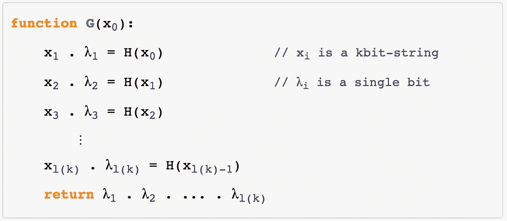

# 构建伪随机数发生器

> 原文：<https://towardsdatascience.com/building-a-pseudorandom-number-generator-9bc37d3a87d5?source=collection_archive---------8----------------------->

## 在不到 50 行的 Python 代码中

在我的文章“ [*如何从一个不平衡的 RNG 得到一个无偏的 T2*](/how-to-get-an-unbiased-rng-from-an-unbalanced-one-dbb44850e5f7)*”*中，我展示了如何从任何来源提取随机性。现在的目标是从头开始构建一个伪随机数生成器！

## “为什么我需要一个随机数？”

随机数的重要性不在于数字本身(如果单独来看，它们是普通的数字)，而在于它们产生的方式。

现代技术是基于这些数字:通信协议，加密，游戏大量使用它们，它们的整体安全性和不可预测性依赖于它们。

假设你想创建一个游戏，系统抛出一枚硬币，玩家在结果上下赌注(用真钱)。如果玩家是正确的，那么他有奖励(金钱),否则他失去了放置的金钱。如果你的硬币真的是公平的(或不可预测的)，那么你就没什么好担心的。

但是，如果玩家能够以很高的准确率预测下一次投掷的结果，会发生什么呢？或者他们是否能根据最后三投预测下一个结果？答案显而易见。

# 自然发电机

大自然提供了一些随机性的来源，但是使用起来非常昂贵。

在宏观环境中，来源很少，如气候变化或宇宙微波背景。这种发电机非常昂贵:我想买一个系统，把你和测量 CMB 变化的卫星连接起来，并在几毫秒内发回结果。成本在 4 ~ 5 亿美元左右。

好吧，我举了一个极端的例子，但是总的来说，考虑到成本和性能，这一点都不方便。

在微观上，整个环境是由混沌驱动的:据我们所知，这是一个概率世界；但是，管理这种资源又是非常昂贵的。完美地平衡一个粒子的量子态这不是一个简单的任务。

# 伪随机发生器

由于这些原因，我们总是发现在我们的机器(电脑、智能手机、电视、*等……*)中内置发电机很方便。此外，有一个更简洁的方法来计算随机字符串总是好的:如果您的系统从以μK 为单位的本地温度中提取一个序列，任何人都可以通过在您的系统附近放置一个传感器来复制相同的序列；甚至任何人都可以操纵检测并控制你的序列。

计算机使用 CPU 来执行指令，而 CPU 是基于确定性机制的。我们如何从一个没有任何随机性来源的环境中创造随机性？

在我回答这个问题之前，让我们定义一个伪随机数发生器(PRNG)。从这里开始，我将处理使用位(0 和 1)的 PRNGs，但对于其他情况，验证其属性是非常容易的，因为可以用一个数来编码一个二进制序列。

# 背后的理论

给定一个初始种子，PRNG 产生一个比特序列，该序列与由真实随机源产生的序列无法区分。

不可区分是指在一台[概率图灵机](http://web.archive.org/web/20161115065946/http://en.wikipedia.org/wiki/Probabilistic_Turing_machine)上没有可以在多项式时间内执行的算法可以决定给定的序列是随机的还是计算出来的。也就是说，没有随机算法能说 PRNG 产生的字符串是确定性计算的还是随机提取的。

因此，这是 PRNG 的一个定义:它是一个在多项式时间内在确定性图灵机上可执行的算法，计算一个函数 ***G*** 使得

用 ***l*** 作为单调递增函数。这意味着输出总是比输入(种子)长。

同样，对于属于 [BPP 类](https://en.wikipedia.org/wiki/BPP_(complexity))的**D*D*中的每个算法，对于每个多项式**p和对于每个整数**k足够大:******

这个庞大的公式可以这样理解:

*[*概率多项式时间问题(BPP)*](https://en.wikipedia.org/wiki/BPP_(complexity)) *类中的算法能够区分真实随机源和 PRNG 之间的序列的概率随着种子长度的增加比任何多项式更快地趋向于零*。*

*因此，PRNG 是一种算法，它将种子作为输入，并返回一个更长的字符串，因此没有人能够轻易说出它是否被计算过。算法计算出的函数称为 ***G*** 。*

****G*** 的定义说，如果初始种子是一个 ***k*** 比特的序列，那么*G***l(k)***比特的更长序列。我们是否应该为每一个可能的函数 ***l*** 构建一个不同的函数 ***G*** ？**

**从简单的 PRNG **号开始 *H* 号****

****

**有可能以 ***G*** 的形式构建任何 PRNG，如下所示:**

****

**其中，xᵢ λᵢ是位串，是位串 xᵢ和单个位λᵢ.串联的结果 ***H*** 函数从初始种子生成一个比原来长一位的序列。通过调用 ***H*** 函数 ***l(k)*** 次并从每次迭代中取出最后一位，我们已经生成了一系列的***【l(k)***位。显然这个功能就是 ***G*** 。**

**我们现在能够构建一个函数，该函数采用 ***k*** 位并返回 ***l(k)*** 位，使得没有算法能够决定 ***l(k)*** 位是否是从真实的随机源生成的。通过这个技巧，我们从构建输出***【k】***位的函数(使用 ***l( )*** 通用多项式函数)的问题转移到只返回 ***k+1*** 位的函数。剩下的就是定义 ***H*** 函数。**

## **单向置换的 h 函数**

**选择 ***H*** 作为单向置换是个好主意。**

*****H*** 如果很难求逆就是单向排列:给定*y，很难计算出*x 使得 ***H(x) = y*** 。****

**众所周知且广泛使用的单向置换是模幂运算。给定一个质数 ***p*** 和一个整数 ***x*** 使得
***0<x<p-1***，**

****

**其中 ***g*** 是循环群的生成元**

****

**这个循环群的生成元的个数是**

****

**当 ***p*** 为奇素数时，其中 ***ϕ*** 为[欧拉全等函数](https://en.wikipedia.org/wiki/Euler%27s_totient_function)。现在求这样的 ***x*** 需要计算离散对数，这是一个著名的未解计算难题。也就是说，没有计算大整数的离散对数的有效方法是已知的。公钥密码学中的许多算法基于这样一种假设，即没有有效的方法来计算它的安全性。**

## **最后一点**

**我们发现一个函数从 ***k*** 位开始，返回 ***k*** 位，并且很难反转。我们需要额外的一位，根据 ***H*** 的定义。该位是功能 ***f*** 的*核心位*。如果已知*x，则 ***f*** 的核心位有点容易计算，但如果只给定 ***f(x)*** 则很难计算。***

**为了找到它，让我们定义两个 ***k*** 位串 ***x*** 和 ***y*** 之间的新操作:**

****

**如果***【x】***是一个单向排列(就像上面定义的那样) ***g(x，y) = f(x) ‖ y*** ，那么 **⟨ *x，y* ⟩** 是 ***g*** 的硬核位，其中***这是由 [Goldreich-Levin 定理](https://en.wikipedia.org/wiki/Hard-core_predicate)陈述的。*****

***最后我们找到了 PRNG ***H*** 这是它的正式定义:***

****

**在哪里**

********

# **PRNG**

**现在我们可以根据我们给出的 ***H*** 和 ***G*** 的定义来构建一个好的 PRNG。对于那些错过的人， ***G*** 是一个函数(实际上是 PRNG 本身),给定输入中的一个 ***k*** 位串，输出一个 ***l(k)*** 位串，并且没有随机算法可以判断产生的字符串是否是由真正的随机源生成的； ***H*** 是一个帮助找到那些伪随机位的函数。**

****

**注意，我假设生成器 ***g = 2*** 。你应该找到一个依赖于 ***p*** 的生成器，因为这只是一个例子(即使统计上 ***2*** 是一个频繁的生成器)。如果你想为你的 ***p*** 找到一个生成器，你可以使用[这个在线工具](http://www.bluetulip.org/2014/programs/primitive.html)来计算给定素数的根基元模。**

**现在主要功能 ***G*** ，【PRNG:**

****

**其中 ***l( )*** 可以是任意多项式函数。**

****

**由于 ***H*** 的输入是将被分成两半的位串，所以初始种子 ***x0*** 的长度必须是偶数。**

**请记住，根据上一节的定义，更长的种子会产生更难区分的序列。这意味着更长的种子将产生更不可预测的比特序列。**

# **Python 实现**

**为了轻松管理位操作，算法的实现在字符串上工作，因此它可以更好地从上面显示的伪代码转换为 Python 代码。但是它可以通过直接处理位来增强，代价是可读性。**

**我用了模幂运算作为单向排列和
***l(k)= k-2k+1***。**

**[Link to the gist](https://gist.github.com/firaja/f2eabc05db3fdd4cf60373f5971b4eb3)**

**用法:**

****

**唯一采用的参数是初始种子，它必须是一个二进制字符串，长度不能超过变量`SEED_SIZE`的值。**

**如果您想要生成一个数字序列，您可以使用输出的任何部分作为下一次迭代的种子。更大的种子会产生更好的输出，但在使用它之前，请记住重新定义一个合适的 ***l( )*** ，如果您想保持模幂运算为单向变换，请选择一个新的`GENERATOR`，它是`MODULUS`的原始根。**