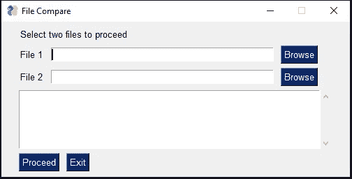
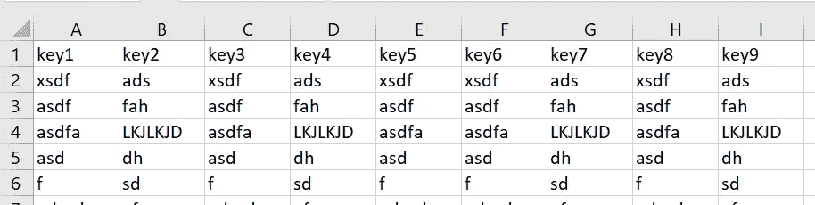
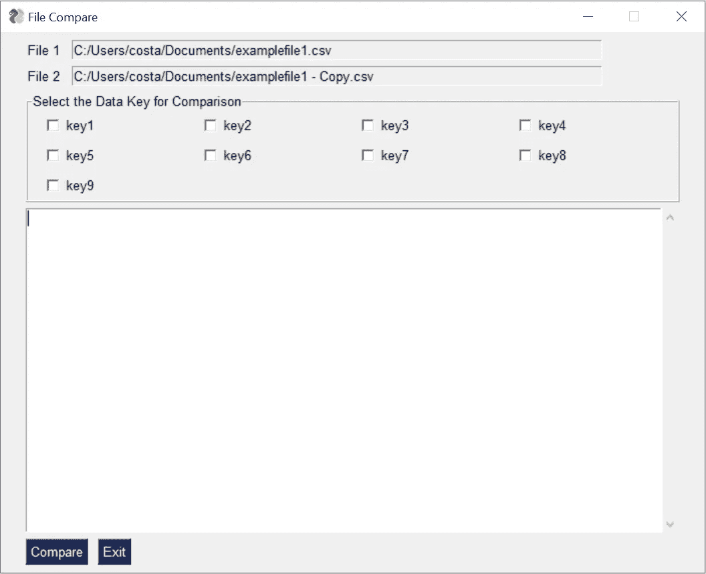
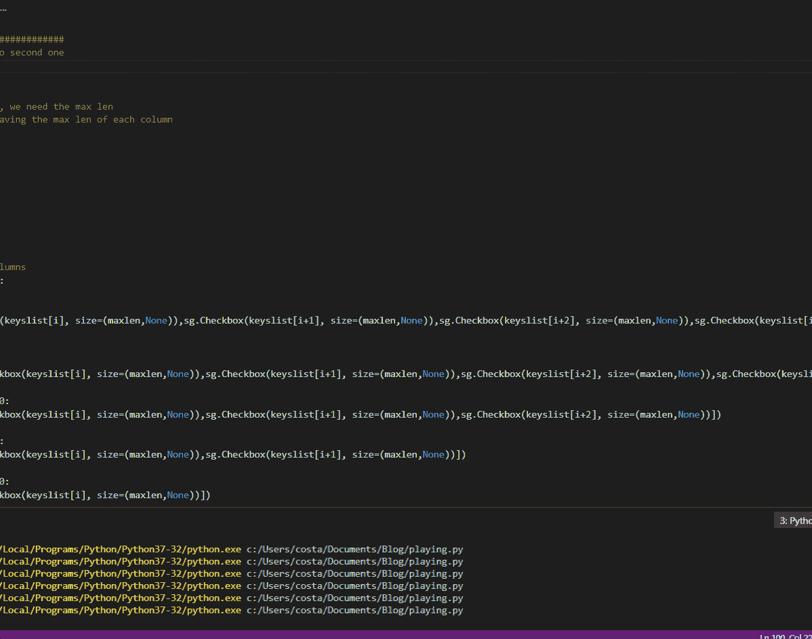

# 构建用于比较数据的 Python UI

> 原文：<https://towardsdatascience.com/building-a-python-ui-for-comparing-data-13c10693d9e4?source=collection_archive---------4----------------------->

## 如何快速让您的非技术团队能够比较数据


Photo by [David Werbrouck](https://unsplash.com/@bigkids?utm_source=medium&utm_medium=referral) on [Unsplash](https://unsplash.com?utm_source=medium&utm_medium=referral)

在分析或 IT 功能上花足够的时间，很快就会发现处理数据是必须的。收集数据，处理数据，当然还有比较数据。如今，所有这些数据的问题通常在于其数量之大。

除非人们的技术水平足够高，知道如何使用 Python、R 或类似的语言，否则当他们需要处理更大的数据集时，他们会很吃力。不幸(还是幸运？)，Excel 就不剪了。这给人们制造了许多障碍。

当谈到数据操作，包括查看数据或比较数据时，我听到的最常见的抱怨之一是 Excel 根本不支持它。太大了，装不下。为此，我写了一些文章解释如何解决这个问题——但是我的大部分文章在本质上都是技术性的。它需要你写代码和使用命令行。

[](https://medium.com/financeexplained/from-excel-to-databases-with-python-c6f70bdc509b) [## 用 Python 从 Excel 到数据库

### 了解如何使用 Python 进行快速数据分析

medium.com](https://medium.com/financeexplained/from-excel-to-databases-with-python-c6f70bdc509b) 

除非你是一个技术人员，否则你不一定会觉得这很容易。同样，如果你想和一个非技术人员分享这个功能。

然而，在我上一篇文章中，我们介绍了如何快速地用 Python 开发 ui，然后与我们更广泛的团队或社区分享它们。反响非常好；你们中的许多人觉得它非常有趣。

[](/learn-how-to-quickly-create-uis-in-python-a97ae1394d5) [## 了解如何用 Python 快速创建 ui

### 最后，你可以在 10 分钟内找到一个图书馆

towardsdatascience.com](/learn-how-to-quickly-create-uis-in-python-a97ae1394d5) 

在这篇博客中，我们将介绍 PySimpleGUI 的大量可用特性，同时我们还将构建一些东西，让我们的非技术朋友能够快速比较数据。

# 定义用户界面

我们需要做的第一件事是定义一个简单的 UI，允许用户选择两个文件。



Choosing the two files to display

一旦定义了这两个文件，我们应该执行一些基本的验证，以确保这两个文件是可比较的。寻找相同的列标题可能是一种方法。然后，我们可以提供这些标题作为潜在的关键字，用户可以选择用于数据比较。

使用此示例文件:



Screenshot of example file

将构建以下屏幕:



以下是包括输出在内的全部内容:



# 图书馆

## 构建用户界面

为了构建 UI，我们将使用基于 Tkinter、wxPython 和 PyQT 的 PySimpleGUI 库。这段代码再简单不过了。快速偷窥:

```
import PySimpleGUI as sgsupportedextensions = ['csv','xlsx', 'xlsm' ,'json']layoutprefile = [
    [sg.Text('Select two files to proceed')],
    [sg.Text('File 1'), sg.InputText(), sg.FileBrowse()],
    [sg.Text('File 2'), sg.InputText(), sg.FileBrowse()],
    # *list1,
    [sg.Output(size=(61, 5))],
    [sg.Submit('Proceed'), sg.Cancel('Exit')]
]window = sg.Window('File Compare', layoutprefile)while True:    # The Event Loop
    event, values = window.read()
    if event in (None, 'Exit', 'Cancel'):
        secondwindow = 0
        break
    elif event == 'Proceed':
  print('yay')
```

## 阅读文件

我们将使用著名的熊猫图书馆来阅读文件。这将允许我们快速支持 CSV、JSON 和 Excel 文件。一旦文件在数据框中，我们就可以进行必要的操作了。

```
import re
import pandas as pdfile1 = r"C:/temp/file.csv"
file2 = r"C:/temp/file1.csv" if re.findall('/.+?/.+\.(.+)',file1)[0] == 'csv':
 df1, df2 = pd.read_csv(file1), pd.read_csv(file2)
elif re.findall('/.+?/.+\.(.+)',file1)[0] == 'json':
 df1, df2 = pd.read_json(file1), pd.read_json(file2)
elif re.findall('/.+?/.+\.(.+)',file1)[0] in  ['xlsx', 'xlsm']:
 df1, df2 = pd.read_excel(file1), pd.read_excel(file2)
```

为了从文件路径中提取扩展名，我使用了 *re* 库，这是 Python 的正则表达式库。正则表达式给了我们一种模式匹配和提取信息的方法。

[](https://medium.com/better-programming/introduction-to-regex-8c18abdd4f70) [## 正则表达式简介

### 使用 Python 逐步介绍正则表达式

medium.com](https://medium.com/better-programming/introduction-to-regex-8c18abdd4f70) 

## 比较数据

为了进行比较，我们将使用 DataComPy 库，它为我们提供了一个很好的比较摘要。

[](/how-to-quickly-compare-data-sets-76a694f6868a) [## 如何快速比较数据集

### 如何快速总结两个数据集之间的差异

towardsdatascience.com](/how-to-quickly-compare-data-sets-76a694f6868a) 

代码还是非常简单:

```
compare = datacompy.Compare(
    df1,
    df2,
    join_columns=definedkey,
    abs_tol=0, #Optional, defaults to 0
    rel_tol=0, #Optional, defaults to 0
    df1_name='Original', #Optional, defaults to 'df1'
    df2_name='New' #Optional, defaults to 'df2'
)
print(compare.report())
```

## 共享用户界面

为了共享 UI，我们可以使用 PyInstaller。只需找到您的文件(本例中为 ComPyUI.py)并运行以下命令:

```
pyinstaller --onefile ComPyUI.py
```

# 代码

事不宜迟，只需在本地复制下面的代码，并运行它作为比较工具:

```
import PySimpleGUI as sg
import re, time
import datacompy
import pandas as pdsupportedextensions = ['csv','xlsx', 'xlsm' ,'json']layoutprefile = [
    [sg.Text('Select two files to proceed')],
    [sg.Text('File 1'), sg.InputText(), sg.FileBrowse()],
    [sg.Text('File 2'), sg.InputText(), sg.FileBrowse()],
    # *list1,
    [sg.Output(size=(61, 5))],
    [sg.Submit('Proceed'), sg.Cancel('Exit')]
]window = sg.Window('File Compare', layoutprefile)while True:    # The Event Loop
    event, values = window.read()
    # print(event, values)  # debug
    if event in (None, 'Exit', 'Cancel'):
        secondwindow = 0
        break
    elif event == 'Proceed':
        #do some checks if valid directories have been provided
        file1test = file2test = isitago = proceedwithfindcommonkeys = None
        file1, file2 = values[0], values[1]
        if file1 and file2:
            file1test = re.findall('.+:\/.+\.+.', file1)
            file2test = re.findall('.+:\/.+\.+.', file2)
            isitago = 1
            if not file1test and file1test is not None:
                print('Error: File 1 path not valid.')
                isitago = 0
            elif not file2test and file2test is not None:
                print('Error: File 2 path not valid.')
                isitago = 0
            #both files to have the same extension
            elif re.findall('/.+?/.+\.(.+)',file1) != re.findall('/.+?/.+\.(.+)',file2):
                print('Error: The two files have different file extensions. Please correct')
                isitago = 0
            #they need to be in a list of supported extensions
            elif re.findall('/.+?/.+\.(.+)',file1)[0] not in supportedextensions or re.findall('/.+?/.+\.(.+)',file2)[0] not in supportedextensions:
                print('Error: File format currently not supported. At the moment only csv, xlsx, xlsm and json files are supported.')
                isitago = 0
            elif file1 == file2:
                print('Error: The files need to be different')
                isitago = 0
            elif isitago == 1:
                print('Info: Filepaths correctly defined.')
                # check if files exist
                try:
                    print('Info: Attempting to access files.')
                    if re.findall('/.+?/.+\.(.+)',file1)[0] == 'csv':
                        df1, df2 = pd.read_csv(file1), pd.read_csv(file2)
                    elif re.findall('/.+?/.+\.(.+)',file1)[0] == 'json':
                        df1, df2 = pd.read_json(file1), pd.read_json(file2)
                    elif re.findall('/.+?/.+\.(.+)',file1)[0] in  ['xlsx', 'xlsm']:
                        df1, df2 = pd.read_excel(file1), pd.read_excel(file2)
                    else:
                        print('How did we get here?')
                    proceedwithfindcommonkeys = 1
                except IOError:
                    print("Error: File not accessible.")
                    proceedwithfindcommonkeys = 0
                except UnicodeDecodeError:
                    print("Error: File includes a unicode character that cannot be decoded with the default UTF decryption.")
                    proceedwithfindcommonkeys = 0
                except Exception as e:
                    print('Error: ', e)
                    proceedwithfindcommonkeys = 0
        else:
            print('Error: Please choose 2 files.')
        if proceedwithfindcommonkeys == 1:
            keyslist1 = [] #This will be the list of headers from first file
            keyslist2 = [] #This will be the list of headers from second file
            keyslist = [] #This will be the list of headers that are the intersection between the two files
            formlists = [] #This will be the list to be displayed on the UI
            for header in df1.columns:
                if header not in keyslist1:
                    keyslist1.append(header)
            for header in df2.columns:
                if header not in keyslist2:
                    keyslist2.append(header)
            for item in keyslist1:
                if item in keyslist2:
                    keyslist.append(item)
            if len(keyslist) == 0:
                print('Error: Files have no common headers.')
                secondwindow = 0
            else:
                window.close()
                secondwindow = 1
                break#################################################
# First screen completed, moving on to second one
if secondwindow != 1:
    exit()#To align the three columns on the UI, we need the max len
#Note: This could be made better by having the max len of each column
maxlen = 0
for header in keyslist:
    if len(str(header)) > maxlen:
        maxlen = len(str(header))if maxlen > 25:
    maxlen = 25
elif maxlen < 10:
    maxlen = 15#we need to split the keys to four columns
for index,item in enumerate(keyslist):
    if index == 0: i =0
    if len(keyslist) >= 4 and i == 0:
        formlists.append([sg.Checkbox(keyslist[i], size=(maxlen,None)),sg.Checkbox(keyslist[i+1], size=(maxlen,None)),sg.Checkbox(keyslist[i+2], size=(maxlen,None)),sg.Checkbox(keyslist[i+3], size=(maxlen,None))])
        i += 4
    elif len(keyslist) > i:
        if len(keyslist) - i - 4>= 0:
            formlists.append([sg.Checkbox(keyslist[i], size=(maxlen,None)),sg.Checkbox(keyslist[i+1], size=(maxlen,None)),sg.Checkbox(keyslist[i+2], size=(maxlen,None)),sg.Checkbox(keyslist[i+3], size=(maxlen,None))])
            i += 4
        elif len(keyslist) - i - 3>= 0:
            formlists.append([sg.Checkbox(keyslist[i], size=(maxlen,None)),sg.Checkbox(keyslist[i+1], size=(maxlen,None)),sg.Checkbox(keyslist[i+2], size=(maxlen,None))])
            i += 3
        elif len(keyslist)- i - 2>= 0:
            formlists.append([sg.Checkbox(keyslist[i], size=(maxlen,None)),sg.Checkbox(keyslist[i+1], size=(maxlen,None))])
            i += 2
        elif len(keyslist) - i - 1>= 0:
            formlists.append([sg.Checkbox(keyslist[i], size=(maxlen,None))])
            i += 1
        else:
            sg.Popup('Error: Uh-oh, something\'s gone wrong!')

#The second UI
layoutpostfile = [
    [sg.Text('File 1'), sg.InputText(file1,disabled = True, size = (75,2))],
    [sg.Text('File 2'), sg.InputText(file2,disabled = True, size = (75,2))],
    #[sg.Text('Select the data key for the comparison:')],
    [sg.Frame(layout=[
        *formlists],title = 'Select the Data Key for Comparison',relief=sg.RELIEF_RIDGE
    )],
    [sg.Output(size=(maxlen*6, 20))],
    [sg.Submit('Compare'), sg.Cancel('Exit')]
]window2 = sg.Window('File Compare', layoutpostfile)
datakeydefined = 0
definedkey = []while True:  # The Event Loop
    event, values = window2.read()
    # print(event, values)  # debug
    if event in (None, 'Exit', 'Cancel'):
        break
    elif event == 'Compare':
        definedkey.clear()
        file1test = file2test = isitago = None
        #print('Event', event, '\n', 'Values', values)
        for index, value in enumerate(values):
            if index not in [0,1]:
                if values[index] == True: 
                    datakeydefined = 1
                    definedkey.append(keyslist[index-2])
            #print(index, values[index], keyslist[index-2])
        if len(definedkey) > 0:
            compare = datacompy.Compare(
                    df1,
                    df2,
                    join_columns=definedkey,  #You can also specify a list of columns eg ['policyID','statecode']
                    abs_tol=0, #Optional, defaults to 0
                    rel_tol=0, #Optional, defaults to 0
                    df1_name='Original', #Optional, defaults to 'df1'
                    df2_name='New' #Optional, defaults to 'df2'
            )
            print('########################################################################################################')
            print(compare.report())
        else:
            print('Error: You need to select at least one attribute as a data key')
```

# 这种解决方案的局限性

这个解决方案有相当多的限制，但它是一个可以在未来非常容易和快速地增强的解决方案。最好拥有以下物品:

1.  如果定义 CSV 定界符而不是现在假设一个'，'就好了
2.  窗口的大小太不稳定，使用很长的标题会产生问题
3.  使系统能够记住基于文件名的按键选择
4.  完整的目录核对

我相信还有很多，但是请让我知道你的想法！