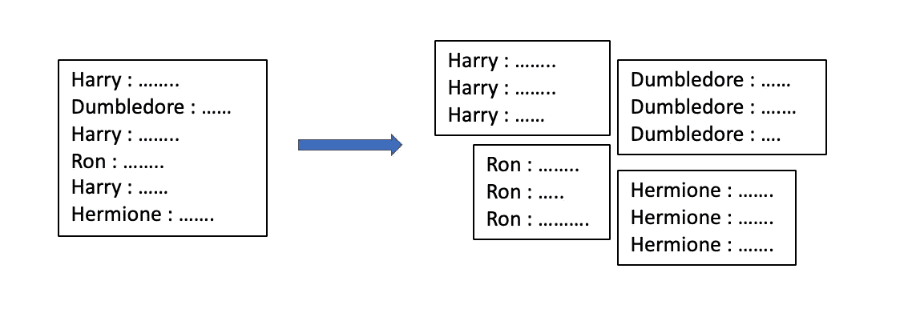

# 用机器学习构建哈利波特语录机器人

> 原文：<https://towardsdatascience.com/building-a-quotebot-with-machine-learning-eca39272e3b7?source=collection_archive---------24----------------------->

## 使用 N-grams 和深度学习创建报价生成器应用程序的生成文本模型


语言模型如今被广泛使用。电子邮件、WhatsApp 文本、自动聊天机器人中的下一个单词预测都是基于语言模型的。


生成模型将一些文本作为输入，学习词汇和句子结构，并创建文本。《用 Python 进行深度学习》(Francois Chollet)这本书是理解 LSTMs 和神经网络如何学习文本的绝佳资源。这是理解 N 元语言模型的另一个很好的指南。

我使用生成模型创建了一个引用机器人，它从哈利波特宇宙中创建角色特定的引用！

# **数据**

首先，我下载了《哈利·波特》系列的电影剧本。这给我带来了第一个挑战。在 python 中使用 pdf！幸运的是，我找到了一个包“pdf2txt ”,可以将这些 pdf 文件转换成我们以前的格式。txt 文件。

```
pdf2txt.py -o HP1_movie_script.txt HP1.pdf
```

这些更容易处理。
现在，继续前进。

# **备考**

我的 QuoteBot 是特定于角色的，所以要学习一个特定角色的演讲风格，只需要相关的对话。我把每个角色的台词都分离出来，并把它们标记出来。



因为 QuoteBot 需要一个生成模型，所以创建一个语料库并对单词进行标记是我们唯一需要的数据准备。其他传统的 NLP 预处理步骤是不必要的，因为我们希望保持原始文本不变，以便模型学习序列。

# 模特们


**N 元模型**

ngrams 模型基于单词或字符出现的条件概率。对于我的 QuoteBot，我创建了一个单词级别的模型，在给定语料库中的一组单词的情况下，该模型查看下一个单词出现的概率。

单字和双字通常过于简单，无法创建连贯的文本。三元模型及以上可能非常有用。但是，我们应该谨慎使用更高阶的“克”。例如，10 克只会记住一个句子，而不是学习结构，导致模型“过度适应”。

三元模型比二元模型产生更一致的输出，例如

> “不得不承认，我确实认为我可能看到了什么——当它被风吹走的时候？”—罗恩·韦斯莱

还有，4 克-

> “真的吗？昨晚你不是不得不滚到床下以免被碎尸万段吗！做你的朋友会死人的，哈利！”—罗恩·韦斯莱

相当酷！有了这些 ngrams 模型，我在深度学习部分徘徊，看看递归神经网络是否会有帮助。特别是 LSTM 模型。

**LSTM 模式**

LSTM 模型也可以是字符级或单词级模型。对于我的 QuoteBot，我尝试了两种方法。[LSTM 生成模型理解指南](https://machinelearningmastery.com/how-to-develop-a-word-level-neural-language-model-in-keras/)

***人物级别***

模型细节:1 层(有 Dropout)，激活函数— softmax，优化器— RMSprop，损失函数—分类交叉熵。我让模型运行了 100 个时期，有了上面的这些细节，我的字符级模型给出了一个稍微不连贯的输出。

> “*荣！你将带领进化者去赢得荣誉。那是什么意思，先生？我不知道发生了什么？他们可能会羡慕我。*”—哈利

有些词不连贯，句子结构有点不对。

***字级 LSTM***

模型细节:3 层(有 Dropout)，激活函数— ReLU & softmax，优化器— Adam，损失函数—分类交叉熵。
我让模型运行了 300 个时期(在 Google Colab 上),有了以上这些细节，我的单词级模型给出了比字符级更好的输出。

> ”*晚上哈利我有一个古老的迷宫继续说你也不会害怕哈利我想是伏地魔。* " —邓布利多

这样好多了！听起来这个角色和所有的单词都是连贯的。

# 创建 QuoteBot

基于每个生成模型的输出，我选择三元模型来创建 QuoteBot。我用 Flask 创建了一个应用程序，它将一个字符作为输入，并给出字符特定的引用！

# 学习

少即是多… **不是**！深度学习模型需要一个大型数据集来从语料库中“学习”单词的顺序。给模型一个更大的语料库并调整更多的超参数肯定会提高模型的性能。

创建更大的语料库可以通过两种方式实现——
*数据扩充*——基于现有语料库为角色模拟更多文本
*将范围*从哈利波特电影系列扩展到我们希望模型学习的任何文本文档！

更多的训练对于优化模型输出总是更好的…斯内普同意！


[LinkedIn](https://www.linkedin.com/in/asmitak/) ， [Github](https://github.com/asmitakulkarni/QuoteGenerator)

参考资料:

[N 克语言模型](https://web.stanford.edu/~jurafsky/slp3/3.pdf)

[使用 LSTMs 生成字符级文本](https://machinelearningmastery.com/text-generation-lstm-recurrent-neural-networks-python-keras/)

[NLTK — ngram 建模](https://www.kaggle.com/alvations/n-gram-language-model-with-nltk)