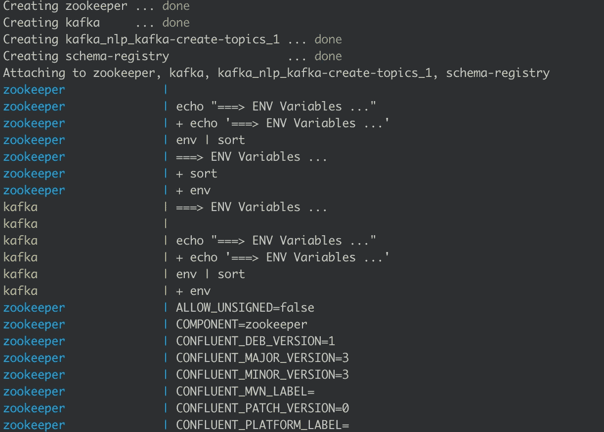
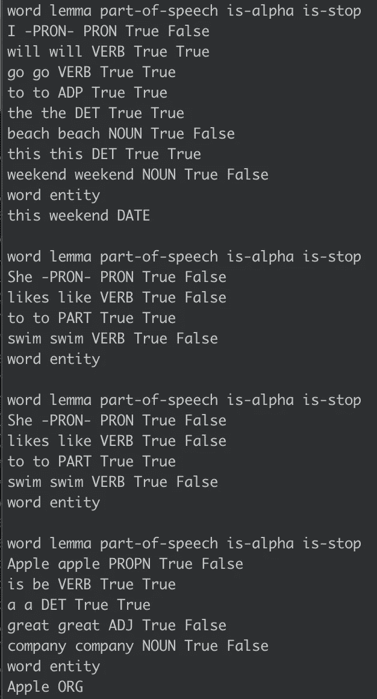

# 使用 Kafka 和 spaCy 构建实时 NLP 管道

> 原文：<https://towardsdatascience.com/building-a-realtime-nlp-pipeline-using-kafka-and-spacy-d4ad636be702?source=collection_archive---------16----------------------->


在本教程中，我们将使用[汇合 Kafka](https://www.confluent.io) 、python 和一个名为 [spaCy](https://spacy.io/usage/spacy-101#pipelines) 的预训练 NLP 库来构建一个实时管道。

作为先决条件，我们应该在本地安装 docker，因为我们将在我们的机器上运行 kafka 集群，还有 python 包 spaCy 和 confluent_kafka - `pip install spacy confluent_kafka.`

## 步骤 1:构建 kafka 集群

为了构建集群，我们将使用一个`docker-compose`文件来启动所有需要的 docker 容器:zookeeper、一个代理和模式注册表。

现在简单地说，kafka 是一个分布式流媒体平台，能够处理大量的消息，这些消息被组织或分组到主题中。为了能够并行处理一个主题，必须将它分成多个分区，来自这些分区的数据存储在称为代理的独立机器中。最后，zookeeper 用于管理集群中代理的资源。这是卡夫卡经典版本中的元素。汇合平台添加了另一个元素，称为模式注册表。这是一种非常方便的方法，可以确保我们在写入和读取流中的数据时保持相同的模式。通常模式是以独立于平台的方式用`avro`格式编写的，它存储在模式注册表中。

为了读写 kafka 集群，我们需要一个代理地址、一个主题和模式注册中心的 url。

`docker-compose`将在`2181`端口启动`zookeper`，在`9092`端口启动`kafka broker`，在`9999`端口启动`schema registry`。除此之外，我们使用另一个 docker 容器`kafka-create-topic`的唯一目的是在 kafka 代理中创建一个主题(称为 test)。

要启动 kafka 集群，我们必须在定义 docker compose 文件的同一文件夹中运行以下命令行指令:

```
docker-compose up
```

这将启动所有带有日志的 docker 容器。我们应该在控制台中看到类似这样的内容:



## 步骤 2:启动 kafka 生成器，并在流中写入一些消息

我们将用 python 创建一个简单的 kafka producer 来发送消息。这将通过使用`confluent_kafka`库来实现。

卡夫卡的信息是键值对。该键通常用于对主题中的数据进行分区。我们将为我们的消息定义一个 avro 模式:

```
value_schema_str = """
{
   "namespace": "my.schema",
   "name": "value",
   "type": "record",
   "fields" : [
     {
       "name" : "data",
       "type" : "string"
     }
   ]
}
"""key_schema_str = """
{
   "namespace": "my.schema",
   "name": "key",
   "type": "record",
   "fields" : [
     {
       "name" : "key",
       "type" : "string"
     }
   ]
}
"""
```

在`key schema`中，我们有一个名为`key`的字段，类型为`string`，在`value schema`(实际数据)中，我们也只有一个名为`data`的字段，类型为 string。

主要的 python 代码非常简单:

一旦我们用适当的配置定义了一个生产者，我们就可以向某个主题的代理异步发送大量消息。在教程的最后，我们有一个包含完整示例的 github 库的链接，包含配置和其他我们有意跳过的内容。

需要注意的一件重要事情是我们生成数据和密钥的方式:

```
value = {"data": random.choice(simple_messages)}        
key = {"key": str(uuid.uuid4())}
```

密钥是一个随机的 uuid 字符串。这将确保数据在集群中均匀分布。对于数据，我们只是从预定义的列表中随机选择一个句子。对于我们发送的每一句话，我们将在消费者端应用一些 nlp 规则。

接下来，我们将消息发送到一个缓冲区，一旦达到一定数量的消息，该缓冲区将被刷新:

```
try:            
    avroProducer.produce(topic=args.topic, value=value, key=key)        except BufferError as e:            
    messages_to_retry += 1
```

如果发送数据时出现问题，我们会再次重试。最后，我们只需要`flush`缓冲区，我们实际上是将消息发送到 kafka 集群。

要运行生成器，我们只需在终端中运行:

```
python3 producer.py
```

我们应该会看到日志`we’ve sent 5 messages to 127.0.0.1:9092`

`producer.py`也有额外的命令行参数。例如，如果我们想要发送 10 条消息，而不是默认数量的`5`，我们可以使用`python3 producer.py -m 10`。

可选的命令行参数有:

*   `-b`代理 ip 和端口，默认`127.0.0.1:9092`
*   `-s`模式注册表 url，默认`[http://127.0.0.1:9999](http://127.0.0.1:9999)`
*   `-t`卡夫卡主题，默认`test`
*   `-m`消息数量，默认`5`

## 步骤 3:消费 kafka 消息并应用 nlp 处理

卡夫卡的消费者是拼图的最后一块。在这一部分中，我们创建了一个`AvroConsumer`并为其订阅了`test`主题。我们对主题进行投票，直到找到想要的消息数量，并跳过`null`或无效的消息。

一旦我们对一条消息进行了去序列化，我们就可以使用`spacy`来应用 nlp 管道，并从单词中提取一些信息。

spacy 很酷的一点是，它是根据英语中的一般单词预先训练的，所以我们几乎可以开箱即用。为了下载`spacy`的英语词汇，我们需要运行`python3 -m spacy download en`。

这个`spacy` API 非常容易使用。我们只需要将我们的句子传递给`nlp`方法，这将运行一系列算法，如`tokenization`(将句子分解成单词)、`lemmatisation`(获得单词的基本形式)、`part-of-speech tagging`(从单词中获得词性，如动词、副词等。)，`named entity extraction`(识别命名实体，如组织或地理实体)。一旦应用了算法，我们就可以从每个单词中提取我们需要的数据。

要运行使用者，请执行以下操作:

```
python3 consumer.py
```

使用与我们在生成器中相同的可选命令行参数。

输出应该类似于下图:



完整的代码示例可以在 [github](https://github.com/BogdanCojocar/medium-articles/tree/master/kafka_nlp) 上找到。