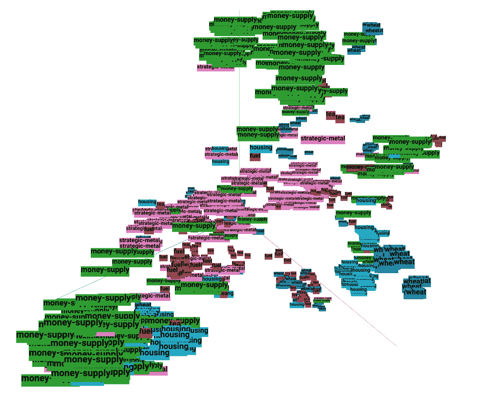
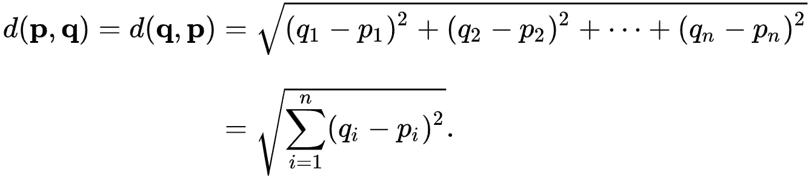
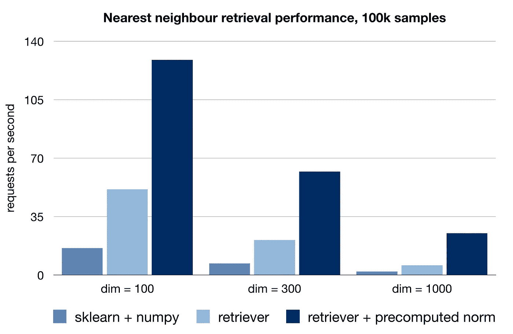

# 用 BERT 和 TensorFlow 构建搜索引擎

> 原文：<https://towardsdatascience.com/building-a-search-engine-with-bert-and-tensorflow-c6fdc0186c8a?source=collection_archive---------2----------------------->

## 在这个实验中，我们使用一个预先训练好的 BERT 模型检查点来建立一个通用的文本特征提取器，并将其应用到最近邻搜索任务中。



T-SNE decomposition of BERT text representations (Reuters-21578 benchmark, 6 classes)

基于深度[神经概率语言模型](http://www.jmlr.org/papers/volume3/bengio03a/bengio03a.pdf)如[伯特](/bert-explained-state-of-the-art-language-model-for-nlp-f8b21a9b6270)的特征提取器可以提取与大量下游 NLP 任务相关的特征。出于这个原因，它们有时被称为[自然语言理解](https://en.wikipedia.org/wiki/Natural-language_understanding) (NLU)模块。

这些特征也可以用于计算文本样本之间的相似性，这对于基于[实例的学习](https://en.wikipedia.org/wiki/Instance-based_learning)算法(例如 [K-NN](https://en.wikipedia.org/wiki/K-nearest_neighbors_algorithm) )是有用的。为了说明这一点，我们将为文本构建一个最近邻搜索引擎，使用 BERT 进行特征提取。

这个实验的计划是:

1.  获取预训练的 BERT 模型检查点
2.  提取为推理而优化的子图
3.  用 tf 创建特征提取器。估计量
4.  用 T-SNE 和嵌入式投影仪探索向量空间
5.  实现最近邻搜索引擎
6.  用数学加速搜索查询
7.  示例:构建电影推荐系统

# 问题和答案

## 这本指南里有什么？

本指南包含两件事的实现:一个 BERT 文本特征提取器和一个最近邻搜索引擎。

## 这本指南是给谁的？

本指南对那些有兴趣使用 BERT 进行自然语言理解任务的研究人员应该是有用的。它也可以作为与 tf 接口的工作示例。估计器 API。

## 需要什么？

对于熟悉 TensorFlow 的读者来说，完成本指南大约需要 30 分钟。

## 给我看看代码。

这个实验的代码可以在 Colab [这里](https://colab.research.google.com/drive/1ra7zPFnB2nWtoAc0U5bLp0rWuPWb6vu4)获得。另外，看看我为我的 BERT 实验建立的[库](https://github.com/gaphex/bert_experimental):它包含额外的东西！

现在，我们开始吧。

# 步骤 1:获得预训练模型

我们从预先训练的 BERT 检查点开始。出于演示的目的，我将使用谷歌工程师预先训练的无外壳[英文模型](https://storage.googleapis.com/bert_models/2018_10_18/uncased_L-12_H-768_A-12.zip)。要训练一个不同语言的模型，请查看我的[其他指南](https://medium.com/p/pre-training-bert-from-scratch-with-cloud-tpu-6e2f71028379?source=email-e6b20e934e90--writer.postDistributed&sk=51c46354668b0fc4255fe8bb7e1e3035)。

为了配置和优化用于推理的图表，我们将利用令人敬畏的 [bert-as-a-service](https://github.com/hanxiao/bert-as-service) 存储库。这个存储库允许通过 TCP 为远程客户端提供 BERT 模型。

在多主机环境中，拥有远程 BERT-server 是非常有益的。然而，在实验的这一部分，我们将着重于创建一个本地
(进程内)特征提取器。如果希望避免由客户端-服务器架构引入的额外延迟和潜在故障模式，这是有用的。

现在，让我们下载模型并安装软件包。

```
!wget [https://storage.googleapis.com/bert_models/2019_05_30/wwm_uncased_L-24_H-1024_A-16.zip](https://storage.googleapis.com/bert_models/2019_05_30/wwm_uncased_L-24_H-1024_A-16.zip)
!unzip wwm_uncased_L-24_H-1024_A-16.zip
!pip install bert-serving-server --no-deps
```

# 步骤 2:优化推理图

通常，要修改模型图，我们必须做一些低级的张量流编程。然而，由于 bert-as-a-service，我们可以使用简单的 CLI 界面来配置推理图。

有几个参数需要注意。

对于每个文本样本，BERT 编码层输出一个形状张量[ *sequence_len* ， *encoder_dim* ]，每个标记一个向量。如果我们要获得一个固定的表示，我们需要应用某种类型的池。

**POOL_STRAT** 参数定义应用于编码器层号 **POOL_LAYER** 的池策略。默认值' *REDUCE_MEAN* '对序列中所有记号的向量进行平均。当模型没有微调时，这种策略最适合大多数句子级任务。另一个选项是 *NONE* ，在这种情况下，根本不应用池。这对于单词级的任务很有用，例如命名实体识别或词性标注。关于这些选项的详细讨论，请查看晓寒的博客文章。

**SEQ _ 莱恩**影响模型处理的序列的最大长度。较小的值将几乎线性地提高模型推理速度。

运行上述命令会将模型图和权重放入一个 [GraphDef](https://www.tensorflow.org/guide/extend/model_files) 对象，该对象将在 **GRAPH_OUT** 序列化为一个 *pbtxt* 文件。该文件通常比预训练模型小，因为训练所需的节点和变量将被移除。这产生了一个非常可移植的解决方案:例如，英语模型在序列化后只需要 380 MB。

# 步骤 3:创建特征提取器

现在，我们将使用串行化图来构建一个使用 [tf 的特征提取器。估计器](https://www.tensorflow.org/api_docs/python/tf/estimator/Estimator) API。我们将需要定义两件事情:**输入 _fn** 和**模型 _fn**

**input_fn** 管理将数据放入模型。这包括执行整个文本预处理管道，并为 BERT 准备一个 **feed_dict** 。

首先，每个文本样本被转换成一个 **tf。示例**实例包含输入名称中列出的必要特性。bert_tokenizer 对象包含了单词表并执行文本预处理。之后，在一个 **feed_dict** 中，示例按特征名重新分组。

tf。估算器有一个有趣的特性，每次调用 predict 函数时，它都会重新构建和初始化整个计算图。因此，为了避免开销，我们将向 predict 函数传递一个生成器，该生成器将在一个永无止境的循环中向模型提供特征。哈哈。

**model_fn** 包含模型的规格。在我们的例子中，它是从我们在上一步中保存的 *pbtxt* 文件中加载的。这些特征通过**输入映射**明确映射到相应的输入节点。

现在我们几乎拥有了进行推理所需的一切。我们开始吧！

由于我们使用了生成器，对 **bert_vectorizer** 的连续调用不会触发模型重建。

```
>>> bert_vectorizer = build_vectorizer(estimator, build_input_fn)
>>> bert_vectorizer(64*['sample text']).shape
(64, 768)
```

上述特征提取器的独立版本可以在[库](https://github.com/gaphex/bert_experimental)中找到。

# 第四步:用投影仪探索向量空间

现在是展示的时候了！

使用矢量器，我们将为来自 Reuters-21578 基准语料库的文章生成嵌入。
为了在 3D 中可视化和探索嵌入向量空间，我们将使用一种叫做 [T-SNE](https://distill.pub/2016/misread-tsne/) 的降维技术。

让我们首先获得文章嵌入。

在[嵌入投影仪](https://projector.tensorflow.org/?config=https://gist.githubusercontent.com/gaphex/7262af1e151957b1e7c638f4922dfe57/raw/3b946229fc58cbefbca2a642502cf51d4f8e81c5/reuters_proj_config.json)上可以获得生成嵌入的交互式可视化。

从链接中你可以自己运行 T-SNE 或者使用右下角的书签加载一个检查点(加载只在 Chrome 上有效)。

使用生成的特征构建监督模型非常简单:

# **第五步:构建搜索引擎**

现在，假设我们有一个 50k 文本样本的知识库，我们需要根据这些数据快速回答查询。我们如何从文本数据库中检索与查询最相似的样本？答案是[最近邻搜索](https://en.wikipedia.org/wiki/Nearest_neighbor_search)。

形式上，我们要解决的搜索问题定义如下:
给定向量空间 **M** 中的一组点 **S** ，以及一个查询点**Q****∈*****M***，找出 ***S*** 到 ***Q*** 中最近的点。在向量空间中有多种方法来定义“最近的”，我们将使用[欧几里德距离](https://en.wikipedia.org/wiki/Euclidean_distance)。

因此，要构建文本搜索引擎，我们将遵循以下步骤:

1.  向量化知识库中的所有样本——这给出了 **S**
2.  向量化查询——这给出了 **Q**
3.  计算 **Q** 和 **S** 之间的欧几里德距离 **D**
4.  按升序排序**D**——提供最相似样本的索引
5.  从知识库中检索所述样本的标签

为了让这个简单的实现变得更令人兴奋，我们将在纯张量流中实现它。

首先，我们为 **Q** 和 **S** 创建占位符

定义欧几里德距离计算

最后，得到最相似的样本指数

现在我们已经建立了一个基本的检索算法，问题是:
我们能让它运行得更快吗？通过一点点数学知识，我们可以做到。

# 第六步:用数学加速搜索

对于一对向量 **p** 和 **q，**，欧几里德距离定义如下:



这正是我们在第四步中的计算方法。

然而，由于 **p** 和 **q** 是向量，我们可以扩展并重写它:


其中⟨…⟩表示内积。

在张量流中，这可以写成如下形式:

顺便说一下，上面公式中的 **PP** 和 **QQ** 实际上是各自向量的平方 [L2 范数](https://en.wikipedia.org/wiki/Norm_(mathematics)#Euclidean_norm)。如果两个向量都是 L2 归一化的，那么 **PP** = **QQ** = 1。这给出了内积和欧几里德距离之间一个有趣的关系:


然而，进行 L2 归一化丢弃了关于矢量幅度的信息，这在许多情况下是不期望的。

相反，我们可能注意到，只要知识库不变， **PP，**其平方向量范数也保持不变。因此，我们可以只做一次，然后使用预计算的结果进一步加速距离计算，而不是每次都重新计算。

现在让我们把它们放在一起。

当然，您可以将这种实现用于任何矢量器模型，而不仅仅是 BERT。它在最近邻检索方面非常有效，能够在双核 Colab CPU 上每秒处理几十个请求。



# 例子:电影推荐系统

对于这个例子，我们将使用来自 IMDB 的电影摘要数据集。使用 NLU 和检索器模块，我们将构建一个电影推荐系统，推荐具有相似情节特征的电影。

首先，让我们下载并准备好 [IMDB 数据集](http://www.cs.cmu.edu/~ark/personas/)。

用伯特·NLU 模块矢量化电影情节:

最后，使用 L2Retriever，找到与查询电影情节向量最相似的电影，并将其返回给用户。

我们去看看吧！

```
>>> recommend = buildMovieRecommender(names, X_vect)
>>> recommend("The Matrix")
Impostor 
Immortel 
Saturn 3 
Terminator Salvation 
The Terminator 
Logan's Run 
Genesis II 
Tron: Legacy 
Blade Runner
```

# 结论

在本指南中，我们构建了一个通用的 BERT 特征提取器。用从 BERT 中提取的特征建立的模型在分类和检索任务上表现充分。虽然可以通过微调来进一步提高它们的性能，但是所描述的文本特征提取方法为下游 NLP 解决方案提供了可靠的无监督基线。

## 本系列中的其他指南

1.  [用云 TPU 从头开始预训练伯特](/pre-training-bert-from-scratch-with-cloud-tpu-6e2f71028379)
2.  [用 BERT 和 Tensorflow 搭建搜索引擎](/building-a-search-engine-with-bert-and-tensorflow-c6fdc0186c8a)【你在这里】
3.  [用 Keras 和 tf 微调 BERT。模块](/fine-tuning-bert-with-keras-and-tf-module-ed24ea91cff2)
4.  [使用 BERT 和表示学习改进句子嵌入](/improving-sentence-embeddings-with-bert-and-representation-learning-dfba6b444f6b)