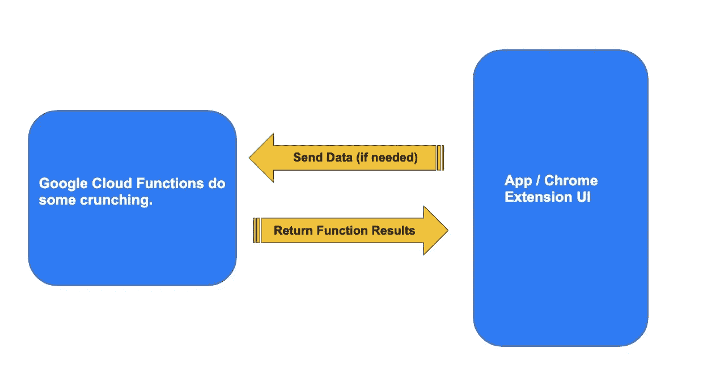

# 构建一个“无服务器”的 Chrome 扩展

> 原文：<https://towardsdatascience.com/building-a-serverless-chrome-extension-f684740e1ffc?source=collection_archive---------8----------------------->



这是一个关于构建利用无服务器架构的 Chrome 扩展的教程。具体来说——我们将在 Chrome 扩展的后端使用谷歌云功能，为我们做一些奇特的 Python 魔术。

我们将构建的扩展是 SummarLight Chrome 扩展:

[](https://medium.com/@btahir/introducing-summary-light-a-chrome-extension-that-highlights-the-most-important-parts-of-an-1666e10411a8) [## 介绍 summary light——一个 Chrome 扩展，它突出了

medium.com](https://medium.com/@btahir/introducing-summary-light-a-chrome-extension-that-highlights-the-most-important-parts-of-an-1666e10411a8) 

SummarLight 扩展获取你当前所在网页的文本(大概是一个像我这样的媒体上的很酷的博客),并突出显示那个页面/文章最重要的部分。

为了做到这一点，我们将设置一个 UI(在本例中是一个按钮),它将把当前网页上的文本发送到我们的后端。在这种情况下，“后端”将是一个谷歌云功能，它将分析文本并返回其摘要(该文本中最重要的句子)。

# 体系结构


A Simple & Flexible Architecture

正如我们所见，该架构非常简单灵活。你可以设置一个简单的用户界面，比如一个应用程序，或者在这种情况下，一个 Chrome 扩展，然后把任何复杂的工作交给你的无服务器功能。您可以轻松地更改函数中的逻辑，并重新部署它来尝试其他方法。最后，您可以根据需要扩展它以支持任意多的 API 调用。

这不是一篇关于无服务器的好处的文章，所以我不会详细讨论使用它优于传统服务器的优点。但是通常情况下，无服务器解决方案会便宜得多并且可伸缩(但并不总是这样…取决于您的使用情况)。

# Chrome 扩展

这里有一个关于 Chrome 扩展设置的很好的指南:

[](https://www.freecodecamp.org/news/how-to-create-and-publish-a-chrome-extension-in-20-minutes-6dc8395d7153/) [## 如何在 20 分钟内创建并发布一个 Chrome 扩展

### 如何在 20 分钟内创建并发布 Chrome 扩展

www.freecodecamp.org](https://www.freecodecamp.org/news/how-to-create-and-publish-a-chrome-extension-in-20-minutes-6dc8395d7153/) 

SummarLight 扩展的所有代码都可以在这里找到:

[](https://github.com/btahir/summarlight) [## btahir/summary light

### Summarlight Chrome 扩展突出了帖子/故事/文章中最重要的部分。-btahir/summary light

github.com](https://github.com/btahir/summarlight) 

根目录中的 main.py 文件是我们定义 Google Cloud 函数的地方。extension_bundle 文件夹包含了创建 Chrome 扩展的所有文件。

**谷歌云功能**

我选择了谷歌而不是 AWS Lamba，因为我有一些免费的学分(感谢谷歌！)但是你也可以用 AWS 轻松做到。对我来说，这是一个巨大的优势，他们刚刚发布了 Python 的谷歌云功能，因为我用这种美丽的语言处理大部分数据。

您可以在此了解有关部署谷歌云功能的更多信息:

 [## 从本地计算机部署|云功能文档| Google 云

### 无论您的企业是刚刚踏上数字化转型之旅，还是已经走上数字化转型之路，谷歌云的解决方案…

cloud.google.com](https://cloud.google.com/functions/docs/deploying/filesystem) 

我强烈推荐使用 gcloud sdk，并从 hello_world 示例开始。您可以在他们提供的 main.py 文件中编辑您需要的函数。这是我的函数:

```
import sys
from flask import escape
from gensim.summarization import summarize
import requests
import json

def read_article(file_json):
    article = ''
    filedata = json.dumps(file_json)
    if len(filedata) < 100000:
        article = filedata
    return article

def generate_summary(request):

    request_json = request.get_json(silent=True)
    sentences =  read_article(request_json)

    summary = summarize(sentences, ratio=0.3)
    summary_list = summary.split('.')
    for i, v in enumerate(summary_list):
        summary_list[i] = v.strip() + '.'
    summary_list.remove('.')

    return json.dumps(summary_list)
```

相当直接。我通过 read_article()函数接收一些文本，然后使用 awesome Gensim 库返回这些文本的摘要。Gensim Summary 函数的工作原理是按照重要性对所有句子进行排序。在这种情况下，我选择返回最重要句子的前 30%。这将突出文章/博客的前三分之一。

**替代方法:**我尝试了不同的摘要方法，包括使用手套词嵌入，但结果并不比 Gensim 好多少(特别是考虑到由于加载这些大规模嵌入而增加的处理计算/时间)。尽管如此，这里仍有很大的改进空间。这是一个活跃的研究领域，并且正在开发更好的文本摘要方法:

 [## 摘要

### 知识库跟踪自然语言处理(NLP)的进展，包括数据集和当前…

nlpprogress.com](http://nlpprogress.com/english/summarization.html) 

一旦我们对这个功能很满意，我们就可以部署它，它将在一个 HTTP 端点上可用，我们可以从我们的应用程序/扩展调用它。

**扩展包**

现在是前端。首先，我们需要一份 popup.html 档案。这将处理 UI 部分。它将创建一个带有按钮的菜单。

```
<!DOCTYPE html>
<html>
  <head>
    <link rel="stylesheet" href="styles.css">
  </head>
  <body>
    <ul>
    	<li>
      <a><button id="clickme" class="dropbtn">Highlight Summary</button></a>
      <script type="text/javascript" src="popup.js" charset="utf-8"></script>
    	</li>
    </ul>
  </body>
</html>
```

正如我们所看到的,“Highlight Summary”按钮有一个触发 popup.js 文件的 onClick 事件。这将依次调用 summarize 函数:

```
function summarize() {
	chrome.tabs.executeScript(null, { file: "jquery-2.2.js" }, function() {
	    chrome.tabs.executeScript(null, { file: "content.js" });
	});
}
document.getElementById('clickme').addEventListener('click', summarize);
```

summarize 函数调用 content.js 脚本(是的是的，我知道我们可以避免这个额外的步骤……)。

```
alert("Generating summary highlights. This may take up to 30 seconds depending on length of article.");

function unicodeToChar(text) {
	return text.replace(/\\u[\dA-F]{4}/gi, 
	      function (match) {
	           return String.fromCharCode(parseInt(match.replace(/\\u/g, ''), 16));
	      });
}

// capture all text
var textToSend = document.body.innerText;

// summarize and send back
const api_url = 'YOUR_GOOGLE_CLOUD_FUNCTION_URL';

fetch(api_url, {
  method: 'POST',
  body: JSON.stringify(textToSend),
  headers:{
    'Content-Type': 'application/json'
  } })
.then(data => { return data.json() })
.then(res => { 
	$.each(res, function( index, value ) {
		value = unicodeToChar(value).replace(/\\n/g, '');
		document.body.innerHTML = document.body.innerHTML.split(value).join('<span style="background-color: #fff799;">' + value + '</span>');
	});
 })
.catch(error => console.error('Error:', error));
```

这里是我们解析当前页面的 html(document . body . innertext)的地方，在用 unicodeToChar 函数进行了一些预处理之后，我们通过 Fetch API 将它发送给我们的 Google Cloud 函数。为此，您可以在 api_url 变量中添加自己的 HTTP 端点 url。

同样，利用 Fetch，我们返回一个承诺，这是从我们的无服务器函数生成的摘要。一旦我们解决了这个问题，我们就可以通过页面的 html 内容解析这个循环，并突出显示摘要中的句子。

由于完成所有这些处理可能需要一点时间，我们在页面顶部添加了一个警告来表明这一点(“生成摘要突出显示。根据文章的长度，这可能需要 30 秒钟。”).

最后，我们需要创建一个 manifest.json 文件来发布扩展:

```
{
  "manifest_version": 2,
  "name": "SummarLight",
  "version": "0.7.5",
  "permissions": ["activeTab", "YOUR_GOOGLE_CLOUD_FUNCTION_URL"],
  "description": "Highlights the most important parts of posts/stories/articles!",
  "icons": {"16": "icon16.png",
            "48": "icon48.png",
            "128": "icon128.png" },
  "browser_action": {
   "default_icon": "tab-icon.png",
   "default_title": "Highlight the important stuff",
   "default_popup": "popup.html"
  }
}
```

注意“权限”选项卡。我们必须在这里添加我们的 Google Cloud 函数 URL，以确保当我们通过 Fetch API 调用我们的函数时不会出现 CORS 错误。我们还填写了名称/描述和图标等细节，以便在 Google Store 上显示我们的 Chrome 扩展。

就是这样！我们已经创建了一个 Chrome 扩展，它利用了一个无服务器的主干网，也就是谷歌云功能。最终效果是这样的:

A demo of SummarLight

这是一种简单而有效的方式来构建真正酷的应用程序/扩展。想想你用 Python 做过的一些东西。现在你可以把你的脚本挂在一个扩展/应用程序的按钮上，然后用它做一个好的产品。无需担心任何服务器或配置。

下面是 Github 回购:[https://github.com/btahir/summarlight](https://github.com/btahir/summarlight)

你可以自己使用分机。这是谷歌商店的直播:

[](https://chrome.google.com/webstore/detail/summarlight/ligjmagakdphdlenhhncfegpdbbendlg?hl=en-US&gl=US) [## 摘要灯

### 突出文章最重要的部分！

chrome.google.com](https://chrome.google.com/webstore/detail/summarlight/ligjmagakdphdlenhhncfegpdbbendlg?hl=en-US&gl=US) 

请在评论中分享你对利用谷歌云功能的扩展(或应用)的想法。:)

干杯。