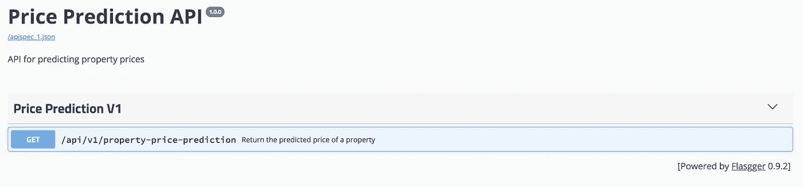
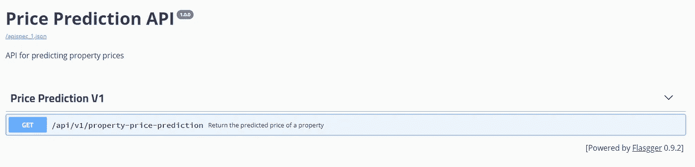
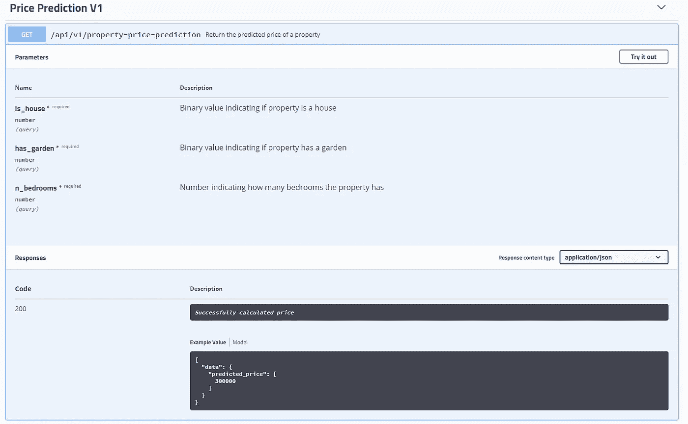

# 为您的模型构建一个稳定且用户友好的 API

> 原文：<https://towardsdatascience.com/building-a-stable-and-user-friendly-api-for-your-model-ef4b2167934e?source=collection_archive---------12----------------------->


[Source](https://pixabay.com/photos/milky-way-starry-sky-night-sky-star-2695569/)

## 你的模型值得一个伟大的 API

大多数(如果不是全部)数据科学家最终都需要部署他们的模型，并通过 API 使其可用。在机器学习项目的端到端过程中，这通常是最容易被忽视的部分，因为大多数注意力都集中在建立模型或可怕的数据清理上。构建一个稳定且用户友好的 API 是让用户/产品团队开始消费你的服务并持续消费的关键。那么，如何着手构建一个稳定且用户友好的 API 呢？这就是这篇文章的来源，这些年来，我专门为数据科学模型构建了许多 API，我想与您分享我是如何着手构建它们的。本文假设了以下情况:

*   Python 知识
*   烧瓶的基本知识

如果你还没有猜到，我们将使用 Python 和 Flask 来构建 API，所有代码都可以在我的 [GitHub 账户](https://github.com/harpalsahota/DataScience/tree/master/Model_API_Example)上找到。

# 问题背景

我们建立了一个(非常粗糙的)随机森林模型来预测房价。这个模型有三个特点:`is_house`、`has_garden`和`n_bedrooms`。`is_house` 和`has_garden`都是二进制标志，而`n_bedrooms`是整数。向利益相关者展示该模型给他们留下了深刻的印象，现在他们希望进入下一阶段，即通过 API 进行质量保证。现在，您的任务是为您的模型构建一个 API。

# 文件夹结构

我的 API 通常遵循这种文件夹结构。我试图让它尽可能简单，同时也让它易于扩展:

*   `common`:保存常用的模块/类，可以与代码库的其他部分共享(例如，代码库中可能有多个 API)
*   `endpoint_docs`:保存端点文档的 YAML 文件(我们稍后会讲到)
*   `views`:保存 API 视图的模块
*   `api.py`:本地启动 API
*   `blueprint.py`:用于使您的应用程序模块化，并为您的端点生成 URL 前缀
*   `config.yml.example`:保存应用程序配置的示例文件
*   `Pipfile`:API 需要的包
*   `settings.py`:用于从您的配置文件导入设置
*   `wsgi.py`:用于启动生产服务器
*   `.env.example`:保存环境变量

要在本地安装并运行，请查看 repo 上的自述文件，其中给出了安装说明。

# 配置和设置文件

这可能看起来像是构建 API 的一个非常无聊的方面，确实如此，但是从一开始就正确地配置 API 确实有助于以后的工作。这里涉及的三个文件是 API 配置:

*   配置. yml .示例
*   . env .示例
*   settings.py

`config.yml`和`.env`文件包含应用程序的应用程序设置和环境变量，其中可能包含敏感信息。我们不希望这些信息出现在存储库中，所以我们创建了示例文件，其中省略了敏感信息。例如，`config.yml`文件可能包含一个数据库密码:`DB_PASSWORD: XXXXX`，但是在`config.yml.example`中这个密码将是:`DB_PASSWORD:`。密码被删除，但与之相关的变量被保留，这使得应用程序的新用户更容易启动和运行，因为这突出了应用程序所需的配置。要使用这些文件，你需要做的就是复制它们，但是去掉后缀`.example`重新命名它们。在我的`config.yml`文件中，我只有一个名为`MODEL_NAME`的变量，这只是我们希望使用的模型的名称。在`config.yml`文件中，用`rf_classifier.pkl`填写`MODEL_NAME` 。在`.env`文件中，将`APP_SETTINGS_YAML`分配给`config.yml`。最后，确保`config.yml`和`.env` 文件都在您的`.gitignore`文件中，这样它们就不会被意外地推到存储库中。

`settings.py`文件是 API 对这些变量的访问点(如下所示)。以下代码部分的第 9-14 行加载到`.env`文件中，并有一个用于`MODEL_NAME`的占位符，默认为`None`:

接下来，获得`APP_SETTING_YAML`(在`.env`文件中定义)的值(第 17 行)，该值为`config.yml`。然后读取该文件并提取键值对(第 18–20 行)。然后，`config.yml`中的这些键值对被用来更新`settings.py`文件中的值。占位符为`None`的变量是要更新的变量。

`MODEL_NAME`的初始值是`None`，但是在读入`config.yml`文件并更新全局值后，它现在被设置为`rf_classifier.pkl`。要访问这个变量，您在应用程序中要做的就是:

```
*import* settings
print(settings.MODEL_NAME)
```

这里需要注意的重要一点是`settings.py`中定义的应用变量名必须与`config.yml`中的键名完全匹配，否则`settings.py`中的变量不会被更新。

第 22–24 行的最后一段代码实际上查看了您的操作系统中定义的环境变量，并使用这些变量覆盖来自`config.yml`的派生变量。我听你说，你为什么要这么做？当您通常部署到生产环境时，可能会有不同的应用程序设置，如生产数据库用户名和密码或端口号等，您不会在本地使用这些设置。你需要做的不是有第二个`config.yml`文件，而是在你的操作系统环境中定义这些相同的变量。这允许您在用于本地开发的设置和用于生产的设置之间轻松切换，而无需更改任何应用程序代码。这里要记住的一个关键点是，在操作系统环境中定义的变量优先于在`config.yml`文件中定义的变量。

# **常用文件夹**

该文件夹包含 python 模块，这些模块具有与其他 API 相同的功能。因此，如果您要为这个项目添加另一个 API，比如说为另一个模型添加 API，您就不必重复代码。让我们从`schemas.py`开始分解这个文件夹中的模块

## schemas.py

该模块使用 [marshmallow](https://marshmallow.readthedocs.io/en/3.0/) 包将数据加载到我们定义的模式中。Marshmallow 将根据模式检查数据，如果发现任何不一致，将会引发错误。通过对照模式验证数据，我们确保 API 的消费者符合模型被训练的特性范围。这很好，因为它防止 API 的消费者向模型传递意外的参数，从而获得奇怪的结果，这些结果可能会在以后的报告中使用。我们模型的模式如下所示:

我们首先创建一个从 marshmallow 继承了`Schema`类的类，这将允许我们创建自己的模式。接下来，模式的变量(模型的特征)被定义并被赋予字段对象。字段对象简单地定义了对象的类型，例如字符串，甚至是字段接受的另一个模式的整数。它们还可以通过传递带有布尔值的关键字参数`required`来声明一个字段是否是强制的。这里我们创建三个变量`is_house`、`has_garden,`和`n_bedrooms`，它们在第 13-15 行声明，并根据需要标记。这三个变量都定义了一个整数类型。接下来，我们创建三个函数来验证每一个特性，这些函数的名字前面都有前缀`validate`，这不是必须的，只是我自己命名的。这些函数是用`@validates`方法修饰的，该方法接受一个参数，该参数是您希望作为类型字符串进行验证的特性的名称。只有用`@validates`包装的函数用于验证数据，并且字符串输入必须是在类顶部定义的变量。作为修饰函数的结果，它们现在接受一个位置参数，这里定义为`value`。这是传递给每个特性的值，我们根据它执行验证。`is_house`和`has_garden`都是二进制标志，具有完全相同的检查，只有错误消息不同(第 17-25 行)。

例如，如果`validate_is_house`中的 if 语句返回 true，就会产生一个错误，并显示一条特定的消息:`is_house must be either 0 or 1`。然后可以将错误消息返回给客户端。这种错误信息为用户提供了有用的调试信息，而不是一般的 HTTP 错误信息。`n_bedrooms`验证(第 27–30 行)验证该值是否大于或等于零，如果不大于或等于零则引发错误。

方法`make_price_prediction_data_model`在模式检查通过后运行。这是由`@posts_loads`装饰者定义的。该函数的执行返回包含特征的数据类对象。这是查看`data_models.py`中定义的数据类的好时机

## data_models.py

如上所述，一旦模式检查通过，数据模型就会以数据类的形式返回。如果你不知道什么是数据类，我强烈推荐你查看这个[帖子](https://hackernoon.com/a-brief-tour-of-python-3-7-data-classes-22ee5e046517)。数据类为我们提供了开箱即用的附加功能，还允许我们通过名称访问类的属性，就像普通的类一样。我们模型的数据类如下所示:

这里没什么事情。我们定义了一个由`@dataclass`包装的类，并在该类中定义了三个变量，它们是该类的属性。在我们的例子中，这些属性是模型的特征。我还定义了一个`__repr__`方法来给我们一个有用的类表示。就像普通的类一样，如果需要的话，你可以添加额外的方法。

## logger.py

最后一个模块是`common`文件夹，是日志文件。该文件只包含几行设置记录器的代码:

在这里，我设置了一个带有`StreamHandler`的日志记录器来记录控制台。如果您愿意，您可以设置一个记录器来记录文件，请参考文档中的[基础教程](https://docs.python.org/3/howto/logging.html#logging-basic-tutorial)来告诉您如何操作。

# 时髦的

有了定义的模式，用户如何预先知道什么是模型可接受的输入？此外，用户如何为您的 API 探索其他端点？这就是[霸气](https://swagger.io/solutions/api-design/)的用武之地。通过在 API 中实现 Swagger，我们为 API 提供了一个可视端点，列出了所有可用的端点以及它们接受的 HTTP 方法。此外，对于每个端点，您可以提供要运行的模式和示例，本质上是记录 API。下面是我们正在构建的 API 的 Swagger 页面的屏幕截图:



如何实现 swagger for out API？好消息是，有一些软件包可以帮我们做到这一点，比如 [Flassager](https://github.com/rochacbruno/flasgger) 和[connection](https://github.com/zalando/connexion)。对于我们的 API，我们将使用 Flassager。

## 招摇文件

为了让 swagger 显示信息，我们需要为它提供文档。该文件以`yaml`文件格式提供，位于`endpoint_docs`文件夹中。如果您导航到在`/endpoint_docs/property_price_prediction_v1/get.yml`找到的文件，您将找到上面显示的该端点的文档。该文件中包含端点的参数以及响应示例。有关记录端点的更多信息，请参见 [swagger 文档](https://swagger.io/docs/specification/2-0/basic-structure/)

# 创建端点

现在我们来看 api 本身的代码。让我们从位于`/views/property_price_prediction.py`的 API 的唯一端点开始。该文件包含一个定义端点的类:

`ProperyPricePrediction`类从`flassagger`继承了`SwaggerView`，后者也从 Flask 继承了[方法视图](http://flask.pocoo.org/docs/1.0/views/#method-views-for-apis)。方法视图允许我们使用同一个端点在一个类中接受不同的 HTTP 方法。要做到这一点，我们首先需要定义以它们所服务的方法命名的函数。例如，在上面的代码中，这个端点接受 GET 方法，所以我定义了一个名为`get`的函数。如果我想让这个端点也接受一个`POST`方法，我要做的就是在这个类中定义一个`post`方法，并将`POST`添加到在类顶部创建的`methods`变量中。这个变量对于 method 视图来说不是必需的，但是对于 swagger 来说是必需的，所以如果你没有使用 swagger，你可以省略它。如果你使用的是 swagger，那么它现在希望文档存在于一个名为`get.yml`的文件中，你可能已经猜到了，但是这些文件是以它们所服务的 HTTP 方法命名的。下面的蓝图部分解释了`get.yml`文件的目录结构。

转到`def get`方法。这个函数中的代码被封装在一个`try/except`块中，以防止在任何处理过程中出现错误时 API 关闭。这个方法获得模型的输入，作为第 21 行定义的 URL 参数，并将它转换成一个字典。接下来的第(22)行将这个特性加载到模式中，模式反过来验证输入。如果失败，验证错误出现，在`try/except`块中捕获并返回给用户。如果通过，数据将被加载到数据模型中，该模型现在可用于进行预测。下一行代码使用数据模型进行预测(第 23— 27 行)。请注意，我们现在可以通过名称来引用特性，这样在代码中看起来更好。然后，预测作为 JSON 对象返回给用户。

在文件的顶部，我导入了设置模块。在这个模块中定义了一个全局变量`MODEL_NAME`。该变量表示要使用的模型名称，该名称随后被分配给`MODEL`变量。我将`MODEL_NAME`定义为一个 API 配置，因为它可以通过简单地改变应用程序中的配置而不是源代码，轻松地在不同模型之间快速切换。`MODEL`变量是在类的外部定义的，因为我们只需要模型加载一次。如果这是在`get`方法中定义的，这将意味着每次请求进来时都要加载模型。这将大大降低请求的响应时间，尤其是在模型很大的情况下。

# 蓝图

蓝图允许我们模块化我们的应用程序路线，例如，我们可能有一个仅供管理员使用的蓝图和一个供用户使用的蓝图，因此分离路线。为了实现这一点，我们需要创建蓝图并向它们注册端点，在`blueprints.py`中的代码为我们做了这些:

一般来说，要创建一个蓝图，您所要做的就是创建一个`Blueprint`类的实例，并用`add_url_rule`方法向它注册端点。在上面的代码中，我通过创建自己的继承 Flask 的`Blueprint`类的`BaseBlueprint`类来扩展`Blueprint`类。我这样做是为了让日志记录更容易。Flask 的 Blueprint 类有两个方法`before_request`和`after_request`，如果分配给方法，它们将分别在请求之前和之后被调用。在`BaseBlueprint`类的`__init__`方法中，我调用这两个方法，并分配`_log_before_request`在每个请求之前调用，而`_log_after_request`在每个请求之后调用。在`_log_before_request`方法中，我记录了与任何参数一起被调用的端点。`_log_after_request`方法记录 HTTP 响应状态和返回的 JSON 负载。对于单个端点来说，这似乎是一项繁重的工作，但是如果我们要向 API 添加新的端点，我们所要做的就是将新的视图作为一项规则添加到这个`BaseBlueprint`实例中(实际上只有一行代码),并且我们已经实现了日志记录！这使得扩展 API 的日志更加容易。我发现这个解决方案比在视图函数本身中实现日志记录要优雅得多。

现在需要做的就是创建一个`BaseBlueprint`类的实例，这是在第 31 行完成的。然后，我们获取该实例并向其添加一个 URL 规则(第 33–36 行)，这意味着每次调用该 URL 时，都会调用分配的视图函数。`add_url_rule`方法接受一个位置参数，它是一个字符串，是这个端点的 URL。我还添加了一个关键字参数`view_func`，它接受我们想要分配给这个 URL 的`MethodView`(或者在我们的例子中是`SwaggerView`)。在这里，我将`PropertyPricePrediction`视图分配给这个 URL，并声明它是一个使用`as_view`方法的视图。这样做是为了将类转换成路由系统可以使用的视图函数。这个方法中的关键字参数`name`只是为这个视图指定一个名称。这里定义的名称也为 Swagger 搜索端点文档提供了参考。因为这个视图有一个`get`方法，所以到`get`文档的路径会有如下模式:`<name of view>/<HTTP method>.yml`并且会转换成:`property_price_prediction_v1/get.yml`

# api.py

该文件是启动 API 的访问点，主要包含配置:

让我们一行一行地过一遍:

*   **1–5**:所需进口。注意，我导入了 Swagger 和我们在上面创建的蓝图
*   **8** :创建一个 Flask 实例
*   **10–15**:允许所有前缀为`/api`的 URL 上的跨来源请求
*   **17–20**:注册我们在上面创建的蓝图，并为所有端点创建以`/api`开头的前缀
*   **21–23**:有些霸气的配置。在这里，我告诉 Swagger 在哪里可以找到端点文档。
*   **24–34**:围绕第 9 行创建的 Flask 实例创建一个 Swagger 实例。我将 parse 设置为`False`，这意味着不根据端点文档中提供的模式检查传入的请求，因为我更喜欢 Marshmallow 的灵活性。当然，您可以将其设置为`true`，所有传入的请求都将被检查。最后，我只是在 API 文档页面上提供一些元数据。
*   **36–41**:只有当文件作为主程序运行时，才会启动 API。

# wsgi.py

这是最后的文件。在生产设置中启动 API 的文件。这个文件只导入 API 实例(从 api.py)。我将这一点分离出来，这样我们就可以在生产中进行不同的设置，并在需要时进行任何额外的检查。你可以直接运行`api.py`，但是你将只使用 flask 的内部服务器，这不是我们想要的，并且[不推荐](http://flask.pocoo.org/docs/1.0/tutorial/deploy/#run-with-a-production-server)用于生产。相反，我们将使用一个名为 [Gunicorn](https://gunicorn.org/) 的包，它是一个用于 UNIX 的 Python WGSI 服务器，与许多 python web 框架兼容。如果你在 Windows 上，你可以使用[女服务员](https://docs.pylonsproject.org/projects/waitress/en/latest/#)。启动 API 的调用如下:

**Unix / Mac** : `gunicorn -b 0.0.0.0:5000 -w 1 wsgi:api`

**视窗** : `waitress-serve --listed=*5000 wsgi:api`

如果您在 Unix / Mac 上运行，应该会看到类似这样的内容:


API 现在正在运行，如果您导航到`http://localhost:5000/apidocs`，您应该会看到:



这是显示 API 文档的页面。单击蓝色条将展开它，显示对模型执行查询的能力，如下所示:



单击“试用”将允许您输入特性值，输入以下特性值，然后点击“执行”(在您单击“试用”之前，按钮不会显示):

*   `is_house` : 5
*   `had_garden` : 1
*   `n_bedrooms` : 3

`is_house`的这个值对于我们的模型是无效的，当您点击 execute 时，它会抛出一个错误。再往下是示例 curl 请求，请求您刚刚输入的数据以及请求 url(示例 curl 请求直到执行查询后才会显示)。下面是来自服务器的实际响应。该示例如预期的那样应该返回 400 —错误:错误的请求以及该响应正文:

```
{
  "error": "{'is_house': ['is_house must be either 0 or 1']}"
}
```

这正是我们想要的，一个清晰的错误被返回给用户，解释请求失败的原因。现在输入一些应该有效的值:

*   `is_house` : 0
*   `had_garden` : 0
*   `n_bedrooms` : 2

然后点击执行。在点击 execute 之后，curl 请求和请求 url 应该被更新。您还应该有一个状态代码为 200 的新响应主体，表示查询成功。响应正文应该类似于:

```
{
  "data": {
    "predicted_price": [
      300000
    ]
  }
}
```

显示给定输入要素时模型对此属性的值。现在，如果我们看一下打印到控制台的日志，您应该会看到:


日志揭示了对模型的请求、传递的参数以及请求是否失败。我们可以看到第一个失败的请求，因为`is_house`必须是二进制值。接下来是我们的第二个请求，它满足模式并成功返回一个预测。

希望你能明白为什么使用 Swagger 是你的 API 的一个必要工具，因为很少的工作你就能得到很多额外的功能，这是完全值得的。这个工具允许用户使用你的 API，查看它的约束，这将允许他们相应地计划他们的资源消耗。

# 结论

这里，我们构建了一个 API 来处理请求，并优雅地将错误返回给用户，使 API 更加透明，不再是一个黑盒。数据模式是一个很好的约束，因为这可以防止模型在它被训练的特性范围之外的意外使用，从而防止一些尴尬的问题。

就是这样！希望在这篇文章中，我已经向您展示了构建一个稳定且用户友好的 API 的重要性。最后，感谢您的阅读，如果您感兴趣，我可能会写一些关于为 API 添加测试的帖子，以及一篇关于集装箱化的帖子。