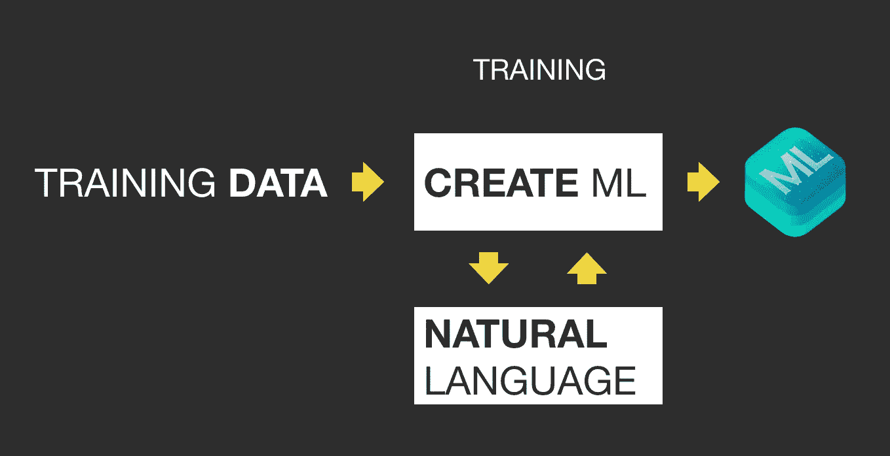
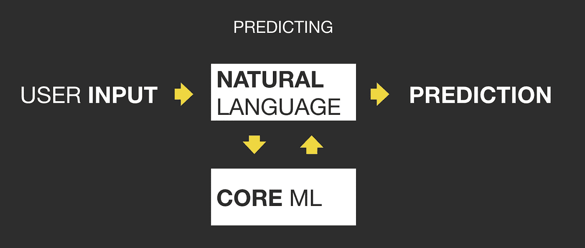

# 用自然语言框架构建文本分类器

> 原文：<https://towardsdatascience.com/building-a-text-classifier-with-naturallanguage-framework-5e4c1ce8e4e?source=collection_archive---------20----------------------->

## 了解如何为所有 Apple 平台上的应用程序构建文本分类器。

## 介绍

你可能知道或者至少听说过像 Siri、Cortana 和 Alexa 这样的虚拟助手。也许你和某个公司的聊天机器人聊过天？如果你不是像我一样以英语为母语，你可能会经常使用谷歌翻译来帮助你阅读像这样的开发材料。

这些都是**自然语言处理**的应用。NLP 有很多定义，但本质上，它指的是任何一种由计算机执行的自然语言操作，通常使用**机器学习**的技术。我所说的自然语言是指人类交流中使用的任何一种非结构化或无限制的语言。

去年，苹果发布了**natural language Framework**(NLF ),为那些愿意让他们的应用程序更具 NLP 智能的开发者提供更简单的体验。该框架提供了一个 API，它隐藏了文本处理任务中通常涉及的大部分复杂性。

NLF 是我在第 21 届佛罗里达会议上演讲的主题，在那里我详细介绍了 NLP 用例、其通用管道以及 NLF 的使用。根据这些建议，我决定写这篇博文来讨论这次演讲的主要部分。因此，我将介绍 NLP 的一些基本概念，并解释如何构建一个文本分类器。

## 自然语言框架

NLF 可以在所有苹果平台上使用，它是从 iOS 11 开始出现在`Foundation`中的实用程序类`NSLinguisticTagger`的演变。像它的前身一样，NLF 提供了以下内置功能:

*   **语言识别**:该框架承诺识别近 60 种不同的语言。
*   **标记化**:可以将文本分解成代表基本意义单位(即单词)的字符序列。NLF 处理像日语这样的语言，这个任务不仅仅是用空格分割句子。
*   **词性(PoS)标注**:框架能够用来自某个方案的标签来标注每个标记。例如，我们可以根据词汇类别(如名词、动词、形容词等)对标记进行分类。
*   **词汇化**:这其实是一种特殊的词性标注方案。它用于减少单词的屈折形式(例如，将复数形式变为单数)。
*   **命名实体识别(NER)** :这是另一个词性标注方案。它用于识别感兴趣的实体，如位置、人员、组织、日期等。

这些内置函数允许我们执行许多很酷的文本处理任务，而无需任何进一步的机器学习算法。例如，我们可以通过一个基本的词汇化调整来改进文本搜索。

在这篇博客文章中，我不会详述语言识别和标记化(但是你可以在这里找到一篇关于它们的很棒的文章)。相反，我将集中讨论词性标注。

## 词性标注

`NLTagger`是负责词性标注任务的班级。它有一个`enumerateTags(in:unit:scheme:options:block:)`函数，用于列出给定文本中的标签，如**清单 1** 所示。`block`参数是一个闭包，每个令牌调用一次，传递它的范围和相应的标签。

**Listing 1**: Using NLTagger for PoS tagging.

为了实例化一个`NLTagger`对象，我们应该提供一个`NLTagScheme`数组来告诉标记者需要哪组标记。**清单 1** 使用了`.nameTypeOrLexicalClass`，因此只返回词法类和命名实体。您可以在**输出 1** 中看到结果。其他常用的方案有`.lexicalClass`、`.nameType`和`.lemma`。

**Output 1**: Result of Listing 1.

`unit`是另一个重要参数。它告诉标记者应该标记哪个文本块。除了`.word`，我们还可以用`.sentence`、`.paragraph`和`.document`。但是，对于某些方案和单元的组合，标记器可能不会返回任何结果。例如，使用`.lemma`作为 scheme 和`.sentence`作为 unit 是没有意义的，因为您只能在每个单词的基础上进行词汇化。

最后一个参数是`option`。它只是告诉标记者补充信息，并不要求标记者工作。例如，我们可以用它来告诉标记者省略空格和标点符号，不要把粒子当作单独的标记。

## 定制模型

所有这些贴吧标签都很酷，但是如果我们想在文本中识别口袋妖怪的名字或者根据它们的类型对文本进行分类呢？好吧，那 NLF 默认做不到。我们需要建立一个自定义模型。

这可能是 NLF 最酷的部分:它可以与 CoreML 集成来构建定制的**单词标签**和**文本分类器**。这还不是全部。苹果还发布了 CreateML 框架，用于构建直接进入 NLF 的定制 CoreML 模型。机器学习开始了。

NLP 通常是一个**分类问题**，目标是在有限的可能性集合中为给定的输入分配一个标签。它还通常使用**监督学习**算法，其中我们提供一个包含文本及其相应标签的训练集，算法使用该训练集进行学习。我不会深入讨论这些细节，因为这超出了讨论范围(不过，你可能想要查看[这篇伟大的文章](https://machinelearningmastery.com/supervised-and-unsupervised-machine-learning-algorithms/))。相反，让我们关注 NLF 如何通过构建一个定制的文本分类器来隐藏大部分的复杂性。

在下一节中，我将通过构建一个餐馆评论分类器来演示定制模型是如何工作的。目标是将输入文本标记为正面或负面评论。

## 构建分类器

培训工作流程如**图 1 所示。**我们将训练数据传递给 CreateML，这样它就可以使用 NLF 从这些数据中提取特征，学习模式并将这些知识保存为 CoreML 模型。

**Image 1**. Model training workflow.

**清单 2** 是我们将用来构建分类器的数据集的摘录。这是一个众所周知的数据集，它包含一千条评论及其相应的标签，可以是`POSITIVE`或`NEGATIVE`。你可以在这里找到完整的 JSON 文件。

**Listing 2**: Excerpt of the restaurant reviews dataset.

我们还需要一个 macOS 平台来训练模型，因为 CreateML 在其他平台上不可用。所以启动游戏并运行清单 3 中的代码。

**Listing 3**: Snippet for training the model.

第一步是将数据集加载到一个`MLDataTable`中，这是 CreateML 使用的一个表格表示。这个类实际上非常强大。您可以使用它在数据集中执行额外的预处理步骤，例如创建和删除列。

下一步，我们使用`randomSplit(by:seed:)`函数将数据集随机分成训练集和测试集。该函数需要一个随机操作的种子和一个比率来确定用于训练和测试的数据集的百分比。种子可以是我们想要的任何整数。这个比例通常在 70%到 90%之间。如果你用更多的数据进行训练，就不会有足够的数据来评估模型；如果您使用较少的数据进行训练，您将无法执行良好的训练，您的大型测试集将会显示这一点。这是一个权衡，80%通常是一个好的选择。

第 3 步是我们实际构建模型的地方。为此，我们初始化`MLTextClassifier`,传递训练集和对应于 JSON 文件的文本和标签列。请注意，这个过程可能需要很长时间，这取决于许多因素，如类的数量和训练集的大小。返回的对象是我们用来做预测的分类器。

下一步是评估我们的分类器的性能。我们通过将测试集传递给`evaluation(on:)`函数来做到这一点。它对测试集中的每个文本进行预测，并记录分类器是对还是错。然后，我们使用这些记录来计算一些指标，比如清单 3 中使用的准确性，给出了正确预测的百分比。CreateML 还提供了精度、召回和混淆矩阵，用于观察各个类的性能。评估是机器学习中一个非常广泛的话题，因为我们在这里仅仅触及了表面，我强烈推荐关于这个主题的进一步阅读。

评估过程是一个非常重要的步骤，因为它为如何改进模型提供了指导。例如，显示某个类的高错误率的混淆矩阵可能是一个警告，表明我们需要将该类的更多示例添加到训练集中。

最后，如果模型足够令人满意，我们就直接保存它。这是第 5 步，我们将`.mlmodel`输出到文件系统。

## CoreML 集成

现在我们已经有了模型文件，我们可以将它拖放到 Xcode 项目中。这一次不再有仅限 macOS 的限制，因为 CoreML 和 NLF 可以在所有苹果平台上使用。

Xcode 自动生成一个与`.mlmodel`文件同名的`MLModel`子类。因此，可以在独立模式下使用该文件，但是我们实际上对 NLF 如何与它集成感兴趣，如清单 4 所示。

**Listing 4**: Integrating NLF with CoreML model.

该代码的主要部分位于`tagger`属性定义中，我们在前面部分创建的模型和一个定制标记方案之间建立了关联。这是必要的，这样标记者就知道何时调用我们的定制模型。

注意，我们不能直接使用 CoreML 模型。我们首先需要通过传递模型的 URL 将其包装在一个`NLModel`对象中。至于自定义标记方案，我们只需要提供一个标识符。并在标签上把我们称之为`setModels(_:forTagScheme:)`的人联系起来。

因此，当我们传递一个自定义方案来枚举标签时，标记器知道它应该使用自定义模型。该工作流程如**图 2** 所示。

**Image 2**: Text classification workflow.

最后，`prediction(for:)`使用`tags(in:unit:scheme:options)`来获得标签和范围元组的列表。因为我们正在评估整个文本，所以我们只为`unit`参数传递`.document`，导致 tagger 只返回一个标签，这个标签要么是`POSITIVE`要么是`NEGATIVE`。

**清单 5** 和**输出 1** 描述了分类器的用法和结果。请注意，它正确地标记了大多数评论，除了最后一条，它预测`POSITIVE`甚至不是评论。由于机器学习的概率性质，这是意料之中的。为了解决这个问题，我们可以在我们的训练数据中增加非评论的例子，但是我会把这个留给读者。

**Listing 5**: Using the custom tagger.

**Output 1**: Print logs from Listing 5.

## 结论

在这篇博文中，我通过介绍 NaturalLanguage 框架的主要概念并展示如何构建一个定制的文本分类器，详细探讨了它。然而，还有更多需要了解的。在[这个 Github 仓库](https://github.com/alanpaivaa/CocoaheadsFloripa21)中，你可以找到所有的文本分类器代码和许多其他使用内置函数的例子，组织数据集的不同方式，以及如何构建自定义单词标签(这与我在这里介绍的非常相似)。

我希望你喜欢这个，请离开你的掌声。再见！

[1]伯德、克莱因和洛珀(2009 年)。*用 Python 进行自然语言处理:用自然语言工具包分析文本*。奥莱利媒体公司。

[2]乔希特，H. (2017)。餐馆评论数据集。【在线】可在:[https://www.kaggle.com/hj5992/restaurantreviews/version/1](https://www.kaggle.com/hj5992/restaurantreviews/version/1)？[2019 年 4 月 14 日]