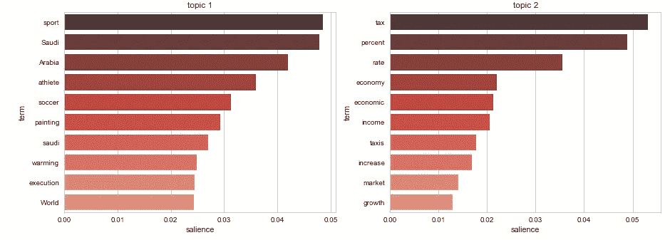
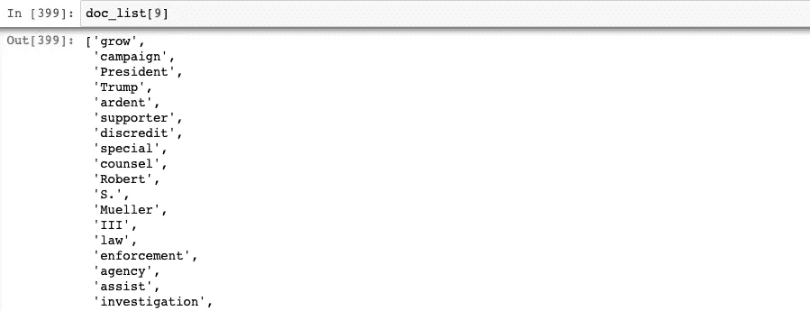
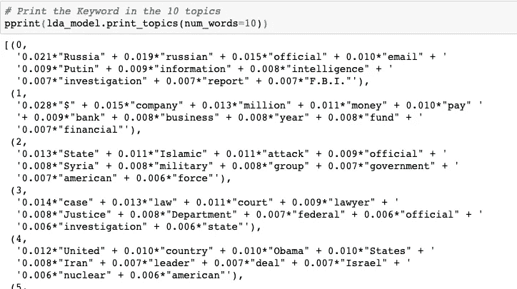

# 用 spaCy 和 Gensim 构建主题建模管道

> 原文：<https://towardsdatascience.com/building-a-topic-modeling-pipeline-with-spacy-and-gensim-c5dc03ffc619?source=collection_archive---------1----------------------->

像大多数编程语言一样，Python 有大量优秀的库和模块可供选择。当然，总的来说，这绝对是个好主意，但这也意味着有时模块之间并不总是能很好地配合。在这个简短的教程中，我将向您展示如何将 spaCy 与 Gensim 连接起来，以创建一个连贯的主题建模管道。

是啊，太好了。什么是主题模型？

好问题。我想过重写维基百科的定义，然后我想我可能应该给你维基百科的定义:

> 在[机器学习](https://en.wikipedia.org/wiki/Machine_learning)和[自然语言处理](https://en.wikipedia.org/wiki/Natural_language_processing)中，**主题模型**是一种[统计模型](https://en.wikipedia.org/wiki/Statistical_model)，用于发现文档集合中出现的抽象“主题”。

基本上，我们在寻找与讨论语料库的内容最相关的词或主题的集合。对于本教程，我们将使用潜在的狄利克雷分配(LDA)。

**关于库的简短说明**

对于那些不知道的人来说， [Gensim](https://radimrehurek.com/gensim/) 是主题建模的杰出库之一。同时， [spaCy](https://spacy.io/) 是一个强大的自然语言处理库，在过去几年中赢得了许多崇拜者。

**建造管道**

首先，让我们导入我们的库:

这里需要注意一些事情:

*   如果你是数据科学的新手，特别是 Python，注意你必须 pip 安装 Gensim 和 spaCy。
*   spaCy 有几种不同的型号可供选择。为了便于说明，我使用了大型的通用 web 模块，但是请使用对您有意义的内容。这需要通过命令行下载。查看模型页面[点击](https://spacy.io/models)了解更多信息。
*   如果你以前没有使用过 tqdm，它是一个允许你创建进度条来跟踪你的代码处理时间的模块。
*   pprint 是为了让我们看的时候主题的格式更好一点。

我们将使用纽约时报头版文章的数据集。实际的文章本身在我们的数据框架的“内容”栏中。

现在是有趣的部分——我们将建立管道！默认空间管道的布局如下:

*   **记号赋予器**:将全文分解成单独的记号。
*   **标记器**:用词性来标记每个标记。
*   **解析器**:解析成名词块等。
*   **命名实体识别器(NER)** :标记命名实体，如美国

我们并不真的需要所有这些元素，因为我们最终不会传递 spaCy 的本机输出。文档由组成。令牌)，因此标记的信息不会通过。无论如何，NER 将会对我们有用。现在我将把它们都留在这里，同样是为了说明的目的，尽管这会使管道的效率有所降低。

除了现成的功能之外，spaCy 还允许您使用自己的功能构建自定义管道，这就是我们将获得真正价值的地方。spaCy 有一个健壮的停用词列表和内置的 lemmatizer，但是我们需要将该功能添加到管道中。

对于那些不熟悉停用词的人来说，它们基本上是普通的词，不会真正为您的模型增加很多预测价值。例如，如果你不把单词“the”从你的语料库中删除，它可能会出现在你生成的每个主题中，考虑到“the”在英语中的使用频率。

请注意，没有一个词，即使是像“the”这样无处不在的词，会自动成为停用词。停用词通常由手头的特定任务决定。例如，我的任务是给《纽约时报》的头版文章做主题模型，我会用一些你在不同的上下文中不会想到的停用词。我可以将它们添加到 spaCy 的默认停用词列表中，如下所示:

我没有太疯狂地更新我的停用词，只是添加了一些精选的停用词，以向您展示我的思维过程:

*   《纽约时报》通常在文章中使用敬语，所以我们会得到很多我们不需要的“先生”、“夫人”等。
*   由于文章中会充满引用，我们也将“说”添加到我们的列表中。
*   许多文章都有署名，因为大多数是政治性的，“华盛顿”经常出现。
*   最后，spaCy 足够聪明，可以在词汇化时将一些缩写分解成它们的组成词(比如“不是”分解成“是”和“不是”)，但“' s”却不是这样。所以那个也要拿走。
*   另一个重要的警告是，我在这里没有做任何语法分析，这是当你在寻找文本中最常见的两个以上的单词短语时。在这种情况下，我可能会做出稍微不同的选择。

我们还需要对文本进行词汇化，也就是简单地将每个单词简化为它的词根。所以比如“going”和“goes”都简化为“go”。“更好”会被简化为“好”。

好了，现在让我们构建我们的管道，为词汇化和停用词移除添加函数:

这里重要的一点是要确保为最终输出返回 token.text。这将把每个令牌对象转换成一个字符串对象，因此它可以在 Gensim 中使用。

对于 Gensim，我最终需要创建一个列表列表:

下面是其中一篇文章在通过管道后的样子:

现在我们已经处理了文章，我们需要创建主题模型所需的输入:

最后，我们可以运行模型本身:

最后，一些示例主题(注意 pprint 以帮助格式化):

就是这样！希望对你有帮助！