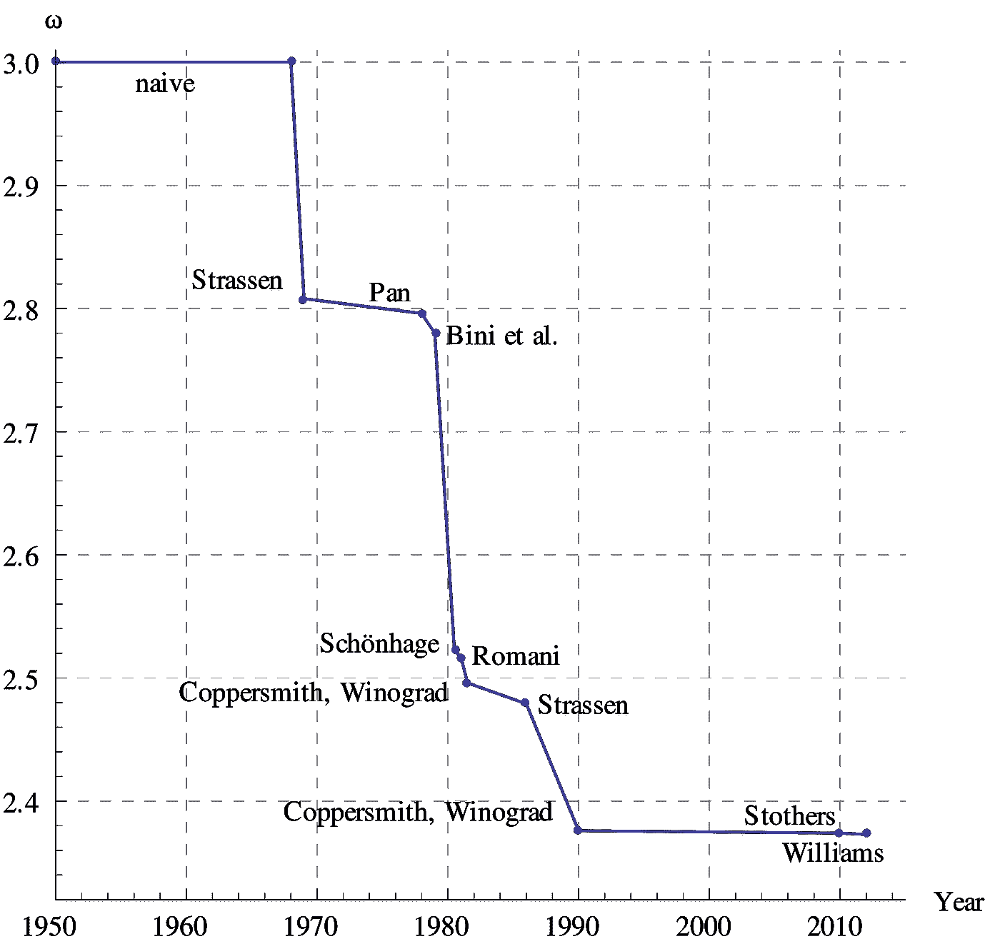
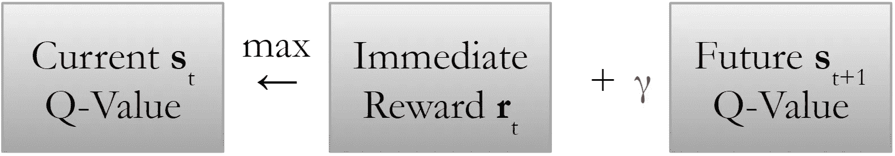
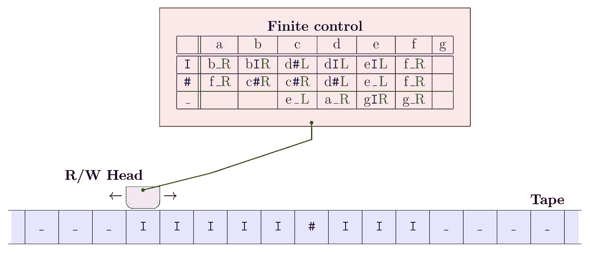
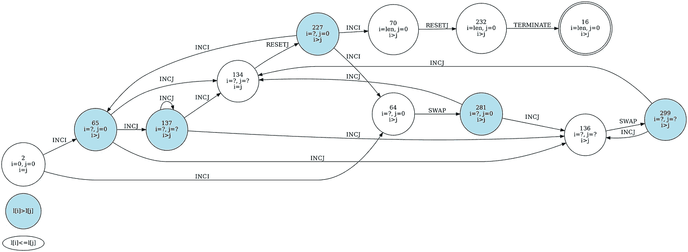
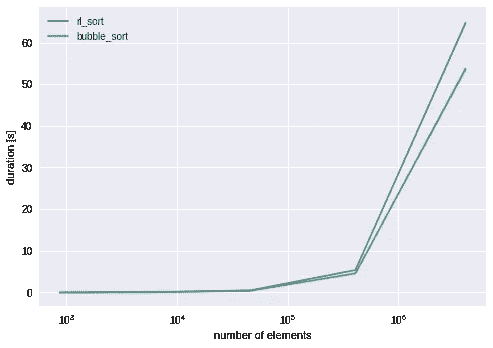

# 用强化学习构建图灵机

> 原文：<https://towardsdatascience.com/building-a-turing-machine-with-reinforcement-learning-9d06a4f0ce6?source=collection_archive---------13----------------------->

## 超越人工算法设计


Alan Turing. A name on which the beginning of an era is manifested. The Turing Award remembers each year on him, lastly to our »[Fathers of Deep Learning](https://www.acm.org/media-center/2019/march/turing-award-2018)«.

老实说，在计算机科学中，没有比另一种排序算法更无聊的东西了。但是，这个时间排序只是一个通用图灵机用高级强化学习框架自我学习的表示。

Thanks, Alec Baldwin!

事实上，想出一个高效的优化算法需要大量的时间、资源和努力。而且，你永远不知道是否还有更高效的版本。然而，直到 20 世纪 60 年代，在快速排序发明之前，排序被认为是一个需要花费大量时间的问题。更不用说优化矩阵乘法的有趣竞赛了，如下图所示…



Matrix multiplication is known to be in *O*(*n^ω*). Currently: *ω*=2.3728639.

这就是强化学习的用武之地:它不仅能够作为一个通用的启发式工具包，而且它还可以作为一种在优化领域中找出一种数学证明的新算法的方法。

在下文中，我将用排序的例子向您展示后者。然而，请随意应用这个框架来满足你自己的需要，也许你能够通过在多项式时间内解决一个 NP 完全问题来用矛盾证明[*P = NP*-问题](https://en.wikipedia.org/wiki/P_versus_NP_problem):我很乐意得到那 100 万美元价格的一部分。；)

# 我为什么要烦恼？

优化发生在任何行业。从本质上来说，没有人不能优化的地方。

然而，至关重要的是，在大多数情况下，给定所需的数据，我们不仅不知道一个合适的算法来优化某个问题，而且我们依赖于一个密集的思考过程，结合好的想法和长时间的试错过程。

将优化留给一个通用的框架，这样定义一个目标(比如一个最优策略)就足够了，这不是很好吗？对这种系统的要求将服从于:

*   收敛到一个有效的广义解
*   暴力的显著优势
*   测试期间的时间效率。

通过利用[强化学习](/what-to-expect-from-reinforcement-learning-a22e8c16f40c)——机器学习的最新进展——我们应该能够满足这些要求。如果我们在本文后面会谈到这一点。；)

## 好吧，很公平。有具体的用例吗？

当然可以。怎么样

*   **物流** : [先期运输](https://www.npr.org/2018/11/21/660168325/optimized-prime-how-ai-and-anticipation-power-amazons-1-hour-deliveries?t=1554890603422)，[库存管理](https://medium.com/@RemiStudios/artificial-intelligence-for-inventory-management-c8a9c0c2a694)，[高效的卡车运输](https://www.youtube.com/watch?v=gdwWrf9roDU)甚至[一个充分利用的 uber/cab/bus 驱动](https://www.youtube.com/watch?v=Vv-tYg03xlU)。
*   **架构** : [智能建筑](https://inbuildingtech.com/ai-ml/ai-ml-smart-building/)如[能源管理](https://arxiv.org/pdf/1901.04693.pdf)、[电梯调度](https://papers.nips.cc/paper/1073-improving-elevator-performance-using-reinforcement-learning.pdf)等。
*   **电子商务** : [UX/I 优化](https://blog.acolyer.org/2017/09/27/an-efficient-bandit-algorithm-for-real-time-multivariate-optimization/)，[电影推荐](https://www.youtube.com/watch?v=kY-BCNHd_dM)，[动态定价](https://arxiv.org/pdf/1803.09967.pdf)等。
*   **计算机科学** : [排序](http://axon.cs.byu.edu/papers/Spencer.CEC10.pdf)，[神经组合优化(如旅行推销员)](https://arxiv.org/abs/1611.09940)，[神经图灵机](https://arxiv.org/abs/1807.08518)，[数据中心冷却](https://deepmind.com/blog/deepmind-ai-reduces-google-data-centre-cooling-bill-40/)等。

## 深信不疑？现在关于技术…

为了便于说明，我选择学习一种排序算法，因为它很容易验证。然而，我的 GitHub 上提供的以下框架也可以用于其他优化技术:

[](https://github.com/moritzmoritz98/rlopt) [## moritzmoritz98/rlopt

### 通过强化学习实现任意优化问题的人类可读解决方案— moritzmoritz98/rlopt

github.com](https://github.com/moritzmoritz98/rlopt) 

# 该算法

1.  **使用贝尔曼方程通过 Q 表学习**任务。
2.  **在转换表中收集**所有用于解决任务的状态。
3.  **通过
    - a *最终状态机(fsm)图*(自动)、
    - a *lambda 函数基于转换表*(自动)或
    - a *简化的 fsm 和代码版本*(手动)重构**学习到的算法，用于算法加速。

在学习阶段，我们的目标是学习解决排序目标的算法。为此，我选择了表格 Q-learning 算法作为强化学习的一个特性，因为它易于标记和解释。

对于那些不熟悉表格 Q-learning 的人来说，本质上我们跨越了行中的列和状态上的动作，其中每个单元格通过采取其动作来确定该状态下的预期未来回报。下图描述了学习过程(也称为贝尔曼备份)。



The Bellman equation: Q(s,a) = r + γ*max Q(s’, a’)

如果有进一步的兴趣，看一看[我的要点](https://gist.github.com/moritzmoritz98/b9a4d7159cda1514192f632400ad4032)关于表格 Q-learning 是如何工作的。

在强化学习中，表格 Q-Learning *动作*、*状态*和*奖励*将被定义。因为我们的目标是一个通用的算法，我们必须特别注意如何选择它们。

本质上，我们正在设计一个多头(两个头: **I** 和 **J** )图灵机 M=⟨ Q，γ，s，b，f，δ ⟩处理其磁带上的一个待排序列表 **L** 。与 Alex Graves 的[神经图灵机](https://arxiv.org/abs/1410.5401)等现有技术相比，在这项工作中，我使用了一种更简单的方法，代价是可定制性更低，但可解释性更高。



Example [Turing machine to compute the truncated subtraction (“monus”), after John E. Hopcroft and Jeffrey D. Ullman (1979).](https://commons.wikimedia.org/wiki/File:MonusTuringMachine_svg.svg) In our case, the finite control table corresponds to the learned Q-table applied on a numerical list on the tape.

## **Q —状态，324**

这些状态必须与磁带无关，因此，我将它们称为 RL 相关变量。

1.  `**L**[**I**] ≥ **L**[**J**]` ∈ {0，1}
2.  **I** 对比**J**:**`**I**<**J**`|`**I**==**J**`|`**I**>**J**`**∈{-1，0，1}****
3.  ****`**I** == 0` |间| `**I** == len(**L**)` ∈ {-1，0，1}****
4.  ****`**J** == 0` | between | `**J** == len(**L**)` ∈ {-1，0，1}****
5.  ****`last_action` ∈ {0，1，2，3，4，5}****

****具体来说，第一个状态是二进制的，而接下来的是三进制的，最后一个是六进制的，因此它们可以用一个布尔、三个三进制和一个六进制来表示，从而产生`2¹×3³×6¹=324`不同的状态。实际上是非常低维的，但仍然足以成功地学习一个排序算法。****

## ****γ-磁带字母符号:动作，6****

****在代码中我使用了以下字母:
*终止*，
*INCI* ，
*INCJ* ，
*RESETI* ，
*RESETJ* ，
*交换*(值在 **I** 和 **J** )。****

****我们图灵机上基本上有两个头定位在 **I** 和 **J** 。通过增加其中一个或将其重置为零，机器能够在胶带内移动。交换是唯一的磁带修改动作，而终止模拟机器发出的暂停信号。有趣的是，希尔伯特的停顿问题也发生在我的一次实验中。****

****注意，你可以将磁带移动与实际程序分开，但是，出于实际考虑，我个人决定不采用这种形式主义。此外，为了确保暂停，'*终止*'动作也是一种变通方法。****

****本质上，只有“SWAP”和“ *NOOP* ”应该是γ的一部分。****

## ****s ∈ Q —初始状态****

****`i=0`；`j=0`；状态编码中的`last_action = ‘*TERMINATE*’` → `-1|-1|0|?|0`。****

## ****b∈γ—空白符号****

****然而，为了简单起见，没有包括空白符号，可以考虑添加一个' *NOOP* '操作。****

## ****f .⊆q——最终/接受国****

****这些是通过强化学习算法学习的。****

## ****δ:(q∖f)×γ→q×γ×{ i0，J0，I++，J++} —转移函数****

****通过算法了解到:来自 Q 的每个非最终状态与来自γ的动作配对具有确定性结果，该确定性结果包括通过采取来自γ的动作以及磁带移动(即 *INCI* 、 *INCJ* 、 *RESETI* 、 *RESETJ* 中的一个)而进入的下一个状态。****

****稍后，当我们讨论结果时，我将可视化这个转换表。****

## ****报酬****

****虽然不是图灵机的一部分，但奖励是通过强化学习来学习排序行为所需要的。为此，我决定让奖励函数尽可能稀疏和简单，以便为算法留出足够的自由空间:****

*   ****300:如果以排序状态终止****
*   ****10:如果交换正确****

****即使我没有指定禁止越界访问，程序自己也知道了这一点(一个无用的动作会减少可见的回报)。****

****还要注意，在这种情况下，相对于最终的表现，稀疏的奖励有它的机会，但是，它显著地增加了学习的时间，特别是在处理随机探索技术时。相反，通过应用直方图探索，每个状态根据其对算法的新颖性而被强制使用一个附加项。这种行为消除了奖励函数在开始阶段的稀疏性，并增加了达到全局最大值的机会。****

****在利用这种高级直方图探索技术之后，该算法能够在几个 1k 步骤中解决该列表，尽管如此，它仍然需要 5M 步骤来确定和优化其结果。****

## ******输入数据******

****关于输入数据的一个小注意:我生成了 3 到 6 个(870 个不同的)列表长度的所有可能排列，以减轻任何可以想到的过度匹配问题。****

# ****结果****

****恭喜你！你通过了艰难的技术部分。现在你想看到结果，对吗？****

****Looks brilliant, right?****

****好吧，你抓到我了。桌子看起来还不太好，对吧？****

****尽管如此，这里发生的事情还是值得一提。基本上，我在*的 5，000，000 个*步骤中学习了 *(324，6)* -Q 表，并通过预测列表(长度:3 到 6)的所有 *870 个*不同排列加上列表长度为 7 的 *5，040 个*排列来“测试”它，并在执行期间收集实际使用了哪些状态以及在这些状态下采取了什么样的动作。****

****令人惊讶的是，没有很多唯一的状态(本质上是 *20* )，而且，该算法确实很好地推广到了*5040*第七列表排列，没有任何错误。****

****我真的想再次强调这一点:仅用 500 万步和所有无限可能列表的一个小子集的训练数据，结合一个简单的手工制作的奖励函数，我们就能够分别教会算法或宇宙图灵机如何排序。****

> ****你现在能想象一个人可以多么容易地把它推进到其他优化困境吗？****

****然而，我们仍然没有到达我们旅程的目的地，除非你能够从那些 *20* 行或最终从下面的 GraphViz 中阅读并主动理解我们学习的算法。****

********

****An astonishing transition graph, isn’t it?****

## ****完整的图灵机****

****在算法描述中，我省略了最终状态集和转移函数，因为它是由我们的 Q-learning 学习的。现在我们能够完全定义我们的图灵机了。****

****首先，最终的状态集很简单，它是状态`16`,如转换图所示。****

****第二，我们的转换函数变得有点棘手，因为它比上面的图表形式上正确的版本更具可读性。尽管不再是一个有效的转换函数，我真的很高兴把它缩短为 4 种不同的情况，其中一个问号代表不相关。****

****Initial values: *j = 0* and *i = 1*.****

****最后，从简化的转换表来看，实际上静态编码是相当直观的:*我们这篇文章的主要目标*！****

```
**j **<-** *0*
i **<-** *1*
**while** action **is not** *TERMINATE*:
    **if** i **==** *len*(l):
        action **<-** *TERMINATE*
    **elif** l[i] **>** l[j]:
        movement **<-** *INCJ*
    **elif** i **>** j:
        action **<-** SWAP
        movement **<-** *INCJ*
    **else**:
        movement **<-** *RESETJ*
        movement **<-** *INCI***
```

****老实说，直到现在我都不知道强化学习在这种情况下是否真的能够找到一种新的排序算法，或者只是一种非常不受欢迎的算法。我唯一可以肯定的是，它实际上可以 100%正确地对任意列表进行排序！****

****也就是说，我真的很感激，如果你能留下一个关于你看起来像什么样的算法的笔记！****

## ****性能赋值****

****由于行动空间有限，学习比 *O(n )* 更好的东西从定义上来说是不可能的。然而，可以获得下面的算法复杂性。****

****非简化/原始版本 w.r.t .所需步骤数:****

*   *****最小* : `O(0.5n² + 1.5n + 1)`****
*   *****最大值* : `O(n² + n + 1)`****

****然而在简化版上，它更快并且(令人惊讶地)稳定:****

*   *****最小值* / *最大值* : `O(0.5n² + 0.5n)`****

****注意，通过从实际的与算法相关的动作字母表(即*交换*、*终止*、*无操作*)中分离带移动(即 *I0* 、 *J0* 、 *I++* 、 *J++* )，可以提高算法性能，因为对于一个动作，大多数时候还需要带上的移动，反之亦然然而，我将把它留给以后的工作。****

********

****RLSort vs. BubbleSort****

****不幸的是，我的 RLSort 算法不如冒泡排序算法快，这可能是由于开销以及 for 循环在 CPU 上比 while 循环在中止条件下优化得更好。此外，较低的性能界限是与快速的 *O(n)* 相比没有竞争力的*O(n)*——验证检查:他对一个已经排序的列表做了很多无意义的事情！****

# ****自己试试吧！****

****我真的很想鼓励你尝试一下，并把这个框架应用到你自己的想法中。如果您正在优化类似于列表的东西，只需要三个简单的步骤和几分钟的 CPU 时间:****

1.  ****查看我的[回购](https://github.com/moritzmoritz98/rlopt)。****
2.  ****根据您的需求调整[奖励功能](https://github.com/moritzmoritz98/rlopt/blob/master/rlopt/env/env.py#L112)。****
3.  ****耐心等待，直到算法找到你(希望)的广义解。****

****你不仅会得到你的训练数据的优化列表的结果，你还会得到一个[重构的现成可用的 lambda 函数](https://github.com/moritzmoritz98/rlopt/blob/master/rlopt/rl_sorting.py#L187)！****

****当然，请让我知道你的用例！我真的很有兴趣听听你和我的框架的独特故事。:)****

## ****修正案****

****下面你会发现一个调用 *RLSort* sorting `[6 4 3 7 0]`的例子，详细说明了学习排序算法是如何工作的:谜语玩得开心！****

```
 ***2* *<<-* [6 4 3 7 0], **i**=*0*, **j**=*0*: *INCI*.
 *64* *<<-* [6 4 3 7 0], **i**=*1*, **j**=*0*: *SWAP*.
*281* *<<-* [4 6 3 7 0], **i**=*1*, **j**=*0*: *INCJ*.
*134* *<<-* [4 6 3 7 0], **i**=*1*, **j**=*1*: *RESETJ*.
*227* *<<-* [4 6 3 7 0], **i**=*1*, **j**=*0*: *INCI*.
 *64* *<<-* [4 6 3 7 0], **i**=*2*, **j**=*0*: *SWAP*.
*281* <<- [3 6 4 7 0], **i**=*2*, **j**=*0*: *INCJ*.
*136* *<<-* [3 6 4 7 0], **i**=*2*, **j**=*1*: *SWAP*.
*299* *<<-* [3 4 6 7 0], **i**=*2*, **j**=*1*: *INCJ*.
*134* *<<-* [3 4 6 7 0], **i**=*2*, **j**=*2*: *RESETJ*.
*227* *<<-* [3 4 6 7 0], **i**=*2*, **j**=*0*: *INCI*.
 *65* *<<-* [3 4 6 7 0], **i**=*3*, **j**=*0*: *INCJ*.
*137* *<<-* [3 4 6 7 0], **i**=*3*, **j**=*1*: *INCJ*.
*137* *<<-* [3 4 6 7 0], **i**=*3*, **j**=*2*: *INCJ*.
*134* *<<-* [3 4 6 7 0], **i**=*3*, **j**=*3*: *RESETJ*.
*227* *<<-* [3 4 6 7 0], **i**=*3*, **j**=*0*: *INCI*.
 *64* *<<-* [3 4 6 7 0], **i**=*4*, **j**=*0*: *SWAP*.
*281* *<<-* [0 4 6 7 3], **i**=*4*, **j**=*0*: *INCJ*.
*136* *<<-* [0 4 6 7 3], **i**=*4*, **j**=*1*: *SWAP*.
*299* *<<-* [0 3 6 7 4], **i**=*4*, **j**=*1*: *INCJ*.
*136* *<<-* [0 3 6 7 4], **i**=*4*, **j**=*2*: *SWAP*.
*299* *<<-* [0 3 4 7 6], **i**=*4*, **j**=*2*: *INCJ*.
*136* *<<-* [0 3 4 7 6], **i**=*4*, **j**=*3*: *SWAP*.
*299* *<<-* [0 3 4 6 7], **i**=*4*, **j**=*3*: *INCJ*.
*134* *<<-* [0 3 4 6 7], **i**=*4*, **j**=*4*: *RESETJ*.
*227* *<<-* [0 3 4 6 7], **i**=*4*, **j**=*0*: *INCI*.
 *70* *<<-* [0 3 4 6 7], **i**=*5*, **j**=*0*: *RESETJ*.
*232* *<<-* [0 3 4 6 7], **i**=*5*, **j**=*0*: *TERMINATE*.
Sorted list in *28* steps: **[0 3 4 6 7]****
```