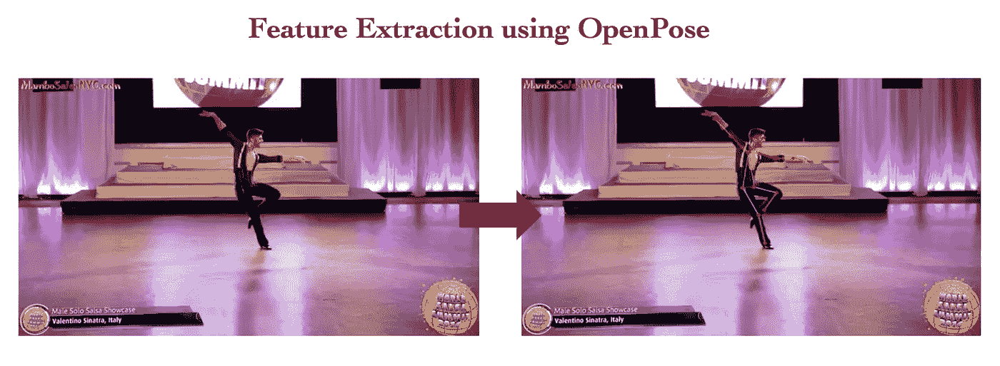
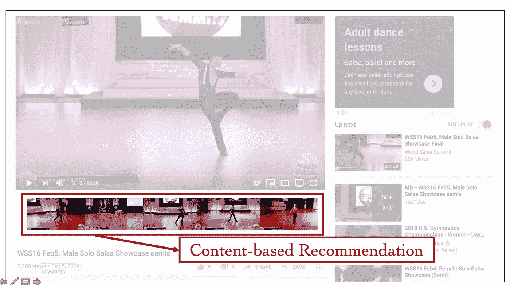
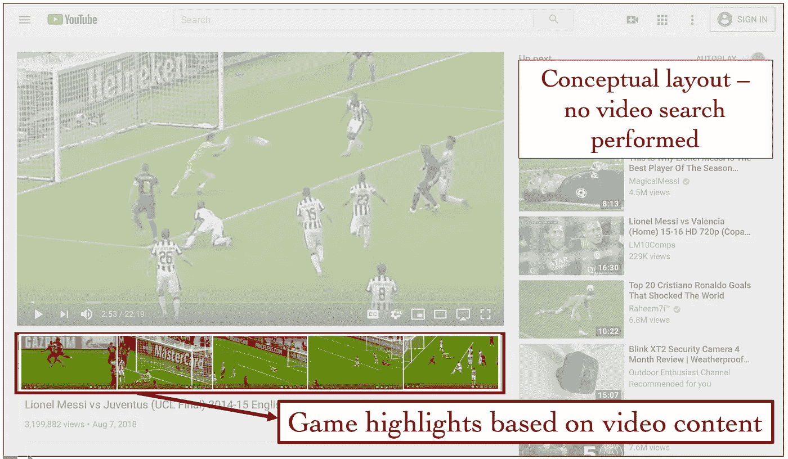

# 利用计算机视觉构建视频搜索引擎

> 原文：<https://towardsdatascience.com/building-a-video-search-engine-b93305126b59?source=collection_archive---------22----------------------->

## 使用萨尔萨舞视频的案例研究

[Source](https://artofdance.ca/wp-content/uploads/2015/06/flam_dance_slide1.jpg)

# 介绍

在图像分类任务取得前所未有的进展之后，计算机视觉领域的自然进展是朝着视频和视频理解的方向发展，尤其是它如何与识别人类对象和活动相关联。正在这一领域建立一些数据集和基准。

与此同时，与 2D 图像相关的计算机视觉任务正在取得进一步进展，如细粒度分类、图像分割、3D 图像构建、机器人视觉、场景流量估计和 ***人体姿态估计*** 。

作为我在 Metis bootcamp 的最终数据科学项目的一部分，我决定将这两个平行的领域结合起来——具体来说是视频和人体姿势估计——以创建一个基于内容的视频搜索引擎。由于将 2D 人体姿势估计应用于视频搜索是一个“没有概念证明”的新颖想法，所以我通过选择 Salsa 舞蹈视频的单个表演者、固定位置单个摄像机视频片段来简化我的方法。

# 录像

仅次于谷歌的第二大搜索引擎 YouTube 的用户每天观看超过 10 亿小时的视频。世界上最受欢迎的社交网站脸书的用户每天观看大约 1 亿小时的视频！！这些平台对向用户提供搜索和发现感兴趣的相关内容的工具感兴趣。

这些平台提供的搜索工具主要使用视频的元数据(位置、时间、内容创建者等。)、标题、描述、抄本(用户创建的或机器从音频生成的)、用户评级、用户评论等。检索“相似”的结果。这些搜索工具不会浏览视频本身的实际内容。对于搜索来说，视频是不可浏览或可索引的。

视频中的视觉特征太多了，索引它们的计算成本很高，检索起来又太慢。举个例子，如果你要搜索*展览 1* 中萨尔萨舞者的舞步，目前在 YoutTube 这样的平台上还没有可供用户使用的工具。salsa 步骤没有文本上下文来执行搜索。

*Exhibit 1: Salsa Dance Video (Credit: World Salsa Summit 2016\. Dancer: Valentino Sinatra, Italy)*

作为我的 Metis 项目 5 的一部分，我构建的视频搜索引擎已经索引了来自 YouTube 的大约 70 分钟的萨尔萨舞视频，并将返回一个匹配，如下面的*图表*所示。Yeifren(中)和 Adriano(右)表演的萨尔萨舞步与 Valentino(左)相似。在这些片段中，表演者走回到舞台中央，并面向舞台左侧进行多次转身。

*Exhibit 2: A search results from the Video Search Engine (Credit: World Salsa Summit 2016\. Dancers: Valentino Sinatra, Italy; Yeifren Mata, Venezuela; Adriano Leropoli, Montreal)*

Valentino(左)和 Yiefren(中)之间的一个非常微妙的动作是，他们都触摸/撞击他们的膝盖/腿！！它在剪辑中的时间是关闭的，但模型拿起这个！！这些片段我看了好多天都没注意到！我认为这是一个迷人的结果。

# 方法学

建立视频搜索引擎有两个步骤。第一步是下载和处理视频素材，并通过 OpenPose 进行特征提取。OpenPose 是卡内基梅隆大学研究人员(曹哲等人)开发的一种人体姿态估计算法。更多关于 OpenPose 的内容将在后面的章节中介绍。第二步是模型构建和测试查询指标。使用矩阵分解方法(PCA，LSA，NMF)建立模型。欧几里德距离和余弦相似性作为查询度量被测试。作为第二步的一部分，还进行了特征工程/特征表示练习，测试了每一帧的展平特征和特征的 Hu 矩。

所获得的“特征表示/维数减少/查询度量”的最佳组合是通过使用具有 LSA 和余弦相似性的简单平坦姿态估计。

*Exhibit 3: Methodology for building a video search engine*

## 数据

这个项目的数据来自处理 YouTube 萨尔萨视频(链接如下)。

**为什么是莎莎？**

除了是一种具有挑战性的舞蹈形式，涉及微妙和快速的动作，YouTube 上的许多频道还提供了独舞者的视频。对于多人视频帧，用于我的项目的特征提取的 Zhe Cao 等人的姿态估计是快速和准确的，但是那些算法不能逐帧跟踪一个人。当视频中的人交换位置时，这就产生了一个问题——比如一对夫妇在做转体/托举等动作。为了避免这种情况并简化我的问题，我选择了独舞视频。

我考虑过的另一种舞蹈形式是芭蕾。然而，女舞者的服装(读芭蕾短裙！)会导致假阳性，如在芭蕾中常见的某些舞蹈姿势的膝盖。

我收集的萨尔萨舞片段来自以下四个总时长为 160 分钟的视频。这个镜头被处理到 70 分钟，并被格式化成 3 秒钟的剪辑。处理后的视频由大约 30 名艺术家的大约 58 场表演组成。

这些视频是:

*   【https://www.youtube.com/watch?v=4nHElVbT3HY 
*   [https://www.youtube.com/watch?v=ITNiqNcl6Mw](https://www.youtube.com/watch?v=ITNiqNcl6Mw)
*   [https://www.youtube.com/watch?v=L5mqL7ADEsY](https://www.youtube.com/watch?v=L5mqL7ADEsY)
*   [https://www.youtube.com/watch?v=M_rPhEjym1o](https://www.youtube.com/watch?v=M_rPhEjym1o)

总而言之，所用的视频包括:

1.  单身舞者
2.  固定位置的单个摄像机的镜头(没有移动的摄像机！).只有摄像机角度和缩放级别会反映在素材中。
3.  视频帧速率从原来的 24 帧/秒降低到 8 帧/秒。
4.  固定屏幕分辨率为 640(宽)X 360(高)像素。
5.  大约 70 分钟的经过处理的镜头，并格式化为 3 秒钟的剪辑(超过 1，400 次观察)。

**OpenPose:实时 2D 多人姿态估计算法**

人体姿态估计是识别图像或视频中人体解剖“关键点”的计算机视觉问题。在过去的几年里，许多研究人员取得了令人难以置信的进展，并展示了实时性能⁴.卡内基梅隆大学机器人研究所的曹哲等人使用“自下而上”的方法赢得了首届 COCO 2016 关键点挑战。他们使用安装了 GPU 的笔记本电脑实现了实时速度。

姿态估计用于对图像/视频剪辑中的人类活动进行分类。它们主要应用于 2D 图像，但从未用于视频搜索目标。下面是 OpenPose 如何在 2D 图像中识别一个人的 18 个关键点的示例(为了简单起见，只显示了 14 个关键点)。

*Exhibit 4: OpenPose on a 2D Image Identifying Keypoints*

当识别出视频中每一帧的关键点时，结果将如下面的*展示 5 & 6* 所示。

*Exhibit 5: OpenPose on a Salsa Dance Video Identifying Keypoints*

*Exhibit 6: Spatio-temporal features extracted from OpenPose*

# 结果

下面显示了索引 salsa 视频并使用余弦相似度进行搜索的一些结果。右上方的视频是搜索片段，搜索结果要从左到右读，然后从上到下。

请注意，搜索引擎索引在检索舞者正走向他们的位置的视频剪辑时是充分有效的(*展示 7* )。这本身就是一个有趣的结果，并展示了这种索引方法如何用于视频编辑。即使对于 2.5 小时的“小的”未处理的镜头，手动编辑这些剪辑也将花费数小时，而搜索引擎运行(后期索引)不到一秒钟，并且能够找到镜头中所有这种剪辑的时间戳。这使得视频编辑更加自动化和快速。

*Exhibit 7: Search using a Clip of Dancers Making an Entry*

## 更多的结果

*Exhibit 8: Dancers Performing Turns*

*Exhibit 9: Turn while bearing to the left (& swoop down!)*

*Exhibit 10: Moving to the left and a turn*

# 其他应用

像这样的视频搜索引擎有很多应用。下面列出了一些例子:

*Exhibit 8: Other Applications for Video Search Engine*

对于像 YouTube 和脸书这样的平台如何在他们当前的网站上使用视频搜索，我有更多的想法。一些概念性的想法如下所示:

*Exhibit 9: A Conceptual Layout of Video Search on YouTube Salsa Videos*

*Exhibit 10: A Conceptual Layout of Video Search on YouTube Football Game Videos*

# 参考

1.  南 Abu-El-Haija 等人 [YouTube-8M:大规模视频分类基准](https://arxiv.org/pdf/1609.08675.pdf)。 *arXiv:1609.08675be* ，2016
2.  曹哲等人，[利用局部亲和场的实时多人 2D 姿态估计(2017)](https://arxiv.org/pdf/1611.08050.pdf) ，CVPR
3.  曹哲等， [Github to OpenPose](https://github.com/ZheC/Realtime_Multi-Person_Pose_Estimation) (2017)
4.  德里克·姆维蒂，[2019 年人体姿势估计指南](https://heartbeat.fritz.ai/a-2019-guide-to-human-pose-estimation-c10b79b64b73) (2019)，中等文章

*最初发布于*[*https://mlbhanuyerra . github . io*](https://mlbhanuyerra.github.io/2019-12-09-Video-Search-Engine-Salsa/)*。*