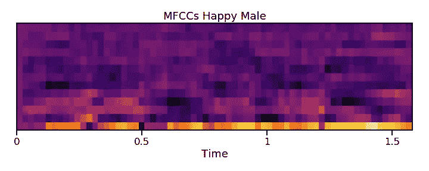

# 利用深度学习构建声音情感传感器

> 原文：<https://towardsdatascience.com/building-a-vocal-emotion-sensor-with-deep-learning-bedd3de8a4a9?source=collection_archive---------14----------------------->

## 教机器更好地理解人类交流

人类的表达是多方面的，复杂的。例如，说话者不仅通过语言交流，还通过节奏、语调、面部表情和肢体语言交流。这就是为什么我们更喜欢面对面而不是电话会议来举行商务会议，也是为什么电话会议比电子邮件或短信更受欢迎。我们离得越近，通信带宽就越多。

语音识别软件近年来有了很大的进步。这项技术现在在识别语音并将这些语音拼凑起来以再现口语单词和句子方面做得非常好。然而，简单地将语音翻译成文本并不能完全概括说话者的信息。除了面部表情和肢体语言，与音频相比，文本在捕捉情感意图方面的能力非常有限。

最初，我选择构建一个声音情感传感器，因为这似乎是一个有趣的工作项目。尽管对这个问题想得更多，我意识到通过音频进行情感感应有一些真正有趣的应用。想象一下，如果你的智能家居设备可以播放符合你情绪的歌曲，例如当你悲伤时播放振奋人心的歌曲。客户服务部门可以使用情绪检测来培训员工，或者测量客户在服务电话过程中是否变得更开心。

# 数据

我用来构建我的情感分类器的数据集是[拉夫德斯](https://smartlaboratory.org/ravdess)、[苔丝](https://tspace.library.utoronto.ca/handle/1807/24487)和 [SAVEE](http://kahlan.eps.surrey.ac.uk/savee/Download.html) ，它们都是免费向公众开放的(SAVEE 需要一个非常简单的注册)。这些数据集包含七个常见类别的音频文件:中性、快乐、悲伤、愤怒、恐惧、厌恶和惊讶。我总共获得了 30 名男女演员制作的 4500 个带标签的音频文件中超过 160 分钟的音频。这些文件通常由男演员或女演员说的带有特定情感意图的简短短语组成。

Actors for the SAVEE dataset

# 特征抽出

接下来，我必须找到可以从音频中提取的有用特征。最初我想用短时傅立叶变换来提取频率信息。然而，对该主题的一些研究表明，当涉及到语音识别应用时，傅立叶变换是相当有缺陷的。原因是尽管傅立叶变换是声音极好的物理表示，但它并不表示人类如何感知声音。

Raw audio waveform. In this form it is useless for classification.

从音频中提取特征的更好方法是使用 Mel 频率倒谱系数，简称 MFCCs。这里提供了一个很好的解释，说明 MFCCs 是如何从音频中获得的。MFCCs 试图以更符合人类感知的方式来表示音频。

为了从音频中导出 MFCCs，需要决定使用多少频率仓以及分段的时间步长有多宽。这些决定决定了输出 MFCC 数据的粒度。语音识别应用的标准实践是应用 20Hz-20k Hz 之间的 26 个频率仓，并且仅使用前 13 个用于分类。大多数有用的信息都在较低的频率范围内，包含较高的频率范围通常会导致性能下降。对于时间步长，10 到 100 毫秒之间的值是常见的。我选择用 25 毫秒。

Mel filter banks used to bin audio frequency content.

导出的 MFCCs 可以绘制在热图上，并用于可视化音频。这样做并不能揭示情感类别之间的任何明显差异。这与其说是因为缺乏模式，不如说是因为人类没有受过训练，无法从视觉上识别这些微妙的情感差异。然而，从这些热图中很容易看出男性和女性说话者之间的差异。

Visualized MFCCs for Happy Male and Female Speakers. Women tend to have stronger high frequency components in their voices, as shown by the brighter colors towards the top of the heatmap.

# 训练卷积神经网络

通过推导 MFCCs，音频分类问题实质上被转化为图像识别问题。因此，在图像识别领域非常有效的工具、算法和技术在音频分类中也非常有效。为了解决情感分类问题，我选择使用卷积神经网络(CNN ),因为这些网络已经被证明在图像和音频识别方面都是有效的。

在训练 CNN 之前，我将数据集中的文件随机分配给 80/20 分割的训练集或测试集。然后，我对训练文件执行了一些预处理步骤。每个文件的流程如下:

1.  切断所有的沉默。
2.  随机选择若干个 0.4s 窗口。
3.  确定每个窗口的 MFCCs，产生 13×16 阵列。
4.  将 MFCCs 调整到 0 到 1 的范围。(这一步超级重要！它使模型无法适应录音的音量水平。)
5.  将每个窗口与源文件的情感标签相关联。

完成预处理后，我生成了 75，000 个标记为 0.4s 的窗口用于训练，每个窗口由一个 13x16 的数组表示。然后我用这些数据训练了我的 CNN 25 个时代。

# 模型检验

为了对测试集上的模型进行基准测试，我应用了一个类似于用来创建训练数据的流程工作流。测试集中每个文件的流程是:

1.  切断所有的沉默。
2.  创建步长为 0.1s 的“滑动”0.4s 窗口。(例如，第一窗口的范围从 0.0s 到 0.4s，第二窗口的范围从 0.1s 到 0.5s，等等。)
3.  确定每个窗口的 MFCCs，范围从 0 到 1。
4.  对每个窗口进行分类并返回 softmax 输出。
5.  聚合每个窗口的预测。
6.  最终预测是聚合后的最大类。

将这个过程应用于测试集中的所有 889 个文件，产生了 83%的总体准确率。我非常怀疑自己能否以接近 83%的准确率给这些文件贴上标签。下面的条形图显示了每种特定情绪的准确度。

# 外卖食品

这篇博文可能会让构建、训练和测试模型看起来简单明了。我可以向你保证，事实并非如此。在达到 83%的准确率之前，有许多版本的模型表现相当差。在一次迭代中，我没有正确地缩放我的输入，这导致了测试集中的几乎每个文件都被预测为“令人惊讶”。那么我从这次经历中学到了什么呢？

首先，这个项目很好地展示了简单地收集更多的数据如何能够极大地改善结果。我第一次成功的模型迭代只使用了 RAVDESS 数据集，大约 1400 个音频文件。仅用这个数据集我能达到的最高准确率是 67%。为了达到 83%的准确率，我所做的就是将数据集的大小增加到 4500 个文件。

其次，我了解到对于音频分类来说，数据预处理是至关重要的。原始音频，甚至短时傅立叶变换，几乎完全没用。我从惨痛的教训中认识到，适当的缩放可以成就一个模型，也可以毁掉它。无法消除沉默是另一个简单的陷阱。一旦音频被适当地转化为信息特征，建立和训练深度学习模型就相对容易了。

总而言之，为语音情感检测建立一个分类模型是一次富有挑战性但却值得的经历。在不久的将来，我可能会再次访问这个项目，以扩大它。我想做的一些事情包括:针对更广泛的输入测试模型，使模型适应更广泛的情绪，并将模型部署到云上进行实时情绪检测。

# 附录

[Github](https://github.com/alexmuhr/Voice_Emotion) 、 [LinkedIn](https://www.linkedin.com/in/alexander-muhr/) 、[个人博客](https://www.datascienceodyssey.com)