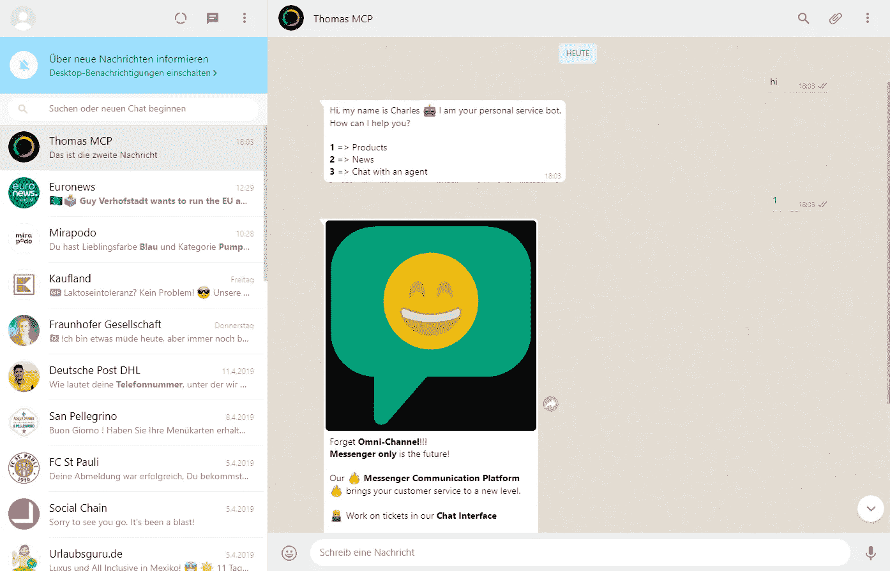
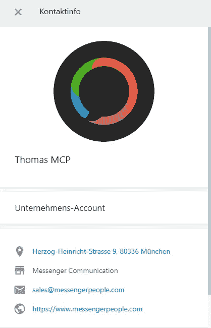
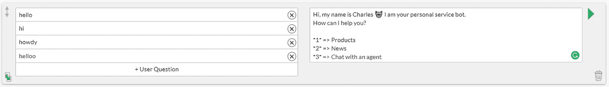
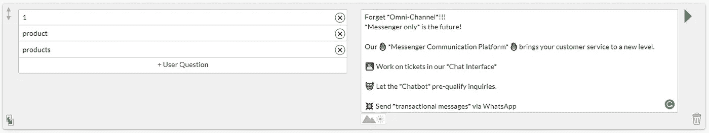
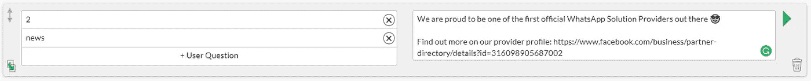
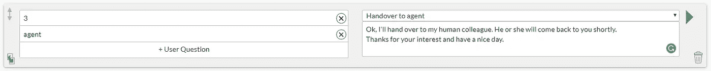
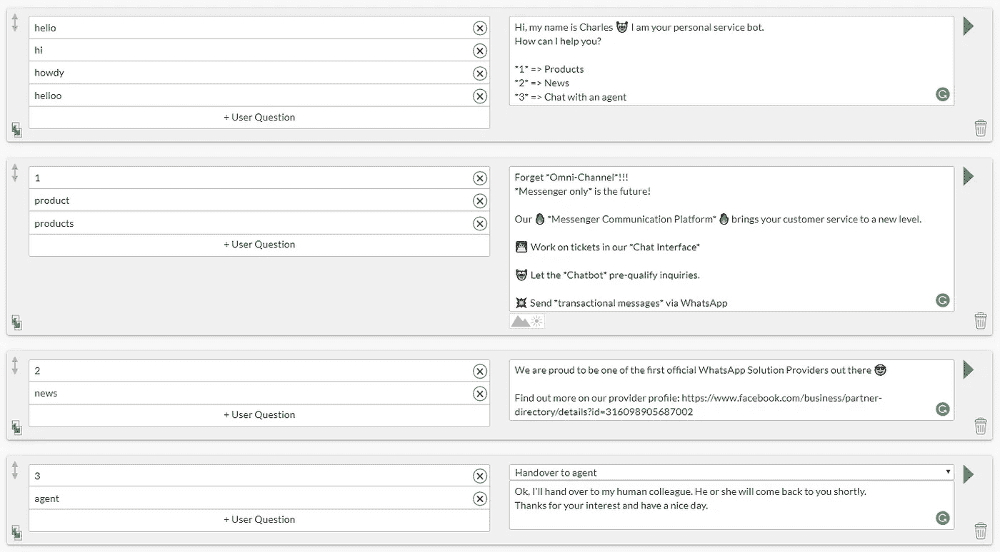
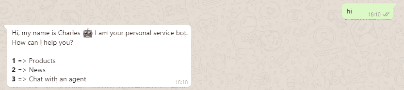
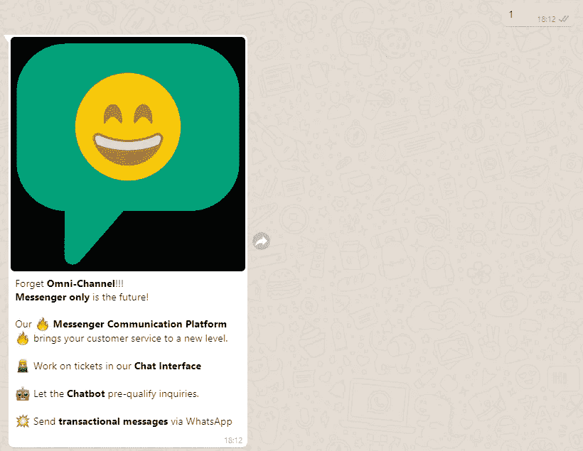
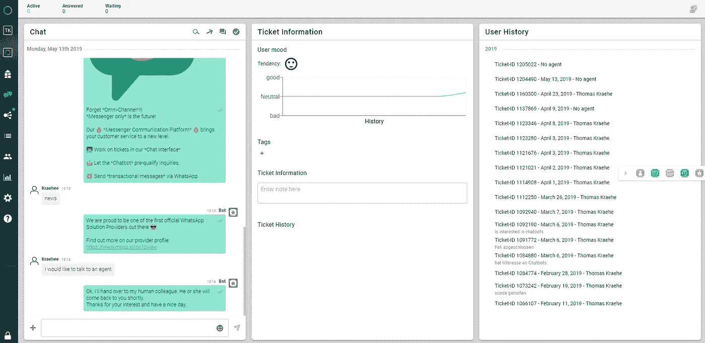

# 无需编码，在 5 分钟内构建一个 WhatsApp 聊天机器人

> 原文：<https://towardsdatascience.com/building-a-whatsapp-chatbot-in-5-minutes-without-coding-f53fab8bfb96?source=collection_archive---------6----------------------->

聊天机器人正在兴起。已经有很多或多或少有用的聊天机器人，其中大多数基于 Facebook Messenger。然而，如果你居住在欧洲、印度、南美或非洲，很可能你正在使用 WhatsApp 作为你的首选沟通渠道( [stats](https://www.messengerpeople.com/global-messenger-usage-statistics/) )。很好，那么对于 WhatsApp 上的聊天机器人来说，什么是有用的案例呢？由于 WhatsApp 目前专注于客户服务，正如他们在[指南](https://developers.facebook.com/docs/whatsapp/guidelines/)中所描述的那样，让我们构建一个机器人来帮助预先确认服务查询。

# 前提条件是什么？

通过 [WhatsApp 商业应用编程接口](https://www.whatsapp.com/business/api)商业使用 WhatsApp 的先决条件是要么直接从 WhatsApp 申请一个自己的账户，这目前极难获得，要么从官方[解决方案提供商](https://www.facebook.com/business/partner-directory/search?solution_type=messaging)那里购买访问权限。我可以推荐第二个选项，因为从技术角度来看设置整个项目是很有挑战性的。顾名思义，它只是一个没有图形用户界面的 API。

当你有了这样一个商业账户，你可以给它添加一个电话号码，开始发送和接收信息。WhatsApp 的一个商业简介是这样的(德语):

# 建造机器人

在这个小展示中，我正在使用 MessengerPeople 的平台来构建聊天机器人。MessengerPeople 是 WhatsApp 官方解决方案提供商之一，为人工代理引导的聊天提供票证系统，并为自动化对话提供图形聊天机器人构建器界面。

简单说明一下:我们的目标并不是构建一个超级智能的数字助理，它可以回答你能想到的每一个问题！我们的目标是构建一个小助手，它可以服务于一个清晰和狭窄定义的用例。这就是为什么我们必须让机器人来主导对话。机器人总是需要给出对话如何进行的提示。最后但同样重要的是，让我提一下，条条大路通罗马。这只是一个功能非常有限的小例子。

好了，理论够了！让我们开始建设吧！MP 的聊天工具界面非常简单和直观。在左侧，你添加所谓的用户问题，这些是机器人应该做出反应的关键词和短语。在右边，你添加相应的机器人答案。

让我们以欢迎词和介绍开始。我们正在添加一些关键字，如你好，嗨，你好，作为用户问题。您还可以通过添加拼写错误的单词和短语来处理错别字。然后我们让机器人介绍自己，并立即给出选项供选择。WhatsApp 提供的[格式选项](https://faq.whatsapp.com/en/android/26000002/)非常有限。我们可以用两颗星把一个单词括起来，使它变得粗体。当然，我们也可以添加[表情符号](https://emojipedia.org/)。

该机器人给用户 3 个选项:产品，新闻和与代理聊天。我们还增加了简化回复过程和优化用户体验的捷径。所以，现在我们可以将相应的对话添加到这三个选项中。先说产品信息。除了快捷方式“1”，我们还添加了关键字“产品”和“产品”。当然，你可以在这里添加任意多的同义词或短语。

然后我们以同样的方式为新闻部分添加第二个对话，快捷键为“2”。我们也可以在机器人回答中放一个链接到一个有更多细节的网页。一个链接缩短器将自动缩短所有链接，并使跟踪点击成为可能。请注意，你不能在 WhatsApp 中使用 HTML，所以你不能添加和样式，例如一个标签。唯一的办法就是加一个纯 URL。

对于快捷键为“3”的第三个对话，我们在机器人回答中增加了一个特殊动作“移交给代理”。这里发生了什么？到目前为止，整个对话是完全自动化的。此时，聊天机器人停止工作，并为人工代理打开一张票。我们称之为混合机器人。然后，代理可以拿起票据并手动回复客户。还可以定义自定义技能，如“销售”、“支持”、“人力资源”等。因此，机器人可以自动将请求路由到正确的部门。

我们的整个配置如下所示:

现在是考验我们小伙伴的时候了！我使用 WhatsApp Web 来开发和测试聊天机器人，因为这是一种在浏览器中使用 WhatsApp 的便捷方式。

很好，不是吗？最后，让我们看看这个请求到达的后端票务系统。这是代理视图:

当然，聊天机器人的功能远不止这种简单的问答游戏。例如，它可以收集数据并存储到用户配置文件中。它可以通过 API 从外部数据源获取信息。它可以处理依赖性并做出相应的响应，例如，“这个用户是否已经提供了他的名字，然后用他的名字称呼他”或“用户用 A 回答了问题 1，所以继续问题 4”。它还可以以定义的延迟发送多条消息，当然，它还可以发送图像、视频、音频和 pdf 等媒体。