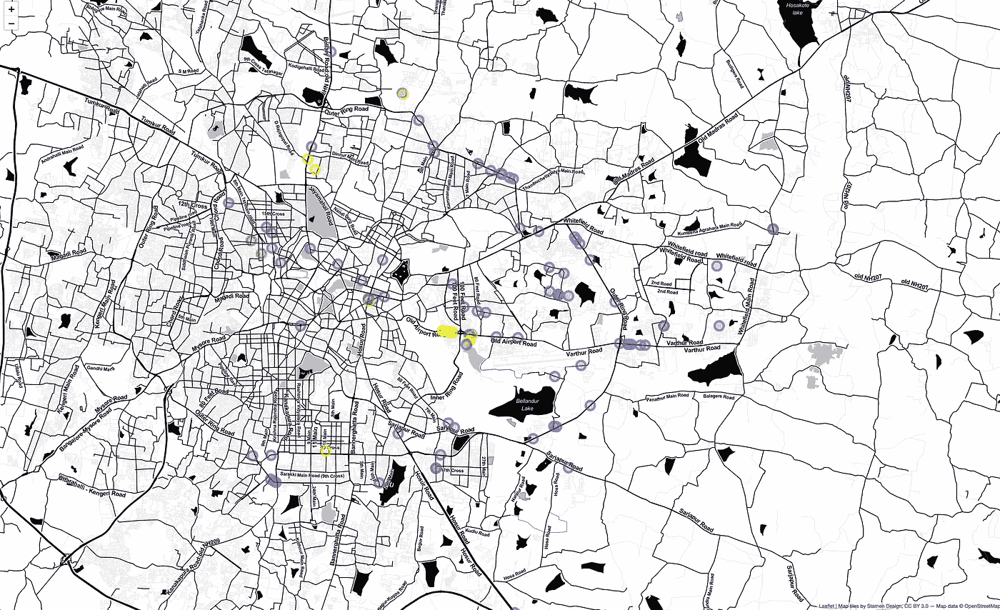

# 用 WiGLE 和 R 建立一个你周围网络的 WiFi 点地图

> 原文：<https://towardsdatascience.com/building-a-wifi-spots-map-of-networks-around-you-with-wigle-and-r-d01a73b1172d?source=collection_archive---------25----------------------->



Map generated using the below code

探索我们周围的世界总是很有趣——当你以数据科学家的 ***视角*** 探索世界时，那就更有趣了。

在此分析中，我们将确定我们周围开放的 WiFi 网络，并将它们映射到交互式地图上。

# 工具包

*   [*wig lr*](https://github.com/hrbrmstr/wiglr)*R 包，用于与 WiGLE API 接口*
*   *用于数据收集的 WiGLE API*
*   *[*tidy verse*](https://www.tidyverse.org/)*R 包用于数据分析&操纵**
*   **[*传单*](https://rstudio.github.io/leaflet/) R 用于绘制互动地图的包(界面为 fleet . js)**

**wiglr 是由 *Bob Rudis* 开发的 R 包，他的名字是 [hrbrmstr](https://rud.is/b/about/) 。他是 R 的超级用户之一，同时也积极参与开发新的 R 包并写博客。**

# **先决条件**

**在我们开始编码之前(不管怎样，只是一堆代码)，我们需要做两件重要的事情。**

## **安装所有需要的 R 包**

**`wiglr`在 CRAN 上尚不可用，因此必须根据您的喜好从 Github/Gitlab 安装。下面是代码，你如何使用`devtools`包从 Github 安装它**

```
**# install.packages('devtools') # install devtools if not available
devtools::install_github(“hrbrmstr/wiglr”)**
```

**上面提到的其他实用程序包:**

```
**install.packages('tidyverse') # ideally dplyr is what we'd need
install.packages('leaflet')** 
```

## **正在获取 WiGLE API 令牌**

*   **在 wigle.net[创建您的账户](https://wigle.net/)**
*   **登录后，从[你的账户页面](https://wigle.net/account)获取你的 API 令牌(点击*显示令牌*)**
*   **打开 RStudio，将您的( *"Encoded for use"* ) API 令牌设置为环境变量，如下所示:**

```
**Sys.setenv(WIGLE_API_KEY = "here_goes_my_encoded_token")**
```

**至此，我们已经具备了先决条件，可以开始了！**

# **起飞**

## **加载库**

**和其他 R 项目一样，第一步是加载所有需要的库。**

```
**library(wiglr)
library(tidyverse)
library(leaflet)**
```

## **我们周围景点的一般统计数据**

**在这一步，我们将给出边界框(以纬度和经度的形式)并提取我们周围的 WiFi 网络的细节。**

```
**# This is for Bengaluru, India - change it according to where you're
wifi_box <- wigle_bbox_search(12.7585, 13.1105, 77.5477, 77.8431)** 
```

****样本输出****

```
**> wifi_box
$success
[1] TRUE$totalResults
[1] 252098$search_after
[1] 552772$first
[1] 1$last
[1] 100$resultCount
[1] 100$results
# A tibble: 100 x 25
   trilat trilong ssid    qos transid channel firsttime lasttime lastupdt housenumber
 *  <dbl>   <dbl> <chr> <int> <chr>     <int> <chr>     <chr>    <chr>    <chr>      
 1   12.9    77.6 oakd…     0 201701…       6 2017-01-… 2017-01… 2017-01… 305, 1st M…
 2   12.9    77.6 Sham…     0 201606…      11 2001-01-… 2016-06… 2016-06… ""         
 3   13.0    77.7 PPAN…     0 201303…       1 2013-03-… 2013-03… 2013-03… ""**
```

**它只是一个列表(JSON 响应的输出),包含实际结果和一些元数据。正如您在上面的示例输出中看到的，我们的关注点是`results`。**

# **巡航**

**说完了，就该画我们承诺要画的交互图了(本文开头)。**

**下面是我们从`wifi_box`中取出`results`并创建一个新变量`labs`的代码(它将在弹出标签的后续行中使用)。这些数据被进一步输入`leaflet()`进行地图创建，我们添加一个基础图层，然后在给定的经度和纬度添加圆形标记。**

**颜色编码是为了让我们表示 WiFi 网络的安全性是*无*(无安全性)—红色、*未知—* 黄色和其他(如 WEP、WPA) —蓝色。**

```
**wifi_box$results %>% 
  mutate(labs = sprintf("SSID: <code>%s</code><br/>Encryption: %s", ssid, encryption)) %>% 
  leaflet() %>% 
  #addTiles() %>% 
  addProviderTiles(providers$Stamen.Toner) %>% 
  #addProviderTiles(providers$OpenStreetMap, options = providerTileOptions(opacity = 0.4)) %>% 
  addCircleMarkers(~trilong, ~trilat, 
                   radius = 10, 
                   popup = ~labs, 
                   color = ifelse(
                     wifi_box$results$encryption == "none","red",
                                  ifelse(
                                    wifi_box$results$encryption == "unknown",
                                    "yellow","blue")))**
```

**这给了我们这个漂亮的情节(当你在 RStudio 中绘图时，它实际上是交互式的)**

****

**你可以使用不同的`names(providers)`值来选择你喜欢的基层/地图主题。**

# **安全着陆**

**这样，我们就成功地绘制了我们周围的 WiFi 网络——以及它的 SSID 和安全加密。这在检测和通知可能被恶意方攻击的没有安全性的开放网络时非常有用。**

# **参考**

*   **[在开发中:使用 wiglr 进入热点](https://rud.is/b/2019/02/18/in-dev-wigle-your-way-into-a-hotspot-with-wiglr/)**
*   **我的 github 上使用的完整代码**
*   **[威格尔官方网站](https://wigle.net/)**

****结束语:** *如果您对开源感兴趣，请* [*贡献此包*](https://github.com/hrbrmstr/wiglr) *以成功部署在 CRAN 上，使其能够面向大众***