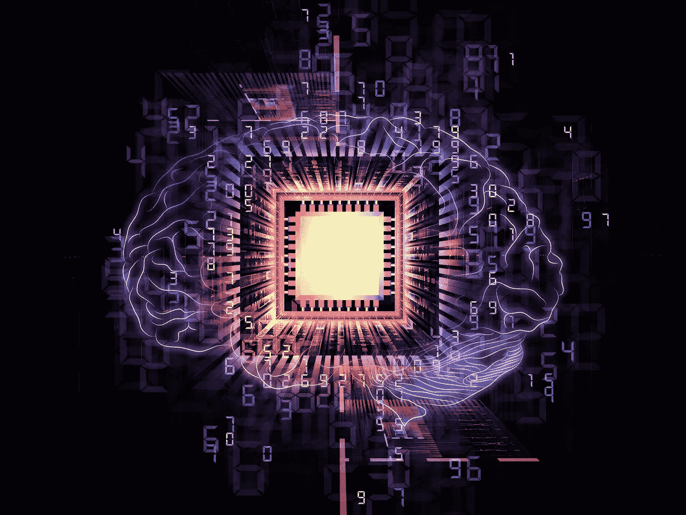
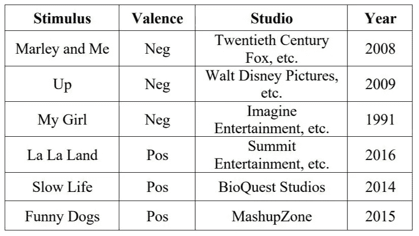
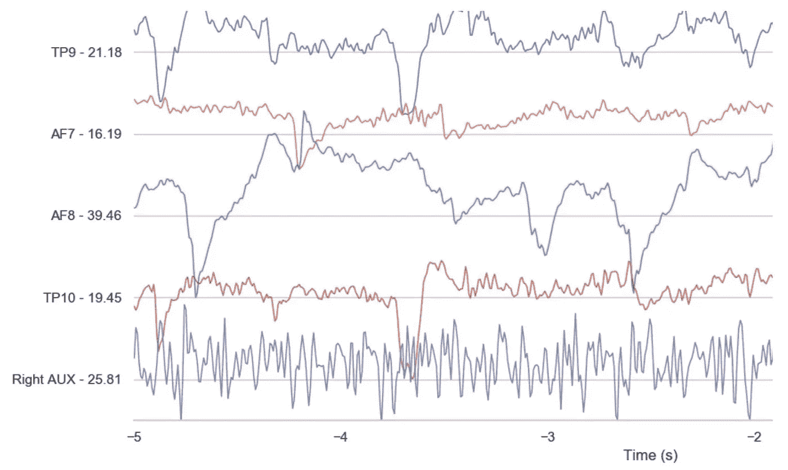
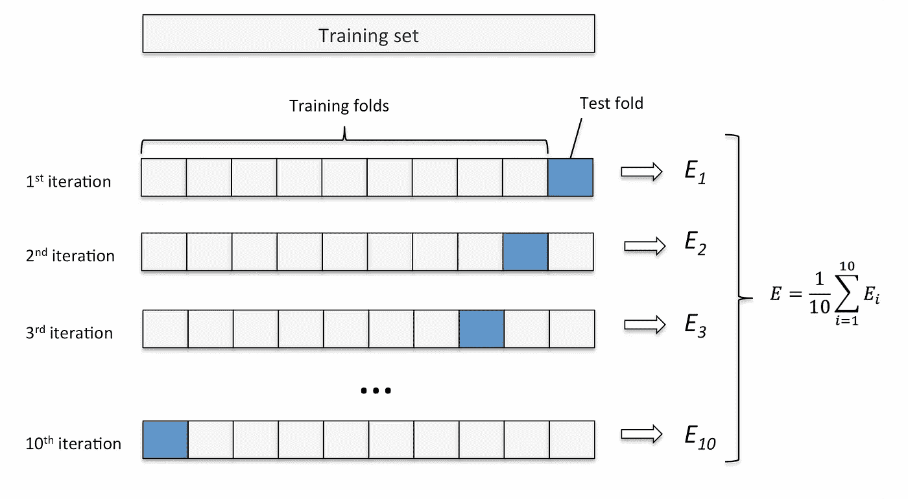
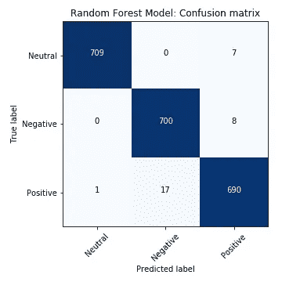

# 构建一个能读懂你思想的人工智能

> 原文：<https://towardsdatascience.com/building-an-ai-that-can-read-your-mind-8b22ad5a7f05?source=collection_archive---------17----------------------->

## 基于脑电数据的精神状态分类机器学习

(Source: [Shutterstock](http://www.shutterstock.com/pic.mhtml?id=102491747))

## 能读懂你思想的人工智能

这听起来可能像科幻电影中的反面未来的情节。然而，随着最近的进展，这项技术正在从科幻小说向纯粹的科学飞跃。

大脑活动的自主[非侵入式](https://en.wikipedia.org/wiki/Non-invasive_procedure)检测在多个领域都有潜在的用途，比如[人类机器人互动](https://en.wikipedia.org/wiki/Human%E2%80%93robot_interaction)和精神保健。它可以在用户和设备之间提供一个额外的交互维度，并使不依赖于语言交流的有形信息能够被导出。

这样的创新也意味着更好的[脑机接口](https://en.wikipedia.org/wiki/Brain%E2%80%93computer_interface)。这将为人机交流开辟全新的平台，包括帮助有身体或精神障碍的人。脑机接口可以让瘫痪的人移动机械臂，或者让脊髓损伤的人控制电动轮椅。

随着低成本[脑电图(EEG)](https://en.wikipedia.org/wiki/Electroencephalography) 设备的日益普及，脑波数据对于消费行业和研究来说变得越来越实惠，从而引入了在不需要专家在场的情况下进行自主分类的需求。

在本文中，我将介绍一个如何使用机器学习来分析大脑活动的示例。通过商业可用设备的脑电图记录，我展示了机器学习模型如何用于预测受试者的相应[精神状态](https://en.wikipedia.org/wiki/Mental_state)。

## 用于精神状态分类的机器学习

记录高质量的脑电图数据并不容易，除非你隶属于一个进行这种实验的实验室。然而，我最近看到了一篇有趣的文章，Jordan J. Bird、Luis J. Manso、Eduardo P. Ribiero、Anikó Ekárt 和 Diego R. Faria 撰写的文章“使用基于 EEG 的脑机接口进行精神状态分类的研究”。幸运的是，他们已经公开分享了他们研究中使用的[数据](https://www.kaggle.com/birdy654/eeg-brainwave-dataset-feeling-emotions)，供其他人进行实验。在我看来，特别有趣的是消费级设备的使用，你只需花几百美元就可以在亚马逊上订购。他们研究中的数据记录和处理方法将在下一节介绍。

## 实验细节

> 这项研究通过一个商用 [MUSE 脑电图头带](https://en.wikipedia.org/wiki/Muse_(headband))采用了四个干式颅外电极。这是一种可穿戴的大脑传感设备，通过 4 个[脑电图](https://en.wikipedia.org/wiki/Electroencephalography) (EEG)传感器测量大脑活动。
> 
> 为了唤起不同的心理状态，实验使用了下表中显示的精选电影片段，代表正负[价](https://en.wikipedia.org/wiki/Valence_(psychology))

Film Clips used as Stimuli for EEG Brainwave Data Collection. [Source](https://www.researchgate.net/publication/329403546_Mental_Emotional_Sentiment_Classification_with_an_EEG-based_Brain-machine_Interface)

> 从两个受试者(1 男 1 女，年龄 20-22 岁)的下表中找到的 6 个电影剪辑中的每一个记录 60 秒的数据，产生 12 分钟的大脑活动数据(每个情绪状态 6 分钟)。还收集了 6 分钟的中性脑波数据，导致从受试者记录的总共 36 分钟的 EEG 数据。(每天收集三分钟的数据，以减少静息情绪状态的干扰)。可变频率重采样至 150Hz，这产生了 324，000 个数据点的数据集。
> 
> **建议的脑电信号特征集**
> 
> 脑电信号的特征提取和分类是脑机接口(BCI)应用的核心问题。当涉及到 EEG 特征提取时，一个具有挑战性的问题是信号的复杂性，因为它是[非线性、](https://en.wikipedia.org/wiki/Nonlinear_system) [非平稳](https://en.wikipedia.org/wiki/Stationary_process)和随机的。信号仅在短时间间隔内被认为是稳定的，这就是为什么最佳实践是应用[短时加窗技术](https://en.wikipedia.org/wiki/Window_function)来满足这一要求。然而，它仍然被认为是一个在正常大脑条件下成立的假设。

Example of a live EEG stream of the four Muse sensors, Right AUX did not have a device and was discarded due to it simply being noise. This live feed graph has a Y-Axis of measured microvolts at t=0 on each sensor, and an X-axis detailing the time reading. [Source](http://jordanjamesbird.com/publications/A-Study-on-Mental-State-Classification-using-EEG-based-Brain-Machine-Interface.pdf)

> 这一小节描述了被认为能够充分区分不同类别的精神状态的一组特征。这些特征依赖于[统计技术](https://en.wikipedia.org/wiki/Statistics)、基于[快速傅立叶变换(FFT)](https://en.wikipedia.org/wiki/Fast_Fourier_transform) 、[香农熵](https://en.wikipedia.org/wiki/Entropy_(information_theory))、时间序列中的最大-最小特征等。根据给定时间窗口中信号的时间分布来计算被提议用于对精神状态进行分类的所有特征。该滑动窗口被定义为 1 秒的时间段，即所有特征都是在该时刻内计算的。关于特征提取的更详细介绍，请看[原文](http://jordanjamesbird.com/publications/A-Study-on-Mental-State-Classification-using-EEG-based-Brain-Machine-Interface.pdf)

## 机器学习算法

按照上述从原始 EEG 数据中提取特征的方法，我们得到了包含 2548 个特征的数据集。对于数据集的每一行，我们都有相应的目标变量:'*中性*'，'*负*'或'*正*'。我们的目标是训练一个机器学习模型，基于这组特征，成功地预测相应的精神状态。

在这个例子中，我从我的一个“定位”算法开始，即[随机森林分类器](https://en.wikipedia.org/wiki/Random_forest)，因为它设置简单，并且经常“开箱即用”地工作，不需要太多的[超参数调整。](https://en.wikipedia.org/wiki/Hyperparameter_optimization)

作为旁注:在原始时域数据上尝试一种[卷积神经网络](https://en.wikipedia.org/wiki/Convolutional_neural_network)方法(而不是包括信号各种频率特征的提取特征集)也是很有趣的。由于时域中应用的卷积通过[卷积定理](https://en.wikipedia.org/wiki/Convolution_theorem)与信号的频率特性密切相关，这可能是一种减少预处理和特征提取量的有前途的方法。

## 交叉验证

在应用 ML 时，您首先要了解的事情之一是[交叉验证](https://en.wikipedia.org/wiki/Cross-validation_(statistics))的重要性:在数据集的一部分上评估您的模型的性能，该数据集独立于您用来训练您的模型的数据集。一种方法是在训练您的模型时保持数据集的一部分，并使用例如以下方法来估计已训练模型的性能:

*   ***用 70%的标注数据训练你的模型***
*   ***对剩余 30%的训练好的模型进行评估***

K-fold 交叉验证在这方面有所改进，它允许您多次这样做，这样您就可以看到测试性能是否会根据您用来训练/测试的样本而变化。

Source: [http://karlrosaen.com/ml/learning-log/2016-06-20/](http://karlrosaen.com/ml/learning-log/2016-06-20/)

通过多次运行训练/测试比较，您将获得对模型性能的更好的估计，并检查模型在对标记数据的不同部分进行训练后的性能是否有很大不同，这本身可能表明您的模型不稳定或样本集太小。

在我的例子中，我在训练模型时进行了 10 重交叉验证，并计算了不同数据段的精确度。模型的最终性能可以通过下面所示的[混淆矩阵](https://en.wikipedia.org/wiki/Confusion_matrix)来可视化。

在[机器学习](https://en.wikipedia.org/wiki/Machine_learning)领域，特别是[统计分类](https://en.wikipedia.org/wiki/Statistical_classification)问题中，**混淆矩阵**，也称为误差矩阵，是一种特定的表格布局，允许算法性能的可视化。矩阵[的每一行](https://en.wikipedia.org/wiki/Matrix_(mathematics))代表实际类中的实例，而每一列代表预测类中的实例。该名称源于这样一个事实，即它很容易看出系统是否混淆了类别(即通常将一个类别错标为另一个类别)。

Confusion matrix: True vs. predicted emotional states

当在交叉验证期间评估 10 倍的模型预测时获得的最终结果是 0.987 (+/- 0.01)的相当令人印象深刻的准确度。这意味着，基于从原始 EEG 数据中提取的特征集，我们可以以接近 99%的准确度预测人的精神状态为“中性”、“消极”或“积极”。

## 结果摘要

虽然这个例子的结果在从脑电图记录中预测情绪状态时确实非常令人印象深刻，但在更高级的应用中还有一段路要走。此外，在实验记录期间，只有两个受试者的有限样本量提出了对新个体进行概括的问题。尽管如此，作为一个显示非常有希望的结果的例子，它代表了进一步调查的良好开端。

# 观点

那么，我们是否正在接近完全精神控制的反主题科幻未来，在那里，我们甚至放弃了自己思想的隐私？

人工智能读取人的大脑活动的能力引发了围绕隐私和安全的重大伦理问题，研究领导者需要认识到这一点。这项技术打开了一个新的恶意使用的潘多拉魔盒，例如，可以包括在操纵你的大脑思考敏感信息后从你的大脑中窃取这些信息。发表在《自然》*杂志上的一篇文章描述了一个迫在眉睫的未来,“将有可能解码人们的心理过程，并直接操纵他们意图、情感和决定背后的大脑机制。”*

*尽管如此，这一领域的突破是解码思考背后的大脑模式的重要一步。这样的创新也意味着更好的脑机接口，这将为人机交流开辟全新的平台。这可能让瘫痪的人[移动机器人手臂](https://futurism.com/videos/this-robotic-arm-can-be-controlled-with-your-mind/)，或者让脊髓损伤的人控制电动轮椅。如下面的视频所示，诸如“智能 prostetics”这样的应用可能代表着全世界残疾人向前迈出的一大步。*

*“Beyond bionics”, The Guardian*

*虽然我认为自己是一个“技术乐观主义者”，但我仍然认为有必要制定规则和条例，以确保这项技术能够帮助那些需要它的人，而不会带来灾难性的后果。*

*未来会怎样谁也说不准，但可以肯定的是，我们会找到更多有意或无意地与计算机互动的方式。人工智能驱动的界面的前景很好，但挑战也很大。*

***(本文原为** [**原文发表于此**](https://www.linkedin.com/pulse/building-ai-can-read-your-mind-vegard-flovik-phd/) **)***

*你觉得这篇文章有趣吗？如果是这样的话，你可能也会喜欢我的其他一些关于人工智能、机器学习、物理等主题的文章。，你可以在下面的链接和我的中型作者简介中找到:*

* [## Vegard Flovik —中等

### 2018 年夏天我发表第一篇关于“走向数据科学”的文章时，数字背后的统计数据…

medium.com](https://medium.com/@vflovik) 

而且，如果你想成为一个媒体会员，免费访问平台上的所有资料，你也可以使用下面我的推荐链接。(注意:如果您使用此链接注册，我也会收到一部分会员费)

 [## 通过我的推荐链接加入 Medium—Vegard flo vik

### 作为一个媒体会员，你的会员费的一部分会给你阅读的作家，你可以完全接触到每一个故事…

medium.com](https://medium.com/@vflovik/membership)*