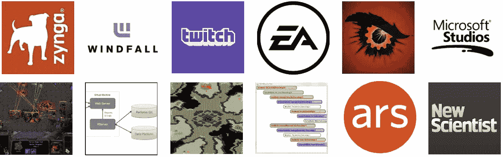
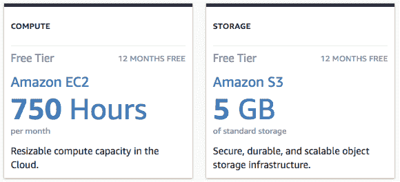
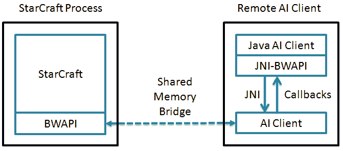
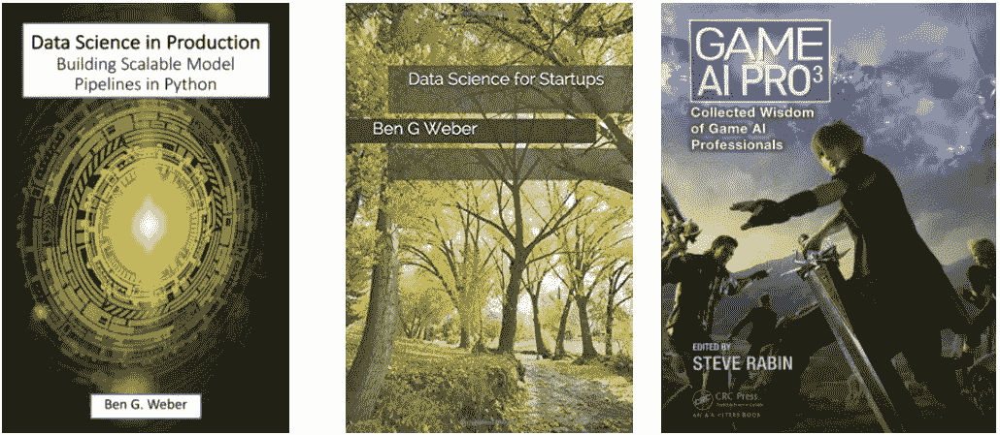

# 建立应用科学投资组合

> 原文：<https://towardsdatascience.com/building-an-applied-science-portfolio-9f25da61fb45?source=collection_archive---------28----------------------->

A visualization of my Portfolio

## 我在 2019 年西 ODSC 会议上的概述

我很高兴今年有机会第一次出席 [ODSC](https://odsc.com/training/portfolio/building-a-portfolio-for-applied-data-science-roles/) 大会！我是开源数据科学项目的忠实粉丝，一直致力于与[分享](https://databricks.com/session/automating-predictive-modeling-at-zynga-with-pyspark-and-pandas-udfs)我们在 Zynga 所做的一些工作。

本次会议的目标是强调如何建立一个出色的投资组合，向公司展示应用数据科学技能。应用科学家是一个在包括亚马逊、脸书和微软在内的科技公司中使用越来越多的职位名称。它处于数据科学和机器学习工程的交汇点，尽管行业对应用科学家的需求越来越多，但积累相关经验可能很困难。

在这次演讲中，我确定了在构建向公司展示的投资组合时需要关注的四个主题。我们的目标不仅是证明你可以做很棒的算法工作，而且还展示你可以扩大它的规模，并编写文档，使你的组织能够理解你的方法。以下是我在演讲中讨论的主要主题:

*   **生态系统:**亲身体验云计算。
*   **规模:**探索分布式计算。
*   集成:将事物粘合在一起。
*   **创作:**超越套牌！

一旦完成，我会更新这篇文章链接到幻灯片。

 [## 构建应用数据科学角色组合|开放数据科学会议

### 摘要:应用科学家是一个越来越多的科技公司使用的职位，包括亚马逊、脸书…

odsc.com](https://odsc.com/training/portfolio/building-a-portfolio-for-applied-data-science-roles/) 

我是 Zynga 的一名数据科学家，我的工作重点是构建[投资组合规模的](https://www.gamasutra.com/blogs/BenWeber/20190426/340293/PortfolioScale_Machine_Learning_atZynga.php)数据产品。这些都是应用科学项目，因为我们需要建立机器学习模型，这些模型可以扩展到数十亿条记录，在我们的游戏中跨不同的事件分类进行翻译，并改进手动功能工程工作。

我很高兴能在 ODSC 做一个关于建立应用科学投资组合的演讲，因为这是我之前为数据科学写的博客。我在 ODSC 演讲的目标是将这篇博文的建议扩展到一个更专业的角色。

 [## 给有抱负的数据科学家的六条建议

### 找到工作前积累经验

towardsdatascience.com](/six-recommendations-for-aspiring-data-scientists-93d12aeb9b9) 

在这次演讲中，我不想强调具体的技术，而是想概括应用科学家应该具备的能力。对于每个主题，我会先问一个可能会被问到的面试问题，然后展示我过去是如何回答这些问题的。

## 生态系统

> 你能告诉我你将一个模型投入生产的一次经历吗？

求职者在寻找新工作时面临的一个主要挑战是，他们没有雇主正在寻找的编码/建模/部署生态系统的经验，并且很难获得新平台的实践经验。

虽然许多公司确实锁定了对其数据平台的访问，但我建议有抱负的应用科学家积累云平台方面的经验，即使这意味着要用自己的时间来做。亚马逊网络服务(AWS)和谷歌云平台(GCP)都提供了构建体验的自由层解决方案，尝试不同的系统可以为如何构建生产级数据产品提供更广阔的视角。

Take advantage of the free cloud platform options.

目标是展示云环境的经验，并证明您可以通过利用这些平台来扩展方法。探索多个平台以了解平台之间的权衡也很有用。例如，我写了如何通过 AWS 和 GCP 使用无服务器函数来托管逻辑回归模型。

 [## 作为无服务器功能的模型

### “生产中的数据科学”第 3 章

towardsdatascience.com](/models-as-serverless-functions-7930a70193d4) 

## 规模

> 你处理过的最大的数据集是什么？

第二个主题是在整合项目组合时使用大规模数据集。理想情况下，您应该突破单实例计算的极限，探索分布式计算方法来解决大规模问题。在 [Kaggle](https://www.kaggle.com/) 、 [BigQuery](https://cloud.google.com/bigquery/public-data/) 和[开放数据](https://registry.opendata.aws/)上有各种开放数据集可供探索。

使用大数据集的目标是表明您的方法可以扩展到现实世界的工作负载，例如为数千万用户构建流失预测。探索解决大规模问题的不同方法很有用，比如使用 Spark 和 Cloud 数据流，甚至在 SQL 中执行复杂的逻辑。你的作品集的这一部分应该展示你可以采取分而治之的方法来解决问题，并且你可以有效地分配工作流。例如，我在博客中讨论了在 Spark 中并行化任务的不同方法。

 [## Spark 中的 3 种并行化方法

### 提升数据科学任务的速度

towardsdatascience.com](/3-methods-for-parallelization-in-spark-6a1a4333b473) 

## 集成

> 你能告诉我你不得不整合不同系统的时候吗？

在将原型代码翻译成产品代码时，经常会遇到挑战。例如，当使用 PySpark 和 MLlib 时，对训练 ML 模型有用的 scikit-learn 库可能在生产环境中不可用。投资组合应该展示当生产一个 ML 模型时，你是如何处理这些类型的挑战的，比如使用一个中间模型格式。展示您可以构建需要跨多个组件协调的端到端 ML 管道也很有用。

我在作品集中使用的一个例子是 [AutoModel](https://medium.com/zynga-engineering/portfolio-scale-machine-learning-at-zynga-bda8e29ee561) ，其中我使用了 Pandas UDFs 来扩展一个只支持 Pandas 数据框的库。Spark 数据帧和[功能工具](https://github.com/FeatureLabs/featuretools)不兼容，用这些组件构建 ML 管道需要一些新的集成工作。我写过的另一个例子是使用云数据流构建一个完全托管的分析平台。

 [## 简单且可扩展的分析管道

### 收集关于应用程序使用和用户行为的数据，如玩家在游戏中的进度，对于产品来说是无价的…

towardsdatascience.com](/a-simple-and-scalable-analytics-pipeline-53720b1dbd35) 

对于你的投资组合中的这个主题，包含分析和机器学习之外的项目可能是有用的。例如，我想展示的集成挑战之一是我如何让我的顾问的反应式编程语言使用 Java 本地接口(JNI)与 C++ API 一起工作。

Writing a StarCraft bot using Java.

## 程序编写

> 你喜欢如何宣传你的项目？

强有力的书面沟通对于推动组织内数据产品的采用至关重要。虽然幻灯片对于提出想法和提供产品概述很有用，但它们通常缺乏传达数据产品如何工作所需的深度和细节。在 Twitch，我养成了为记录分析和 ML 模型而编写长格式内容的习惯，并且从那以后一直应用这种方法。在 Zynga，我提倡撰写白皮书，为数据产品提供执行摘要、产品概述和实施细节。关于我的作品集，我目前正在写一本名为[生产中的数据科学](https://leanpub.com/ProductionDataScience)的书。

Long-form content I’ve written on data science.

虽然将代码和文档放在 GitHub 这样的平台上对于共享项目来说很好，但是积累编写关于项目的长格式内容的经验也是很好的。这可以采取白皮书或博客帖子的形式，创作这种类型的内容对于展示书面交流技能很有用。

## 结论

当构建应用科学角色的文件夹时，展示您过去如何扩展方法以在生产规模下工作是很棒的。我从前三个主题谈起:生态系统、规模和整合。我强调的最后一个主题是为你的项目写作和宣传。

如果您无法到达 ODSC，活动结束后应提供会谈视频。我还将在旧金山湾区的以下活动中发言。

 [## 2019 年 Zynga | AI 和大数据博览会上的自动化功能工程

### 开始时间:结束时间:白天:谈话:Zynga 是一家移动游戏出版商，其工作室遍布全球。我们有…

www.ai-expo.net](https://www.ai-expo.net/northamerica/talk/automated-engineering/)  [## AIFOW -影响:AI 2020

### 2020 年 2 月 4 日和 5 日——旧金山影响:AI 2020 即将在加州旧金山举行。来学习、探索和创造…

aifow.com](https://aifow.com/ai2020) 

[本·韦伯](https://www.linkedin.com/in/ben-weber-3b87482/)是 Zynga 的杰出数据科学家。我们是[招聘](https://www.zynga.com/job-listing-category/data-analytics-user-research/)！