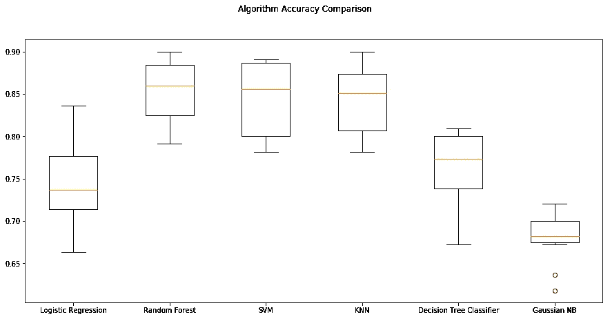
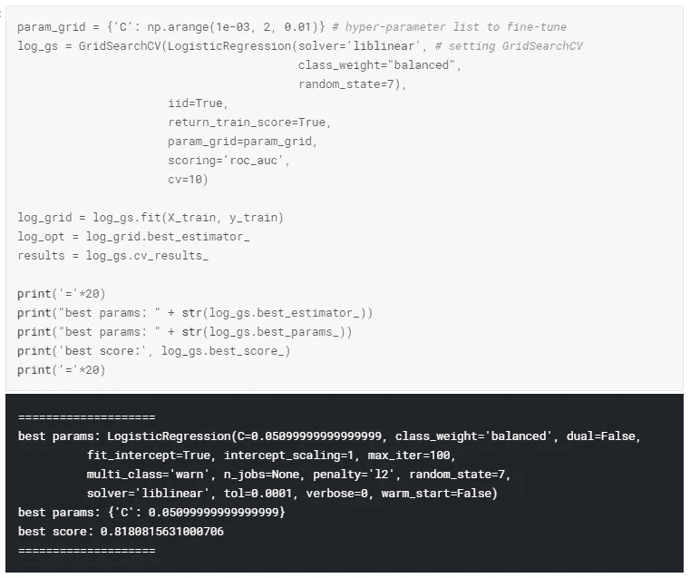

# 在 Python 中构建员工流失模型以制定战略性保留计划

> 原文：<https://towardsdatascience.com/building-an-employee-churn-model-in-python-to-develop-a-strategic-retention-plan-57d5bd882c2d?source=collection_archive---------3----------------------->

Everybody’s working hard but who is most likely to hand in their resignation letter? (Photo by [Alex Kotliarskyi](https://unsplash.com/photos/QBpZGqEMsKg?utm_source=unsplash&utm_medium=referral&utm_content=creditCopyText) on [Unsplash](https://unsplash.com/?utm_source=unsplash&utm_medium=referral&utm_content=creditCopyText))

# 内容

1.  [问题定义](#c099)
2.  [数据分析](#6270)
3.  [EDA 结束语](#030a)
4.  [预处理流水线](#dd40)
5.  [建立机器学习模型](#8341)
6.  [结束语](#13e2)

# 1.问题定义

员工流动(也称为“员工流失”)对公司来说是一个代价高昂的问题。替换一名员工的真实成本通常会非常高。

美国进步中心(Center for American Progress)的一项研究发现，公司通常会支付员工工资的五分之一来替换该员工，如果高管或收入最高的员工被替换，成本会显著增加。

换句话说，对于大多数雇主来说，替换员工的成本仍然很高。这是由于面试和寻找替代者所花费的时间，签约奖金，以及新员工在适应新角色的几个月中生产力的损失。

了解员工最有可能离开的原因和时间可以导致提高员工保留率的行动，并可能提前计划新的招聘。我将使用一种循序渐进的系统方法，使用一种可以用于各种 ML 问题的方法。这个项目将属于通常所说的**人力资源分析**或**人员分析**。

Focused and minding their own business but where’s the collaborative spirit? (Photo by [rawpixel](https://unsplash.com/photos/kJAxZT1zRwM?utm_source=unsplash&utm_medium=referral&utm_content=creditCopyText) on [Unsplash](https://unsplash.com/?utm_source=unsplash&utm_medium=referral&utm_content=creditCopyText))

在这项研究中，我们将试图解决以下陈述的问题:

*   一名在职员工离开公司的可能性有多大？
*   员工离开公司的关键指标是什么？
*   根据调查结果，可以采取哪些**策略**来提高员工保留率？

假设我们有前雇员的数据，这是一个**标准监督分类问题**其中标签是一个二元变量，0(在职雇员)，1(前雇员)。在这项研究中，我们的目标变量 Y 是员工离开公司的概率。

*注意:完整代码请参考本*[***GitHub repo***](https://github.com/hamzaben86/Employee-Churn-Predictive-Model)*和/或本*[****ka ggle 内核****](https://www.kaggle.com/hamzaben/employee-churn-model-w-strategic-retention-plan) **。**

* [## hamzaben 86/员工流失预测模型

### 使用监督机器学习预测员工流失-hamzaben 86/员工流失预测模型

github.com](https://github.com/hamzaben86/Employee-Churn-Predictive-Model)  [## 带有战略保留计划的员工流失模型| Kaggle

### 编辑描述

www.kaggle.com](https://www.kaggle.com/hamzaben/employee-churn-model-w-strategic-retention-plan) 

# 2.数据分析

在本案例研究中，HR 数据集来自于 [IBM HR Analytics 员工流失&绩效](https://www.ibm.com/communities/analytics/watson-analytics-blog/hr-employee-attrition/)，其中包含 1，470 名员工的数据以及关于这些员工的各种信息。我将使用这个数据集，通过了解员工流失的主要驱动因素来预测员工何时会辞职。

正如 [IBM 网站](https://www.ibm.com/communities/analytics/watson-analytics-blog/hr-employee-attrition/) : *上所述，“这是 IBM 数据科学家创造的虚构数据集。其主要目的是展示 IBM Watson 员工流失分析工具。*

Let’s crunch some employee data! (Photo by [rawpixel](https://unsplash.com/photos/xDE_p0EXpc8?utm_source=unsplash&utm_medium=referral&utm_content=creditCopyText) on [Unsplash](https://unsplash.com/search/photos/business?utm_source=unsplash&utm_medium=referral&utm_content=creditCopyText))

## 2.1 数据描述和探索性可视化

首先，我们导入数据集并为该分析制作源文件的副本。数据集包含 1，470 行和 35 列。

数据集包含几个数字列和分类列，提供关于雇员个人和雇佣详细信息的各种信息。

让我们按照列的类型(例如 int64、float64、object)来细分这些列:

## 2.2 数据来源

提供的数据没有缺失值。在人力资源分析中，员工数据不太可能出现大比例的缺失值，因为人力资源部门通常会将所有个人和雇佣数据存档。

但是，保存的文档数据类型(即，是否是基于纸张、Excel 电子表格、数据库等)对人力资源数据的准确性和易用性有很大影响。

## 2.3 数字特征概述

基于数字特征的信息和直方图，可以进行一些观察:

*   几个数字特征是重尾的；事实上，有几个分布是右偏的(例如，MonthlyIncome DistanceFromHome，YearsAtCompany)。在将模型拟合到数据之前，可能需要数据转换方法来接近正态分布。
*   年龄分布是一种略微向右倾斜的正态分布，大多数工作人员年龄在 25 至 45 岁之间。
*   EmployeeCount 和 StandardHours 是所有雇员的常数值。它们很可能是多余的功能。
*   考虑到特征的准均匀分布，员工编号可能是员工的唯一标识符。

source code: df_HR.hist() — isn’t Python a beautiful thing?

## 2.4 按目标属性的特征分布

在本节中，将进行更详细的探索性数据分析。完整代码请参考这个 [**GitHub repo**](https://github.com/hamzaben86/Employee-Churn-Predictive-Model) 和/或 [**Kaggle 内核**](https://www.kaggle.com/hamzaben/employee-churn-model-w-strategic-retention-plan) 。

**2.4.1 年龄**

在职和离职雇员的年龄分布仅相差一岁；前员工的平均年龄为 33.6 岁，现任员工的平均年龄为 37.6 岁。

让我们创建一个由目标值着色的核密度估计(KDE)图。核密度估计(KDE)是一种估计随机变量概率密度函数的非参数方法。

**2.4.2 性别**

性别分布显示，该数据集中男性前雇员的相对比例高于女性前雇员，数据集中前雇员的标准化性别分布为男性 17.0%，女性 14.8%。

**2.4.3 婚姻状况**

该数据集包含三种婚姻状况:已婚(673 名员工)、单身(470 名员工)、离婚(327 名员工)。单身员工的离职比例最大，为 25%。

**2.4.4 角色和工作条件**

对商务旅行频率和流失状态之间的关系的初步观察表明，对于“经常”旅行的员工来说，存在最大的归一化离职比例。没有披露与商务旅行状态相关的旅行指标(即多少小时的旅行被视为“频繁”)。

数据集中列出了几种工作角色:销售主管、研究科学家、实验室技术员、制造总监、医疗代表、经理、销售代表、研究总监、人力资源。

**在公司工作 2.4.5 年，自上次晋升以来**

在职员工在公司的平均工作年限为 7.37 年，离职员工为 5.13 年。

**2.4.6 年，现任经理**

在职员工在现任经理手下工作的平均年限为 4.37 年，离职员工为 2.85 年。

2.4.7 加班

一些员工有加班承诺。数据清楚地表明，有相当大一部分加班的员工已经离开了公司。

**2.4.8 月收入**

员工月收入从 1009 美元到 19999 美元不等。

2.4.9 目标变量:减员

特征“**损耗”**就是这个机器学习问题的所在。我们试图通过使用与员工个人和职业历史相关的其他相关特征来预测特征“流失”的价值。

在提供的数据集中，在职员工的比例为 83.9%，离职员工的比例为 16.1%。因此，这是一个**不平衡的阶级**问题。

当每个类的实例数量大致相等时，机器学习算法通常工作得最好。在实现我们的机器学习算法之前，我们必须解决这个目标特征的不平衡。

## 2.5 相关性

让我们来看看一些最重要的相关性。值得记住的是，相关系数只测量线性相关性。

如上所示，“月工资”、“工作的公司数量”和“离家的距离”与自然减员正相关；而“总工作年数”、“工作级别”和“在当前职位的年数”与自然减员呈负相关。

# 3 EDA 结束语

*   数据集没有任何**缺失或错误的数据值**，所有特征都是正确的数据类型。
*   与目标特征最强的**正相关**是:绩效等级、月工资率、工作过的公司数量、离家的距离。
*   与目标特征最强的**负相关**是:总工作年限、工作级别、在当前岗位的年限、月收入。
*   数据集**不平衡**，大部分观察描述的是当前在职员工。
*   与已婚和离异员工相比，单身员工的离职比例最大。
*   大约 10%的离职者在他们在公司的两周年纪念日离开。
*   与同事相比，住得离工作地点较远的人离职的比例更高。
*   经常出差的人比他们的同行显示出更高的离职比例。
*   不得不加班的人比他们的同事有更高的离职率。
*   与同行相比，之前已经在几家公司工作过的员工(已经在工作场所之间“跳槽”)的离职率更高。

# 4.预处理流水线

在本节中，我们进行数据预处理步骤，为机器学习算法的实现准备数据集。完整代码请参考这个 [**GitHub repo**](https://github.com/hamzaben86/Employee-Churn-Predictive-Model) 和/或 [**Kaggle 内核**](https://www.kaggle.com/hamzaben/employee-churn-model-w-strategic-retention-plan) 。

## 4.1 编码

机器学习算法通常只能将数值作为它们的预测变量。因此**标签编码**变得必要，因为它们用数值编码分类标签。为了避免为具有大量唯一值的分类特征引入特征重要性，我们将同时使用**标签编码**和**一键编码**，如下所示。

## 4.2 特征缩放

使用**最小最大缩放器**的特征缩放实质上缩小了范围，使范围现在介于 0 和 n 之间。当输入数值变量落在类似的范围内时，机器学习算法表现更好。在这种情况下，我们在 0 和 5 之间缩放。

## 4.3 将数据分成训练集和测试集

在实现或应用任何机器学习算法之前，我们必须将训练和测试数据帧与我们的主数据集分离。

# 5.构建机器学习模型

## 5.1 基线算法

在我们进入更复杂的解决方案之前，让我们先使用一系列**基线**算法(使用开箱即用的超参数)。本节考虑的算法有:**逻辑回归**，**随机森林**， **SVM** ， **KNN** ，**决策树分类器**，**高斯 NB。**

让我们依次评估每个模型，并提供**准确度**和**标准差分数**。完整代码请参考本 [**GitHub repo**](https://github.com/hamzaben86/Employee-Churn-Predictive-Model) 和/或 [**Kaggle 内核**](https://www.kaggle.com/hamzaben/employee-churn-model-w-strategic-retention-plan) 。

**分类准确度**是正确预测的数量占所有预测的比例。这是分类问题最常见的评估标准。

然而，**经常被误用**，因为它只有在每类中有**相等数量的观测值，并且所有预测和预测误差同等重要时才真正适用。在这个项目中情况并非如此，所以不同的评分标准可能更合适。**

**ROC 曲线下面积**(简称 AUC)是二元分类问题的性能度量。AUC 代表**模型区分正负类别**的能力，更适合本项目。面积为 1.0 表示模型能够完美地做出所有预测。面积为 0.5 表示模型与随机模型一样好。

基于我们的 ROC AUC 比较分析，**逻辑回归**和**随机森林**显示最高的平均 AUC 分数。我们将这两种算法列入候选名单，以供进一步分析。关于这两种算法的更多细节见下文。

## 5.2 逻辑回归

GridSearchCV 允许通过搜索估计器的指定参数值来微调超参数。如下所示，GridSearchCV 的结果使用 ROC_AUC 作为评分标准，为我们提供了微调的超参数。

## 5.3 混淆矩阵

混淆矩阵为我们提供了更详细的准确度分数表示，以及我们的标签正在发生的事情——我们确切地知道哪些标签/如何被正确和错误地预测。Logistic 回归分类器在测试集上的准确率为 75.54。

## 5.4 标签概率

可以将概率与预测目标相关联，而不是获得二进制估计目标特征(0 或 1)。输出提供了第一个索引，该索引涉及数据属于**类别 0** (员工未离职)的概率，第二个索引涉及数据属于**类别 1** (员工离职)的概率。预测特定标签的概率为我们提供了一个衡量员工离开公司的可能性的方法。

## 5.5 随机森林分类器

让我们仔细看看如何使用随机森林算法。我将通过对 AUC 分数进行交叉验证来微调随机森林算法的超参数。

随机森林让我们知道在预测目标特性时哪些特性是最重要的(本项目中的“损耗”)。下面，我们按照重要性来划分特征。

Random Forest 帮助我们确定了 10 个最重要的指标(排列在下表中):(1)月收入，(2)加班，(3)年龄，(4)月工资，(5)离家的距离，(6)日工资，(7)总工作年数，(8)在公司的年数，(9)小时工资，(10)与经理的年数。

随机森林回归分类器在测试集上的准确率为 86.14。下面显示了相应的混淆矩阵。

预测特定标签的概率为我们提供了一个衡量员工离开公司的可能性的方法。使用 RandomForestClassifier 预测概率时的 AUC 为 0.818。

## 5.6 ROC 图

AUC-ROC 曲线是在各种阈值设置下对分类问题的性能测量。ROC 是概率曲线，AUC 代表可分性的程度或度量。它告诉我们模型在多大程度上能够区分不同的类。绿线代表纯随机分类器的 ROC 曲线；一个好的分类器尽可能远离那条线(朝向左上角)。

如上所示，与随机森林分类器相比，微调的逻辑回归模型显示了更高的 AUC 分数。

# 6.结束语

## 6.1 风险评分

随着公司生成更多关于其员工的数据(关于新加入者和最近离职者)，该算法可以使用额外的数据进行重新训练，并在理论上生成更准确的预测，以根据算法分配给每个特征变量(即员工)的概率标签来识别**高风险离职员工**。

员工可以根据预测的标签分配一个“**风险分数**，以便:

*   **标签为< 0.6 的员工的低风险**
*   **中等风险**适用于评分在 0.6 和 0.8 之间的员工
*   **高风险**标签为> 0.8 的员工

Good work on reading the analysis — but what now? How does this help decision-makers? (Photo by [rawpixel](https://unsplash.com/photos/a2VqhP3d4Vg?utm_source=unsplash&utm_medium=referral&utm_content=creditCopyText) on [Unsplash](https://unsplash.com/?utm_source=unsplash&utm_medium=referral&utm_content=creditCopyText))

## 6.2 指标和战略保留计划

人们离开的更强指标包括:

*   **月收入**:工资高的人不太可能离开公司。因此，应努力收集当前当地市场的行业基准信息，以确定公司是否提供有竞争力的工资。
*   **久而久之**:加班的人更容易离开公司。因此，必须努力在前期适当确定项目范围，提供足够的支持和人力，以减少加班。
*   **年龄**:相对年轻的 25-35 岁年龄段的员工更有可能离职。因此，应该努力清楚地阐明公司的长期愿景以及适合该愿景的年轻员工，并以明确的晋升途径等形式提供激励。
*   离家远:住得离家远的员工更有可能离开公司。因此，应努力为离开同一地区的员工群提供公司交通或交通补贴形式的支持。基于员工家庭所在地的初步筛选可能不被推荐，因为只要员工每天按时上班，这将被视为一种歧视。
*   总工作年限:越有经验的员工越不容易离开。拥有 5-8 年工作经验的员工应被视为潜在离职风险较高。
*   **YearsAtCompany** :忠诚的公司不太可能离开。满两周年的员工应被认定为具有较高离职风险的潜在员工。
*   **YearsWithCurrManager** :大量离职者在现任经理离职 6 个月后离开。通过使用每个员工的直线经理详细信息，可以确定哪个经理在过去一年中经历了最多数量的员工辞职。

这里可以使用几个指标来确定是否应该与**直线经理**一起采取行动:

*   直线经理担任特定职位的年数:这可能表明员工可能需要管理培训或在组织中被指派一名导师(最好是高管)
*   辞职员工的模式:这可能表明离职员工的重复模式，在这种情况下可以采取相应的措施。

## **6.3 最终想法**

可以为每个**风险分值**组制定战略保留计划。除了上面列出的每个特征的建议步骤之外，人力资源代表和员工之间的面对面会议可以针对**中风险员工**和**高风险员工**展开，以讨论工作条件。此外，与这些员工的直线经理会面可以讨论团队内部的工作环境，以及是否可以采取措施改善工作环境。* 

*我希望你能像我写这篇文章时一样喜欢它。
再次声明，完整代码请参考本**[**GitHub repo**](https://github.com/hamzaben86/Employee-Churn-Predictive-Model)和/或本 [**Kaggle 内核**](https://www.kaggle.com/hamzaben/employee-churn-model-w-strategic-retention-plan) 。***

*** [## hamzaben 86/员工流失预测模型

### 使用监督机器学习预测员工流失-hamzaben 86/员工流失预测模型

github.com](https://github.com/hamzaben86/Employee-Churn-Predictive-Model)  [## 带有战略保留计划的员工流失模型| Kaggle

### 编辑描述

www.kaggle.com](https://www.kaggle.com/hamzaben/employee-churn-model-w-strategic-retention-plan)***