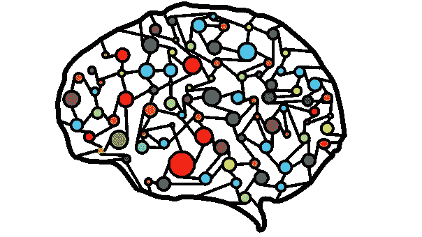
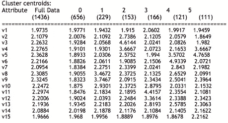
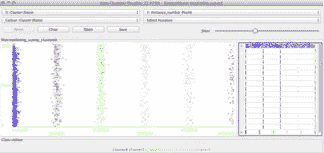
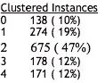
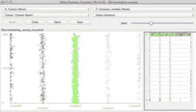

# 构建复合算法的实验框架

> 原文：<https://towardsdatascience.com/building-an-experimentation-framework-for-composite-algorithms-19d0084cb24a?source=collection_archive---------13----------------------->

## 在现有 ML 库的基础上快速开发一个框架来改变模型超参数和混合多个模型以找到最佳执行算法通常非常有用。

Weka 提供了一套全面的库来快速试验不同的模型。在这里，我将演示如何轻松地使用 Weka Api 来构建一个实验平台，以比较不同 ML 算法的性能。



可以先编写一个包装类，比如 KNNTest，使用 maven 构建，创建 CLI 比如 MLExpFwk，然后如下调用它。

```
Weka maven dependency: {groupId: nz.ac.waikato.cms.weka,artifactId: weka-stable, version: 3.6.8}
Java version :  1.7.0_71
Weka Standalone: weka-3-6-12, Mac compatible Weka: weka-3-6-12-oracle-jvm.dmgEntry Point: MLExpFwk
Executable: MLExpFwk-1.0.0.jar 
Run the tool: java -jar MLExpFwk-1.0.0.jar CreditRating-train.arff CreditRating-test.arff* Output of  the program :
o Menu options 
Welcome to ML Programs Suite !

Which Algorithm do you want to run ? 

Type 0 to exit.
Type 1 for Decision Tree - J48
Type 2 for KNN
Type 3 for SVM
Type 4 for MLP
So on ...We can run any algo against any training and test datasets to compare and contrast the accuracy.
```

**实验监督算法**

> 使用不同的超参数生成不同的模型组合:

```
//**DTree Model properties**
tree.setMinNumObj(minNumObj); 
tree.setReducedErrorPruning(true); 
tree.setNumFolds(M); 
tree.setSubtreeRaising(true); 
tree.setUnpruned(false);//**KNN Model properties** IBk ibk = new IBk(); 
ibk.setKNN(3); 
ibk.setCrossValidate(true); 
ibk.setMeanSquared(true);//**SVM Model properties**
SMO smo = new SMO();   
NormalizedPolyKernel normalizedPolyKernel = new NormalizedPolyKernel();   
smo.setKernel(normalizedPolyKernel);   
smo.setC(2);//**ANN Attribute Variations** MultilayerPerceptron mlp = new MultilayerPerceptron();   mlp.setLearningRate(0.1);**//Create different Run options for different models to be tested** case 1: “Type 1 — to run AdaBoosting on J4.8 tree“); 
        testBoostingOnTree(); break; 
case 2: “Type 2 — to run AdaBoosting on SVM”)
        testBoostingOnSVM(); break; 
case 3: ...... 
default: printmenu(); break;
```

例如[我们可以尝试提升 SVM 模式和 J48 树](https://github.com/kaniska/machine_learning_library/blob/master/supervised-learning/algo-analysis-source/src/main/java/com/mscourse/boosting/BoostingTest.java)

```
AdaBoostM1 classifier = new AdaBoostM1(); 
SMO smo = new SMO(); boosting.setClassifier(smo); classifier.buildClassifier(MLExpFwk.TRAINING_DATA);Evaluation eval = new Evaluation(MLProgramSuite.TRAINING_DATA); eval.evaluateModel(classifier, MLExpFwk.TRAINING_DATA);System.out.println(eval.toSummaryString(); 
System.out.println(“ — — Now apply the Classifier to the test data — — “); 
//runAlgoOnTestData
Evaluation eval = new Evaluation(MLExpFwk.TRAINING_DATA);    eval.evaluateModel(classifier, MLExpFwk.TEST_DATA);     System.out.println(eval.toSummaryString("\nResults\n\n", false));
```

例如，让我们在电离层数据集(https://archive.ics.uci.edu/ml/datasets/Ionosphere 上运行不同的监督算法组合！！)

*   *AdaBoostM1 / MultiBoostAB +/修剪过的树*
*   *SVM+/adaboosting m1+/多内核+/归一化多内核)*
*   *IBK +/ k=3 +/交叉验证)*
*   *MLP(具有非线性 sigmoid 传递函数)等等。*

然后我们有了有趣的观察:

*   **MLP** 达到 99%的准确率，但耗时 1.45 秒。它对大量异质特征非常有用。由于函数逼近的全局性质，MLP 学习具有复杂局部结构的非线性函数较慢。在梯度下降过程中，参数在学习过程中陷入的平稳状态需要很长时间才能消除。
*   **使用归一化多核的 SVM**在 0.10 秒内达到 97.14%的准确率。SMO 算法对过度拟合具有很强的弹性。看起来归一化的 PolyKernel 在测试数据集上比 PolyKernel 表现得更好，因为它归一化了特征向量中的一些稀疏性，并找到了更好的模型。
*   **J48 的 numFolds = 5 和 reducedErrorPruning** 提供了更高的精度，比如 91.22%。当应用 adaboostm 1/multiboosttab 升压时，精度进一步提高到 97.8%。
*   **k = 3 且交叉验证的 KNN**提供了非常好的结果。但是由于未适当处理的不平衡数据分布问题，显示出一些不一致性。

**实验无监督算法**

现在，让我们对数据集应用无监督算法，通过创建像 ICA、NN-ICA、Kmeans-ICA、NN-KMeans、EM-ICA 这样的包装器类来理解聚类技术和特征选择是如何工作的

让我们用下面的数据集来检查有趣的事实:

用户接受采访，以提供对大型产品品牌的购买行为的意见。

> 偏好 _ 电子邮件、质量 _ 产品 _ 定价 _ 高、咨询 _ 多个 _ 网站 _ 购买前、偏好 _ 电视 _ 广告、偏好 _ 移动 _ 广告、观看 _ 广告 _ 制作 _ 购买、偏好 _ 在线 _ 网络、女性 _ 主要 _ 决策者、偏好 _ 儿童 _ 友好 _ 广告、偏好 _ 大 _ 品牌、频繁 _ 访问 _ 商场、偏好 _ 在线 _ 优惠、偏好 _ 分期付款、偏好 _ 餐厅 _ 优惠券 _ 购物、偏好 _ 电影 _ 优惠券 _ 购物

用户反馈数据被捕获为数值:

```
1,3,1,2,3,1,2,2,3,2,2,1,1,1,1 
(1 = Strongly Agree, 2 = Agree, 3 = Neither Agree nor Disagree, 4 = Disagree, 5= Strongly Disagree)
```

> 让我们首先尝试应用 KMeans 算法，该算法提供基于迭代距离的不相交聚类集。

```
DataSet ds = CSVFilereader.read(“/resources/marketing_survey.csv”, skipHeader); 
KMeansClusterer km = new KMeansClusterer(6); km.estimate(ds);
```

Weka 输出很容易理解。显然，集群 0 是所有特性中最好的一个。我们还可以进行其他有趣的观察，比如第 5 类客户对“prefer_mobile_ads”的看法比其他类客户更强烈。



> 接下来让我们运行**期望最大化算法**,该算法利用先验概率找到聚类。由于需要计算任何实例的聚类成员概率，因此查找聚类需要相当长的时间。



We observe that Cluster 2 offers best market segment.



```
EMClusterer em = new EMClusterer(); em.estimate(ds);
```

现在让我们把重点放在**降维算法上。**

> **主成分分析:**通过选择足够的特征向量来解释原始数据 95%的方差，从而实现降维。

```
PrincipalComponentAnalysis filter =new PrincipalComponentAnalysis(dataset); System.out.println(set.getDescription()); System.out.println(filter.getProjection()); Matrix reverse = filter2.getProjection().transpose(); 
for (int i = 0; i < set.size(); i++) 
{ Instance instance = set.get(i);   
instance.setData(reverse.times(instance.getData()).plus(filter.getMean())); 
}
```

一旦**协方差矩阵**被打印出来，我们就可以找到互特征相关性。PCA 回答了以下问题——这 M 个参数中的哪一个解释了数据集中包含的大量变化？

然后我们选择**排名前 5 的属性**。

```
**0.864** 1 0.443**v5**+0.377**v4**+0.354**v11**+0.327**v9**+0.298v6…
**0.7509** 2 -0.461**v4**–0.422**v5**+0.382**v9**+0.377**v11**+0.339v10…
**0.6513** 3 0.519v8–0.505v12–0.415v11+0.388v9–0.294v13…
**0.5564** 4 0.529v6–0.473v3+0.361v5–0.327v10–0.318v4…
**0.4744** 5 -0.446v2–0.373v8–0.362v7–0.36v3+0.326v10…
```

> 类似地，我们可以运行**独立分量分析:**它在新生成的特征集中生成足够的特征向量，以提供关于具有较高变化的特征的想法，这些变化可以被选择用于进一步的分类。

```
System.out.println("Before ICA");        System.out.println(set.getDescription());        System.out.println(set);        
IndependentComponentAnalysis filter = new IndependentComponentAnalysis(set, 8);        
filter.filter(set);
System.out.println("After ICA");
System.out.println(set);
```

正如我们前面提到的，我们的目标是混合和匹配算法。

**接下来，我们使用 PCA 运行 KMeans 聚类**

```
PrincipalComponentAnalysis filter = new PrincipalComponentAnalysis(dataset, 15); filter.filter(dataset); System.out.println(dataset.getDescription()); 
KMeansClusterer km = new KMeansClusterer(4); km.estimate(dataset);
```

然后我们用 ICA 运行 **KMeans 聚类**

```
IndependentComponentAnalysis filter = new IndependentComponentAnalysis(set); filter.filter(set); System.out.println(set.getDescription()); 
KMeansClusterer km = new KMeansClusterer(3); km.estimate(set);java -cp unsupervised_algo.jar:lib/ABAGAIL.jar com.ml.unsupervised.tests.KMeansWithIndependentComponentAnalysisTest
```

我们还可以应用其他 Weka 降维技术，如**不重要成分分析**和**随机投影**

> **随机投影**通过使用具有单位长度列的随机矩阵将数据投影到更低维度的子空间来降低数据的维度(即，它将减少数据中的属性数量，同时保留其大部分变化，如 PCA，但计算成本低得多)。

在减少维度之前，它首先应用 NominalToBinary 过滤器将所有属性转换为数值。

理想情况下，我们应该将代码封装到合适的复合模型构建器包装器中，并测试所有不同的变体。为了更有趣，我们可以用 PCA 运行**神经网络**

```
**//Feature Names**
obs#, chk_acct,duration,history,new_car, used_car, furniture,radio_tv, education,retarining,crd_amount,sav_accnt,employment,install_rate,male_div, male_single, coapplication,guarantor, present_redisence, real_estate,prop_unknown,age,other_install,rent,own_res,num_credits,job,num_dependents,telephone,foreign,response**//Feature Values** 2,1,48,2,0,0,0,1,0,0,5951,0,2,2,0,0,0,0,0,2,1,0,22,0,0,1,1,2,1,0,0,0
5,0,24,3,1,0,0,0,0,0,4870,0,2,3,0,1,0,0,0,4,0,1,53,0,0,0,2,2,2,0,0,0PrincipalComponentAnalysis filter = new PrincipalComponentAnalysis(set, 15); filter.filter(set); network = factory.createClassificationNetwork( new int[] {inputLayer, hiddenLayer, outputLayer}); ConvergenceTrainer trainer = new ConvergenceTrainer( new BatchBackPropagationTrainer(set, network, new SumOfSquaresError(), new RPROPUpdateRule())); trainer.train(); System.out.println(“Convergence in “+trainer.getIterations()+”iterations”);Instance[] patterns = set.getInstances(); 
int true_positives_num = 0; int actual_class = 0; int predicted_class = 0; for (int i = 0; i < patterns.length; i++) { network.setInputValues(patterns[i].getData()); network.run(); actual_class = Math.round(Float.parseFloat(patterns[i].getLabel().toString())); predicted_class = Math.round(Float.parseFloat(network.getOutputValues().toString())); if(actual_class == predicted_class) { true_positives_num++; } }double true_positives = ((true_positives_num*100/(patterns.length)));
```

因此，本质上，我们可以非常容易地混合所有不同的技术，并构建一套非常强大的复合模型，如 **Kmeans-ICA** 、 **KMeans-PCA** 、 **NN-LDA** 、 **NN-ICA** 、 **NN-KMeans** 、 **NN-EMC** 等。这里没有特定的正确或错误的模型，这都是通过使用 Weka 或任何其他库(如 SciKit)进行实验的结果。

现在让我们换个话题，看看**随机搜索**并使用 ABAGAIL 和 Weka 库构建一个框架。

> 有时，MLP 无法收敛到复杂数据集的解决方案，这是由于:(1)无偏估计量，但可能具有高方差(由于过拟合)/ (2)刚性模型相反，导致小方差但高偏差/ (3)需要更长的时间，并且还存在陷入局部最优的风险。

**因此，让我们在反向传播网络中应用随机优化而不是梯度下降**

使用 [ABAGAIL.jar](https://github.com/pushkar/ABAGAIL) 的本地随机搜索算法(在类路径中)。

这里，我们对训练样本应用 3 种类型的优化算法。我们可以结合多种技术，也可以用不同的超参数以孤立的方式进行测试。

```
oa[0] = new RandomizedHillClimbing(nnop[0]);
oa[1] = new SimulatedAnnealing(1E11, .1, nnop[1]); 
oa[2] = new StandardGeneticAlgorithm(100, 50, 10, nnop[2]);
```

> **随机爬山**是“一个不断走向增值的循环”。它可以在最佳后继者的集合中随机选择，以避免局部最小值。
> 
> **模拟退火**是随机局部搜索方法的一个例子，以基于目标函数变化大小的概率，在开始时结合横向和下坡移动。这个想法是在早期对整个空间进行足够的探索，以便最终的解决方案对初始状态相对不敏感。这应该会降低在局部最大值、平台或山脊被捕获的机会。"
> 
> **遗传算法**是一种基于遗传学和自然选择原理的优化和搜索技术。GA 允许由许多个体组成的群体在指定的选择规则下进化到最大化“适应度”(即最小化成本函数)的状态。

```
train (OptimizationAlgorithm oa, BackPropagationNetwork network, String oaName) { // 
     for(int i = 0; i < trainingIterations; i++) { 
         oa.train(); double error = 0; 
         for(int j = 0; j < instances.length; j++) { 
         if(instances[j] == null || instances[j].getData() == 
                  null) continue;  
            network.setInputValues(instances[j].getData());  
            network.run(); Instance output = 
                 instances[j].getLabel(), example = new   
                Instance(network.getOutputValues()); 
            example.setLabel(new    
Instance(Double.parseDouble(network.getOutputValues().toString()))); error += measure.value(output, example); 
} } }
```

一旦我们运行算法的组合，我们观察到一些非常有趣的 w.r.t .当前数据集。

*   遗传算法提供了一个最佳变量列表，而不仅仅是一个单一的解决方案。它的随机探索(通过交叉)技术可以找到其他局部搜索算法找不到的解决方案。随机突变避免了陷入局部最小值的问题。
*   遗传算法同时从大范围的成本面中搜索，处理大量的变量。所以它非常适合并行计算，
*   GA 优化了具有极其复杂的成本表面的变量(它们可以跳出局部最小值)
*   当样本量为 200，配对节点数为 100，变异节点数为 10 时，遗传算法需要更长的时间才能达到高精度
*   如果我们将种群规模设置为 100，交配节点设置为 50，变异节点设置为 20，那么 GA 会工作得更快，并达到同样高的精度。
*   在某些情况下，寻找性能良好的凸函数的解的基于微积分的导数可以优于遗传算法，因为遗传算法可能仍然需要花费周期来分析初始种群的成本，因为它需要为实值数据提供更多位。
*   爬山搜索的主要好处是它只需要有限的内存。
*   我们需要选择一个局部变化来提高目标函数的当前值。
*   爬山搜索的主要好处是它只需要有限的内存。这里，我们需要选择一个局部变化，它应该提高目标函数的当前值。像连续空间中的梯度下降算法一样，它接近局部极小值，但是不使用梯度，爬山使用随机局部搜索。HA 不同于梯度下降算法，梯度下降算法根据山的梯度在每次迭代中调整随机变量 X 中的所有值。
*   一旦迭代次数达到 100，RHC 就可以正确地分类 95%的实例，因为它可以更好地探索更多的邻居，并越过山脊和高原。
*   模拟退火是随机局部搜索的一个例子。如果温度降低 0.1(慢得多)，迭代次数为 10，**模拟退火的性能提高很多**。性能提高的主要原因是“探索非最佳路径的移动频率和这种非最佳空间(平台)的大小随着我们降低温度而减小”。
*   因此，虽然 GA 在节点变异增加时表现更好，但 RHC 需要大量的迭代，而 SA 以较少的迭代次数和较慢的温度变化收敛。

到目前为止，我们已经使用 Weka 和 ABAGAIL 开发了一个基于 Java 的框架，用于监督、非监督和随机搜索算法的实验。在下一篇博客中，我们将讨论强化学习算法的实验方法。