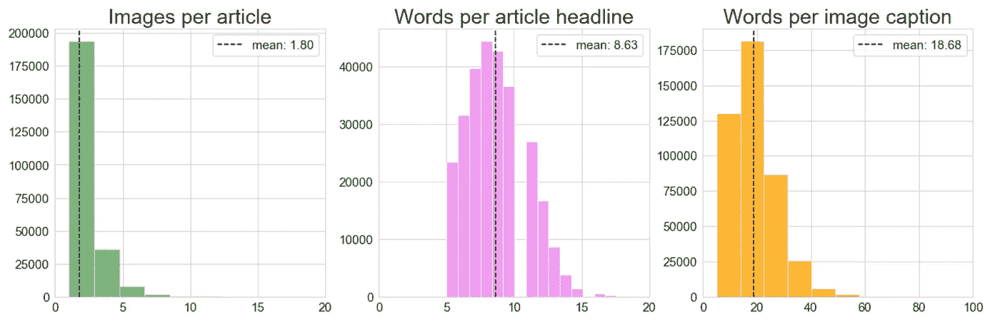
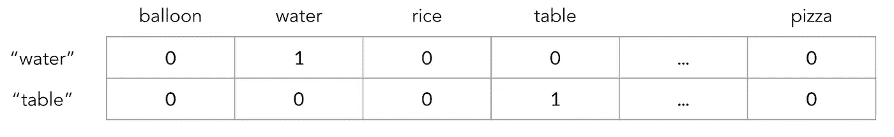
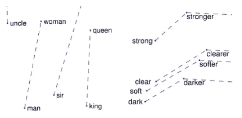
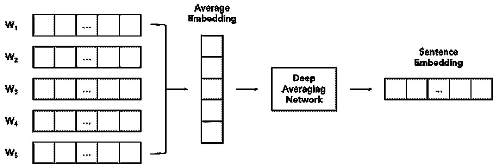
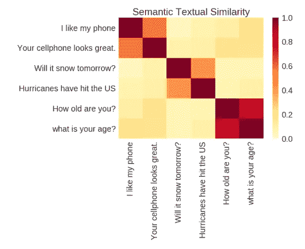
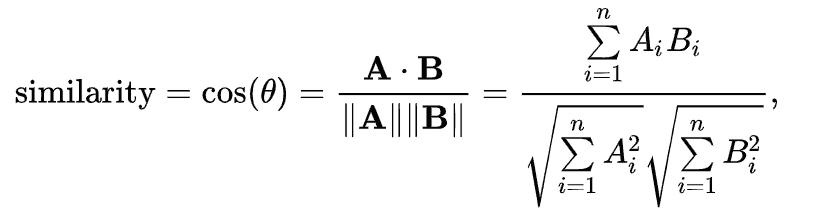
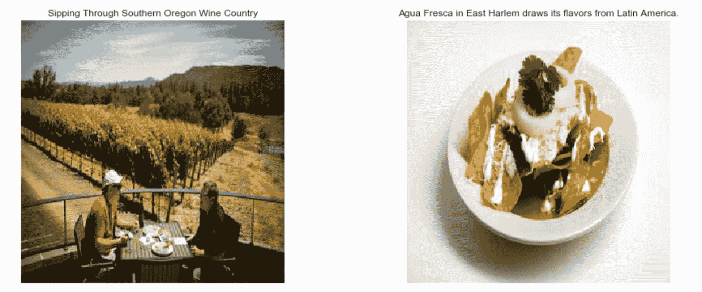
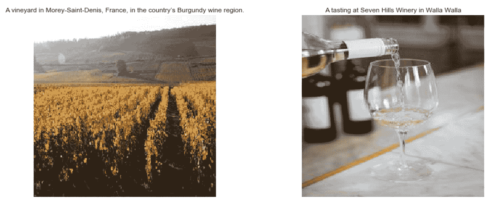

# 使用单词和句子嵌入构建新闻文章的图像推荐系统

> 原文：<https://towardsdatascience.com/building-an-image-recommendation-system-for-news-articles-using-word-and-sentence-embeddings-a5acb485a445?source=collection_archive---------27----------------------->

Source: [https://miro.medium.com/max/1200/1*9B7S9mipwLURUX9wdZN7Pw.jpeg](https://miro.medium.com/max/1200/1*9B7S9mipwLURUX9wdZN7Pw.jpeg)

*作者:Karina Huang、Dianne Lee、Abhimanyu Vasishth 和黄家仪(按姓氏字母顺序排列)*

*本文所表达的观点仅代表作者的观点，不代表美联社的观点。*

# **简介**

这篇博文展示了我们在哈佛 AC297r 课堂上与[美联社](https://www.ap.org/en-us/) (AP)合作的顶点项目的一部分。我们为任何给定的新闻标题建立了一个文本到图像的推荐系统。该项目的目标如下:

> 给定一篇文章的标题，使用标题推荐一组最匹配的图片。

由于机器学习方法不能直接优化文本，我们需要一种方法来将文本转换为数字表示。对于这项任务，我们使用单词嵌入，这是一种可以将单词表示为数字向量的方法。

在下面的部分中，我们使用两种不同类型的嵌入来讨论我们的方法 1)平均手套单词嵌入，和 2)通用句子编码器(USE)来编码文章标题和图像标题，随后是推荐过程和例子。

# **数据**

由于我们用于项目的数据是我们的行业合作伙伴的专有数据，为了这篇博文的目的，我们使用了一个包含新闻文章及其相关图像的公开数据集，以使我们的方法具有可重复性。我们下载了由 [Biten，A. F .、Gomez，l .、Rusinol，m .、& Karatzas，D. (2019)](http://openaccess.thecvf.com/content_CVPR_2019/papers/Biten_Good_News_Everyone_Context_Driven_Entity-Aware_Captioning_for_News_Images_CVPR_2019_paper.pdf) 提供的[数据。然后，我们使用下面的代码块提取文章标题和图片标题。图片由原作者](https://drive.google.com/file/d/1rswGdNNfl4HoP9trslP0RUrcmSbg1_RD/view)[在这里](https://drive.google.com/file/d/1RF-XlPTNHwwh_XcXE2a1D6Am3fBPvQNy/view)提供。

在通过排除标题中少于 5 个单词的文章和标题少于 5 个单词的图像来清理数据之后，最终的数据集有 276596 篇新闻文章，431841 幅相关图像。

我们使用了 [WordCloud](https://github.com/amueller/word_cloud) Python 库来创建文章标题(左)和图片标题(右)中的单词云。

这是数据集汇总统计数据的一些可视化效果。

# **手套词嵌入**

来自[斯坦福 NLP 网站](https://nlp.stanford.edu/projects/glove/)关于手套嵌入:

> “GloVe 是一种无监督学习算法，用于获得单词的矢量表示。在来自语料库的聚合的全局单词-单词共现统计上执行训练，并且产生的表示展示了单词向量空间的有趣的线性子结构。”

一种简单的单词嵌入方法是为英语中所有可能的单词创建一个长的 0 向量。然后，给定一个单词，在该单词对应的向量的索引中填入 1。这方面的一个例子如下:

使用这个例子，单词“water”的嵌入将是[0，1，0，0，…，0]，单词“table”的嵌入将是[0，0，0，1，…，0]。但我们可以立即看出，这不是一个好主意，原因有多种:

1.  向量好长啊！英语中有成千上万的单词(包括专有名词)，将每个单词存储为如此长的向量将占用大量的内存，并使任何 ML 算法都非常慢。
2.  语义信息不会被保留。这意味着对应于该单词的索引并不真正传达任何意义。“气球”和“水”相差一个位置，但这是非常不同的词。
3.  同样，两个单词之间的距离并不能让你知道这两个单词在语义上有多相似。

由于这些原因，开发了手套嵌入物。这些是在一个巨大的单词语料库上以无监督的方式进行训练的，使用单词的共现，即不同的单词对一起出现的次数。这让你感觉到这两个词是如何相关的。生成的嵌入集具有一些简洁的属性，如下图所示:

来自手套镶嵌的创作者:

> “区分男人和女人的基本概念，即性或性别，可以由各种其他词对等同地指定，例如国王和王后或兄弟和姐妹。为了从数学上说明这一观察结果，我们可能会认为，男人——女人、国王——王后和兄弟——姐妹之间的矢量差可能都大致相等。这类似于矢量强-更强、清晰-更清晰等的差异。”

我们下载了预训练的维基百科 2014 + Gigaword 5 手套单词嵌入，其词汇表中有超过 400000 个单词。预先训练好的嵌入可以从[斯坦福 NLP 网站](https://nlp.stanford.edu/projects/glove/)下载。叫做 **glove.6B.zip.** 在这个文件夹里解压后，你会发现几个文件。这些包含 50 维、100d、200d、& 300d 的嵌入，下载量为 822 MB。要加载下载的手套嵌入，请遵循以下代码:

# **平均手套单词嵌入以创建句子嵌入**

现在的问题是:鉴于我们知道如何将单个单词作为数字向量嵌入，我们如何将其扩展到新闻标题，即由多个单词组成的句子？

对句子嵌入的直观期望是，它应该从句子中的所有单词中捕获隐藏的特征。因此，我们可以通过连接或平均单词的单词嵌入来为给定的句子生成嵌入。然而，取决于单词嵌入的维度，拼接可能并不理想。句子嵌入的维数将随着字数的增加而成倍增加。此外，连接将要求所有输入句子具有相同数量的单词，这可能会由于单词减少而导致重要信息的丢失。

我们通过平均预训练的手套单词嵌入来为文章标题和图像标题生成句子嵌入。我们在进行一些预处理后这样做，其中包括:

1.  将句子中的所有单词转换成小写
2.  去掉句子中不必要的标点
3.  从句子中删除停用词。这些词包括“the”、“not”、“my”等。我们之前做词云的时候，已经从词云库下载了一个停用词列表。

有关实现，请参见下面的代码:

为了避免输入文章标题和图像标题之间的重复成对比较，我们在一个矩阵中检索并保存所有的图像标题嵌入。以下代码创建了带有手套嵌入的图像标题嵌入矩阵:

# **通用语句编码器**

使用平均手套嵌入当然是获得句子嵌入的好方法，但是，你可能已经注意到这是一种上下文无关的方法。也就是说，我们不考虑句子中单词的顺序。

> 一句“老虎吃人”的平均手套嵌入和一句“人吃老虎”的平均手套嵌入是一样的！

因此，我们需要一种方法来使用单词在句子中的上下文，以便创建一个更全面的句子嵌入集。

谷歌研究在 2017 年推出了通用句子编码器(USE)，它被训练成一个通用的语言理解模型。下面的流程图演示了使用深度平均网络(DAN)训练的训练过程，深度平均网络是一系列前馈神经网络。给定一个输入句子，DAN 被训练成将句子中所有单词的平均嵌入编码成 1×N 向量，这实际上是 DAN 的最后一个 softmax 层。通过评估不同语言任务(例如，情感分析)中的句子嵌入向量来更新网络权重。

实际上，网络可以学习仅从平均单词嵌入中捕获句法和语义信息。

Figure source ([the paper on USE embeddings by Cer et al.](https://arxiv.org/pdf/1803.11175.pdf))

我们嵌入了文章标题和图片标题，并预先训练了用法。该模型在 tensorflow hub 上开源。对于任意长度的输入文本，使用 outputs 语句嵌入的维度为 1 x 512。下面的代码显示了如何访问模型。用户端不需要任何预处理！

同样，我们可以检索和保存所有图像标题嵌入:

请注意，tensorflow hub 上有[种不同的使用模型](https://tfhub.dev/google/collections/universal-sentence-encoder/1)，以及不同版本的使用模型。模型随 tensorflow 版本更新而更新，并针对不同的语言任务进行了优化。我们使用的版本是[版本 4](https://tfhub.dev/google/universal-sentence-encoder/4) 。或者，你也可以探索一种使用 Transformer encoder 训练的变体([版本 5](https://tfhub.dev/google/universal-sentence-encoder-large/5) )。据报道，Transformer 编码器在迁移学习任务上的表现优于 DAN 编码器，但消耗了大量的内存和计算资源。

# **推荐**

为了推荐图像，我们计算图像标题嵌入和文章标题嵌入之间的余弦相似度。然后根据计算的余弦相似度按降序排列推荐图像。余弦相似度越高，图像标题与文章标题的语义相似度越高。来自[维基百科页面](https://en.wikipedia.org/wiki/Cosine_similarity)关于余弦相似度:

我们将嵌入向量归一化为单位范数，因此比较将只是点积。下面的代码显示了使用 GloVe 和 USE 嵌入的推荐过程:

# **结果**

以下是手套和使用嵌入模型推荐的图片。因为这个数据集由实际的新闻文章组成，所以我们提供了相应新闻文章的 URL。

第 1 条标题:[在瓦拉瓦拉的葡萄酒之乡重塑形象](https://www.nytimes.com/2016/02/21/travel/walla-walla-wineries-restaurants.html)

手套预测:

使用预测:

正如您所看到的，两个模型都推荐与葡萄酒或葡萄酒葡萄园相关的图像，这些图像在语义上与新闻标题中的“葡萄酒”相似。

# 结论

在这篇博文中，我们演示了如何使用 GloVe 和嵌入来编码一个句子。使用句子嵌入，我们可以计算句子之间的语义相似度，并使用它来推荐新闻文章的图像。完整的实现在我们的 jupyter 笔记本上[这里](https://github.com/phoebewong/medium_blogpost/blob/master/news_image_recommendation/ImageRecommendationNewsArticles.ipynb)。

# 感谢

我们要感谢我们在哈佛的导师 Pavlos Protopapas 和 Isaac Slavitt，感谢他们整个学期的指导。我们还要感谢我们的合作者，美联社的韦罗妮卡·兹琳斯卡和戴维·福克斯，感谢他们的支持。

# 参考

Biten，A. F .，Gomez，l .，Rusinol，m .，& Karatzas，D. (2019)。好消息，各位！新闻图像的上下文驱动实体感知字幕。在*IEEE 计算机视觉和模式识别会议记录*(第 12466–12475 页)。

Cer，d .，Yang，y .，Kong，S. Y .，Hua，n .，Limtiaco，n .，John，R. S .，和 Sung，Y. H. (2018 年)。通用句子编码器。 *arXiv 预印本 arXiv:1803.11175* 。