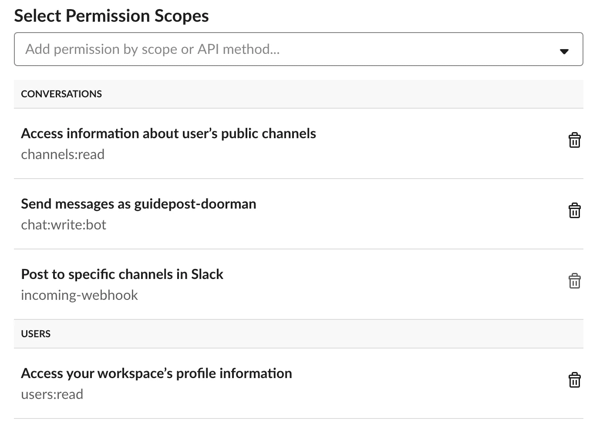
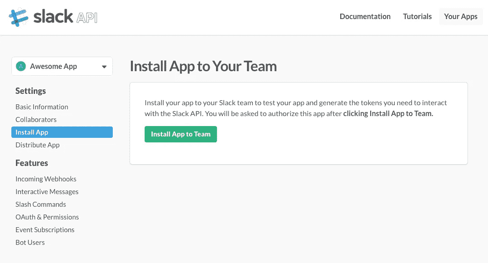
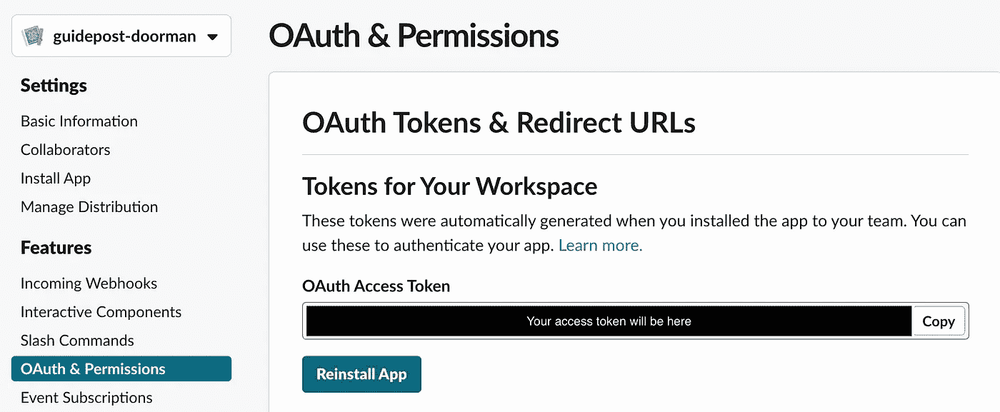
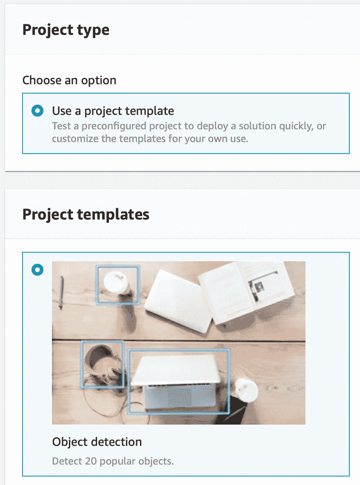

# 在 AWS DeepLens 和 Slack 上用几个小时构建一个交互式计算机视觉演示

> 原文：<https://towardsdatascience.com/building-an-interactive-computer-vision-demo-in-a-few-hours-on-aws-deeplens-38ff48c7ddbd?source=collection_archive---------16----------------------->

## 一步一步的指南来建立一个演示，可以帮助您解释您对孩子做了什么，给客户留下深刻印象，或通过检测人来自动操作


几个月前，我[发表了一篇文章](https://medium.com/@ryano144/teaching-3-year-olds-about-technology-consulting-9e1547c05bf),向我女儿 3 岁的学前班解释我作为技术顾问的工作。这些天我所做的事情中比较容易理解的一部分是研究计算机视觉问题。人们(甚至是蹒跚学步的孩子)天生就知道识别你面前的东西。有趣的是，正如我通过这次经历所了解到的，计算机视觉对于一个蹒跚学步的孩子来说实际上比这篇文章的大多数读者更容易理解。我女儿这一代人将是第一代带着这样的期望长大的人，他们可以像与他人互动一样与电脑互动。当电脑能说出孩子们的名字时，他们一点也不惊讶，这让我很震惊。

随着今天深度学习、云平台和 IOT 相机技术的进步，我们能够快速轻松地将这种能力带到计算机上。在本文中，我将介绍我用来构建实时计算机视觉系统来问候人们的架构和代码。这个想法、架构和代码的大部分功劳归于[桑德·范·德格拉夫](https://github.com/svdgraaf)和他的[看门人参加](https://github.com/svdgraaf/doorman) [AWS DeepLens 挑战赛](https://awsdeeplens.devpost.com/)。我将假设您理解编码原则，我的目标是您可以遵循这些原则来构建自己的演示。让我们开始吧…

# 架构概述

这个系统使用了大量的 AWS 无服务器技术(这里不需要配置网络或操作系统)。 [DeepLens](https://aws.amazon.com/deeplens/) 已经通过 [GreenGrass](https://aws.amazon.com/greengrass/) 接口与 AWS Lambda 集成，该接口将功能代码运行到设备上。该架构的其余部分使用云原生的事件驱动处理。从 DeepLens 上传的人的图像在 S3 到处移动，这使用 Lambda 函数触发适当的动作。这有一个很好的副作用，就是为了下游调试和分析的目的对图像进行排序。类似地， [API 网关](https://aws.amazon.com/api-gateway/)处理来自 Slack API 的入站 HTTP 请求，再次委托 lambda 函数进行处理。实际的人检测功能由 [AWS Rekognition](https://aws.amazon.com/rekognition/) 处理，它为面部识别提供全自动的机器学习服务。SNS 主题和 SQS 队列允许附加应用对检测到的人做出反应。在这个例子中，一个控制台应用程序使用 [AWS Polly](https://aws.amazon.com/polly/) 与被发现的人对话。


实际的工作流程是这样的:

1.  DeepLens 正在制作一个 *Find Person* Lambda 函数，该函数通过一个模型循环每一帧，以检测一个人，然后识别图像中是否有人脸。一旦 DeepLens 在画面中识别出一个人，它就会将图像上传到一个加密的 S3 桶位置。
2.  *Guess* Lambda 函数被配置为在 S3 上传时触发，它将图像传递给 Rekognition，以使用亚马逊预先训练的面部识别算法来确定图像与哪个 Slack 用户匹配。
3.  当一个新人的第一张图像到达时，Rekognition 很可能找不到匹配，因此 Lambda 函数将图像移动到 S3 的一个未知文件夹中进行进一步处理，设置适当的权限以便 Slack 能够显示它。
4.  一旦图像被放入 S3，未知的λ函数被触发。它向附加未知图像的 Slack API 发送一条消息，Slack API 向预先配置的 Slack 通道发送一条消息，询问图像中是哪个 Slack 用户。
5.  一旦团队中的某个人识别出与图像相关联的 slack 用户，Slack 就向 AWS API Gateway 发回一条消息，这将触发 *Train* Lambda 函数来告诉 Rekognition 用户是谁。
6.  下一次 DeepLens 上传 Slack 中已识别的人的图像时，Rekognition 可能会在 *Guess* Lambda 函数中匹配该人，这两个函数都会将已识别的人发布到 Slack 频道，以允许用户在必要时纠正识别。
7.  该应用还向 SNS 主题发送消息，包括用户信息和附加的[情绪检测](https://docs.aws.amazon.com/rekognition/latest/dg/API_Emotion.html)信息。订阅 SNS 主题的 SQS 队列允许应用程序处理这些信息。一个简单的控制台应用程序监听 SQS 队列，并使用 [AWS Polly](https://aws.amazon.com/polly/) 来问候这个人，并记录他们表现出的情绪。

# 设置服务

首先，您的开发环境需要具备以下条件:

1.  Git 访问:您必须[生成一个 SSH 密钥](https://help.github.com/articles/generating-a-new-ssh-key-and-adding-it-to-the-ssh-agent/#platform-linux)并将其添加到您的 GitHub 帐户中
2.  [NodeJS](https://nodejs.org/en/download/package-manager/#nvm)&[python 3](https://docs.python-guide.org/starting/installation/)(带 pip3 & pipenv)
3.  [无服务器框架](https://serverless.com/framework/docs/providers/aws/guide/installation/) &无服务器-python-需求插件。
4.  [AWS CLI](https://docs.aws.amazon.com/cli/latest/userguide/installing.html) ，以及它们的依赖项，安装在您的开发机器上。

以下说明应适用于 [AWS Cloud9](https://aws.amazon.com/cloud9/) 。它预装了 NodeJS、Python 和 AWS CLI(更新到您的电子邮件):

```
#Setup SSH Key for Git Access
ssh-keygen -t rsa -b 4096 -C "[your_email@example.com](mailto:your_email@example.com)"
eval "$(ssh-agent -s)"
ssh-add ~/.ssh/id_rsa
cat ~/.ssh/id_rsa.pub
#Copy paste the resulting token to add it to your account
```

您现在需要将生成的令牌复制粘贴到[并添加到您的 GitHub 帐户](https://help.github.com/articles/adding-a-new-ssh-key-to-your-github-account/#platform-linux)中，这样您就可以认证您的 Cloud9 环境了。请注意，这将允许您的 Cloud9 环境中的任何人访问您的 GitHub 帐户，因此使用 Cloud9 共享功能时要小心。

```
# Clone Github repo
git clone [git@github.com](mailto:git@github.com):ryano144/doorman.git
cd doorman#Install Serverless and the AWS CLI
npm install -g serverless 
sudo yum install jq 
pip install --upgrade awscli
```

最后，您将需要访问 [Slack](https://slack.com/) 。如果你还没有在工作中使用它，你可以建立一个免费账户来测试这个功能(当我写这篇文章的时候，你只需要输入你的电子邮件，然后点击*开始*)。然后你需要[在 Slack API](https://api.slack.com/slack-apps#creating_apps) 上创建一个与你的工作空间相关的应用。现在，您需要的只是一个名称和指向您将使用的工作区的指针。在本文的后面，您将配置 Slack 应用程序指向您的 AWS 后端。

您将需要激活传入的网络挂钩。这将允许应用程序发布到 Slack。


然后，您需要转到 OAuth 和 Permissions 部分，并选择以下范围(channels:read，chat:write:bot，incoming-webhook，users:read):



接下来，您需要将应用程序安装到您的工作空间:



这将把你带到一个可以安装应用程序的屏幕。你需要记住你为应用程序选择的 slack 频道。

> 安全说明:该应用程序将获得您工作区中所有用户个人资料的访问权限。这将允许您为 DeepLens 相机上传的每张图片选择一个用户。只有不透明的 Slack 用户 ID 将被发送到 AWS Rekognition，但是通过您的访问令牌，用户可以从 slack API 获得额外的配置文件信息。故事的寓意:**一定要保护好你的 Slack API 令牌**。为了增加安全性，如果 Slack 在 GitHub 这样的公共网站上发现你的访问令牌，他们会自动为你停用它。

一旦设置了 OAuth 权限，您就可以从安装应用程序或 OAuth & Permissions 页面复制您的访问令牌。



无服务器部署包使用几个环境变量来允许部署指向多个帐户的相同代码。为了简化部署，您可以创建一个 shell 脚本。我称之为 mine environment.sh，并将在下面的脚本中引用它。你会在许多脚本中看到对<name>的引用</name>

> 安全说明:不要将此文件提交给源代码管理。另外，如果您使用共享的 Cloud9 环境，那么您应该只在终端中直接输入 slack API token 环境变量。

```
export name=<your-slack-app-name>
export BUCKET_NAME=doorman-$name
export REKOGNITION_COLLECTION_ID=doorman-$name
export SLACK_API_TOKEN=<your-slack-api-token>  
export SLACK_CHANNEL_ID=guidepost-$name
export SLACK_TRAINING_CHANNEL_ID=guidepost-$name
export AWS_ACCOUNT_NUMBER=$(curl -s [http://169.254.169.254/latest/dynamic/instance-identity/document](http://169.254.169.254/latest/dynamic/instance-identity/document) | jq -r .accountId)
```

按照上面链接的指南，你应该有一个工作的开发环境。您可以通过运行以下命令将完整的架构部署到 AWS 来测试它:

```
source environment.sh
aws s3 mb s3://doorman-$name
aws rekognition create-collection --collection-id doorman-$namepip install --user pipenv
sls plugin install -n serverless-python-requirementssls deploy
```

一旦完成部署，您就可以浏览到 [CloudFormation 控制台](https://console.aws.amazon.com/cloudformation/home)来查看资源。你现在需要更新你的 Slack 应用程序，并将 Lambda 函数部署到 DeepLens。对于 slack 应用程序，您需要捕获 API 网关 URL，它应该在成功部署后出现在控制台上:


然后，您需要在 Slack 应用程序中更新此 URL，并从安装应用程序屏幕重新安装它。


你需要的最后一件事是从亚马逊购买一台 DeepLens 相机。如果你参加了 re:Invent 2017 并参加了任何 ML 会议，你很可能有一个。如果你没有，你可以在亚马逊上花 250 美元买一个。相机是一个预包装的包，本质上是一台运行 [AWS GreenGrass](https://aws.amazon.com/greengrass/) 的迷你电脑，连接到一台摄像机。这款相机可以轻松部署计算机视觉模型来运行直播视频，特别是如果你已经熟悉 [AWS Lambda](https://aws.amazon.com/lambda/) 的话。我假设你已经完成了[设置指南](https://docs.aws.amazon.com/deeplens/latest/dg/deeplens-getting-started-set-up.html)，你的 DeepLens 现在已经连接到互联网。您肯定应该[获取客户端证书](https://docs.aws.amazon.com/deeplens/latest/dg/deeplens-viewing-device-output-in-browser.html)，以便在浏览器中查看视频提要。



完成这些步骤后，您应该浏览到 [DeepLens 控制台](https://console.aws.amazon.com/deeplens/home)。您需要使用对象检测模板[创建一个项目](https://docs.aws.amazon.com/deeplens/latest/dg/deeplens-create-deploy-sample-project.html)。一旦你选择了这个，你将点击创建应用程序，然后编辑它以关联查找人 lambda 函数。接下来，在项目列表中选择它，并单击 Deploy to Device。从那里，选择您注册的 DeepLens，并将其推送到设备。完成后，您会看到 DeepLens 控制台顶部有一个绿色条，让您知道项目已经成功部署。

恭喜你！此时，您应该拥有一个功能齐全的系统。此时，您可以连接到设备的本地视频源。为此，首先在设备详细信息页面上找到 IP 地址，然后浏览到 https:// <ip-address-here>:4000 查看视频馈送。如果一个人走到摄像机前，摄像机会在他们周围放一个盒子。一旦您看到这种情况发生，您可以浏览到您发送消息的 Slack 通道，并查找带有提示的图像上传，以选择要关联的用户。</ip-address-here>


That’s me testing detection in the dark (it works)

如果它对你不起作用，请在下面的评论中自由提问。如果有足够多的问题，我将发布后续文章，详细介绍如何在 AWS 上调试这些类型的应用程序。