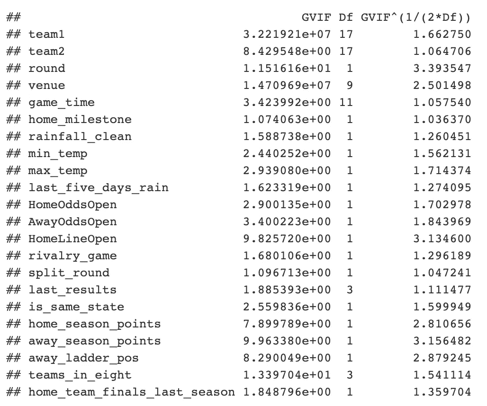

# 在 R 中建立线性回归模型预测 AFL 人群

> 原文：<https://towardsdatascience.com/building-an-linear-regression-model-in-r-to-predict-afl-crowds-735b16a1f7c6?source=collection_archive---------17----------------------->

# 介绍

现代 AFL 有很多关于群体行为和群体问题的讨论。我个人认为，人群问题是一个*一切照旧*的例子；近 30 年来，我一直断断续续地去看 AFL 的比赛，今天的观众行为与 20 年前没有什么不同……只是现在每个有手机和 Twitter 账户的人都是记者。

无论如何，那是我的两分钱。这种分析不是基于群体行为。这篇文章主要是关于建立一个模型来预测赛季期间 AFL 的人群。虽然数据是自 2000 赛季开始以来收集的，但该模型将建立在从 2013 赛季开始到 2018 赛季结束(总决赛系列除外)的训练数据基础上，然后用训练好的模型来预测 2019 赛季直到 2019 年 7 月 21 日周日结束的第 18 轮 AFL 比赛的出席人数。线性模型将在 [RStudio](http://www.rstudio.com/) 中使用 R(版本 3.5.3)构建。

这篇文章是我对跟风粉丝所做的介绍性分析的后续。这里可以找到。

这篇文章的灵感来自托尼·考克的惊人工作，特别是他在 AFL 人群的可预测性上的文章。

这个项目的所有代码都可以在 GitHub [这里](https://github.com/JaseZiv/AFL-Crowd-Analytics)找到

# 数据

该项目使用了三个数据来源:

1.  [AFL 表格](https://afltables.com)被用作主要信息来源。这无疑是任何想做 AFL 分析的人的首选
2.  [澳大利亚体育博彩](http://www.aussportsbetting.com)用于获取 2013 赛季比赛的博彩数据
3.  [澳大利亚气象局](http://www.bom.gov.au/climate/data/)用于气候数据(降雨和温度)。BOM 数据的一部分是从 James Day 的 [fitzRoy](https://github.com/jimmyday12/fitzRoy) R 包中取出的。非常感谢他。降雨和温度数据有一些遗漏的观测数据。缺失的雨量数据通过对之前缺失数据点的下一个读数取平均值来填充。缺失的温度用该月的平均温度来填充。

# 特征工程

AFL 表格中包含的数据是一个丰富的信息来源，但是需要一些步骤来从数据中收集一些额外的信息。

最初的三个数据源包含大约 35 个潜在的变量。然后进行特征工程(创建在预测模型中使用的额外解释变量的过程),总共产生约 95 个特征，以观察它们是否最终会被添加到最终模型中使用。

# 创建的功能

根据从众文章中得到的一些反馈和我想探索的其他东西，创建了一些新功能来看看它们是否有任何预测能力。

以游戏开始时间为例——有时间是很好的，但回归模型可能会发现将时间分类为一天中的一段时间更好，以减少一些噪音。因此，考虑到这一点，创建了一个特性(`time_period`)——如果游戏在下午 5 点开始，我将它归类为下午的游戏。在下午 5 点至 7 点之间开始的游戏被归类为晚间游戏，而在此之后的游戏是夜间游戏。

此外，星期几和`time_period`被加入到一个变量`game_time`中以在模型中使用。例如，如果是星期六下午 5:30 开始的比赛，则被归类为“星期六晚上”。

不经常使用的场馆，或者更准确地说，不是球队的主要“主场”体育场被标为“其他”。在这些场馆中共有 94 场比赛，其中包括像*尤里卡体育场*、*卡扎利体育场*、*特雷格公园*以及新西兰的国际场馆*惠灵顿*和中国的*江湾体育场*等场馆。

另一个特点是确定竞争游戏——当两个激烈的对手面对面时，观众就会来了。作为竞争游戏，有几种不同的选择。第一个包括四个最老的传统对手，都来自墨尔本——科林伍德、里士满、埃森登和卡尔顿(保留你的卡尔顿观点，我知道他们很糟糕，但他们的球迷仍然会去看这些对抗赛)。南美洲的德比(阿德莱德和阿德莱德港之间的对决)和西澳大利亚的德比(西海岸和弗里曼特尔之间的西部德比)也被归类为对抗赛。

几年前，我听到一位重要的 AFL 工作人员谈论博彩市场是上座率的一个强有力的预测因素，我收集了博彩数据来测试这一假设。除了收集的原始赔率和线数据之外，还创建了许多特征。这些包括计算主队和客队赔率之间的差异，以及计算一周内赌注的变化。

围绕主队和客场队的平均体验也创造了一些特色，里程碑式的比赛也是如此(每支球队的球员都参加了他们的第 100 场、200 场、250 场或 300 场比赛)。

计算每个队的最后一场比赛结果，以及每个队在前三场比赛中的获胜次数。此外，球队是否在前一个赛季打总决赛也被确定。

每轮都创建了一个阶梯，并探索了阶梯位置、百分比和得分作为最终模型的可能特征。

还创建了一个功能来识别来自同一州或不同州的团队所玩的游戏。

# 探索性数据分析

在我们开始构建模型之前，我们需要了解响应变量和预测变量。最有效的方法是通过可视化，什么包比`ggplot2`更好用！

这一部分将包含一些探索性的数据分析(通常称为“EDA”)，这是任何数据分析项目中自然的第一步。这是一个极其重要的步骤，它允许分析师检查数据——目标变量和预测变量的形状，预测模型中可能包含的变量之间是否有任何相关性，数据中是否有任何异常值，或任何缺失的数据……您明白了，EDA 非常重要！

嗯，在所使用的数据集中没有丢失的数据……这些数据都已经在预处理阶段被清除，可以在[这个](https://github.com/JaseZiv/AFL-Crowd-Analytics/blob/master/src/preprocessing.R) R 代码中找到。

# 响应变量— `Attendance`

让我们看看我们的反应变量——或者我们试图预测的东西——`attendance`在 AFL 超级联赛赛季比赛中。

我们可以看到出席人数多少有些偏正。我们将会看到一些高上座率的游戏是否会引起一些问题。这个变量可能需要进行某种形式的转换，但稍后会详细介绍。

自 2013 年以来，AFL 常规赛的平均上座率为 1340 场，略低于 32500 场。


# 一些关键预测

```
data_for_model <- afl_premiership_season %>%
  select(season, attendance, team1, team2, round, venue, game_time, home_median_experience, home_mean_experience, away_median_experience, away_mean_experience, home_300, home_milestone, away_300, away_milestone, count_milestones, rainfall_clean, min_temp, max_temp, last_five_days_rain, temperature_diff, HomeOddsOpen, AwayOddsOpen, HomeLineOpen, AwayLineOpen, odds_diff, rivalry_game, HomeTeamFav, team1_last_result, team2_last_result, split_round, home_team_finals_last_season, away_team_finals_last_season, season_stage, temperature, IsHomeMilestone, IsAwayMilestone, count_milestones, last_results, home_team_state, away_team_state, is_same_state, temperature_diff, home_odds_change, away_odds_change, home_line_change, away_line_change, second_home_game, home_season_points, home_score_for, home_percentage, home_ladder_pos, away_wins_last_three, away_season_points, away_score_for, away_percentage, away_ladder_pos, teams_in_eight, finals_last_season, home_wins_last_three, away_wins_last_three) %>% na.omit()
```

正如在本系列的第一篇文章中所看到的，参赛队伍之间的出席率有明显的差异，而且参赛队伍在之前的比赛中是赢是输。此外，第一个帖子显示，主队的偏袒地位似乎也与出勤率有关。

**分类特征:**

我们预计会对人群数据产生影响的一些关键分类变量如下所示。


**一些观察:**

*   比赛地点和出席人数之间似乎有关系。被归类为`Other`的体育场包括第二主场地和 2019 年未使用的一些椭圆形场地。在这些体育场举行的 1340 场比赛中有 238 场
*   去年是主队还是客场打总决赛，似乎和上座率关系不大。在我们的模型中包含以下内容可能是有用的
*   玩游戏的时间和出勤率似乎是相关的。毫无疑问，`Weekday Afternoon`和`Friday Afternoon`因为埃森登和科林伍德之间的澳新军团日冲突而高涨。周五和周日晚上的比赛似乎吸引了更多的观众。可能是一个有用的预测
*   在一个赛季的不同轮次之间，出席人数似乎有一些差异。可能是一个有用的预测
*   被归类为“竞争游戏”的游戏显然比非竞争游戏吸引了更多的观众。可能是一个有用的预测
*   这一轮是否是分轮(有些队轮休，或者休息一周)似乎与出席率无关。可能不是一个有用的预测
*   当主队有一名球员打一场里程碑比赛(无论是第 100 场、200 场、250 场还是第 300 场比赛)时，观众人数似乎略高，但这种关系显然不会很强。可能不是一个有用的预测
*   当两支参赛队伍来自同一个州时，观众人数会更多。可能是一个有用的预测
*   不出所料，主队在第二主场(塔斯马尼亚的霍桑和诺斯，墨尔本，达尔文的西部牛头犬队等)比赛的观众较少。这可能与体育场容量较低有关，但可能仍然是一个有用的功能

**数字特征:**

为了探索数字特征和`attendance`之间的关系，将使用皮尔逊相关。

使用 dplyr 仅选择数字特征，然后计算转换矩阵的相关性，得出以下与`attendance`的相关性。

```
numeric_features <- data_for_model %>% select_if(is.numeric)

numeric_features %>% 
  as.matrix() %>% 
  cor() %>% .[,"attendance"] %>% sort(decreasing = T)
```


虽然所有相关性似乎都相当弱，但可以得出以下结论:

*   主队的平均经验(`home_mean_experience`)计算为每个球员在他们参加的每场比赛中参加的平均比赛，产生了与出勤率的最高皮尔逊相关性 0.264
*   主队的百分比(得分/反对得分)也具有高于 0.2 的相关性，为 0.236
*   主队在过去三场比赛中获胜的次数具有 0.175 的皮尔逊相关性，而客队平均比赛经验的相关性为 0.159
*   奇怪的是，主队的阶梯位置呈负相关，皮尔逊相关系数为-0.273。客队的阶梯位置也有负相关-0.150
*   投注数据显示了一些关系；随着`HomeOddsOpen`的增大，`attendance`趋于减小，这多少有些意料之中。`odds_diff`变量(主队开局赔率与客场球队的差距)也有微弱的负相关关系(相关性-0.168)
*   天气数据显示了一些关系。不出所料，当天的最高气温和降雨量以及最近五天的累积降雨量与上座率呈负相关(分别为-0.091、-0.081 和-0.65)

# 构建模型

在任何旨在建立一个机器学习模型来预测一些响应变量的结果的项目中，在训练模型时保留数据的子集是很重要的。这两组通常被称为训练集和测试集。训练集是您传递给模型进行构建的内容，然后根据模型尚未“看到”的数据进行预测，以最好地模拟现实生活中的例子。

在这种情况下，模型将根据 2013 年至 2018 年赛季的数据进行训练(`afl_pre_2019`)，然后根据模型尚未看到的 2019 年数据进行预测，`afl_2019`。这样做是为了确保模型不会“过度拟合”数据。过度拟合数据的模型通常在看不见的事件上表现更差。

# 尝试过但未包含在模型中的事物

以下特征被认为具有一定的有效性，但是当运行该模型时，发现没有预测能力:

*   这两个队在过去三场比赛中的获胜次数并没有起作用
*   当天的降雨量没有预测能力(但是比赛日之前五天的总降雨量有)
*   里程碑游戏使模型表现更差

# 缺少什么/最好有什么

有一些信息是不公开的(或者说我没有试图去获取)，这些信息可能会在未来的建模工作中派上用场。其中包括:

*   每个赛季的门票定价，以探索门票定价对上座率的影响
*   比赛门票是否发给了球迷，这是否对上座率有影响
*   任何社交媒体帖子/报纸文本分析，涉及游戏中玩家的团队/话题等

```
afl_pre_2019 <- data_for_model %>% filter(season < 2019, season >= 2013)

afl_2019 <- data_for_model %>% filter(season == 2019)
```

# 基线模型

在建立一个预测游戏的模型之前，我们希望有一个基线模型可以比较。使用每场比赛的平均人群作为基线的诱惑是存在的，但是不同的场馆容量使得这不太相关。因此，为了计算基线模型，我将使用每个场馆的出席率中值(将标有“其他”的场馆的平均值作为一个整体)，用于每个主客场球队组合。比如科林伍德(H) vs 埃森登(A)和埃森登(H) vs 科林伍德(A)是不一样的。使用中位数是因为 AFL 人群有轻微的偏斜。

```
median_attendances <- afl_pre_2019 %>% 
  group_by(team1, team2, venue) %>% 
  summarise(baseline_attendance = median(attendance)) %>% ungroup()

baseline <- afl_2019 %>% select(team1, team2, venue, attendance) %>% 
  left_join(median_attendances, by = c("team1", "team2", "venue")) %>% 
  filter(!is.na(baseline_attendance))
```

使用每个场地的平均上座率作为我们的基线，获得了 6816 的 RMSE 和 4958 的平均绝对误差。从这里建立的任何模型都需要比这更好。

# 转换响应变量

由于我们的响应变量有点倾斜的性质，进行某种转换以使其更加正常化可能是明智的。对数变换通常用于“消除”数据偏差。下面是 log 转换考勤变量的结果。


它看起来没有未转换的变量偏斜，然而(*剧透*)，模型表现更差，出席率被对数转换。

# 使用逐步方法的特征选择

选择哪些特征进入模型的一种流行方法是使用逐步回归。这可以通过以下方式进行:

*   *forward* ，变量一个一个加，只保留那些提高模型可解释性(R 平方)的变量，
*   *向后*，从所有变量开始，如果它们不能增加模型的可解释性，就删除它们，或者
*   *both* ，是*前进*和*后退*特征选择的集合。

在*和*两个方向上逐步使用最大化模型调整后的 R 平方值为 0.87。

执行线性回归时，我们希望确保变量之间没有共线性。评估的一个方法是计算可变通货膨胀系数(VIF)。这通过`car`包中的`vif`函数变得很容易。高于 5 的 VIF 被认为是过高的。

虽然游戏进行的回合刚刚超过 5 (5.7)，我们将保持这一点，但是`odds_diff`和`home_score_for`将从使用逐步选择的完整模型中删除并重新运行。

```
full_model <- lm(attendance ~ ., data = afl_pre_2019)

*# Set seed for reproducibility*
set.seed(123)

step.model <- MASS::stepAIC(full_model, direction = "both", 
                      trace = FALSE)car::vif(step.model)
```


```
*# the backward selection model include a variable with hi collinearity (VIF = 12). Will recreate model without odds_diff*
full_model_clean <- lm(attendance ~ team1 + team2 + round + venue + game_time + 
    home_milestone + rainfall_clean + min_temp + max_temp + last_five_days_rain + 
    HomeOddsOpen + AwayOddsOpen + HomeLineOpen + 
    rivalry_game + split_round + last_results + is_same_state + 
    home_season_points + away_season_points + 
    away_ladder_pos + teams_in_eight + home_team_finals_last_season, 
    data = afl_pre_2019)

car::vif(full_model_clean)
```



清洁模型的调整后 R 平方为 0.8652，而 RMSE 为 6，474，MAE 为 4，855。这些结果优于基线模型，但也仅仅如此。

# 最佳模特

确定“最佳”模型是一项有趣的工作。如果模型的可解释能力是我们所追求的，那么我们希望最大化调整后的 R 平方度量。这种分析旨在最大限度地成功预测人群，因此，均方根误差(RMSE)或平均绝对误差(MAE)是我们将重点关注的指标。这两种方法都可以追溯到响应变量——出勤率，区别在于 MAE 是模型的平均绝对误差(预测和实际之间的差异),而 RMSE 惩罚误差越大的模型。

对于 RMSE 和 MAE，当应用于 2019 赛季比赛时，以下模型导致最低的 RMSE 和 MAE。

```
set.seed(123)

fit_lm <- lm(attendance ~ team1 + team2 + round + venue + game_time + I(HomeLineOpen * home_ladder_pos) + rivalry_game + last_results + last_five_days_rain + max_temp + min_temp + home_mean_experience + away_mean_experience + is_same_state + home_score_for + I(home_percentage * home_ladder_pos) + I(home_wins_last_three * round) + round * finals_last_season, data = afl_pre_2019)

summary(fit_lm)$adj.r.squared
```

该模型的调整后 R 平方为 0.858，表明该模型可以解释训练集(2013-2018 年)中 AFL 出勤的几乎 86%的可变性。

**交互术语**

在这个模型中，特性不仅仅是单独使用。还采用了相互作用术语。以下特征组合在一起形成了一个特征，提高了模型的预测能力:

*   `I(HomeLineOpen * home_ladder_pos)`
*   `I(home_percentage * home_ladder_pos)`
*   `I(home_wins_last_three * round)`
*   `round * finals_last_season`

# 分析最佳模型

我们要做的第一件事是确保残差是正态分布的，以满足线性模型的正态性条件。

下面的直方图表明，误差呈正态分布，以零为中心。一个好迹象。

```
ggplot(data = data.frame(fit_lm$residuals), aes(x= fit_lm.residuals)) + 
  geom_histogram() +
  ggtitle("ERRORS ARE CENTRED AROUND ZERO") +
  scale_x_continuous(labels = comma, name = "Model Residuals")
```


然后我们可以看看每个预测变量的系数。

为了使检查更容易，使用了`broom`包。使用`tidy()`功能，汇总 lm 输出的结果可以很好地显示在 DF 中。

每个预测变量的系数(除了主队和客场队)如下所示。

```
a <- broom::tidy(fit_lm) %>% mutate(p.value = round(p.value, 5))

a %>% filter(!str_detect(term, "team1"), !str_detect(term, "team2")) %>%  
  kableExtra::kable(format = "html", escape = F) %>%
  kableExtra::kable_styling("striped", full_width = F)
```


```
actual_2019crowds <- afl_2019$attendance

*# fit linear model* 
afl_2019$predicted_attendance <- predict(fit_lm, afl_2019)

*# put a floor on AFL attendances - surely the AFL doesn't let the crowd fall below 6,000*
afl_2019$predicted_attendance <- ifelse(afl_2019$predicted_attendance < 6000, 6000, afl_2019$predicted_attendance)

*# calculate the errors*
error <- afl_2019$predicted_attendance - afl_2019$attendance
```

然后我们要分析模型与关系的拟合程度。这可以通过在散点图上绘制实际值和预测值来实现。

我可以看到，线性模型平均来说做得相当好。该模型确实低估了一些大型抽奖游戏，同时也预测了第八轮在 MCG 举行的山楂与 GWS 比赛的上座率超过 30，000 人，该比赛仅吸引了 14，636 名球迷。

```
afl_2019 %>% 
  ggplot(aes(x=attendance, y= predicted_attendance)) +
  geom_point() +
  geom_abline(slope = 1, intercept=0) +
  ggtitle("MODEL UNDER-PREDICTED SOME\nLARGE DRAWING GAMES") +
  scale_x_continuous(labels = comma, name = "Actual Attendance") +
  scale_y_continuous(labels = comma, name = "Predicted Attendance") +
  annotate(geom = "text", x=83000, y= 55000, label = "Model under-predicted\non these games")
```


我们还可以看看模型如何预测每个场馆的人群。

```
afl_2019 %>% 
  mutate(error = predicted_attendance - attendance) %>% 
  ggplot(aes(x= error)) +
  geom_density() +
  geom_vline(xintercept = 0, linetype = 2) +
  facet_wrap(~ venue, scales = "free_y", ncol = 2) +
  scale_x_continuous(labels = comma, name = "Error") +
  ggtitle("Exploring Errors by Venue") +
  theme(axis.text.y = element_blank(), axis.title.y = element_blank())
```


该模型倾向于高估加巴、珀斯体育场、悉尼展览场甚至 MCG 的出席人数，而低估卡拉拉和“其他”的出席人数。

# 模型的整体性能

最终选定的模型实现了 5953 的 RMSE 和 4466 的平均用户体验，这意味着在预测上座率时，模型平均误差不到 4500 个粉丝。与基线模型(RMSE 为 6，816，平均平均误差为 4，958)相比，该模型比基线模型平均高出 500 多人，但也没有太多的极端误差。

# 结论

希望你已经到这里了！

我很乐意在评论中听到您的反馈/更正或进入 [touch](https://www.linkedin.com/in/jason-zivkovic-4a0a1926/) 。

***本帖原创，发布在不怪数据博客***[***【https://www.dontblamethedata.com】***](https://www.dontblamethedata.com)