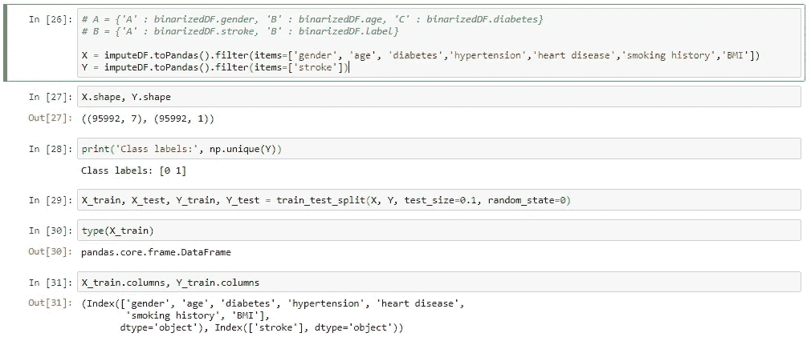

# 在 Pyspark 中使用 MLlib 构建 ML 应用程序

> 原文：<https://towardsdatascience.com/building-an-ml-application-with-mllib-in-pyspark-part-1-ac13f01606e2?source=collection_archive---------3----------------------->

## 本教程将指导您如何在 apache spark 中创建 ML 模型，以及如何与它们交互

# 介绍

Apache Spark 是一种按需大数据工具，全球许多公司都在使用它。它的内存计算和并行处理能力是这个工具流行的主要原因。


Spark Stack

MLlib 是一个可扩展的机器学习库，它与 Spark SQL、Spark Streaming 和 GraphX 等其他服务一起出现在 Spark 之上。

# **数据集相关介绍**

在本文中，我们将专注于一个叫做笔画数据集的数据集。中风是一种流向大脑的血流停止或血流过多的情况。中风的危险因素有

*   吸烟
*   高血压
*   糖尿病
*   血液胆固醇水平高
*   酗酒
*   高脂肪(尤其是饱和脂肪)和高盐，但低纤维、水果和蔬菜的饮食
*   缺乏经常锻炼
*   肥胖

所以我这里得到了一个不错的数据集:[*https://bigml . com/user/Francisco/gallery/model/508 b 2008570 c 6372100000 B1 # info*](https://bigml.com/user/francisco/gallery/model/508b2008570c6372100000b1#info)

以下是数据集:


Stroke Dataset

该数据集几乎包含了上述中风的所有风险因素。因此，选择具有适当风险因素的数据集非常重要。

我们将把列的字符串值变成数字值。这样做的原因将在后面解释。使用 Excel 中的替换功能，我将数据集更改为以下内容

1.  性别列—男性=1，女性=0

2.吸烟史——从未=0，曾经=0.25，当前= 0.5，以前= 0.75，当前= 1.0

# **使用的服务和库**

1.  Google cloud——我们将在 Dataproc 中建立我们的 spark 集群，并在 Jupyter 笔记本中编写代码
2.  Jpmml(pyspark2pmml) —用于将我们的模型转换成 pmml 文件。
3.  open scoring——一个为 PMML 模型评分的 REST web 服务。
4.  VS 代码——我们将使用 React JS 构建一个与 REST 服务器通信的交互式网站。

# **架构图:**

下图展示了我们整个项目的简要架构。


The architecture diagram of our project

# **步骤 1:设置谷歌云**

Google cloud 有一个名为 Dataproc 的服务，用于创建预装 Apache Spark 的集群。我们可以随时调整集群的大小。谷歌云提供免费的 300 美元信用作为入门优惠。因此，我们将使用这些免费配额来建立我们的集群。


Google Cloud Console

点击“激活”获得 300 美元的免费点数。


Registration Step-1

选择您的国家，然后点击“继续”。在下一页，您将被提示输入您的帐单细节和信用卡或借记卡细节。填写它们，然后点击底部的按钮。


Google Cloud Console - Dataproc

将打开控制台页面。在页面顶部，在搜索栏中键入 Dataproc，上面的页面就会打开。单击 create a cluster 开始创建集群。


GC — Creating a cluster-1


GC — Creating a cluster-2


GC — Creating a cluster-3

请确保您输入了与上述相同的设置。点击高级选项，按照上面的图像设置，然后点击创建。创建一个集群可能需要 2 到 3 分钟。


Google cloud — Dataproc clusters

导航到群集，然后单击虚拟机实例。在 VM 实例下，我们可以看到创建了一个主节点和两个工作节点。主节点的作用是它通常请求集群中的资源，并使它们对 spark 驱动程序可用。它监视和跟踪工作节点的状态，这些工作节点的工作是托管 executor 进程，该进程存储来自任务的输出数据并托管 JVM。详细描述可以在[这里](http://www.informit.com/articles/article.aspx?p=2928186)找到

现在单击主节点的 SSH 按钮。


SSH

一个新的终端在一个新的 chrome 标签中打开。这是命令行界面，通过它我们可以与我们的集群进行交互。键入“pyspark”检查 spark 上的安装及其版本。确保 spark 版本在 2.2 以上，python 版本为 3.6。


Firewall Rules

现在设置 jupyter 笔记本，我们需要创建一个防火墙规则。按照图片设置新的防火墙规则。确保在协议和端口中选择“全部允许”。


Firewall Rules

点击保存并导航至“外部 IP 地址”。


External IP addresses

将“spark-cluster-m”的类型改为静态。给出任意一个名字，点击“保留”。

现在导航到“SSH”并键入以下命令。

```
sudo nano ~/.jupyter_notebook_[config.py](https://www.youtube.com/redirect?event=comments&stzid=UgwMLhVicKWXmwMzyJ54AaABAg&q=http%3A%2F%2Fconfig.py%2F&redir_token=7XHzrHJ0cqu2HG4iRpSCumF2asJ8MTU2MDUzMTgyMEAxNTYwNDQ1NDIw)
```

复制下面的线并粘贴它。按 CTRL+o，回车，CTRL+x。

```
c=get_config()c.NotebookApp.ip=’*’c.NotebookApp.open_browser=Falsec.NotebookApp.port=5000
```

现在我们可以通过下面的命令打开 jupyter 笔记本

```
jupyter-notebook --no-browser — port=5000
```

在 SSH 中键入上述命令，然后打开一个新的选项卡，并在 google chrome 中键入“https://localhost:5000”以打开 Jupyter notebook。在我的例子中，本地主机是 35.230.35.117


Jupyter Notebook

# **第二步:在 Jupyter 笔记本的 Pyspark 中编码**

在进入这一部分之前，我们需要安装一些外部库。

我们需要 Imblearn 库来执行 SMOTE，因为我们的数据集高度不平衡。更多关于 smote 的信息可以在这个[链接](https://medium.com/coinmonks/smote-and-adasyn-handling-imbalanced-data-set-34f5223e167)中找到。

在 SSH 中，键入

```
sudo -i
```

然后键入下面一行

```
conda install -c glemaitre imbalanced-learn
```

退出根文件夹，然后打开 Jupyter 笔记本。开始编码吧。

**导入重要库**

```
from pyspark.sql import SQLContext
from pyspark.sql import DataFrameNaFunctions
from pyspark.ml import Pipeline
from pyspark.ml.classification import DecisionTreeClassifier
from pyspark.ml.classification import LogisticRegression
from pyspark.ml.feature import Binarizer
from pyspark.ml.feature import OneHotEncoder, VectorAssembler, StringIndexer, VectorIndexer
from pyspark.ml.classification import RandomForestClassifier
from pyspark.sql.functions import avgimport pandas as pd
import numpy as np
import matplotlib.pyplot as plt
%matplotlib inlinefrom pyspark.ml.evaluation import MulticlassClassificationEvaluator
from pyspark.mllib.evaluation import MulticlassMetrics
from pyspark.ml.evaluation import BinaryClassificationEvaluatorfrom imblearn.over_sampling import SMOTE
from imblearn.combine import SMOTEENN
from sklearn.model_selection import train_test_split
from collections import Counter
```

现在我们需要创建一个 spark 会话。

```
from pyspark.context import SparkContext
from pyspark.sql.session import SparkSession
sc = SparkContext(‘local’)
spark = SparkSession(sc)
```

我们需要从存储中访问我们的数据文件。导航到 google 云控制台中的“bucket”并创建一个新的 bucket。我命名为“data-stroke-1 ”,并上传修改后的 CSV 文件。


Google Cloud Bucket

现在我们需要加载已经上传到我们的 bucket 中的 CSV 文件。

```
input_dir = ‘gs://data-stroke-1/’
df = spark.read.format(‘com.databricks.spark.csv’).options(header=’true’, inferschema=’true’).load(input_dir+’stroke.csv’)
df.columns
```


我们可以通过使用下图所示的命令打印数据帧来检查它。


现在，我们需要创建一个列，其中包含所有负责预测中风发生的特征。

```
featureColumns = [‘gender’,’age’,‘diabetes’,‘hypertension’,
 ‘heart disease’,‘smoking history’,‘BMI’]
```


确保所有列都是双精度值。接下来，让我们删除所有 2 岁以下的条目。

```
df = df.filter(df.age >2)
df.count()
```

现在让我们打印一个条形图来检查数据中存在的类的类型

```
responses = df.groupBy(‘stroke’).count().collect()
categories = [i[0] for i in responses]
counts = [i[1] for i in responses]

ind = np.array(range(len(categories)))
width = 0.35
plt.bar(ind, counts, width=width, color=’r’)

plt.ylabel(‘counts’)
plt.title(‘Stroke’)
plt.xticks(ind + width/2., categories)
```


# 步骤 3:数据预处理

*步骤 3A。缺失数据管理*

现在，进行适当的缺失数据管理以最终得到一个非常好的模型是非常重要的。使用“df.na.drop()”并不总是好的，它会删除所有丢失数据的行。用适当合理的价值观来填充它们是我们可以实现的一个想法。

如我们所见，我们在身体质量指数列和吸烟史列中缺少值。填充这些身体质量指数值的一种可能方法是使用年龄值来填充它们。


taken from — [*https://dqydj.com/bmi-distribution-by-age-calculator-for-the-united-states/*](https://dqydj.com/bmi-distribution-by-age-calculator-for-the-united-states/)

对于吸烟史，很难找到合理的数值来填补。通常情况下，16 岁以下的人对吸烟并没有那么上瘾，因此我们可以用 0 来填充那些年龄组的人的值。年龄在 17 到 24 岁之间的人一生中可能至少尝试过一次吸烟，所以我们可以给这些人 0.25 的价值。现在，一些人过了一定年龄就戒烟了，即使他们有健康问题，也很少有人继续吸烟。我们不能决定给它们取什么值，所以默认情况下，我们给它们赋值 0。

*我们既可以删除这些列中缺少值的所有行，也可以按照上面的逻辑填充这些行。但是出于本教程的目的，我已经用上面的逻辑填充了丢失的行，但是实际上篡改数据而没有数据驱动的逻辑来备份通常不是一个好主意。*

我们将对此数据帧执行一些操作，而 spark 数据帧不支持任何操作。因此，我们将我们的数据帧复制到熊猫数据帧，然后执行操作。

```
imputeDF = dfimputeDF_Pandas = imputeDF.toPandas()
```

我们将根据年龄将完整的数据帧分成许多数据帧，并用合理的值填充它们，然后，将所有数据帧合并成一个数据帧，并将其转换回 spark 数据帧。

```
df_2_9 = imputeDF_Pandas[(imputeDF_Pandas[‘age’] >=2 ) & (imputeDF_Pandas[‘age’] <= 9)]
values = {‘smoking history’: 0, ‘BMI’:17.125}
df_2_9 = df_2_9.fillna(value = values)df_10_13 = imputeDF_Pandas[(imputeDF_Pandas[‘age’] >=10 ) & (imputeDF_Pandas[‘age’] <= 13)]
values = {‘smoking history’: 0, ‘BMI’:19.5}
df_10_13 = df_10_13.fillna(value = values)df_14_17 = imputeDF_Pandas[(imputeDF_Pandas[‘age’] >=14 ) & (imputeDF_Pandas[‘age’] <= 17)]
values = {‘smoking history’: 0, ‘BMI’:23.05}
df_14_17 = df_14_17.fillna(value = values)df_18_24 = imputeDF_Pandas[(imputeDF_Pandas[‘age’] >=18 ) & (imputeDF_Pandas[‘age’] <= 24)]
values = {‘smoking history’: 0, ‘BMI’:27.1}
df_18_24 = df_18_24.fillna(value = values)df_25_29 = imputeDF_Pandas[(imputeDF_Pandas[‘age’] >=25 ) & (imputeDF_Pandas[‘age’] <= 29)]
values = {‘smoking history’: 0, ‘BMI’:27.9}
df_25_29 = df_25_29.fillna(value = values)df_30_34 = imputeDF_Pandas[(imputeDF_Pandas[‘age’] >=30 ) & (imputeDF_Pandas[‘age’] <= 34)]
values = {‘smoking history’: 0.25, ‘BMI’:29.6}
df_30_34 = df_30_34.fillna(value = values)df_35_44 = imputeDF_Pandas[(imputeDF_Pandas[‘age’] >=35 ) & (imputeDF_Pandas[‘age’] <= 44)]
values = {‘smoking history’: 0.25, ‘BMI’:30.15}
df_35_44 = df_35_44.fillna(value = values)df_45_49 = imputeDF_Pandas[(imputeDF_Pandas[‘age’] >=45 ) & (imputeDF_Pandas[‘age’] <= 49)]
values = {‘smoking history’: 0, ‘BMI’:29.7}
df_45_49 = df_45_49.fillna(value = values)df_50_59 = imputeDF_Pandas[(imputeDF_Pandas[‘age’] >=50 ) & (imputeDF_Pandas[‘age’] <= 59)]
values = {‘smoking history’: 0, ‘BMI’:29.95}
df_50_59 = df_50_59.fillna(value = values)df_60_74 = imputeDF_Pandas[(imputeDF_Pandas[‘age’] >=60 ) & (imputeDF_Pandas[‘age’] <= 74)]
values = {‘smoking history’: 0, ‘BMI’:30.1}
df_60_74 = df_60_74.fillna(value = values)df_75_plus = imputeDF_Pandas[(imputeDF_Pandas[‘age’] >75 )]
values = {‘smoking history’: 0, ‘BMI’:28.1}
df_75_plus = df_75_plus.fillna(value = values)
```

组合所有数据帧

```
all_frames = [df_2_9, df_10_13, df_14_17, df_18_24, df_25_29, df_30_34, df_35_44, df_45_49, df_50_59, df_60_74, df_75_plus]
df_combined = pd.concat(all_frames)
df_combined_converted = spark.createDataFrame(df_combined)
imputeDF = df_combined_converted
```

*步 3B。处理不平衡数据*

我们将执行 [SMOTE](https://imbalanced-learn.readthedocs.io/en/stable/generated/imblearn.over_sampling.SMOTE.html) 技术来处理不平衡数据。SMOTE 可以从这里引用:

```
X = imputeDF.toPandas().filter(items=[‘gender’, ‘age’, ‘diabetes’,’hypertension’,’heart disease’,’smoking history’,’BMI’])
Y = imputeDF.toPandas().filter(items=[‘stroke’])X_train, X_test, Y_train, Y_test = train_test_split(X, Y, test_size=0.1, random_state=0)
```



```
sm = SMOTE(random_state=12, ratio = ‘auto’, kind = ‘regular’)x_train_res, y_train_res = sm.fit_sample(X_train, Y_train)print(‘Resampled dataset shape {}’.format(Counter(y_train_res)))
```

请参考此[链接](https://imbalanced-learn.readthedocs.io/en/stable/generated/imblearn.over_sampling.SMOTE.html)了解参数


X_train 包含除 Stroke 列之外的所有数据列。

Y_train 包含笔画列数据。

将重新采样的数据组合成一个火花数据帧

```
dataframe_1 = pd.DataFrame(x_train_res,columns=[‘gender’, ‘age’, ‘diabetes’, ‘hypertension’, ‘heart disease’, ‘smoking history’, ‘BMI’])
dataframe_2 = pd.DataFrame(y_train_res, columns = [‘stroke’])# frames = [dataframe_1, dataframe_2]
result = dataframe_1.combine_first(dataframe_2)
```

将其改回火花数据帧

```
imputeDF_1 = spark.createDataFrame(result)
```

检查重新采样的数据。这与我们之前使用的代码相同。


如我们所见，我们成功地对数据进行了重新采样。现在我们将进入下一部分。

# **第四步。构建 Spark ML 管道**

下面是一个 spark ml 项目的通用管道，除了我们没有使用字符串索引器和 oneHotEncoder。


Spark ML Pipeline

现在要构建一个汇编器，为此，我们需要一个二进制化器。

```
binarizer = Binarizer(threshold=0.0, inputCol=”stroke”, outputCol=”label”)
binarizedDF = binarizer.transform(imputeDF_1)binarizedDF = binarizedDF.drop(‘stroke’)
```

这将创建一个名为“label”的新列，其值与 stroke 列中的值相同。

```
assembler = VectorAssembler(inputCols = featureColumns, outputCol = “features”)
assembled = assembler.transform(binarizedDF)print(assembled)
```

汇编程序将预测笔画所需的所有列组合起来，产生一个称为特征的向量。


**现在开始拆分数据**

```
(trainingData, testData) = assembled.randomSplit([0.7, 0.3], seed=0)
print(“Distribution of Ones and Zeros in trainingData is: “, trainingData.groupBy(“label”).count().take(3))
```


培养

```
dt = DecisionTreeClassifier(labelCol="label", featuresCol="features", maxDepth=25, minInstancesPerNode=30, impurity="gini")
pipeline = Pipeline(stages=[dt])
model = pipeline.fit(trainingData)
```

测试

```
predictions = model.transform(testData)
```

AUC-ROC

```
from pyspark.mllib.evaluation import BinaryClassificationMetrics as metric
results = predictions.select(['probability', 'label'])

## prepare score-label set
results_collect = results.collect()
results_list = [(float(i[0][0]), 1.0-float(i[1])) for i in results_collect]
scoreAndLabels = sc.parallelize(results_list)

metrics = metric(scoreAndLabels)
print("Test Data Aread under ROC score is : ", metrics.areaUnderROC)
```


```
from sklearn.metrics import roc_curve, auc

fpr = dict()
tpr = dict()
roc_auc = dict()

y_test = [i[1] for i in results_list]
y_score = [i[0] for i in results_list]

fpr, tpr, _ = roc_curve(y_test, y_score)
roc_auc = auc(fpr, tpr)

%matplotlib inline
plt.figure()
plt.plot(fpr, tpr, label='ROC curve (area = %0.2f)' % roc_auc)
plt.plot([0, 1], [0, 1], 'k--')
plt.xlim([0.0, 1.0])
plt.ylim([0.0, 1.05])
plt.xlabel('False Positive Rate')
plt.ylabel('True Positive Rate')
plt.title('Receiver operating characteristic Graph')
plt.legend(loc="lower right")
plt.show()
```


AUC — ROC Curve

正如我们所看到的，我们得到了 98 左右的 AUC-ROC 分数，这是非常好的。由于 SMOTE 技术的使用，模型可能会过拟合。(*但是逻辑回归对这个数据集很有效。但是 pyspark2pmml 库中似乎有一些错误，不能正确导出逻辑回归模型。*)因此，出于演示目的，我将使用决策树模型文件。

# 第五步。保存模型文件

为此，我们将使用一个名为 PySPark2PMML 的库，它的细节可以在这里找到([https://github.com/jpmml/pyspark2pmml](https://github.com/jpmml/pyspark2pmml))

保存 jupyter 文件并退出 jupyter 笔记本。

从[https://github.com/jpmml/jpmml-sparkml/releases](https://github.com/jpmml/jpmml-sparkml/releases)下载*jpmml-spark ml-executable-1 . 5 . 3 . jar*文件

上传到 SSH


上传后，如果我们运行“ls”命令检查，我们会看到我们的文件。


现在我们需要设置 jupyter notebook，当我们在 ssh 中键入 pyspark 时，我们需要打开 jupyter notebook。为此，我们需要更改环境变量。

更新 PySpark 驱动程序环境变量:


将下面几行添加到您的`~/.bashrc`(或`~/.zshrc`)文件中。按“I”插入新行。复制下面的代码并使用“CTRL+V”粘贴它。

```
export PYSPARK_DRIVER_PYTHON=jupyter
export PYSPARK_DRIVER_PYTHON_OPTS='notebook'
```

要保存并退出 vi 编辑器，请按“ESC”和“:wq”保存。


重启你的终端，然后输入“pyspark”。你应该可以运行 jupyter 笔记本。


您应该能够在其中一行中看到端口号。

现在要使用 pmml 库，通过调用下面的命令打开 jupyter 笔记本。

```
pyspark --jars /home/yashwanthmadaka_imp24/jpmml-sparkml-executable-1.5.3.jar
```

打开 jupyter 笔记本后，运行我们之前写的所有单元格。现在，添加下面这段代码。

```
trainingData = trainingData.drop(“features”)from pyspark.ml.feature import RFormula
formula = RFormula(formula = "label ~ .")
classifier = DecisionTreeClassifier(maxDepth=25, minInstancesPerNode=30, impurity="gini")
pipeline = Pipeline(stages = [formula, classifier])
pipelineModel = pipeline.fit(trainingData)from pyspark2pmml import PMMLBuilder
pmmlBuilder = PMMLBuilder(sc, trainingData, pipelineModel) \
 .putOption(classifier, "compact", True)pmmlBuilder.buildFile("dt-stroke.pmml")
```


运行上述代码后，将在提到的位置创建一个新文件。将这个文件下载到您的本地桌面，让我们开始构建一个网站来与我们的模型文件进行交互。

整个 jupyter 笔记本可以在[这里](https://github.com/yashwanthmadaka24/Stroke-Classification---Decision-Tree)找到。

# 第六步。构建一个前端 ReactJS 应用程序与 PMML 文件交互。

*步骤 6a。从我们的模型文件构建一个 REST 服务器:*

对于与模型文件交互的应用程序，我们需要将应用程序公开为 REST web 服务。为此，我们将借助 Openscoring 库。

我们需要使用 maven 安装 Openscoring。确保将我们从 Google clouds 虚拟机下载的模型文件放入*PATH/open scoring/open scoring-client/target 文件夹*。

其中 PATH = open scoring 文件所在的路径。

安装后，我们需要按照下面的命令启动服务器。

首先，通过进入服务器文件夹并键入下面的命令来启动服务器

```
cd openscoring-server/targetjava -jar openscoring-server-executable-2.0-SNAPSHOT.jar
```

接下来，打开客户端文件夹，输入下面的命令。接下来，打开一个新的 cmd 并键入以下命令。

```
cd openscoring-client/targetjava -cp openscoring-client-executable-2.0-SNAPSHOT.jar org.openscoring.client.Deployer --model [http://localhost:8080/openscoring/model/stroke](http://localhost:8080/openscoring/model/stroke) --file dt-stroke.pmml
```

当我们访问[http://localhost:8080/open scoring/model/stroke](http://localhost:8080/openscoring/model/stroke)时可以看到下面的结构


*步骤 6b。下载 ReactJS 前端并运行:*

现在访问 this [Github 链接](https://github.com/yashwanthmadaka24/React-Js-Website)并克隆这个项目。

下载后，使用 VS 代码打开这个项目文件夹。打开里面的终端，输入

```
npm install
```

在启动 ReactJS 应用程序之前，我们需要启用 CORS。为此，我们可以添加一个 [chrome 扩展](https://chrome.google.com/webstore/detail/allow-cors-access-control/lhobafahddgcelffkeicbaginigeejlf?hl=en)。

打开 CORS 后，在 VS 代码终端中键入以下命令。

```
npm start
```

将打开一个 web 界面，如下所示。


ReactJS Frontend

我们可以输入任何值并测试它。我们会得到预测，中风发生的概率和不发生中风的概率。

所有与 REST 服务器交互的方法都编码在 index.js 文件中。

# **附言**

> 现实模型的 98 分是不可能达到的，这个博客的主要意义是展示如何与 pyspark 制作的 ML 模型进行交互。
> 
> 我们的数据预处理越好，我们的模型就越好。模型的质量直接取决于我们使用的数据的质量和多样性。因此，最好花更多的时间进行适当的数据清理和数据过滤技术。

# 有用的链接

1.  SMOTE—[https://medium . com/coin monks/SMOTE-and-adasyn-handling-unbalanced-data-set-34f 5223 e167](https://medium.com/coinmonks/smote-and-adasyn-handling-imbalanced-data-set-34f5223e167)
2.  pyspark 2 pmml—[https://github.com/jpmml/pyspark2pmml](https://github.com/jpmml/pyspark2pmml)
3.  开场得分—[https://github.com/openscoring/openscoring](https://github.com/openscoring/openscoring)
4.  ReactJs 前端—[https://github.com/yashwanthmadaka24/React-Js-Website](https://github.com/yashwanthmadaka24/React-Js-Website)

现在，是休息的时候了😇