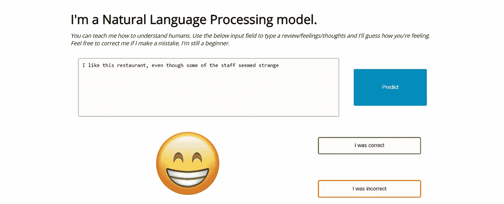
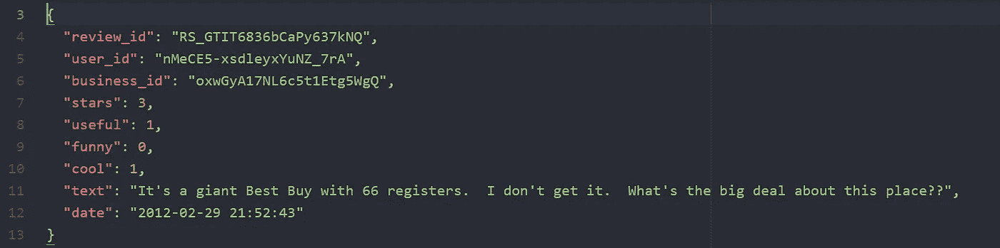
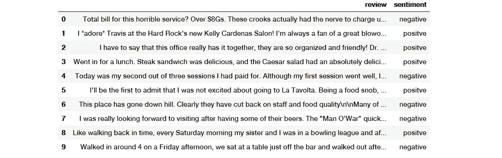
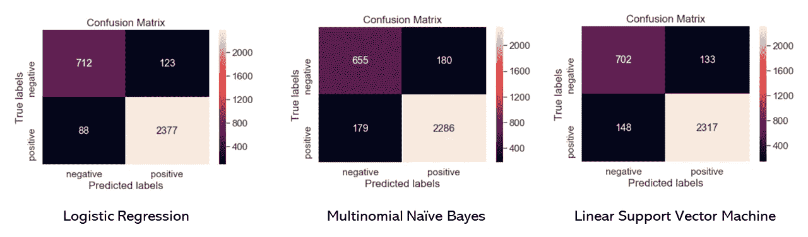
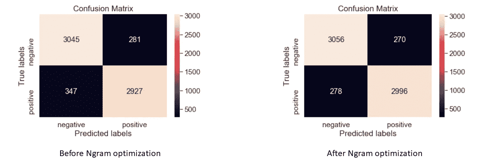
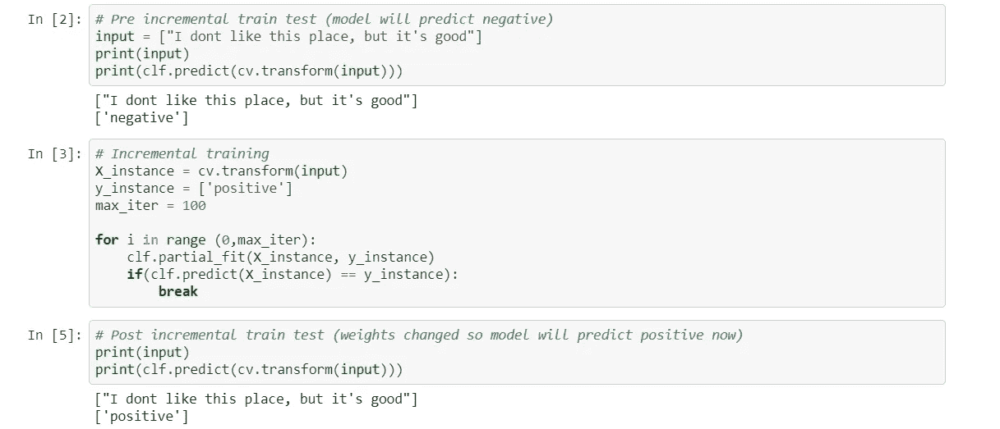

# 在两周内构建和部署数据科学项目

> 原文：<https://towardsdatascience.com/building-and-deploying-a-data-science-project-in-two-weeks-3c63f0acdab1?source=collection_archive---------21----------------------->

## [数据科学冲刺](http://towardsdatascience.com/tagged/data-science-sprints/)

## *通过构建有趣的东西来学习自然语言处理、Flask 和 ML 模型部署的基础知识！*



End product: a sentiment analysis web application with built-in ongoing learning capacity

我是一个动觉型学习者；我通过做、建造和破坏东西来学习。在这篇文章中，我将分享我如何建立一个基本的情感分析机器学习模型+web 应用程序，并在不到两周的时间内部署它，以学习三种新技术-自然语言处理(NLP)，flask 和增量/持续学习。

# 学习成果

我从事这项事业的主要目标如下:

1.  学习 NLP 基础知识并训练情感分析分类器
2.  了解如何使用 flask 构建 web 应用程序
3.  了解基于 ML 的 web 应用程序部署

我想以一种快速构建/学习的模式来完成这一切，重点是功能性，而不是美观性。我最终探索和学习的一些其他主题包括模型优化、增量/持续学习和 jQuery。**本文使用的所有 Jupyter 笔记本和代码都可以在我的** [**Github**](https://github.com/hr23232323/nlp_medium_p1) **上找到。**

# 数据集

对于这个项目，我需要一个数据集，它包含文本数据，但已经被标记和结构化。这将使我能够专注于基于 NLP 的预处理，同时浏览其他形式的数据准备。在看了几个不同的选项后，我最终选择了 [yelp 评论数据集](https://www.yelp.com/dataset)，因为它是预先标记的(文本评论和 1-5 星评级)，但评论中的实际文本是混乱和不一致的。您可以从下面的原始 JSON 数据集中看到一个示例记录



Example record from raw JSON data

对于我的模型，我只对文本评论和 1-5 颗星感兴趣(也许将来我可以尝试用其他属性做一些有趣的事情)。此外，为了进一步简化我的培训流程并坚持快速发展的心态，我决定将标签从 1-5 分修改为与文本审查相关的积极(4 或 5 星)或消极(1 或 2 星)情绪。我放弃了 3 星评级的评论，因为它们的分类很难验证。几行代码之后，我把我的数据放在一个熊猫的数据框架中，如下图所示



Pandas dataframe with just the text review and positive/negative sentiment

这个文本有许多潜在的问题。有些字符如 *** 和 *\n* 对帮助理解文本没有实际作用，而其他字符如 *$* 和*！*，可以洞察评价者的感受。此外，有许多人类可以理解的单词/俚语(8Gs = 8000 美元)，但对机器来说几乎没有意义。所有这些以及更多的场景将在下一节中解决。

# 自然语言处理流水线

为了准备分类数据，我们必须首先设计一个 NLP 管道来准备文本数据。NLP 管道涉及几个步骤，其中一些步骤如下所示


Sample NLP Pipeline

在我们的例子中，像词性标注和命名实体识别这样的步骤不是很有用，因为手头的任务是一个样本分类问题。因此，我们将把重点放在最划算的技术上:标记化、停用词去除和 ngram 利用(下面讨论)。

对于我的 NLP 模型的第一次迭代，我决定使用 sklearn 的`CountVectorizer()`方法实现一个简单的单词袋模型，并在大约 100，000 行上训练它。我利用 sklearn 的`train_test_split()`方法将我的数据分解成训练和测试块。在尝试了一些不同的分类器(如逻辑回归、多项式朴素贝叶斯和线性支持向量机)后，我发现逻辑回归模型最适合这些数据。这是各个分类器的混淆矩阵-



Confusion Matrices for the various classifiers

进一步思考，我发现逻辑回归模型将无法在项目后期利用增量学习，而线性 SVM(由 sklearn 的`SGDClassifier()`提供支持)可以。精确度的折衷很小，逻辑回归的平均 F1 值为 93%，而 SVM 的平均 F1 值为 92%。因此，我决定继续进行线性 SVM，以便在项目后期利用增量学习。

另外，我选择用`HashingVectorizer()`替换`CountVectorizer()`,因为它使用一种叫做哈希的技术来将输入处理模型的大小减少 99%。唯一的主要损失是失去了查看模型中显式单词的能力(哈希将所有单词转换为数字)，这对我来说不是一个大问题。你可以在这里阅读更多关于这款车型的信息[。](https://scikit-learn.org/stable/modules/generated/sklearn.feature_extraction.text.HashingVectorizer.html)

# 模型优化

我做了一些事情来优化我的模型。正如你从上面的困惑矩阵中看到的，我的培训和测试数据中负面评价的数量都比正面评价少。这导致我的负标签 F1 分数为 82%，正标签 F1 分数为 94%。为了减少这种差异，我必须通过确保对应于两个标签的记录数量是可比较的来平衡我的数据集。在平衡我的数据集后，我开始省略停用词，如*和，一个*等。从单词袋模型来看。

在这两个步骤之后，我的模型的 F1 分数从 92%下降到 91%，但是之前两个标签之间的差距变小了。我的负面和正面评论的 F1 分数分别是 91%和 90%，所以总体上分类器表现更好。接下来，我决定利用 **ngrams** 来进一步优化我的模型。

Ngrams 简单地指的是一组连续的 n 个共现的单词。比如说-

`In the sentence "I love data science", the 1-grams would be ["I", "love", "data", "science"]. The 2-grams would be ["I love", "love data", "data science"] and so on.`

从上面的例子中，您甚至可以看出为什么使用 ngrams 会有所帮助。出现在一个句子中的两个单词“数据科学”会比一个单词“数据”和“科学”提供更多的信息。现在，回到优化:我利用 1.2 克来进一步加强我的模型。优化前后的混淆矩阵如下-



Before and after the ngram optimization

正如您所看到的，这是一个重大的改进，因为正面和负面的错误猜测都减少了。该模型的最终 F1 分数上升到 92%，两个班级之间的差距可以忽略不计。此时，模型已经准备好。接下来，增量/持续学习。

# 增量学习

正如你们已经看到的，我们的情感分类模型远非完美。这就是增量学习的魅力所在。

> 增量学习是一种机器学习范式，其中每当新的示例出现时就进行学习过程，并根据新的示例调整已经学习的内容。

如果你想一想人类是如何学习语言的，你会很快发现他们是在渐进地学习。每当父母纠正一个孩子，老师纠正一个学生，或者两个朋友互相纠正，一种增量学习的形式就发生了。在这一节中，我们将为我们的 NLP 模型构建一个类似的系统，这样当它出现分类错误时，用户可以“纠正”它。

还记得我们之前因为这个功能选择了 SGDClassifier()吗？SGDClassifier 有一个内置的`partial_fit()`方法，它将帮助我们用几行代码实现增量学习，如下所示

```
# Incremental training# example x
X_instance = cv.transform(["I like this place, but not much"]) # user determined label
y_instance = ['n']# max iterations of training until the classifier relearns 
max_iter = 100# loop for a maximum of max_iter times
# partially fit the classifier over the learning instance
# stop when classifier relearns (or max_iter is reached)
for i in range (0,max_iter):
    clf.partial_fit(X_instance, y_instance)
    if(clf.predict(X_instance) == y_instance):
        break
```

利用这一点，无论何时出现错误，我们都可以在新数据上训练我们的模型，同时仍然保持初始训练。下面可以看到一个例子——



Example of incremental learning

# 总结和第 2 部分

到目前为止，我们已经取得了相当大的成就:我们已经创建了一个基本的 NLP 分类器，它可以读取一段文本，并将情绪分为积极或消极。我们已经使用停用词和 ngrams 等 NLP 技术优化了我们的模型，以实现 92%的基线 F1 得分。最后，我们已经编写了代码来增量训练我们的分类器，只要它出错，学习就不会停止！

在下一部分中，我们将在前面介绍的基础上，使用 Flask 构建一个基本的 web 应用程序。特别是，我们将构建 API 来对用户输入的文本进行分类，并逐步教授/纠正我们的模型。这将使我们能够作为用户与我们的模型进行交互，并进一步了解机器学习模型部署！

我希望你喜欢读这篇文章，就像我喜欢把它放在一起一样。如果您有任何问题、反馈或意见，请随时通过 [LinkedIn](https://www.linkedin.com/in/harshrana1997/) 或我的[网站](http://www.harshrana.com)与我联系。

[1]:耿 x .，史密斯-迈尔斯 K. (2009)增量学习。载于:李世泽，贾恩(编)《生物识别百科全书》。马萨诸塞州波士顿斯普林格