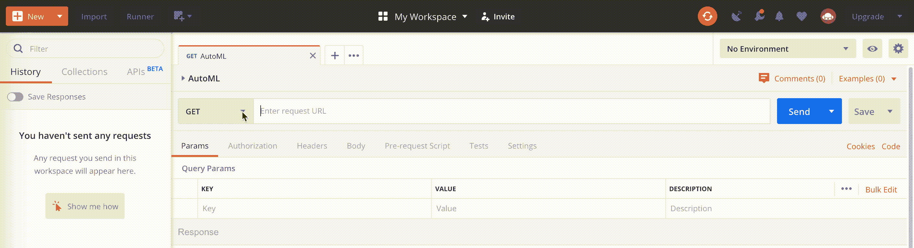

# 在 Azure 上使用自动化 ML 构建和部署机器学习模型。

> 原文：<https://towardsdatascience.com/building-and-deploying-a-machine-learning-model-with-automated-ml-on-azure-b586a0e7d448?source=collection_archive---------17----------------------->


Overview of the automated machine learning process.

这篇文章讲述了使用 Azure 的自动化机器学习功能的基础知识。我们将训练和部署一个可操作的机器学习模型。在这篇文章之后，你将能够构建一个端到端的解决方案来部署一个机器学习模型，而无需编写任何代码。

目标是帮助您理解构建和部署机器学习模型的基础。它不会涵盖建模技术/最佳实践、安全性/授权等概念，但对于以下人员来说是一个起点:(1)希望在不编码的情况下构建 ML 模型，或者(2)希望了解自动化机器学习的可能性以及这对您和您的组织有何价值。

在这个练习中，我们将使用微软 Azure 的自动机器学习平台。我们设置环境/资源，在数据集上训练多个模型，并在 Azure 上部署这个模型，这样我们就可以实际使用它了。

本文共分三个部分:
1 .**【无聊的东西】**(在 Azure 中设置资源)
2。**【酷玩意儿】**(训练模特)
3。**“我现在可以展示我的朋友”**(部署模型)

*所以事不宜迟，让我们来构建一些很酷的东西(又名* ***无聊的东西)！***

# 建立

## **注意事项**

使用 Azure 上的服务需要花钱。有办法获得免费学分或试用期(例如:通过 [*这个链接*](https://azure.microsoft.com/en-us/free/services/machine-learning/) *)。)*

整个实验花了我 3.02€(没有使用任何免费信用):


Total costs for Azure Automated Machine learning experiment.

在本文的最后，我们将介绍如何清理，这样我们就不会产生任何意外的成本。

让我们开始吧！

## **一笔账**

*(在此注册*[](https://azure.microsoft.com/en-us/free/services/machine-learning/)**如果您还没有 azure 帐户，并确保您设置了支付方式，这应该是注册过程的一部分)。**

*注册后，你应该会看到你的默认 Azure 主页:*

**

*Azure Home Page*

## ***创建资源组***

*资源组是“保存 Azure 解决方案相关资源的容器”。它将帮助我们容易地区分属于我们的 ML 模型和部署的资源(*，并将帮助我们以后容易地删除它)。**

*从 Azure 主页，点击左侧菜单中的“资源组”并创建一个新的资源组:*

**

*Create new resource group in Azure Portal*

*在这个练习中，地区并不重要:根据你在这个世界上的位置选择一个。*

## ***创建机器学习服务工作区***

*Azure 机器学习服务是一个资源集合，可以帮助你创建、测试和部署机器学习模型。自动化 ML 是这个集合的一部分，这就是我们在这里使用的。确保将新资源分配给上面创建的“autoML”资源组。*

**

*Create new resource in Azure Portal*

**在这个练习中，地区并不重要:根据你在这个世界上的位置选择一个。**

## ***下载** [**数据集**](https://www.kaggle.com/dgomonov/new-york-city-airbnb-open-data/downloads/new-york-city-airbnb-open-data.zip/3) **。***

*在本文中，我们将构建一个回归模型来预测纽约市 AirBnB 的正确价格。数据来自 Kaggle，可通过[链接](https://www.kaggle.com/dgomonov/new-york-city-airbnb-open-data/downloads/new-york-city-airbnb-open-data.zip/3)获得。*

*我们现在可以把这个文件保存在本地:我们将在下一节把它上传到 Azure。*

## ***重述***

*我们已经为 Azure 创建了一个帐户，建立了一个资源组来组织我们与此练习相关的资源，并创建了一个 Azure 机器学习服务工作区，我们可以从我们的主页上看到:*

**

*A brand new ‘autoML’ workspace is visible under our recent resources (or by searching in the top bar)!*

**恭喜恭喜！我们已经做了无聊的事情！让我们赶紧过去做一些实际的数据相关的工作。**

# *培养*

*在我们的 Azure 主页上，我们可以点击“autoML”资源进入资源页面。我们将通过点击“立即启动预览”横幅使用新界面，或者通过[此链接](https://ml.azure.com/)直接进入新界面。所有的训练步骤都将在新的 Azure 机器学习界面上执行。*

*选择最近创建的订阅和 Azure 机器学习资源:*

**

*Your subscription and machine learning workspace.*

***上传数据集** 导航至“数据集”(左侧菜单)，上传解压缩后的数据集“Output.csv”，然后点击“创建数据集”。*

*从本地机器选择文件。所有其他设置可以保持原样。单击完成后，数据集将上传:*

**

*Uploading a dataset into Azure Machine Learning Services*

*现在，我们的数据集将从“数据集”页面可见:*

**

*datasets for Automated Machine Learning*

## ***创建并运行实验***

*从菜单中，转到“自动化 ML”并点击蓝色的“创建实验”按钮:*

**

*create automated machine learning experiment*

*在下一个屏幕中，我们必须提供一个名称和训练计算。你可能想知道“训练计算”是什么意思。我们想要训练的模型需要一台计算机来运行。Azure 提供虚拟计算机，这些计算机位于世界各地的大型数据中心。这使得我们可以在需要的时候启动任何大小的计算机，并在完成后再次关闭，只使用我们需要的东西。*

*在本练习中，我们将启动一个小型计算资源(虚拟机)。单击“创建新计算机”并为其命名，如 autoML。我们将使用默认的 ***标准 _DS12_V2 — — 4 个 vCPUs，28 GB 内存，56 GB 存储*** (保留其他设置不变):*

**

*Creating a new compute. After clicking create it takes up to a few minutes to provision the resource.*

*当我们选择一个实验名称时(我选了*——惊喜！-*“autoML”)新计算已创建，请确保选择我们刚刚创建的培训计算，然后单击“next”。*

*接下来，我们选择之前上传的数据集，我们将被要求输入更多内容。**现在，对于我们的用例，目标是根据数据集中的其他信息预测价格(目标列)。***

**

*Dataset settings for automated machine learning*

*我们可以检查 profile 选项卡来进行一些数据探索，但是为了简洁起见，我们将直接选择要包含的列，即预测任务和目标列:*

**

*Data model for Automated Machine Learning*

*首先，我们排除模型中不需要的列。您可能会在将来探索/包括其他专栏，但是按照本教程:选择与我所做的相同的专栏。我们包含的列有:邻居 _ 组、邻居、房间 _ 类型、价格(*目标列* **)、**最低 _ 夜数、评论数、最后 _ 评论、每月评论数。*

*我们正在预测一个数量(每晚的价格)，所以我们的*预测任务* 是**回归**，*目标列* 是**价格**。*

*我们可以使用高级设置，在将来的实验中你可能会用到，但是现在我们让它保持原样。这意味着我们选择“Spearman 相关性”作为衡量和比较模型的主要指标。我们把培训工作时间设定为 30 分钟。*

*向下滚动，点击开始，恭喜你自己！您现在是数据科学家了！**

*Azure 现在将增加合适的资源。之后，ML 的实际“自动化”部分开始了:Azure 将尝试并适应不同的模型和设置，以找到最适合我们的数据和练习类型(回归)。我们将很快开始看到不同的模型和它们的准确度分数。此外，在运行期间，我们不必停留在任何特定的页面上；所以请随意浏览 Azure ML 界面。*

*请记住，Azure 将需要一些时间来旋转资源并获得第一批模型的结果，因此整个过程需要的时间比我们选择的 30 分钟训练时间更长。*

*但是不要告诉你真正的数据科学家朋友和同事，因为他们可能不会同意。*

## ***排行榜***

*在实验运行期间和之后，我们可以通过排行榜查看每次运行的结果:*

**

*We can check out our experiment leaderboard! Here we can check out the different models that have been tested on our dataset.*

*通过点击任何已完成的迭代，我们可以看到一组更广泛的结果指标和图表:*

**

*Model results*

*一旦实验完成，我们可以四处看看，看看运行了什么类型的模型，它们的表现如何等等。之后我们将进入下一环节:**部署***

# *部署*

*酷！我们有一个排行榜和一个成功的模型。**现在怎么办？**我们还不能真正展示任何东西:我们希望给我们的模型输入列(如邻居、每月评论数和平均评论数)，然后接收每晚价格的估计。**进入本教程**的“我现在可以展示我的朋友”部分**！***

*为了获得每晚价格的估计，我们需要“部署”模型。这将成为一个“容器”,能够在指定的环境(python)上运行我们的模型代码(获胜的模型),并处理传入的请求。Azure 机器学习服务有一个非常棒的功能，包含在自动机器学习服务中，在部署时为我们做所有的工作:“部署最佳模型”。它在我们之前查看的排行榜页面上，以了解不同型号的表现。*

*使用您喜欢的任何部署名称和描述，并让评分脚本和环境脚本“自动生成”。点击部署，这将需要大约 20 分钟才能完成。*

**

*Deploying with Azure Automated Machine Learning*

*当我们的模型被部署时，这个模型将会出现在“模型”页面上。模型包括一个*端点。*API 端点通常被定义为“通信通道的末端”。这个定义本身并没有真正帮助我们(完全没有)，但是请这样想:我们有一个模型，我们希望通过发送*输入*(我们在模型中包括的列)并获得*输出*(每晚价格的估计)作为回报来与这个模型进行通信。我们不能对我们的模型/端点抛出任何东西，然后期望得到正确的响应，所以下一步是找到我们的端点并向我们的模型发送一个 HTTP 请求！*

*当我们部署模型时，Azure ML services 创建了一个 python 脚本，该脚本已经部署在一个“容器”中。这个容器运行在 Azure cloud 的某个地方，现在可以接收来自我们的 HTTP 请求了。*

*为此，我们需要做三件事:*

## ***确定终点计分 URI***

*在 Azure ML 界面中，可以通过从左侧菜单转到“端点”来获得端点*

**

*Azure Automated machine learning endpoints.*

*我们单击我们新部署的模型，将会看到一个属性列表，其中相关的一个是*“得分 URI”。**

**

*The scoring URI in azure ml. *Not showing up?* Your deployment might not be fully completed yet. The Scoring URI shows up when the complete deployment is finished.*

*还记得谈论 API 端点吗？这个评分 URI 是我们已经创建的模型的端点，这意味着我们可以向这个端点(输入)发送(“做请求”)一些东西，并将接收一个响应(输出)。如果我们正确地格式化请求，我们将得到我们想要的:给定输入列的每晚估计价格。*

## *创建一个 HTTP 请求*

*对于那些没有处理 HTTP 请求经验的人来说，这一部分可能会有点混乱，但是只要继续按照步骤操作，您就可以让它正常工作了！*

*从功能上来说，我们想要做的是发送一个 http 请求，在这里我们为已经包含在模型中的列输入值(*除了目标列，当然这是我们想要返回的一列)。*这意味着我们想发送以下信息:*

**“邻居 _ 组”、“邻居”、“房间 _ 类型”、“最低 _ 夜数”、“评论数”、“最后 _ 评论”、“每月评论数”。**

*这些信息被称为我们的 http 请求的“主体”, Azure [在他们的文档中描述了](https://docs.microsoft.com/en-us/azure/machine-learning/service/how-to-consume-web-service)我们应该如何格式化这些信息以使其能够被模型解释:*

**REST API 期望请求的主体是一个 JSON 文档，其结构如下:**

```
*{
    "data":
        [
            <model-specific-data-structure>
        ]
}*
```

*其中，我们的“特定于模型的数据结构”看起来像这样:*

```
*{
    "data": [
        {
            "neighbourhood_group": "Queens",
            "neighbourhood": "Ridgewood",
            "room_type": "Entire home/apt",
            "minimum_nights": 3,
            "number_of_reviews": 9,
            "last_review": "2019-06-26T00:00:00.000Z",
            "reviews_per_month": 2.1
        }
    ]
}*
```

*一个 HTTP 请求还包括一个或多个“头”，根据[文档](https://docs.microsoft.com/en-us/azure/machine-learning/service/how-to-consume-web-service)，我们需要添加一个“内容类型”头:*

```
*“Content-Type” : “application/json”*
```

*总而言之，基于:(1)端点/评分 URI，(2)正文(输入)和(3)标题，我们可以创建一个请求，该请求将返回(如果一切正常)每晚的估计价格！让我们来测试一下吧！*

**对于好奇的人(我假设你们所有人都做到了这一步):以下是完整的请求:**

```
*POST /score HTTP/1.1
Host: *<scoring-uri>*
Content-Type: application/json
User-Agent: PostmanRuntime/7.17.1
Accept: */*
Cache-Control: no-cache
Postman-Token: *<token-value>*
Host: *<scoring-uri>*
Accept-Encoding: gzip, deflate
Content-Length: 335
Connection: keep-alive
cache-control: no-cache{
    "data": [
        {
            "neighbourhood_group": "Queens",
            "neighbourhood": "Ridgewood",
            "room_type": "Entire home/apt",
            "minimum_nights": 3,
            "number_of_reviews": 9,
            "last_review": "2019-06-26T00:00:00.000Z",
            "reviews_per_month": 2.1
        }
    ]
}*
```

*这里面有一些我们没有涉及到的信息；不要担心，因为这对理解我们的端到端工作流并不重要。**进行到最后一部分！***

## ***发送 HTTP 请求***

*此时，您已经有了一个可通过 API 端点(评分 URI)调用的部署模型。任何人(实际上是任何人，因为我们没有对 API 进行任何授权)都可以通过 API 端点在他们的应用程序、笔记本或其他(商业)应用程序中使用您的漂亮模型。当我从两个段落向上发送请求时，我得到以下结果:*

```
*"{\"result\": [125.5851758821278]}"*
```

*厉害！因此，这告诉我们，给定模型输入(Queens，Ridgewood，whole home/apt，3 晚，9 条评论，2019 年 6 月 26 日的最后一条评论，平均每月 2.1 条评论)，估计每晚的价格将为 125.58 美元*

*很简单！显然你想看到这一点来相信它，所以我们开始吧:*

*下载[邮差](https://www.getpostman.com/)，API 开发免费 app。我们将使用 his 向我们的模型发送 HTTP 请求。一旦安装。我们将重复以下三个步骤:设置 URL(为 URI 评分)、添加内容类型标题和添加正文:*

*打开 Postman，从“新建”选项卡中选择“请求”:*

**

*Postman Create New Request*

*提供名称并创建收藏/文件夹，然后点击保存:*

**

*您将看到一个新屏幕，我们可以在其中创建 API 请求。*

*将“http 方法”设置为 POST，并在放置“输入请求 URL”占位符的位置复制评分 URI:*

**

*当我们转到 postman 中的“Body”选项卡时，我们采取两个动作:
1。将主体类型设置为“raw ”,并将类型设置为 JSON
2。将先前显示的请求中的请求列和值复制到正文字段:*

```
*{
    "data": [
        {
            "neighbourhood_group": "Queens",
            "neighbourhood": "Ridgewood",
            "room_type": "Entire home/apt",
            "minimum_nights": 3,
            "number_of_reviews": 9,
            "last_review": "2019-06-26T00:00:00.000Z",
            "reviews_per_month": 2.1
        }
    ]
}*
```

**

*Body and Response*

*我们之前讲的 header(“Content-Type”)是 postman 自动添加的，因为我们把 raw body 的类型设置为“JSON”。您可以在标题选项卡上看到这一点。*

*这意味着我们已经涵盖了请求的所有部分！是时候点击蓝色的发送按钮，完成我们的第一个请求了！*

**

*Postman response*

*你做到了！给自己一个击掌，放上你最喜欢的果酱(*我推荐*[DMX——派对(在这里)](https://www.youtube.com/watch?v=thIVtEOtlWM)为了这个场合)并向你自己的**部署的自动机器学习模型发出几个请求！***

*当您准备好时，请确保删除资源组，这样您就不会在 Azure 上产生任何意外费用:*

**

*Delete Azure Resource group*

# *考虑和想法*

*通过阅读本教程，您可能已经注意到，当涉及到使数据科学可操作时，有相当多的工作不一定与数据科学相关。我坚信对于任何数据工作者来说，实验都是有价值的。我们有一套令人惊叹的云服务提供商(开源)框架，可以快速轻松地开始测试新想法。*最重要的是入门！**

## *何时使用自动化 ML*

*似乎有一场关于自动化机器学习的持续辩论，人们大致分为两类:“那不是数据科学！”以及“我们根本不再需要数据科学家了！”。真相可能介于两者之间，但需要一定的细微差别。*

*它总是依赖于您的特定需求和可用的能力，但是考虑到您在选择 autoML 供应商/框架时拥有的选择数量以及它得到的关注数量，我们可以有把握地假设它会一直存在。*

*我认为了解并可能应用自动化 ML 将有助于组织利用新技术，这可能是有价值的，尤其是在以下情况下:*

1.  ***您没有数据科学团队**或者想要通过自动化“更简单”的数据科学任务来利用稀缺的数据科学资源。*
2.  *您想要迭代完整的端到端流程，以便**快速开发分析用例**。我们应该将时间分配到流程的所有部分，而不仅仅是建模部分，以确保我们最终得到的解决方案不仅准确，而且*有效(*可操作)。*
3.  *你想建立一个**‘基线模型’**。自动化的 ML 模型不一定是最终的模型。*

***我希望这是一个对你开始自动机器学习有用的教程！请在回复中留下你的想法/建议！***

****(随意伸手上***[***LinkedIn***](https://www.linkedin.com/in/robbertbrouwers/)***也是)。****

# **建议进一步阅读:**

***不同的自动化 ML 解决方案**—[https://medium . com/@ santiagof/auto-is-the-new-black-Google-automl-Microsoft-automated-ML-autokeras-and-auto-sk learn-80 D1 d 3c 3005 c](https://medium.com/@santiagof/auto-is-the-new-black-google-automl-microsoft-automated-ml-autokeras-and-auto-sklearn-80d1d3c3005c)*

***数据科学方法论**—[https://medium . com/forward-artificial-intelligence/the-Data-Science-methodology-50d 60175 a06a](https://medium.com/towards-artificial-intelligence/the-data-science-methodology-50d60175a06a)*