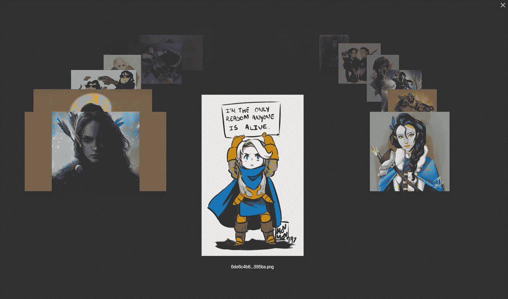
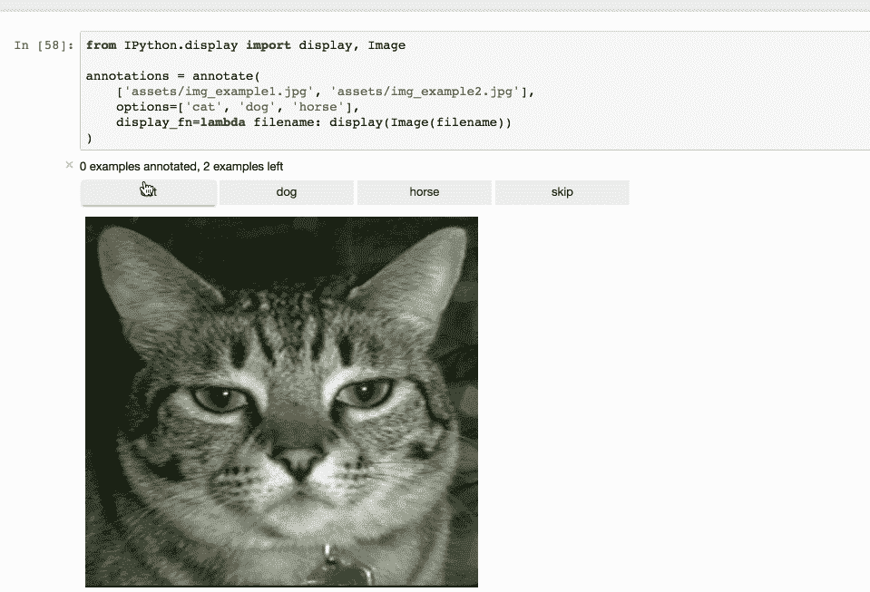
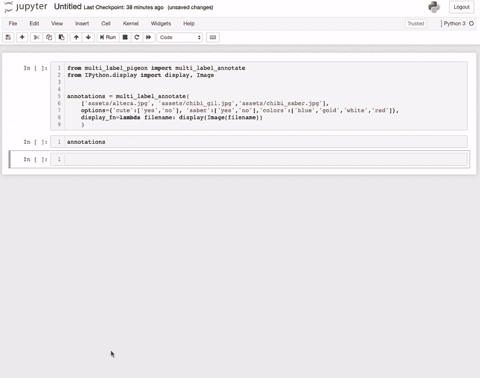

# 为数据科学项目构建和标注影像数据集

> 原文：<https://towardsdatascience.com/building-and-labeling-image-datasets-for-data-science-projects-ab59172e46b4?source=collection_archive---------9----------------------->

## 构建影像数据集的一些提示和技巧

使用标准化数据集对于新模型/管道的基准测试或竞争非常有用。但对我来说，至少当你把东西应用到你自己选择的项目中时，数据科学的许多乐趣就来了。这个过程的一个关键部分是建立一个数据集。

所以有很多方法可以建立图像数据集。对于某些事情，我只是合理地截取了一些截图，比如当我生病的时候，用《闪电侠》第四季建立了一个面部识别数据集，并用 [labelimg](https://github.com/tzutalin/labelImg) 对其进行了注释。我采取的另一条路线是手动下载一堆图像，只显示图像并在 excel 电子表格中标记它们……对于某些项目，你可能只需要用手机拍一堆照片，就像我制作[骰子计数器](/calculating-d-d-damage-with-tensorflow-88db84604f0a)时的情况一样。

这些天来，我想出了更多的技巧，使这一过程变得更容易一些，并一直在努力改进。

# 获取数据集的方法:

我下载图片管道中的第一个重大升级是使用一些基于 PyimageSearch 教程的 javascript 从谷歌获取图片 URL，并为[圣诞老人探测器](https://www.pyimagesearch.com/2017/12/04/how-to-create-a-deep-learning-dataset-using-google-images/)制作数据集。

这个的主要思想是你可以使用搜索作为那个类别的“标签”。所以你可以在谷歌上搜索圣诞老人，拉下这些网址，下载这些图片，用“圣诞老人”作为标签。这个过程非常好，我已经在一些个人项目中使用过。但是我们在技术上可以做得更好，另一个 PyimageSearch 教程为此铺平了道路。

作为前一种必须手动搜索并输入 javascript 的方法的替代方法，PyimageSearch 提供了另一个使用 Bing 搜索 api 快速制作图像数据集的教程[这里](https://www.pyimagesearch.com/2018/04/09/how-to-quickly-build-a-deep-learning-image-dataset/)。这是一个我非常喜欢的方法，它很容易与 Bing api 交互，以自动化的方式收集大量的图像非常好。我只在试用期间玩过 Bing API，但对结果很满意，所以如果真的是这样，我可能会根据需要付费。

这两种方法都可以让你相当快速地下载图像，如果你只是在做一个多类类型的问题，那么你已经有你的标签了。然而，需要采取一些额外的步骤来清理数据集，这种标注方法在多任务或多标签类型问题的情况下帮助不大。

# 下载完图像后

对于这两种方法，你通常每次搜索只能得到几百张与你给的搜索词相关的图片。我根据 PyimageSearch 教程采取了几个步骤。

1.  过滤掉小图片:当我下载图片时，我会检查它们的大小，过滤掉低于某个阈值的图片，比如任何一边低于 300 像素。由于大多数图像模型拍摄的图像介于 224x224 和 512x512 之间，这有助于剪切掉您可能已经提取的超低质量图像
2.  消除重复:如果看起来有很多完全相同的内容，你可以使用 Resnet18 之类的工具，通过检查重复的特征向量，把它们过滤掉。这在大型数据集上不是最实用的，但当有 1-10K 影像时，也不是那么糟糕。这样做的想法是，复制的图像可能会允许模型在性能指标上“作弊”，如果它们被放入训练和测试分割中，那么如果可能的话减少它们是好的。相位化是另一种潜在的重复数据删除方法，但由于图像的尺寸缩小得相当小，并且变成了黑白图像，因此非重复图像可能会出现重复，因此需要权衡。
3.  手动修剪…这不是最有趣的活动，但非常重要。在我摄影的日子里，我最喜欢使用的工具是 adobe bridge，据我所知，我似乎可以在新的 adobe 系统上免费使用它。不过，我也只是在 Windows 或 Mac 的 Finder 中用大图标做了这些。这是尝试从数据集中的不同类中移除低质量或不相关的数据。我发现这一步有点级联到最终模型和类的质量，所以如果你想要定义良好的类，我建议在删除图像时要非常积极。

Sample adobe bridge review mode with critical role!

我喜欢 adobe bridge 的原因之一是，我基本上可以用箭头键过滤图像，并使用向下箭头扔掉图像。当你完成审查模式时，你剩下的所有你没有丢弃的图像仍然被选中，所以我通常只是把它们复制到一个新的目录中，这个目录只包含干净的图像。对于一个项目，我在一两个小时内看完了 7K 张图片……如果使用默认的 Mac 界面，时间会长得多。

# 标记

因此，使用 PyimageSearch 方法，如果你正在处理一个简单的多任务问题，那么你可以为你下载的每一组 URL 标记标签，并将它们用作类别标签。然而，根据项目的类型，除了那些基本的类名之外，你可能还需要额外的标签。

对于我使用的管道对象检测模型，我更喜欢 [labelimg](https://github.com/tzutalin/labelImg) ，它有一组很好的热键，这样你就可以很快地通过标注数据集。

对于图像分割，我使用来自牛津[的注释器，通过](http://www.robots.ox.ac.uk/~vgg/software/via/) (VGG 图像注释器)。我猜他们是发明 VGG 建筑的牛津小组？

直到最近，我还没有真正想出在一张图片上标注多个标签的好方法，但是一位同事向我展示了一个叫做[鸽子](https://github.com/agermanidis/pigeon)的注释器。它有很好的功能来注释 jupyter 笔记本中的图像和文本数据，用于标准的多类分类或回归类型问题。这个图书馆很酷，建造这个图书馆归功于阿格马尼迪斯。

Sample pigeon usage for image classification

然而，我不怎么处理回归，也很少需要构建直接的多类数据集，因为我可以使用基于 PyimageSearch 方法的标签。许多现实世界的问题并不像只有一个标签那么简单，所以我倾向于做多标签和多任务类型的问题。所以我做了一个扩展了标准鸽子库的包来做多标签图像标注！

# 多标签鸽子

出于某种原因，当我看到鸽子库时，我觉得用它来标记我的多标签/多任务问题真的很酷。我做了我的修改，并将其添加到 pypi 中(这是我以前没有做过的，我基本上是按照[这个](https://dzone.com/articles/executable-package-pip-install)教程做的)。所以我想我正在介绍我的[多标签鸽子](https://github.com/sugi-chan/multi_label_pigeon)库！

在它目前的状态下，我所做的只是增加了一次标记多个任务的功能，用户可以选择他们想要的标签。这个想法是，与我以前主要靠手动操作的过程相比，它让一次标记一堆不同的问题变得更简单。也因为我不是最成人的，所以我用了赤壁命运系列的人物来显示注释。

Easy labeling is “good civilization”

基本上，演示显示的是如何标记 3 个任务问题。要标记的不同任务由一个字典定义，其中每个任务名称是一个键，一个潜在答案列表是值。

对于不同的任务，我只是标记一个图像是否。

1.  可爱:是或不是
2.  军刀(用剑？):是或否
3.  颜色:蓝色，金色，白色，红色。

前两个是二进制的，我只回答是或不是，但是对于颜色，我为一些标记了多种颜色。所有这些结果都记录在一个字典中，其中键是图像的路径，值是包含任务名称和为每个任务按下的按钮的字典。

对我来说，这是对我自己生活质量的提升，我想我可以把它扔进深渊，如果其他人认为它有用，他们可以随意使用它！

# 结束语

我最终建立了许多数据集，并像某种数据集龙一样囤积起来，所以我得到了一些不错的实践，并在此过程中学到了一些东西。因为它是项目中非常基础的一部分，但并不经常被谈论，所以我想发布一个关于它的帖子可能会很酷，但我仍然不确定它是否对人们有用(也许每个人都已经知道这些东西了？谁知道呢？).

但是在一天结束的时候，就像大多数写博客的事情一样，我认为把它扔出去是值得的，如果它能帮助一些人，那就太好了！如果没有，那也很酷！