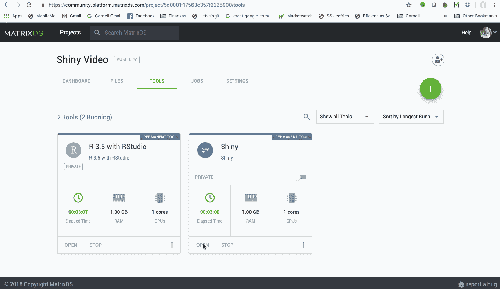

# 构建和共享闪亮的应用程序

> 原文：<https://towardsdatascience.com/building-and-sharing-a-shiny-app-a486ca9efca2?source=collection_archive---------17----------------------->

## 如何尽快上手

[支持本文的所有代码都可以从 MatrixDS 项目中派生出来](https://community.platform.matrixds.com/community/project/5d0001f17563c357f2225900/dashboard)


Photo by [Stephen Dawson](https://unsplash.com/@srd844?utm_source=medium&utm_medium=referral) on [Unsplash](https://unsplash.com?utm_source=medium&utm_medium=referral)

数据科学流程中一个经常被忽略的部分是部署一个可供非技术决策者使用的完整解决方案。RStudio Shiny 是构建和部署该解决方案的优秀工具。Shiny 为数据科学家提供了用 R 编程语言构建反应式 web 应用程序的能力。它也非常灵活，如果你想构建更健壮的东西，它允许你添加 HTML 和 CSS。作为一名数据科学家，我希望专注于构建能够产生价值的模型，并希望尽可能少地处理托管和基础架构需求。有几个工具可以帮助你托管一个闪亮的应用程序，最常见的是 RStudio Connect、shinyapps.io 和 MatrixDS。对于本教程，我们主要关注 MatrixDS，因为它是自包含的(您不需要使用任何其他工具来构建、托管和部署)。它还为用户提供了轻松协作创建模型和应用程序的能力。

TL；DR:这篇文章的其余部分大致遵循这个视频的结构。

在任何 MatrixDS 项目中，我们都可以创建一个闪亮的工具和一个 RStudio 工具。


如果你的项目还没有，Shiny 工具会立即创建一个“shiny-server”文件夹，并加载一个应用程序。r 文件。这个文件是闪亮应用程序模板的修改版本，当你点击“新建”，然后点击“闪亮 Web 应用程序…”时，RStudio 就会构建这个模板。Shiny 工具创建了一个容器，可以挂载和部署“shiny-server”文件夹中的任何内容。



以下代码行被添加到 Shiny 模板中以帮助部署:

```
.libPaths( c( .libPaths(), “/srv/.R/library”) )
```

这一行告诉托管闪亮应用程序的容器使用安装在 RStudio 实例中的相同库。

```
production <- TRUEif(production == FALSE) {
 #if you using the RStudio tool
 shiny_path <- “~/shiny-server/”
 home_path <- “~/”
} else {
 #if you are using the shiny tool
 shiny_path <- “/srv/shiny-server/”
 home_path <- “/srv/”
}
```

这里我们创建了一个名为 production 的变量。当 production 设置为 TRUE 时，应用程序将在闪亮的容器上运行。当 production 设置为 FALSE 时，应用程序将在 RStudio 中运行。因为每个工具都在一个单独的容器中，所以我们必须使用绝对路径，这样它们才能找到我们在代码中引用的文件或对象。

最后，你可以通过点击闪亮工具上的私人/公共切换来分享你的应用。当设置为公共时，任何具有该 URL 的人都可以看到生产中的应用程序，并且您可以轻松地将其与消费者或客户端共享。查看公开的闪亮应用程序不需要 MatrixDS 帐户。


如果您打开 RStudio 工具，您会立即进入我们创建闪亮应用程序的环境，无需安装。在这里，您可以进行任何修改，这些修改会立即显示在您的客户或同事正在使用的已部署版本上。


[现在就在 MatrixDS 上测试构建和部署您闪亮的应用程序](https://community.platform.matrixds.com/community/project/5d0001f17563c357f2225900/files)

在 LinkedIn 上联系我:【https://www.linkedin.com/in/alejandromartinezm/ 

在 MatrixDS 上联系我:[https://community . platform . matrix ds . com/community/Alejandro/overview](https://community.platform.matrixds.com/community/alejandro/overview)