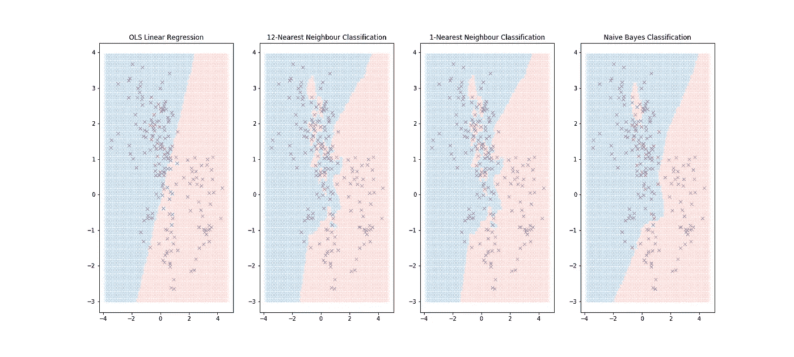
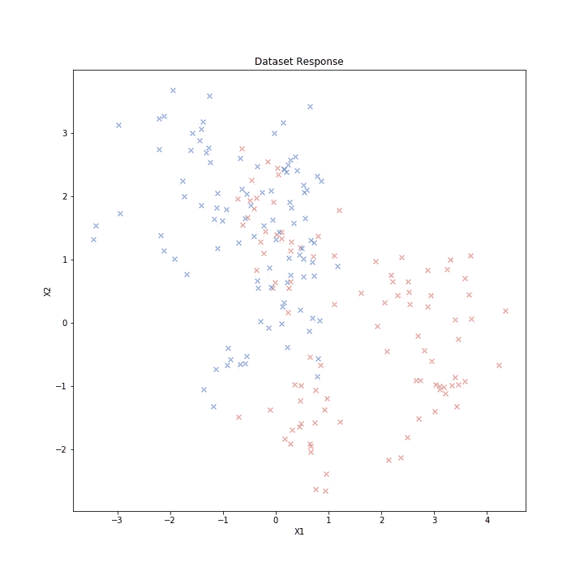
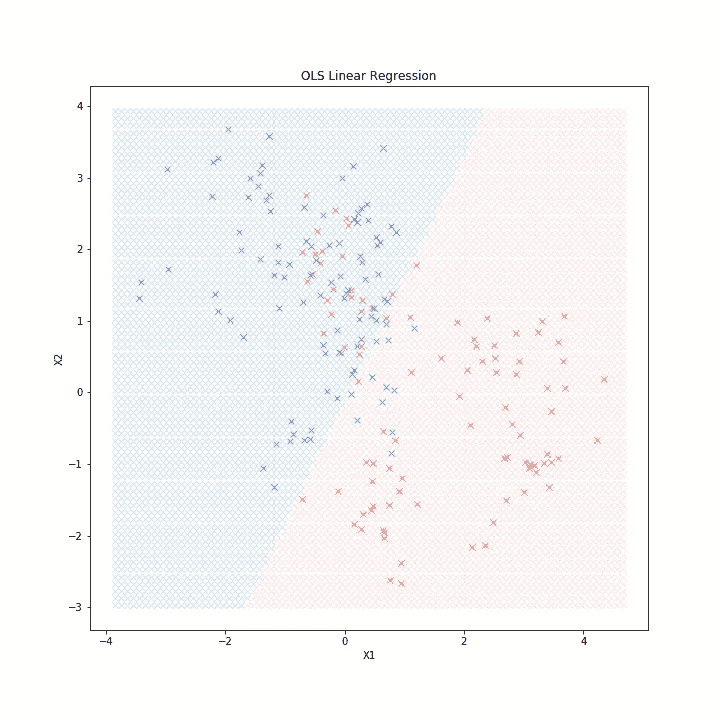
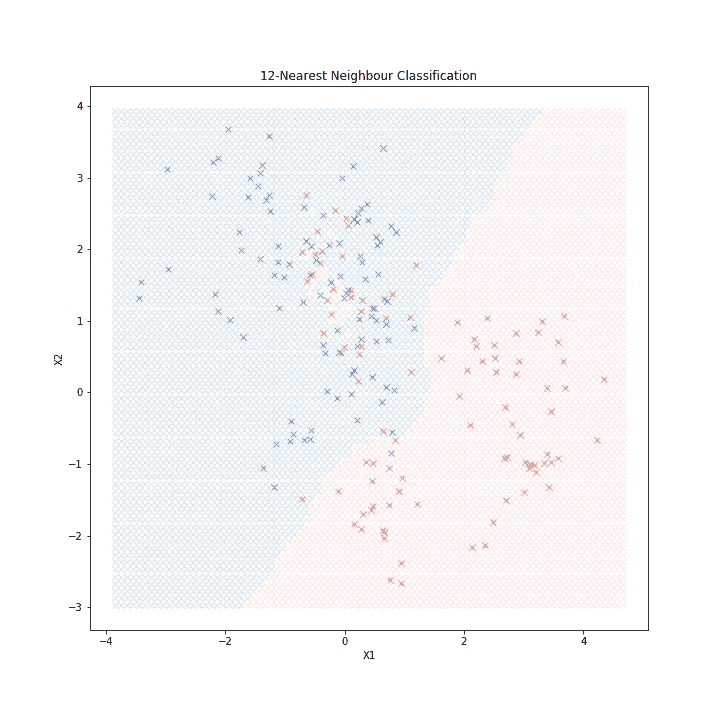
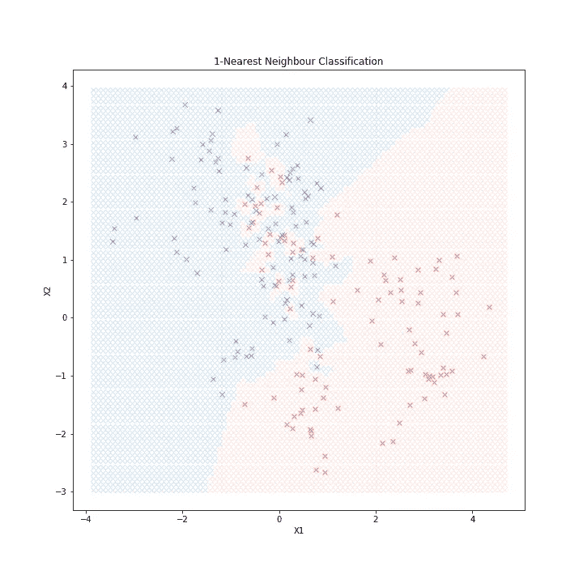
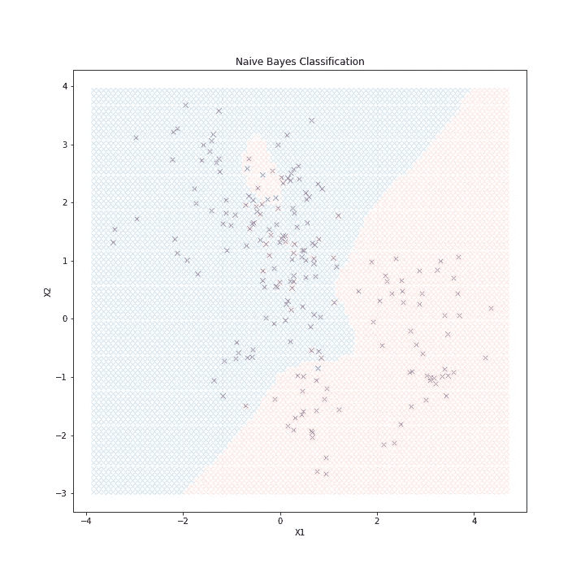

# 监督学习的构建模块

> 原文：<https://towardsdatascience.com/building-blocks-of-supervised-learning-cebab32c15ac?source=collection_archive---------10----------------------->

**监督学习**的目标是根据大量输入预测输出。在监督学习问题中，输入和输出变量都是可测量的。这一系列技术由几个关键要素组成:

A)学习算法——以动态方式响应输入生成输出的过程，即输入/输出关系根据原始输出和生成输出之间的差异进行自我修改。

b)教师——用统计学术语来说，是帮助指导学习过程的可测量的结果变量。

c)数据集——在机器血管中循环的血液。我们的算法必须从中学习的一组输入和输出。

本文旨在说明和探索三种简单而强大的预测/分类方法:普通最小二乘法拟合的**线性模型**、k 近邻预测规则和**朴素贝叶斯**分类器。这些技术的范围是巨大的。我是说，巨大的。事实证明，今天使用的流行技术的一个大子集仅仅是上述技术的变体(无论如何是针对低维问题的)。

我们开始工作吧。

**我们需要从数据中得到什么？**

人们通常认为预测的力量在于模型，但是也应该强调高质量数据的重要性。*质量*是什么意思？在基本层面上，为了避免正式的数学定义，我们需要一组可测量的输入变量， *X={X1，X2，…}* ，以及一个输出变量， *Y* 。由于我们关注技术，我们假设对于我们输出的每个观察值， *Y* ，在数据集中我们有一个完整的输入集， *X* ，在收集、精度、偏差等方面没有错误。

*打响指*

Figure 1 — Bivariate Training Data Scatterplot

图 1 显示了我们训练数据的散点图。对于每个观察，我们有一对连续的输入，用一个彩色十字表示， *X=(X1，X2)* ，还有一个离散的输出变量， *G* ，它决定了每个十字的颜色——鲑鱼蓝或矢车菊蓝。我们将这两个组称为**类**，我们的目标是建立一个可以将任何观察分类的模型，即任何一对输入( *x1，x2)，*分类为鲑鱼类或矢车菊蓝类。

我们有了数据集，现在让我们建立模型。

**线性模型**

线性建模(或**线性回归**)的基本原理是找到输入变量的*线性组合*，它能最好地预测/描述输出变量。

*   我们如何适应我们的模型？

我们使用关键成分 c) —我们的数据集！给定我们已经观察到的对 *(X1，X2)* 的集合，我们可以开始构建我们的模型 *f* ，作为 *(X1，X2)* 的某种组合，由原始输出(由我们的数据给出)和*f*生成的输出之间的差异指导。如果需要，我们的线性组合需要足够灵活，以允许部分(非整数)和多个变量。为了方便起见，创建了辅助变量—这些变量也被称为**回归系数**。

因此，“拟合模型”相当于优化一组系数值，以产生最接近*Y 的*估计值——等等！，我听到你喊，你说*关*是什么意思？问得好，需要一个度量标准来量化距离。通用指标也称为**损失函数**(或误差函数)，试图提供一个数字来概括特定模型在数据集上测试的不准确性。在这里，我们将使用一种非常简单但非常流行的方法，叫做**普通最小二乘法**(或者只是‘最小二乘法’)。该指标对我们训练集中每个观察值的模型估计值和原始输出值(平方误差)之间的平方差进行求和。最小化这个误差导致我们模型的最佳系数集。

注意，线性模型是一种回归技术，与分类技术相反。也就是说，它们的原始应用是用于定量变量而不是定性变量建模。对于我们的例子，在我们的连续回归输出之上还需要一个层。

设整数 1 代表三文鱼类，0 代表矢车菊蓝类。我们现在面临一个二元分类问题，如果模型输出大于 0.5，则选择在鲑鱼类中分类，否则在矢车菊蓝类中分类。这就是所谓的**决定边界**。图 2 描述了我们的线性模型及其决策边界。线以上的所有点被分类为矢车菊蓝类，其余的点被分类为鲑鱼类。

Figure 2 — Linear Regression Decision Boundary

因此，对于任何坐标(X *1，X2)* ，我们的模型立即吐出一种颜色——太棒了！完成颜色，发现行为，正确完成工作？不对。

这里做了一个关键的结构假设——基础过程表现出全局线性。换句话说，假设对于所有的 *X* ，Y 相对于 *X* 表现为恒定的变化率。如果这些数据是从以不同平均值为中心的两个独立分布中生成的，那么线性决策边界可能是最佳的。在这种情况下，没有提到生成分布。如果这两个类中的训练数据都来自 10 个低方差双变量高斯分布的混合，每个分布都有单独的、独立分布的双变量高斯均值，会怎么样？在这种情况下，没有理由建议最佳边界应该是线性的。虽然我们的视觉检查向我们显示了边界两侧明显的错误分类，但它没有向我们表明我们对潜在关系的误解有多严重。这举例说明了线性回归中的一个关键缺陷——严重依赖线性结构假设或统计术语，高**偏差**。

这就引出了另一种分类技术，它更适合我们刚刚介绍的场景。

**k 近邻(kNN)**

k-最近邻(或 **kNN** )的基本原理是基于来自训练集中在输入空间附近的观察集合的最常见输出来分配类别， *X* 。

*   我们如何拟合模型？

kNN 输出定义为 k 个最近输入的响应变量的算术平均值。同样，*最近的*意味着度量，所以我们将使用欧几里德距离([https://en.wikipedia.org/wiki/Euclidean_distance](https://en.wikipedia.org/wiki/Euclidean_distance))。对于给定点 *X=x* ，仅需要数据集的 *k-* 大小的子集，而不是像线性回归中那样汇集整个训练集。本质上，该方法将分类视为多数投票，并假设行为是局部恒定的，即行为在每个邻域内不会改变。

Figure 3–12 Nearest Neighbour Classification Boundary

与线性模型的情况一样，我们将整数值 1 分配给鲑鱼类，0 分配给矢车菊蓝类。那么对于任何给定的 *(X1，X2)* ，kNN 输出 *f* 被定义为一组 12 个二进制数的算术平均值。很快注意到，输出可能不是整数，因此再次需要边界条件，以便提供我们想要的输出{鲑鱼，矢车菊蓝}。如果 *f* 大于 0.5，我们选择归入鲑鱼类，否则归入矢车菊蓝类。

图 3 显示了 *k* =12 的实现。显而易见的是，从线性结构假设中解放出来，可以实现更灵活的边界，甚至可以在大部分矢车菊蓝色区域中容纳鲑鱼分类区域。这种灵活性是 kNN 方法的主要优点，但是如果我们改变 *k* 会发生什么呢？

Figure 4–1 Nearest Neighbour Classification Boundary

图 4 显示了算法的特殊情况，其中模型仅基于数据集中最近的观察值分配输出，即 *k* =1 的情况。请注意，训练集中没有错误分类，这乍一看可能很好，但会导致训练集之外的分类/预测的高**错误率**，尤其是在模型训练数据集很小的情况下。

请注意，不同的 *k* 值的边界是不同的，这会引入噪声和选择 *k* 的额外任务(这里我们不讨论)。当模型偏差较低时，kNN 受到高**方差**的影响。换句话说，该模型可能对训练数据非常敏感，并且可能过度拟合该模型，而不是描述真实的输入/输出关系。

由于这种技术对数据的假设更少，因此算法有更多的变化。更深入的研究将探索不同的距离度量、加权平均值和 k 的参数选择技术对决策边界的影响。

**朴素贝叶斯分类器**

朴素贝叶斯分类器的基本原理是使用我们的先验知识分类到最可能的类别，并且基于我们应该在多大程度上信任观察到的证据的数学定理(贝叶斯定理—[https://en.wikipedia.org/wiki/Bayes'_theorem](https://en.wikipedia.org/wiki/Bayes'_theorem))。

*   我们如何拟合模型？

该模型的程序需要计算和比较**后验概率**，该概率代表我们相信模型在给定所有输入 *X.* 的情况下准确描述 *Y* 的程度。这是一个封闭形式的计算，需要了解 *Y* 的分布(分布类型及其参数)。实际上，这限制了这种方法的使用——生成分布很少是已知的，但我们也要求它在某种程度上易于处理(易于评估)。

因此，为了使贝叶斯模型适合我们的例子，我们需要知道数据来自哪里。因为我自己模拟了这些数据，所以我可以告诉你，这些数据是由 10 个低方差高斯分布混合生成的，每个低方差高斯分布都具有单独的、独立分布的高斯平均值(就像前面讨论的场景一样！).

图 5 显示了这种方法的决策边界。

Figure 5 — Naive Bayes Classification Boundary

我们观察到边界看起来类似于 *k=12* kNN 方法，尽管看起来是一种非常不同的技术。

概率论认为，如果几个变量不以任何方式相互依赖，那么一起观察它们的概率就是独立观察每个变量的结果。事实上，这种假设很少成立，因为我们感兴趣的建模系统中的变量彼此之间往往存在某种联系。因为这个原因，这个方法是**幼稚的**。

**最后一个提示**

任意点 X=x 处 Y 的最佳预测是给定所有可用信息的期望值。

我们已经看到，这三种技术中的每一种都为我们的初始分类问题提供了一个解决方案，但是它们在过程和决策边界上都有很大的不同。事实上，所有这三个都是由上面的陈述支撑的，其中*最佳*是通过前面描述的平方误差损失函数来测量的。这种说法已经在统计决策理论中得到证明，被称为**回归函数**。每种技术的差异可以通过它们对回归函数的解释来很好地总结。

线性模型:*Y 在任一点 X=x 的最佳预测是给定所有可用信息的线性组合的期望。*

kNN: *对任意点 X=x 的 Y 的最佳预测是给定 X=x 周围 k 大小的邻域的期望*

朴素贝叶斯:*任意点 X=x 处 Y 的最佳预测是给定所有可用信息的期望值(假设生成密度已知)。*

这些构件是统计推断的重要基础。它们不仅易于实现，而且突出了统计建模的复杂性和在建模真实系统中出现的问题。自然延伸出现在以下问题中:

*   随着输入变量数量的增加，这些模型的性能会发生什么变化(*维数灾难*)？
*   我们如何比较模型的相对性能？
*   我们如何测试模型假设是否成立？为什么这些假设很重要？
*   如果我们用不同的损失函数重复我们的分析会怎么样？

欢迎反馈和评论！