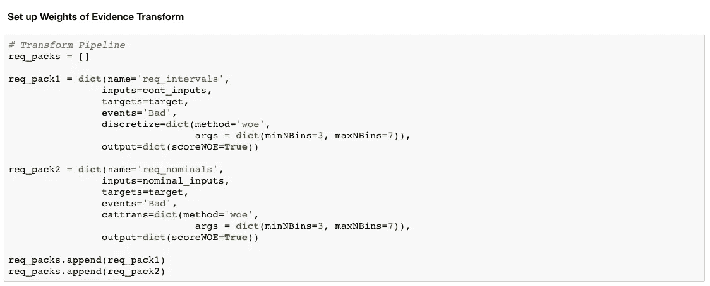
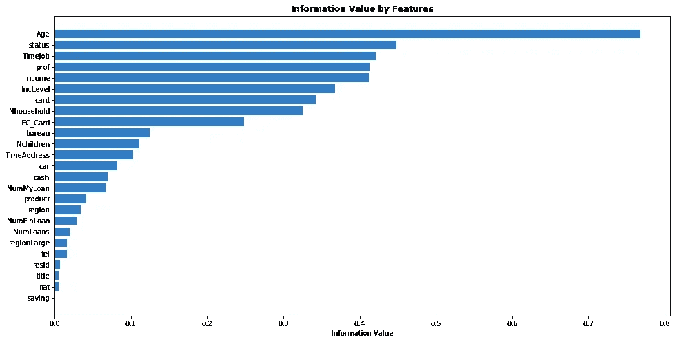
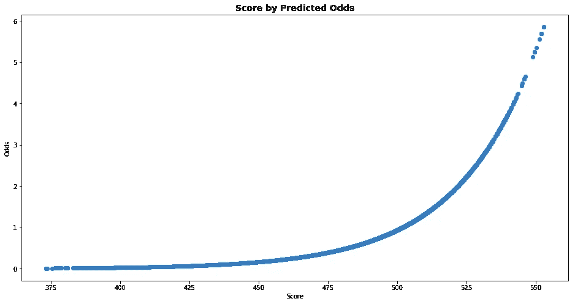
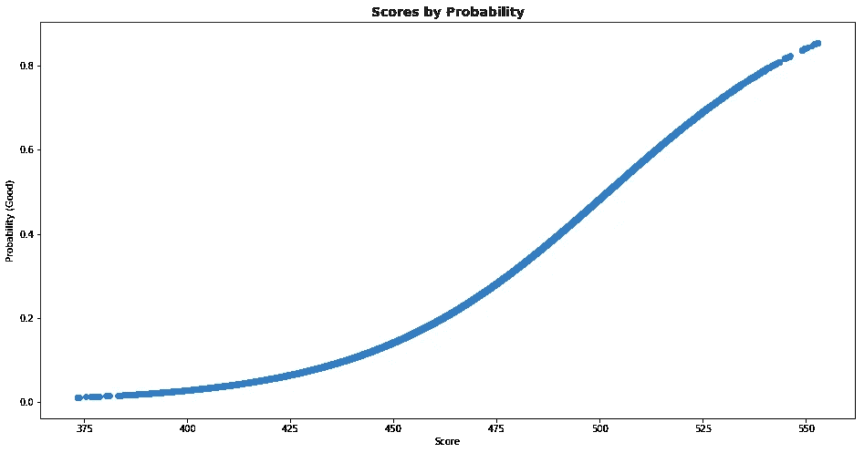
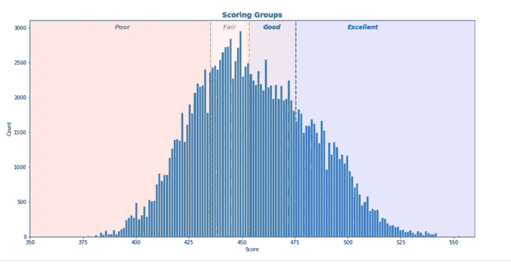
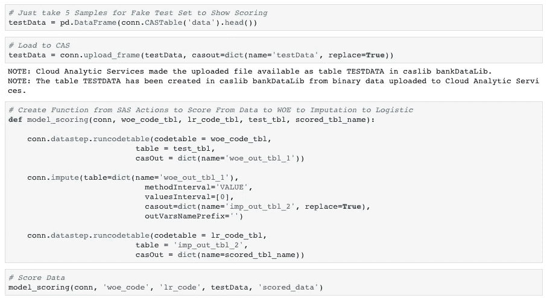

# 使用 SAS 和 Python 构建信用记分卡

> 原文：<https://towardsdatascience.com/building-credit-scorecards-using-sas-and-python-cf9c3ecc30bc?source=collection_archive---------8----------------------->

无论你是在申请你的第一张信用卡，还是在购买第二套房子，或者在这两者之间的任何地方，你都可能会遇到申请过程。作为这一过程的一部分，银行和其他贷方使用记分卡来确定你偿还贷款的可能性。

自然，这意味着信用评分对于银行和任何与银行业合作的企业来说都是一个重要的数据科学主题。

由于我以前有过客户分析的经验，但不是专门的金融风险，我一直在学习如何开发信用记分卡，我想分享我所学到的东西，包括我的想法和代码实现。

# 记分卡和信用评分的价值

记分卡有两种基本类型:行为记分卡和应用记分卡。

1.  行为记分卡更多的是对当前客户及其违约可能性进行预测或评分。
2.  当新客户申请贷款时，应用记分卡用于预测他们成为盈利客户的可能性，并将分数与他们相关联。

对银行来说，信用评分有助于管理风险。作为消费者，我们被各种优惠轰炸。由企业评估消费者的信用价值和信用评分，根据风险、周转时间、不正确的信用拒绝等因素确定最佳产品解决方案。

如果在不该放贷的时候放贷，那么未来很可能会亏损。如果批准或拒绝信贷的周转时间有很长的滞后时间，或者银行不准确地拒绝了一个良好的客户信用，他们可能会失去这些客户的竞争对手。在这种情况下，你可能需要很长时间才能找回它们。

使用信用评分可以优化风险，最大限度地提高企业的盈利能力。

# 信用评分数据

本帖中信用评分示例的训练数据是真实的客户银行数据，出于显而易见的原因，这些数据被篡改和匿名化了。这些特征——在信用评分中被称为特征——包括孩子数量、家庭成员数量、年龄、居住时间、当前工作时间、拥有电话、收入等。我们的目标变量将是一个二元变量，其值为“坏”或“好”，与给定的某个历史时期的客户违约相关。

# 信用评分代码

对于这个分析，我使用名为 [SWAT(用于分析传输的脚本包装器)](https://github.com/sassoftware/python-swat)的 SAS 开源库来用 Python 编码并执行 SAS CAS 动作集。SWAT 充当 python 语言和 CAS 动作集之间的桥梁。 [CAS 动作集](https://go.documentation.sas.com/?cdcId=pgmcdc&cdcVersion=8.11&docsetId=allprodsactions&docsetTarget=actionSetsByName.htm&locale=en)与 Python 中的库或 r 中的包同义。一个主要的区别和好处是，这些动作集中的算法已经高度并行化，可以在 [CAS(云分析服务)服务器](https://support.sas.com/resources/papers/proceedings17/SAS0309-2017.pdf)上运行。CAS 服务器是一个分布式内存引擎，我可以在其中完成所有繁重的工作或计算。代码和 Jupyter 笔记本在 [GitHub](https://github.com/aviolante/sas-python-work/tree/master/machine_learning/scorecard_post) 上都有。

# 信用评分法

*证据的权重*

我首先使用证据权重(WOE)方法转换我的数据。该方法试图通过将每个要素分割成多个条柱并为每个条柱分配一个权重来找到输入要素和目标变量之间的单调关系。假设收入水平上的 WOE 变换包括收入水平$ 100，000 到$ 150，000，那么该区间内的所有观察值将接收相同的 WOE 值，该值可以使用下面的公式计算。

Weight of Evidence Calculation

考虑收入水平在 10 万美元到 15 万美元之间的区间。在我们数据中所有“好”的观察结果中，30%来自这个收入水平区间，而只有 10%的“坏”观察结果来自这个区间。使用这些比例，你可以说，我们有 3:1 的赔率，收入在 10 万美元和 15 万美元之间的人是一个好的信用候选人，而不是坏的。然后，我们取自然对数和 100 的倍数，以便于用数字表示，我们得到了收入水平区间内所有观察值的收入水平权重值。

Weight of Evidence Example

*数据管道*

让我们将这种转换应用于整个数据集。使用 SAS 中的数据预处理动作集使得构建数据管道变得非常容易(图 1)。数据管道有助于常见手动数据科学步骤的自动化流程。该动作集可以为跨任何连续或标称特征的各种转换构建大型数据管道。

构建单一管道只需几个步骤:

1.  将变量分配给角色。
2.  构建变量转换。
3.  附加转换以便以后应用于数据。

首先，我们将特性分配给它们的角色，关于转换和建模，分离名义变量和连续变量以及目标(图 1)

Figure 1: Assign features to roles

接下来，我们创建名为 req_pack1 的第一个转换，它是 request package 的缩写，是 datapreprocess.transform 操作中的参数。我给转换命名，传递特性列表和目标，并指定感兴趣的事件，在本例中是“坏的”。

我在 Python 中调用 discretize 来绑定连续值并指定 WOE 转换。在该变换中有一个正则化参数，您可以在该参数中使用最小和最大 NBins 参数指定一个范围。这使得能够使用信息值(IV)在那些箱中搜索以找到最佳箱号。IV 是分类模型中常用的统计数据，用于衡量特征集的预测能力。

第二个转换，我将其标记为 req_pack2，除了我正在转换名义输入，因此需要使用 cattrans 而不是 discretize 之外，它几乎是相同的。cattrans 参数代表分类转换。

然后，我们将这些列表附加在一起，以便稍后将转换大纲传递给我们的转换操作。

Figure 2: Set up weight of evidence transformation

*数据转换*

现在我们已经有了数据管道，让我们来转换数据(图 3)。我首先使用 table 参数引用我们的数据。然后我提供了我在图 2 中创建的 req_packs 列表以及所有的转换。我将输出表(casout)指定为 woe_transform。接下来，我使用 copyVars 将 target 和 _customerID 特性从原始表复制到新的转换表中。然后我给我们所有新转换的特征一个全局前缀“woe”。code 参数将转换保存为代码表。这将在以后用于对新数据进行评分。这有利于希望进行模型协作或为重复出现的工作构建更深的端到端管道的团队。

最后，我们将预览一下新的 WOE 表(图 3)。请注意我们一些客户的相同值。请记住，发生这种情况是因为对于一个给定的变量，这些观察值属于同一个箱，因此得到相同的权重。

Figure 3: Transform data and view new dataset.

*可视化转化结果*

转换操作在 CAS 服务器上创建了几个输出表，如图 3 所示。其中一个表叫做 VarTransInfo，它包含我们特性的 IV 统计信息。查看 IV 以了解我们的特征的预测能力并确定是否有必要将这些特征包括在我们的模型中，这是一种很好的做法。下面是对 IV 的计算。图 4 是我们每个特性的 IV 值的曲线图。强特征通常具有大于 0.3 的 IV，弱特征< 0.02, and anything > 0.5 可能是可疑的，需要仔细观察。图 4 显示了我们的特性几乎分成了两部分，一部分是强特性，另一部分是中间特性。此外，年龄变量看起来非常强大。目前，我们将保留所有功能。

Figure 4: Information value (IV) calculation

我们还可以根据分配给特征的箱来绘制特征权重值。除了查看这些区间的 WOE 值之外，数据科学家可能希望返回并手动配置每个特定变量的区间数(合并或拆分),这样更符合逻辑。重要的是要知道，WOE 试图在单个特征内建立分离，因为它与一个目标变量相关，所以应该有跨箱的差异。图 5 显示了您期望在表示这些特征内的分离的多个条块上看到的 WOE 值。

Figure 5: Plot of WOE value by bin for several features

这正是数据科学家需要了解业务的地方，以确保各条块之间的加权趋势符合逻辑。例如，对一家银行来说，客户可用的现金越多，它应该在各个箱中看到更高的权重，这具有商业意义。同样的逻辑也适用于工作、年龄或职业群体的时间。我们预计所有这些权重相对于箱来说会更高。

# 记分卡的逻辑回归

我们的下一步是使用新转换的 WOE 数据集拟合逻辑回归模型。我将展示非常简单的代码来训练模型并解释参数。

下面的图 6 显示了训练代码。以下是训练模型所涉及的步骤:

1.  分配模型输入并将“woe_”连接到所有原始列名，以便它正确引用 woe_transform 数据集。
2.  使用 table 参数引用 woe_transform 数据集。
3.  指定目标和参考(根据模型参考“好”或“坏”)。
4.  然后，指定变量选择的正向选择方法。正向选择从一个空模型开始，并根据特定标准(AIC、AICC、SBC 等)在每次迭代中添加一个变量。).
5.  使用 code 参数保存我们的逻辑回归代码
6.  使用 casout 为新的输出表创建一个名称，然后再次复制 target 和 _customerID 变量。

Figure 6: Logistic regression model

# 创建记分卡

最后一步是将模型扩展到记分卡中。我们将使用一种通用的缩放方法。我们需要通过拟合模型得到的逻辑回归系数，以及带有转换后的 WOE 值的 WOE 数据集。我们将对我们的训练表进行评分，以得出 logit 或 log odds 值。因为我们从逻辑回归中得到的分数是对数比值形式，所以我们需要将其转换成记分卡的积分系统。我们通过应用一些缩放方法来进行转换。

第一个值是目标分数。这可以被认为是一个基线分数。对于这张记分卡，我们将分数定为 600 分。600 的目标分数对应于 30 比 1 的好/坏目标赔率(target_odds = 30)。缩放不会影响记分卡的预测力度，因此如果您选择 800 作为缩放分数，就不会有问题。

下一个变量叫做 pts_double_odds，意思是双倍赔率的点数。这意味着，分数增加 20 分，我们认为申请人在违约方面表现良好的可能性就会增加一倍。例如，如果你有 600 分，你有 30 比 1 的机会成为一个好的信用候选人。但是 620 分会让你被认为好的几率提高到 60:1。下面的图 8 显示了预测赔率和得分之间的指数关系。在下面的图 7 中，您可以看到简单的计算，以及如何使用它们来导出我们的记分卡分数变量。

Figure 7: Scorecard scaling and logic

Figure 8: Predicted odds by score plot

# 形象化

我们可以在图 9 中看到记分卡分数变量的分布，平均分数为 456。

Figure 9: Distribution of scores with mean score

然后，我们还可以看到这些分数如何与我们的业务成为好客户或坏客户的概率相关联，如图 10 所示。你可以看到很好的曲线形状。

Figure 10: Plot of scores by predicted probability

最后，我们可以使用这些分数来根据消费者的信用分数确定他们的等级。取决于产品、贷款等。这些层级将有不同的级别。对于我的分层系统，我只选择了四分位数来说明临界值的构建，但您可以根据产品或服务选择任何变化。

Figure 11: Customer groups based on quartile scores

# 拒绝推理

我想简单提一下拒绝推断，因为这是信用评分中的一个重要步骤。到目前为止，我们已经根据好坏的标签拟合了一个逻辑回归模型，并将这些分数换算成记分卡。整个过程着眼于当前的客户群，这些客户群拥有大部分完整的数据和已知的信用(好的或坏的)。然而，信贷申请往往会丢失大量数据，从而导致信贷被拒。在这种情况下，拒绝信用是由于我们有偏见的模型，它只查看我们知道是好是坏的人的完整记录。我们需要包含一些方法来调查这些拒绝，并将这些信息包含回我们的模型中，这样就更少偏见，更好地概括。

这就是拒绝推理所达到的效果。简而言之，我们查看那些被拒绝的客户，他们的信用状况未知，并分别处理这些数据，然后将他们重新分类为好或坏。这通常通过基于规则的方法、类似于原始 logit 模型的比例分配、增加否定的 logit 的原始分数等来实现。这个主题可以是一个独立的讨论，因为有各种各样的方法和思想流派。现在，我只想说，为了优化你的模型，使其不偏不倚，更好地概括，应该调查和整合由于缺失数据而导致的否定。

# 摘要

总的来说，使用证据权重转换和逻辑回归模型来为客户获得分数，对于同样使用业务逻辑感的数据科学家来说，是一个非常强大的工具。有许多方法可以建立这些评分模型，虽然这只是其中一种，但我希望它有助于提供指导或激发新的想法。此外，任何时候，数据科学家都可以处理复杂的问题，如转换和信用评分，并说明结果，这对从业者和组织都是一种胜利。

# 奖励:计分函数或 Rest API

我创建了一个函数，它使用来自转换和逻辑回归的 code 参数来对新的输入数据进行批量评分。它可以节省时间，并展示如何使用您的代码为新数据评分。

请看图 12，第一步是生成一个小的测试集，我通过从训练数据中获取一些观察数据来完成这个任务(只是为了测试)。然后将数据加载到 CAS 服务器。在这里你可以看到我构建的名为 model_scoring 的函数。它有 5 个参数:CAS 连接的名称、来自 woe 转换的代码、来自逻辑回归模型的代码、测试表名称和评分表名称。如果您查看 model_scoring 函数，会发现有三个步骤:

1.  runcodetable — woe 转换。
2.  估算-用 0 替换缺失的 woe 值。
3.  runcodetable 使用 woe 变换值的逻辑回归。

我使用评分函数对新数据进行评分。此时，您可以应用这些简单的记分卡计算方法，无论您想如何扩展，您都可以随时使用记分卡。

Figure 12: Scoring new data with scoring function

所有这些也可以使用 REST API 来完成。CAS 上的每个分析资产都使用 REST 端点进行抽象。这意味着您的数据和数据处理只需要几次 REST 调用。这允许将 SAS 技术轻松集成到您的业务流程或其他应用程序中。我使用 python 访问这些动作集和动作，但是使用 REST，您可以用自己选择的语言访问任何这些资产。

**参考文献**

1.  西迪奇，纳伊姆。*信用风险记分卡:开发实施智能信用评分*。第一版。，威利，2005 年。
2.  “数据处理”动作集的 SAS 开发者，非常感谢 [Biruk Gebremariam](https://www.linkedin.com/in/biruk-gebremariam-78590815/)
3.  在 [GitHub](https://github.com/aviolante/sas-python-work/tree/master/machine_learning/scorecard_post) 上完整的 Jupyter 笔记本演示
4.  附加感谢:[韦恩·汤普森](https://blogs.sas.com/content/author/waynethompson/)

*原载于 2019 年 1 月 18 日*[*blogs.sas.com*](https://blogs.sas.com/content/subconsciousmusings/2019/01/18/building-credit-scorecards-using-statistical-methods-and-business-logic/)*。*