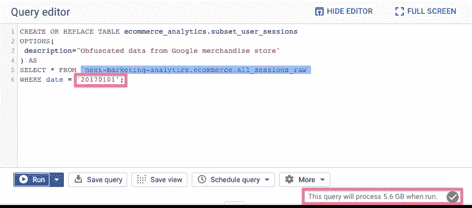
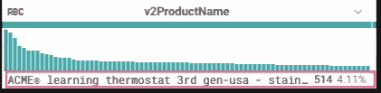

# 不用一行代码就能构建数据管道

> 原文：<https://towardsdatascience.com/building-data-pipelines-without-a-single-line-of-code-ccb10ff5abc2?source=collection_archive---------15----------------------->

## 使用 Google Cloud Dataprep 探索数据的智能而直观的方式。

[https://cloud.google.com/dataprep](https://cloud.google.com/dataprep)

厌倦了编写大量 python/java 代码来构建 ETL 管道或探索数据集吗？害怕编程来分析数据集？正在寻找一个基于用户界面的分析平台来帮助您处理这些大型数据集吗？对您来说，集成不同的工具是一项庞大而笨拙的任务吗？

瞧啊。你所有的祈祷/疑问都被 Trifacta 的这个叫做[**Cloud data prep**](https://cloud.google.com/dataprep/)**的神奇工具回答了。**它是与谷歌云平台集成的合作伙伴服务，支持数据工程和分析领域的众多工作流。在本帖中，你不仅将学习如何使用 dataprep，还将了解与谷歌云平台(GCP)服务的潜在集成。我们将借助 Cloud Dataprep 和 Bigquery 构建一个数据转换管道。

## 云数据准备概述

Dataprep 是一个基于 web 的、无服务器的、无操作的智能数据服务，可以可视化地对数据集执行探索性分析。它帮助您讨论和探索结构化和非结构化数据，以便进一步处理，用于机器学习、报告仪表板、分析框架等。
建议和预测加载数据的下一次数据转换的惊人能力使得分析对于那些犹豫要不要写代码的人来说变得轻而易举。
但是 dataprep 在数据工程领域，尤其是在 GCP 基础设施中的定位是什么:

From [https://cloud.google.com/dataprep/](https://cloud.google.com/dataprep/)

基于 GCP 的数据工程管道通常由上图中的部分或全部云服务组成。
数据的**摄取**可以发生在任何组件上，如 Bigquery、云存储或通常的文件上传。接下来是主要部分，在这里您设计您的数据以**准备**用于更深层次的模型构建和分析目的。这包括原始数据流入一个或多个(根据您的用例)数据处理引擎，如 Cloud Dataprep、Cloud dataflow，转换后的数据输出并存储在 [Bigquery](https://cloud.google.com/bigquery/) 或[云存储](https://cloud.google.com/storage/)中。

让我们深入了解构建并运行管道的任务:

## 任务分解

1.  设置您的云控制台
2.  将数据导入 BigQuery
3.  将 Bigquery 连接到 Dataprep
4.  Dataprep web 界面的探索性分析
5.  数据争论和管道配方
6.  计划数据准备作业

进一步阐明以上每一点:

## 1.设置您的云控制台

一旦你登录到你的谷歌[云控制台](https://console.cloud.google.com/)，创建一个新的项目，这个项目将用于本教程。单击顶部导航栏上的下拉菜单，然后单击+新建项目。

GCP project list page

Click on the `NEW PROJECT` icon

Provide the project name and click CREATE

成功创建项目后，确保您在环境中选择的新创建的项目反映在下拉列表中:

关于项目创建和管理的更多细节，这里是到[文档](https://cloud.google.com/resource-manager/docs/creating-managing-projects)的链接。

## 2.将数据导入 BigQuery

设置好开发环境后，我们需要设置 BigQuery，它在管道中同时扮演输入和输出存储的角色。下面是流程的样子:

Pipeline Flow Architecture

这篇文章的主要焦点是 Dataprep，但是我们需要 BigQuery 来导入数据(摄取)并在转换周期完成后在 Dataprep 中导出输出。

将数据导入 Bigquery 的说明:

1.  从云控制台的导航菜单(汉堡图标)中，点击 **BigQuery。**我们将被带到 BigQuery 控制台，这里有一个左窗格，列出了查询历史、保存的查询等选项，在底部，我们有`Resources`，在它下面必须显示我们的项目。点击并选择您的项目，在右边的查询编辑器下，`CREATE DATASET`选项被激活。

2.点击`CREATE DATASET`并输入`Dataset ID`作为`ecommerce_analytics`，这将是我们项目下数据集的名称。将所有其他字段设置为默认，点击底部的`Create dataset`按钮。

3.我们的数据集已经准备好以表格的形式存储数据。我们将通过查询来自`bigquery-public-data`项目的数据子集，使用来自谷歌商品商店的模糊的[谷歌分析 360 数据](https://console.cloud.google.com/marketplace/details/obfuscated-ga360-data/obfuscated-ga360-data?filter=solution-type:dataset&q=ecommerce&id=45f150ac-81d3-4796-9abf-d7a4f98eb4c6)。它伴随着每个新项目而来。
该查询使用标准 SQL。在查询编辑器中键入或粘贴 SQL 查询:

4.点击**运行。**左窗格现在应该是这样的:

该查询创建了一个名为`subset_user_sessions`的新表，其中包含 2017 年 1 月 1 日发生的 33，664 个用户会话。您可以通过选择左侧窗格中的表格，然后单击右侧的`Preview`选项来预览数据。

现在我们已经将数据导入到 BigQuery 中，让我们转到 Dataprep，将它链接到 dataprep 来研究这些数据。

## 3.将 BigQuery 连接到 Dataprep

在这里，我们将从 Cloud Dataprep 开始，并使用它连接我们的 bigquery 表。以下是该任务的步骤:

*注意:你需要一个 Chrome 浏览器，因为 Cloud Dataprep 只能与 Google chrome 配合使用。*

1.  从**导航菜单>打开 Dataprep。**
2.  您将需要启用计费以使用 Dataprep，如果您在云控制台上还没有计费帐户，则必须从导航菜单的计费部分创建一个。
3.  接受服务条款，然后授权 Trifacta 和 Google LLC 访问您的帐户信息。

4.点击`Allow`按钮，允许 Trifacta 访问项目数据，同步账户信息需要几分钟时间:

5.选择您想要登录的 Google 帐户，并允许 Trifacta 访问该帐户信息:

6.帐户设置完成后，您将首次被提示设置一个对话框，以提供一个位置来保存我们在 Google 云存储的 Dataprep 中创建的文件。确保选择了正确的项目，然后点击`Continue.`

7.欢迎来到主游戏场，云数据准备仪表板。一旦我们到了这里，我们就用 BigQuery 开始连接过程。点击右上角的`Create Flow`按钮。

8.输入`User Analytics Pipeline`作为**流程名称**并添加流程描述。

9.该从 BigQuery 导入数据集了，点击**导入&添加数据集，从左窗格**选择 **BigQuery** 。

10.点击您的数据集，当您的数据集表被加载时，点击如下所示的`Create Dataset`图标:

在右侧，一个窗格预览表格数据，单击底部的**导入&添加到流程**按钮。
连接成功建立，现在您可以向流程中添加新的配方了，因为右侧的`Add new Recipe`选项变得可用。

## 4.Dataprep UI 的探索性分析

现在我们的 BigQuery 项目数据被导入到 dataprep 中，我们可以开始进行[探索性数据分析。](/hitchhikers-guide-to-exploratory-data-analysis-6e8d896d3f7e)
EDA 过程中的第一步也是最重要的一步是与手头的数据建立联系，这有助于你评估可以从数据中获得的潜在洞察力。有不同的方法来进行最初的数据理解练习，我的方法是阅读[模式描述](https://support.google.com/analytics/answer/3437719?hl=en)如果有的话，然后我试着浏览每一列，并准备一个好问题列表来回答这些列或列的组合。
有关 EDA 的更多信息:

 [## 探索性数据分析指南

### 如何用 python 调查数据集？

towardsdatascience.com](/hitchhikers-guide-to-exploratory-data-analysis-6e8d896d3f7e) 

从我们上一节离开的地方开始，单击右窗格中的`Add new Recipe`按钮，然后单击`Edit Recipe`在 Transformer 视图中查看数据。

你可以在这里阅读数据集[来理解每一列的含义。因此，让我们定义几个问题，并使用 Dataprep 的工具和特性提取它们的答案。这将帮助我们了解数据和平台:](https://support.google.com/analytics/answer/3437719?hl=en)

1.  **数据帧的形状(行数和列数)是什么？**

在 transformer 视图的底部，您会发现我们的示例包含 32 列、12.5K 行和 4 种不同的数据类型。

**2。寻找列的最小值，最大值，下四分位数，上四分位数函数。**

要了解每列的统计和模式详细信息，请单击列名前面的下拉菜单，然后选择**列详细信息**。让我们试着找出以下各列的最小值/最大值:

*   `productQuantity`

单击列详细信息会将您带到摘要和统计信息页面:

最小购买量为 1，最大购买量为 50。

同样，
**最大/最小浏览量:1/115** 我们通过几个步骤修正后，就能得出网站花费的最小/最大时间。

> 注意:答案可能因您的子集而异。

**3。直方图在列标题下表示什么？**

直方图描述了列中响应的类别。例如**版本 2 产品名称**可以在上面的截图中看到。如果您将鼠标悬停在条形上，它会告诉您该类别在列中出现的频率，如下所示:

现在，让我们用这个来回答下一个问题。

**4。会议发起数量排名前五的国家:**

他们依次是:**美国>英国>印度>加拿大>日本**

**5。柱形图的颜色表示什么？**

您一定已经注意到列标题下有一个条形，它有不同的颜色，表示缺少和不匹配的数据类型值。

灰色表示缺少值，而红色表示不匹配的值。我们将在下一部分纠正这些错误。

**6。常见的流量来源有哪些？** 要回答这个问题，我们需要查看模式描述中的`channelGrouping`列。有 7 个来源，最常见的是:

**有机搜索>转诊>直接**

**7。常见的产品类别有哪些？** 要回答这个问题，我们需要查看模式描述中的`v2ProductCategory`列。共有 31 个类别，最常见的有:

**极致>服装>电子**

## 5.数据争论和配方制作

既然我们已经知道了与现有数据集相关联的问题，那么让我们来构建转型方案。我们需要为我们发现有问题的列定义数据清理步骤，就像上面数据集中不匹配的时间列一样。

1.  **修改**列`timeOnSite`的数据类型:点击列名前面的下拉菜单，从那里**修改类型>整数。**它会将所有值的数据类型更改为整数，这将是用户在网站上花费的秒数。

这里重要的一步是注意食谱图标，如果你点击它，会显示一个添加到它上面的步骤，如下所示:

在我们处理数据争论的过程中，这个方法会不断更新。

**2。删除未使用的列**:如果您仔细观察，会发现有几列有完整的灰色条，表明这些列都是空值(或者没有有效值)。这些列没有用处，是多余的。

*注意:我们不能删除所有包含空值的列，因为我们正在处理数据的子集。如果在删除前不确定某列，请阅读该列的说明。*

**如何删除栏目？**
单击列标题下的灰色栏，dataprep 将高亮显示所有缺少的值行。
现在，点击下拉菜单>点击**删除。**

对 **itemQuantity** 和 **itemRevenue** 列重复该过程，因为我们将使用 **productQuantity** 和 **productRevenue** 列，因为它们在其中有值，这对收入报告很有用。

现在，更新后的食谱看起来像这样:

**3。删除重复行:**EDA 中另一个非常常见和有用的步骤是从数据中删除重复行，在 pandas 中我们使用`drop_duplicate`函数，这里我们将使用顶部的工具栏。

点击**过滤行**图标，然后选择**移除重复行。** 系统会询问您是否要将此步骤添加到配方中，作为将来对所有输入数据集运行的步骤。
点击**添加。**

**4。向配方添加自定义公式:****totalTransactionRevenue**列包含交易产生的总收入。从[模式](https://support.google.com/analytics/answer/3437719?hl=en)文档中，您可以看到它已经乘以了 10⁶，但从数值上看并不清楚。

从**下拉菜单>计算>自定义公式:**

在打开的右窗格中，添加公式:

我们已经向**totalTransactionRevenue**列添加了一个定制的`**DIVIDE**`公式，预览可以在 transformer 视图中显示。点击**添加**，添加到配方中。

**5。合并列:**合并/连接是 EDA 中另一个非常重要和常见的任务，Dataprep 也能以最轻松的方式完成。让我们为每个用户会话创建一个主键列。

我们将 fullVisitorId、time 和 v2ProductName 用于此任务，因为它为每个会话提供了唯一的值，由一个`|`分隔，并将新列命名为 **main_id** 。

点击**添加。**

这是我带你走过的几个步骤，使用这个智能工具，你可以进行一系列的操作和操纵。

这是食谱现在的样子:

## 6.运行和调度 Dataprep 作业

现在管道已经准备好运行，点击右上角的**运行作业**。
因为出于分析或建模的目的，我们需要将转换后的数据添加回新表中的 BigQuery。
点击右侧的**添加发布动作**，然后选择 BigQuery 作为输出目的地，同步的数据集将变为可用，这里您需要使用右侧窗格中的**创建表**选项创建一个新表。

点击底部的**添加**即可:

设置好您需要的地区和机器类型后，单击页面右下角的“运行作业”。这项工作将需要几分钟的时间，一旦完成，您可以在 BigQuery 中检查您的结果，带有转换数据的表格正等着您！！

## **调度作业**

另一个重要的特性是在 dataprep 上调度作业运行的能力。在流程页面上，点击顶部的 3 个点图标，然后选择**计划流程。**

您可以选择时区、频率、日期和时间，如下所示:

## 结论

谁会想到将创建管道这一费力的任务简化到这种程度？正如我们所说，谷歌云团队正在添加一些无与伦比的工具和功能，以重新定义云计算的含义。在估算了 dataprep 为我们节省的工时数后，我着迷了，没有比这更有用、连接更好、界面更友好的工具了。更多有趣的工作流将被讨论，我很高兴揭开我要讲述的关于 GCP 数据工程的故事。敬请期待！！

# Harshit 的数据科学

通过这个渠道，我计划推出几个涵盖整个数据科学领域的系列。以下是你应该订阅[频道](https://www.youtube.com/channel/UCH-xwLTKQaABNs2QmGxK2bQ)的原因:

*   该系列将涵盖每个主题和副主题的所有必需/要求的高质量教程。
*   解释了为什么我们在 ML 和深度学习中做这些事情的数学和推导。
*   与谷歌、微软、亚马逊等公司的数据科学家和工程师以及大数据驱动型公司的首席执行官的播客。
*   项目和说明，以实现迄今为止所学的主题。

你可以在 [LinkedIn](https://www.linkedin.com/in/tyagiharshit/) 、 [Twitter](https://twitter.com/tyagi_harshit24) 或 [Instagram](https://www.instagram.com/upgradewithharshit/?hl=en) 上与我联系(在那里我谈论健康和福祉。)

注意:在这些黑暗的时期，自我隔离为自我提升腾出了一些空间，我们可以利用这些空间来发展新的技能、爱好，并帮助未来的自己。