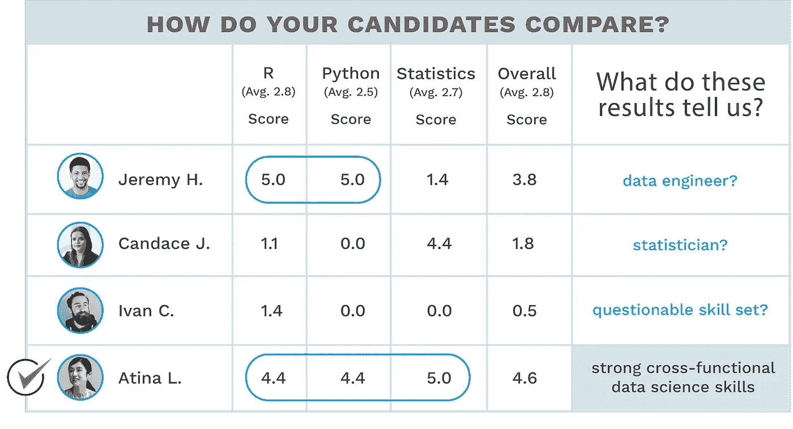

# 构建数据科学能力意味着长期博弈

> 原文：<https://towardsdatascience.com/building-data-science-capabilities-means-playing-the-long-game-f68166ecf2f?source=collection_archive---------21----------------------->

> "管理就是在制定长期计划的同时进行短期管理."
> ——杰克·韦尔奇

您是否对寻找和留住不需要大量时间和投资来发展的数据科学员工的挑战感到沮丧？你并不孤单。

最近在一次机器学习会议上，有人向我表达了对持续的数据科学人才短缺的厌倦。一家知名数据驱动型公司的高管哀叹道，他就是找不到“优秀的数据科学人才，他不必花大量时间去培训他们”。他的观点是可以理解的。这家公司多年来一直在数据科学能力上投资，远远领先于其竞争对手，并且*仍在*努力寻找和培养经验丰富的数据科学人才。

为什么？因为对顶级分析人才的竞争持续加剧，留住这些人才变得非常困难和昂贵，即使对于最数据驱动的品牌公司也是如此。此外，技术和所有计算机科学继续以闪电般的速度发展，而 zettabytes 的数据堆积如山。面对这些越来越多的挑战，也许是时候组织重新思考他们创建数据科学团队的方法了。

那么，该怎么办呢？美国政府给了我们一个线索。继最近关于保持美国在人工智能领域领先地位的[行政命令之后，美国前首席技术官 Meghan Smith](https://www.whitehouse.gov/presidential-actions/executive-order-maintaining-american-leadership-artificial-intelligence/) [敦促学校儿童学习代码并玩树莓派的](https://www.youtube.com/watch?v=tSguF3UOT_s)作为国家的必要事项。

这些权力正在向世界传递一个简单但关键的信息:在数据科学和人工智能方面，要为技能的长期发展进行规划和投资。不这样做的后果也很简单。您将数据科学人才融入组织的努力将永远不会停止。

你说的这些都不错，但是面对前面提到的每天产生的 zettabytes 数据以及从这些数据中获取价值的紧迫性，公司需要专注于当前迫切的数据科学需求。他们现在需要数据科学家。他们不能等待现在的八年级学生掌握技能并毕业。那么，他们有什么选择呢？

# QuantHub 在数据科学技能方面的经验

在 QuantHub，我们一次又一次地看到从入门级数据科学家、数据工程师到博士候选人的实际数据科学技能评估分数。你知道吗？技能无处不在。很少有候选人能在各种技能中脱颖而出。尽管如此，我们坚信有一个良好的数据科学人才“潜力”基础，正等待着进一步开发。这是缓解我们裁谈会的朋友的疲劳感的关键所在。

An example of the variety of skills scores we see on data science/engineering assessments

# 所以，让我们像麦肯锡那样定义长期游戏

我是麦肯锡研究的粉丝。他们往往处于一切事物的最前沿，并且长期以来一直非常活跃地研究数据科学领域。以下是麦肯锡如何推广雇佣数据科学家的想法，以提供一些视角。

十多年前的 2007 年，麦肯锡发布了“[八大值得关注的商业技术趋势](https://www.mckinsey.com/business-functions/digital-mckinsey/our-insights/eight-business-technology-trends-to-watch)”。在那篇文章中，它引用了“将更多科学纳入管理”是一种趋势，“技术正在帮助经理们利用越来越多的数据来做出更明智的决策，并开发创造竞争优势和新商业模式的洞察力。”是的，没错——他们 12 年前就这么说了。

然后在 2011 年，麦肯锡写了一份名为“[大数据:创新、竞争和生产力的下一个前沿](https://www.mckinsey.com/~/media/mckinsey/business%20functions/mckinsey%20digital/our%20insights/big%20data%20the%20next%20frontier%20for%20innovation/mgi_big_data_exec_summary.ashx)”的报告，其中它称赞大数据是一股“不断增长的洪流”，有各种统计数据可以证明这一点。五年后的 2016 年，产生了一项后续研究“[分析时代:在数据驱动的世界中竞争](https://www.mckinsey.com/~/media/mckinsey/business%20functions/mckinsey%20analytics/our%20insights/the%20age%20of%20analytics%20competing%20in%20a%20data%20driven%20world/mgi-the-age-of-analytics-full-report.ashx)”。这是它三年前给出的观点，

> 当我们评估过去五年取得的进展时，我们看到公司正在数据和分析上下大赌注。但是，对于个人或组织来说，适应一个更加数据驱动的决策时代并不总是一件简单的事情。许多人正在努力培养人才、业务流程和组织能力，以从分析中获取真正的价值。这正成为一个紧迫的问题，因为分析能力越来越成为行业竞争的基础，而领导者们正在锁定巨大的优势。与此同时，技术本身正在取得重大的飞跃——下一代技术有望带来更大的突破。机器学习和深度学习能力有着各种各样的应用，深入到迄今为止在很大程度上处于边缘地位的经济领域。

快进到 2018 年，麦肯锡发布了“[分析时代来临](https://www.mckinsey.com/business-functions/mckinsey-analytics/our-insights/analytics-comes-of-age)”，其中提出“数据是这个领域的硬币。”翻译:数据是非常有价值的，哦，顺便说一下，10 多年来，我们一直告诉你要发展能力和才能，从数据中获取价值。时间到了。

这是什么意思？如果你早在 2007 年就加入了这股潮流，并在那时开始投资大数据分析，理论上，你可能要等十多年，你的分析投资才会“成熟”并成为有价值的“硬币”。

*那么为什么在这个领域工作的员工不能享受同样的时间和投资呢？*

# 发展数据科学能力的长期路线图

正如我之前提到的，数据科学人才潜力很大，但大部分都不完美。为了利用这种人才，然后发展数据科学能力，公司需要制定一个长期计划来实现这一点，然后实施它。

这里有一个路线图，用于开发一个多管齐下的长期方法来“训练优秀的人”成为更好的数据科学家。

# 1.放弃独角兽，真的

就像机器学习高管一样，你不能因为沮丧而继续把头埋在沙子里，而不承认当今数据科学就业市场的现实。你永远也找不到你需要的确切候选人。当面临大数据带来的紧迫挑战时，人们很容易幻想不存在的完美解决方案。因此，[正如弗雷斯特研究公司的人最近所说的](https://go.forrester.com/blogs/shopping-for-ai-talent-beware-of-unicorns/)，“小心独角兽”。认识到你正在寻找独角兽，努力快速找到解决方案。接受你找不到这些人的事实，然后继续下一步。

# 2.认识并修正你招聘过程中的缺陷

[分析和数据科学标准倡议](https://www.iadss.org/)最近的一项研究发现，数据科学家和数据工程师在 LinkedIn 简历中列出的技能与雇主对数据科学和分析职位要求的技能之间存在很大的脱节。虽然候选人列出了适用于数据科学领域的各种硬技能和软技能，但雇主招聘的是非常具体的技术技能，尤其是编程语言。

在雇主为数据科学职位列出的前 10 项必备技能中，几乎所有技能都是编程语言，而实际的数据科学家通常拥有几种非编程技能，如数据分析和统计，以及其他相关技能，如雇主要求中完全不存在的数据争论。

还有许多其他证据表明，数据科学人才的招聘流程存在缺陷，无论是公司不知道他们招聘的是什么技能，人力资源经理无法正确筛选候选人，还是要求不必要的高等学位。也许这位高管所在的公司长期以来一直使用相同的招聘和保留策略，以至于没有根据就业市场和现有人才调整其招聘和发展流程。

无论如何，数据科学招聘要求和数据科学候选人的现实之间的持续脱节肯定会导致无法找到“优秀人才”进行培训和发展。他们只是在招聘过程中被忽视了。

# 3.开发数据科学人才的组合视图

许多组织尚未认识到在将数据科学应用于业务战略时成功所需的人才和技能组合。现实是，没有一个人，甚至两个数据科学家能够涵盖所有的基础，也不应该期望他们这样做。因此，你应该致力于开发一个由个人组成的组合，这些个人*共同*拥有你所需要的才能。

在我最近主持的一次网上研讨会中，来自 [Protective Life](https://www.protective.com/) 和 [Regions Bank](https://www.regions.com/about_regions/company_info.rf) 的数据科学高管都描述了在软硬技能组合和教育程度方面雇佣多样化数据科学人才的类似策略。作为高度量化行业中经验丰富的数据分析经理，这些企业领导人认识到这是在其组织中建立和保持长期成功的数据科学能力的唯一途径。

做到这一点的第一步是定义随着时间的推移组织所需的人才，而不是定义具有特定技能的团队成员或特定数据项目所需的技能集。与其考虑投资 100，000 美元以上来招聘特定的角色，不如考虑如何投资开发组织在数据工作中取得成功所需的技能和人才。您可能会发现，这些远远超出了大多数公司在规划数据科学计划时招聘的典型“R”编码语言和 SQL 功能。

一个完善的数据科学战略可能需要功能领域知识来帮助确定高价值的商业案例，需要设计思维技能来帮助头脑风暴解决方案，需要财务技能来创建令人信服的商业案例，需要数据工程和争论技能来以所需的形式提供对正确数据的访问，还需要机器学习技能来推动人工智能技术的执行。你真的能让一两个人做到这一切吗？大概不会。

# 4.技能和才能的交叉培训

与前一点类似，保护生命采取的另一种故意的方法是他们称之为“异花授粉”。这意味着他们雇佣不同的人，他们拥有不同但需要的技能，然后把这些人放在一个房间里一起工作很长时间，有很多咖啡和休息时间。随着时间的推移，这为技能交流和知识共享提供了大量机会。他们还定期派这些人到组织中去与商务人士合作和喝咖啡。异花授粉成功的关键是有目的地为其自然发生创造“空间”。

# 5.把终身学习的目标放在学位和即时技能上

关于严格遵守特定学位资格是否导致了大量数据科学人才短缺的争论仍在激烈进行。例如，在制药行业，从事人工智能研究的本科生除非拥有硕士或博士学位，否则没有晋升机会是很常见的。这种符合晋升资格的严格要求完全没有必要，是短视的，可能反映了企业不愿意或没有能力投资于初级数据科学人才的长期培训和发展。因此，被招聘的人才看不到职业发展，要么表现不佳，要么在其他地方寻找发展机会。

此外，那些自学的数据科学训练营毕业生可能不具备最完美的编码技能。然而，他们有一项已展示的技能:学习具有挑战性的材料和开发高难度技能的动力。众所周知，数据科学和商业智能技术日新月异。编码语言会来来去去。技术将会迅速发展。随着时间的推移，自我激励学习和发展的人是你可以长期投资的人，这样做的话，你就可以在你的组织中留住他们。

扪心自问:谁更忠诚？一个随时随地都能找到高薪工作的博士？或者是一个聪明但自学成才的毕业生，渴望成长和学习，并寻求进一步提高他们的工作技能——即使是在业余时间？

# 6.构建旨在培养数据科学人才的职业道路

该地区银行采取的一项策略是，允许并鼓励其数据科学家和分析师在组织内流动。它在新员工和年度绩效评估中公开讨论和计划这一点。因此，入门级数据科学家将进入一个部门，并知道在该部门学习所有内容后的几年内，他们将有机会转移到组织的一个新领域，在那里他们可以继续发展，做出贡献并得到认可。

这一策略很好地体现了一个非常简单的事实:就在您最优秀的数据科学家开始大展拳脚的时候，他们也可能会考虑成家立业，从而在您的组织内寻找新的机遇和挑战，而不是面临跳槽。当他们看到自己有前途，可以开始考虑其他人生目标时，他们可能会计划在你的公司呆更长时间。

除此之外，公司应该开始为所有员工创建一个混合职业发展轨道——一个与数据科学和业务平行的轨道，它允许业务人员进入分析领域，反之亦然。例如，如果您的公司能够负担得起，您可以实施教育和培训计划，为有兴趣获得分析资格和技能的员工提供支持。这些员工可以享受学费补贴，以换取他们同意在贵公司工作一定年限。

# 7.使数据科学民主化

培养和发展数据科学家的真正长期解决方案来自数据科学的民主化。公司必须找到方法，停止将数据科学知识降级给少数高度专业化、拥有博士学位的准独角兽。数据科学的责任正以前所未有的速度增长。这给数据科学团队本身以及招聘人员和经理带来了巨大的压力。

因此，麦肯锡、哈佛、德勤和 Airbnb 等公司一直倡导的是数据科学的民主化，以此作为解决数据科学人才短缺的一种方式，但更重要的是，作为提取数据科学真正价值的关键一步。公司正在建立数据科学大学来培训所有管理人员，并雇用“混合”角色，如可视化专家，以帮助弥合数据科学家和组织其他人员之间的差距。

一些公司还在积极实施自动化工具、预训练模型和自助服务分析，以使数据科学技术和技能更容易为整个组织所用。随着时间的推移，数据科学的民主化可能会减轻数据科学团队的压力，并促进对他们真正需要的培训程度做出更公平的判断。

诚然，大多数公司离数据科学民主化还很远，但实现这一目标的速度可能比你想象的要快。

# 十年后…

很明显，如果不在人才招聘和以新方式规划数据科学人才的未来发展方面冒一些风险，就没有一种方法可以立即满足广泛的数据科学需求。组织需要采取措施，缓解目前对数据科学候选人和试图聘用他们的人提出的不切实际的要求。这需要从长远着眼，在组织内开发一套更加平衡的能力。

许多提议的步骤实际上并不需要太多的额外投资。与招聘和雇佣一名“现成”数据科学家的成本相比，新兵训练营和 LinkedIn Learning 并不那么昂贵。相反，我们需要的是承认雇佣现成的数据科学家是一个日渐式微的选择。现在就开始制定你的长期路线图，也许在 10 年后，当麦肯锡报告称人工智能已经“成熟”时，你将拥有一支本土和忠诚的数据科学家团队，随时准备利用数据科学的未来所提供的一切。