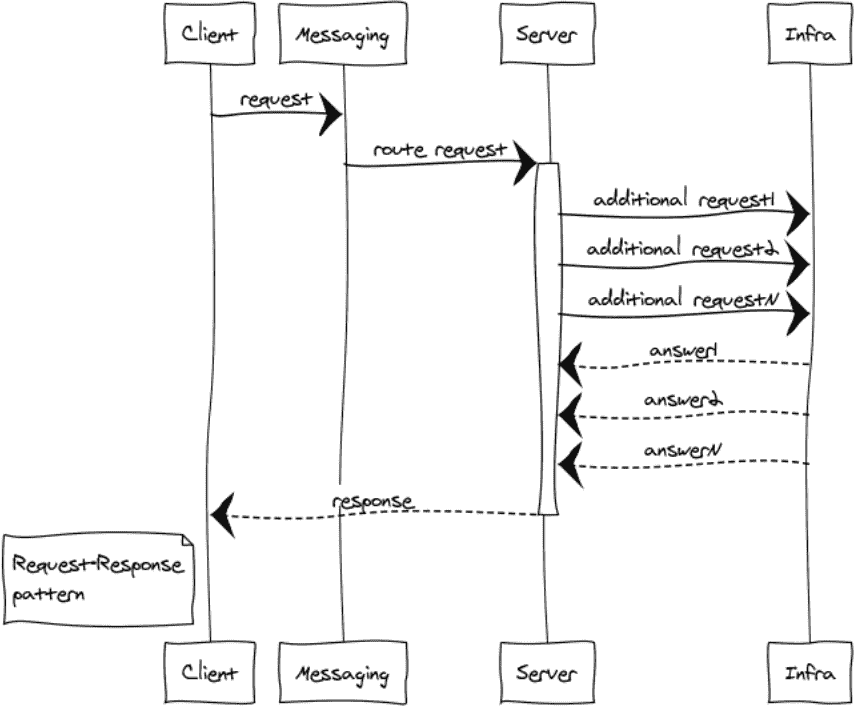
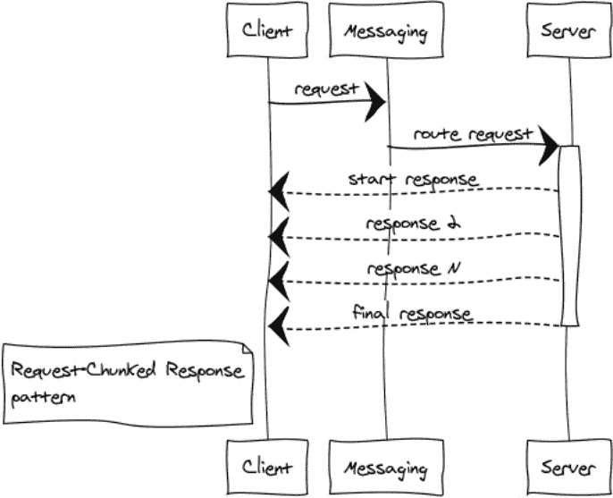
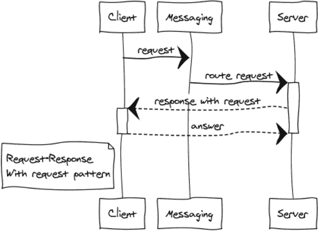
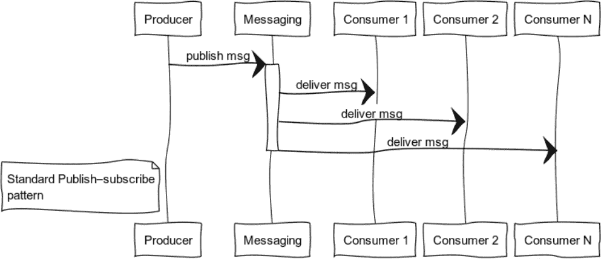
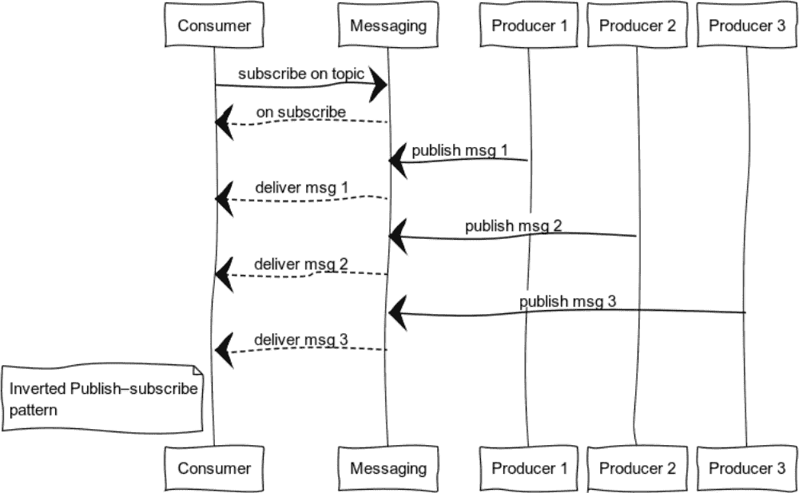
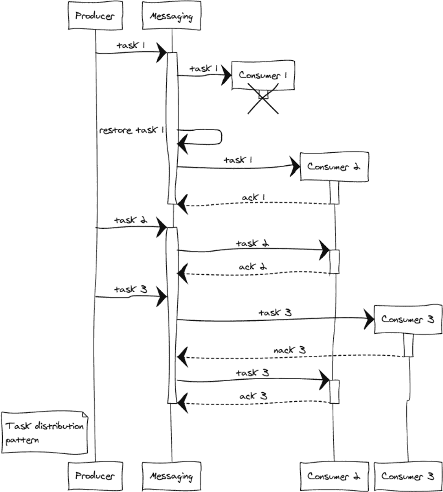

# 构建分布式应用程序:第一近似值

> 原文：<https://towardsdatascience.com/building-distributed-apps-first-approximation-2bbab777f6b2?source=collection_archive---------28----------------------->


在[之前的文章](/building-distributed-apps-zero-approximation-b0c4b16f92d3)中，我们已经讨论了反应式架构的理论基础。现在是时候讨论数据流、实现反应式 Erlang/Elixir 系统的方法以及其中包含的消息交换模式了:

*   请求-响应
*   请求分块响应
*   带请求的响应
*   发布-订阅
*   反向发布-订阅
*   任务分配

# SOA、MSA 和消息传递

SOA 和 MSA 是定义系统开发规则的服务架构。反过来，消息传递为我们提供了实现它们的原语。

我不想提倡任何特定类型的建筑。我完全赞成使用完全满足某个项目或业务需求的实践。无论我们选择什么样的范例，系统组件都应该用 Unix 方式来创建:具有最小连接性的组件实现不同的系统实体。API 方法对实体执行基本操作。

消息传递，从名字就能猜到，是一个消息代理。它的主要目的是接收和发送信息。此外，它还负责消息发送接口、创建逻辑数据通信通道、路由、平衡和处理系统级故障。

正在开发的消息传递并不试图与 Rabbitmq 竞争或取代它。其主要特点如下:

*   *分布式自然*。可以在集群的任何节点上创建交换，尽可能靠近利用它们的代码。
*   *简约*。面向可用性和样板代码的最小化。
*   *更好的性能*。我们并不试图复制 Rabbitmq 的功能。我们只是强调架构和传输层，并将它们嵌入到 OTP 中，同时降低成本。
*   *灵活性*。每个服务都可以集成许多交换模式。
*   *容错*体现在设计中。
*   *可扩展性*。信息与应用一起成长。随着负载的增加，我们可以将一些交换点放在不同的机器上。

*注意。* 就代码组织而言，元项目也就是伞状项目非常适合 Erlang/Elixir 中的复杂系统。所有的项目代码都位于一个存储库中——保护伞项目。同时，微服务被尽可能地隔离，并执行由独立实体负责的简单操作。在这种方法下，很容易支持整个系统的 API。您还可以毫不费力地进行更改并编写单元测试或综合测试。

在服务架构中，组件直接或通过代理进行交互。从消息传递的角度来看，每个服务都有多个生命阶段:

*   *服务初始化*。在这一阶段，初始化和启动流程及其所有依赖项。
*   *创建交易所*。服务可以使用节点配置中给定的静态交换，也可以动态创建交换。
*   *服务注册*。服务必须在 exchange 上注册才能处理请求。
*   *正常工作*。在这种模式下，服务处理用户的请求。
*   *过程的终止*。有两种可能的终止方式:正常终止和崩溃终止。在第一种情况下，服务从交换机断开并停止。然而，在崩溃的情况下，消息传递执行处理故障的场景之一。

这看起来可能有点复杂，但是如果你看一下代码，实际上并没有那么糟糕。本文稍后将给出一些代码示例。

# 交换

交换是消息服务的内部过程。它在定义的消息交换模式中提供不同系统组件之间的交互逻辑。

在下面的所有示例中，组件通过交换进行交互，交换的组合创建了消息传递。

# 消息交换模式(MEP)

一般来说，所有的 MEP 都可以分为双向和单向模式。前者意味着对收到的信息作出反应，后者则不然。客户机-服务器体系结构中双向 MEP 的一个经典例子是请求-响应模板。让我们仔细看看这个和它的修改。

# 请求-响应或 RPC

当我们需要从另一个进程获得响应时，就会用到 RPC。这个过程可以在同一个节点开始，甚至可以位于不同的洲。下图展示了通过消息传递实现的客户端-服务器交互。



因为消息传递是完全异步的，所以客户端的交换包括两个阶段:

*   发送请求。

```
messaging:request(Exchange, ResponseMatchingTag, RequestDefinition, HandlerProcess)
```

*交换*是唯一的交换名称

*ResponseMatchingTag* 用于处理响应的本地标签。例如，当属于不同用户的几个相同的请求被发送时。

*请求定义**请求体*

**处理器流程*处理器 PID。这个过程将得到一个服务器响应。*

*   *收到回应*

```
*handle_info(#'$msg'{exchange = EXCHANGE, tag = ResponseMatchingTag,message = ResponsePayload}, State)*
```

**ResponsePayload* 是服务器响应。*

*对于服务器，该过程也分两个阶段进行:*

1.  *Exchange 初始化*
2.  *请求的处理*

*这种模式可以用代码来说明。假设我们必须创建一些简单的服务来提供精确时间的方法。*

*首先，让我们将 API 定义代码放入 **api.hrl** :*

```
*%% =====================================================%%  entities%% =====================================================-record(time, { unixtime :: non_neg_integer(), datetime :: binary()}).-record(time_error, { code :: non_neg_integer(), error :: term()}).%% =====================================================%%  methods%% =====================================================-record(time_req, { opts :: term()}).-record(time_resp, { result :: #time{} | #time_error{}}).*
```

*让我们在 **time_controller.erl** 中定义服务控制器*

```
*%% The example shows the main code only. If you insert it into gen_server pattern, you will get a proper working service.%% gen_server initializationinit(Args) -> %% connection to exchange messaging:monitor_exchange(req_resp, ?EXCHANGE, default, self()) {ok, #{}}.%% processing of exchange disconnection events. The same happens if an exchange hasn’t been run yet.handle_info(#exchange_die{exchange = ?EXCHANGE}, State) -> erlang:send(self(), monitor_exchange), {noreply, State};%% API processinghandle_info(#time_req{opts = _Opts}, State) -> messaging:response_once(Client, #time_resp{ result = #time{ unixtime = time_utils:unixtime(now()),       datetime = time_utils:iso8601_fmt(now())} }); {noreply, State};%% gen_server terminationterminate(_Reason, _State) -> messaging:demonitor_exchange(req_resp, ?EXCHANGE, default, self()), ok.*
```

*客户端代码放在 **client.erl.** 向服务发送请求，我们可以在客户端的任何部分调用消息请求 API:*

```
*case messaging:request(?EXCHANGE, tag, #time_req{opts = #{}}, self()) of ok -> ok; _ -> %% repeat or fail logicend*
```

*我们不知道系统的状态，因为它依赖于请求到达时各种系统组件的状态。当请求到来时，消息传递可能还没有运行，或者服务控制器可能还没有准备好处理请求。这就是为什么我们必须检查消息响应并处理失败。*

*如果请求被提交，服务可以用一个响应或一个失败来回答。让我们在 *handle_info* 中处理这两种情况:*

```
*handle_info(#'$msg'{exchange = ?EXCHANGE, tag = tag, message = #time_resp{result = #time{unixtime = Utime}}}, State) -> ?debugVal(Utime), {noreply, State};handle_info(#'$msg'{exchange = ?EXCHANGE, tag = tag, message = #time_resp{result = #time_error{code = ErrorCode}}}, State) -> ?debugVal({error, ErrorCode}), {noreply, State};*
```

# *请求分块响应*

*更安全的做法是不要发送太大的消息，因为它们可能会影响系统的总体响应能力和性能。如果一个响应占用了太多的内存，那么拆分就至关重要。*

**

*这里有几个例子:*

*   *组件正在交换二进制数据，例如一些文件。将响应分成小块有助于我们处理任何大小的文件，并防止内存溢出。*
*   *清单例如，我们需要选择数据库中巨大表格的所有行，并将其传输到另一个组件。*

*这种反应有时看起来像一列火车。无论如何，1024 条 1mb 的消息比一条 1gb 的消息要好。*

*Erlang 集群带来了额外的好处，因为响应绕过交换机直接到达接收方，所以减少了交换机和网络的负载。*

# *带请求的响应*

*这是一个非常罕见的构建对话系统的 RPC 模式的修改。*

**

# *发布-订阅(数据分布树)*

*事件驱动系统在数据准备好的时候向用户交付数据。系统更倾向于推模型，而不是拉或轮询模型。这个特性使我们在不断请求和等待数据时不会浪费资源。*

*该图显示了向订阅某个主题的用户分发消息的过程。*

**

*这种模式应用的一个经典案例是状态分布:它可以是计算机游戏中的游戏世界、金融交易中的市场数据或数据馈送中的有用信息。*

*看一下用户代码:*

```
*init(_Args) -> %% subscribe to exchange, routing key = key messaging:subscribe(?SUBSCRIPTION, key, tag, self()), {ok, #{}}.handle_info(#exchange_die{exchange = ?SUBSCRIPTION}, State) -> %% if an exchange is unavailable, we are trying to reconnect to it messaging:subscribe(?SUBSCRIPTION, key, tag, self()), {noreply, State};%% process received messageshandle_info(#'$msg'{exchange = ?SUBSCRIPTION, message = Msg}, State) -> ?debugVal(Msg), {noreply, State};%% if a consumer stops, disconnect from exchangeterminate(_Reason, _State) -> messaging:unsubscribe(?SUBSCRIPTION, key, tag, self()), ok.*
```

*发布者可以通过函数调用在任何合适的地方发布消息:*

```
*messaging:publish_message(Exchange, Key, Message)*
```

**交易所*交易所名称、*

**键*路由键、*

**信息*有效载荷。*

# *反向发布-订阅*

**

*当我们反转发布-订阅时，我们得到一个有利于日志记录的模式。生产者和消费者可以有很大的不同。该图显示了一个消费者和多个生产者的情况。*

# *任务分配模式*

*几乎每个项目都向我们提出了延期处理任务的挑战，比如生成报告、发送通知、从第三方系统获取数据。通过增加工人，系统容量很容易扩展。现在剩下的就是组成一群工人，并在他们之间平均分配任务。*

*让我们考虑一个有三个工人的例子。在分配任务的阶段，我们面临着分配的公平性和工人超负荷的问题。Round-robin 将负责提供公平性，而 prefetch_limit 将防止工人过载。在临时模式下，prefetch_limit 不允许一个工人获得所有任务。*

*消息控制队列和处理优先级。工人来了就有任务。任何任务都可以成功完成，也可以失败。*

*   **消息传递:当消息被成功处理时，ack(Tack)* 被调用*
*   **信息:nack(Tack)* 在所有紧急情况下都会被调用。任务返回后，消息会将其重新发送给另一个工作人员。*

**

*让我们假设在处理 3 个任务时发生了复杂的故障。工人 1 在获得任务后崩溃，并且未能通知交换。在这种情况下，当*确认*超时时，交换将任务重定向到另一个工作者。出于某种原因，工人 3 拒绝了该任务并发送了 *nack。*结果，这个任务被另一个设法完成它的工人处理掉了。*

# *初步结论*

*在本文中，我们仔细研究了分布式系统的主要构件。我们还对它们在 Erlang/Elixir 中的实现有了基本的了解。*

*通过组合基本模式，您可以构建复杂的范例来应对新出现的挑战。*

*最后一部分将集中在管理服务、路由和平衡的一些一般性问题上。我们还将讨论系统可伸缩性和容错性的实际方面。*

*第二部分的结尾。*

*照片由[马里乌斯·克里斯滕森](https://unsplash.com/photos/UXfi8LyqGDk)*

*用 websequencediagrams.com 制作的插图*