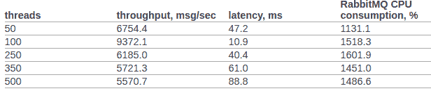

# 构建分布式应用程序:二次近似

> 原文：<https://towardsdatascience.com/building-distributed-apps-second-approximation-f792b3fe893f?source=collection_archive---------27----------------------->


本文是关于 Erlang/Elixir 中分布式反应式应用的系列文章的最后一篇。在[第一篇文章](/building-distributed-apps-zero-approximation-b0c4b16f92d3)中，你会找到反应式架构的理论基础。[第二个](/building-distributed-apps-first-approximation-2bbab777f6b2)展示了构建这种系统的主要模板和机制。
今天我们将讨论代码库开发和项目开发的一般问题。

# 服务机构

当我们在现实生活中处理服务开发时，我们经常需要在一个控制器中组合几种交互模式。例如，执行管理项目用户配置文件的服务必须响应 req-resp 请求，并使用发布-订阅发送配置文件更新事件的通知。这种情况非常简单:在消息传递的背后，只有一个控制器实现服务逻辑并发布更新。

当我们必须创建一个容错的分布式服务时，事情变得更加复杂。让我们假设对用户服务的要求发生了变化:

1.  该服务现在必须在集群的 5 个节点上处理请求，
2.  它必须能够执行后台处理任务，
3.  它还应该能够动态管理订阅列表

**注意**:在本文中，我们并不解决数据的一致存储和复制问题。让我们假设这些问题以前已经解决了——系统已经有了一个可伸缩的、可靠的存储层，处理程序可以与之交互。

用户服务的形式化描述变得更加复杂。从程序员的角度来看，由于使用了消息传递，所以变化很小。为了满足第一个要求，我们必须在请求-响应上定义平衡算法。

处理后台进程的需求经常出现。在用户中，它可以检查用户的文档，处理下载的多媒体或与社交网络同步数据。这些任务应该分布在集群中，并且必须控制它们的实现。这就是为什么我们有两个选择:要么使用前一篇文章中的模式，要么如果它不适合我们，编写一个定制的任务调度程序，它将控制处理程序池。

第三点需要发布-订阅模式扩展。要实现它，我们应该首先创建一个发布-订阅交换，然后在我们的服务中运行这个交换的控制器。这样，我们就把订阅事件和订阅者列表的管理从消息层转移到了用户实现。

因此，任务分解表明，为了满足需求，我们应该在不同的节点上运行服务的 5 个副本，并创建一个额外的实体—负责订阅的发布-订阅控制器。

要运行 5 个处理程序，没有必要更改服务代码。只有一个额外的行动——设定交易所的平衡规则。我们稍后会谈到这一点。此外，还有一个困难:发布-订阅控制器和定制的调度程序必须单独工作。作为基础的消息传递服务必须提供一种领袖选举的机制。

# 领导人选举

在分布式系统中，这是指定负责在集群上调度和分配任务和负载的唯一进程的过程。

在不倾向于集中的系统中，使用一些通用的和基于共识的算法，例如 paxos 或 raft。

由于消息传递同时是一个代理和一个中心元素，它知道所有服务控制者——领导候选人。消息传递可以不经投票任命领导人。

启动并连接到 exchange 后，所有服务都会收到一条系统消息:

> #'$leader'{exchange =？EXCHANGE，pid = LeaderPid，servers = Servers}

如果 LeaderPid 与当前进程 Pid 匹配，它将被指定为 leader。服务器列表包括所有节点及其参数。

当一个新的集群节点出现并且当前工作的集群节点关闭时，所有的服务控制器

> #'$slave_up'{exchange =？EXCHANGE，pid = SlavePid，options = SlaveOpts}

和

> #'$slave_down'{exchange =？EXCHANGE，pid = SlavePid，options = SlaveOpts}

分别是。

这样，所有的组件都知道所有的变化。此外，在任何给定的时刻，集群中只有一个确定的领导者。

# 中间件

如果我们需要实现复杂的分布式处理或优化现有的体系结构，中间件使用起来很方便。

如果您不想更改服务代码并处理额外的处理、消息日志的路由等问题，您可以打开代理处理程序，它将完成所有的工作。

发布-订阅优化的一个经典例子是一个分布式应用程序，其业务核心是生成更新事件，如市场价格的变化。这样的应用也有一个访问层——N 个服务器，为 web 客户端提供 websocket API。

客户服务，如果直接处理它，看起来像这样:

*   客户端与平台建立连接。在服务器端，终止流量，启动服务于此连接的进程。
*   更新授权和订阅发生在服务流程中。该流程调用主题的 subscribe 方法。
*   当一个事件在核心中生成时，它被传递给服务于该连接的进程。

假设我们有 50000 名主题为“新闻”的订户。订户平均分布在 5 台服务器上。最终，每次更新到达 exchange 时，都会被复制 50000 次:根据订阅者的数量，每台服务器复制 10000 次。看起来不是一个有效的计划，对吗？

为了改进它，让我们引入一个与交换同名的代理。全局名称注册管理机构必须能够在一个组中通过名称解析最近的进程，因为这很重要。

然后，让我们在接入层服务器上运行这个代理。我们所有服务于 websocket api 的进程都将订阅它，而不是订阅内核中的初始发布-订阅交换。代理仅在唯一订阅的情况下订阅核心，并将其获得的消息复制给所有订阅者。

因此，将在核心服务器和访问服务器之间发送 5 条消息，而不是 50000 条。

# 路由和平衡

# 请求-响应

在当前的消息传递实现中，有 7 种请求分发策略:

*   *默认*。请求发送到所有控制器。
*   *循环赛*。以循环的方式为输入的请求分配控制器。
*   *共识*。提供服务的控制器分为主控制器和从控制器。请求只发给领导。
*   *共识&循环赛*。组中有一个领导者，但是请求在所有成员之间分配。
*   *粘粘的*。哈希函数是为某个处理程序计算和保留的。具有此签名的所有后续请求都发送到同一个处理程序。
*   *粘人好玩的*。当交换被初始化时，应该定义用于粘性平衡的散列函数。
*   *好玩*。相当于 sticky-fun，但你也可以重定向，拒绝或预处理它。

发行策略是在交易所初始化时定义的。

除了平衡，消息传递使我们能够标记实体。让我们看看系统中的标签类型:

*   连接标签。让我们了解事件发生的关联。当控制器进程连接到同一个交换机但具有不同的路由关键字时使用。
*   服务标签。允许我们在一个服务内将处理者联合成组，并扩展路由和平衡机会。对于请求-响应模式，路由是线性的。我们向交换机发送请求，交换机将请求传递给服务器。然而，如果我们必须将处理程序分成逻辑组，那么这种划分是在标签的帮助下完成的。如果指示了标签，请求将被发送到某一组控制器。
*   请求标签。让我们能够区分不同的反应。由于我们的系统是异步的，我们需要有机会指示 RequestTag 来处理服务响应。通过这个标签，我们将了解我们所收到的请求的响应。

# 发布订阅

有了 pub-sub 就简单多了。我们有一个交易所，可以让信息被发布。交换在订阅了所需路由关键字的订阅者之间分发消息(可以说这相当于主题)。

# 可扩展性和容错性

系统可伸缩性通常取决于其层和组件的可伸缩性:

*   通过向群集中添加带有服务处理程序的额外节点来扩展服务。人们可以在试运行期间选择最佳的路由策略。
*   特定集群中的消息服务本身通常通过将负载最重的交换移动到单独的集群节点或者通过将代理进程添加到负载最重的集群区域来进行扩展。
*   整个系统的可伸缩性取决于体系结构的灵活性以及将独立的集群合并成一个逻辑实体的机会。

项目的成功通常取决于简单性、快速转换和可伸缩性。当前实现中的消息传递随着应用程序而增长。即使 50-60 台机器的集群对我们来说不够，我们也可以使用联盟。不幸的是，联邦的问题超出了本文的范围。

# 保留

在讨论负载平衡时，我们已经讨论了服务控制器预留。然而，消息也应该被保留。如果一个节点或一台机器出现故障，消息传递必须尽快自动恢复。

在我的项目中，我使用了额外的节点，这些节点可以在出现故障时承担部分负载。Erlang 为 OTP 应用程序提供了分布式模式的标准实现。分布式模式通过在另一个已经预先启动的节点上运行失效的应用程序来负责恢复。过程很清楚:出现故障后，应用程序会自动转移到故障转移节点。您可以在此获得关于此功能的更多详细信息[。](http://erlang.org/doc/design_principles/distributed_applications.html)

# 表演

让我们尝试，至少粗略地，将 rabbitmq 的性能与我们定制的消息传递的性能进行比较。

我看到了 openstack 团队的 rabbitmq 的官方测试结果:

([https://docs . open stack . org/developer/performance-docs/test _ results/MQ/rabbit MQ/cmsm/index . html](https://docs.openstack.org/developer/performance-docs/test_results/mq/rabbitmq/cmsm/index.html))。

第 6.14.1.2.1.2.2 点。文档中显示了以下 RPC 转换结果:



让我们不要使用任何 OS 内核或 erlang VM 的高级设置。

测试环境:

*   erl opts: +A1 +sbtu。
*   一个节点内的测试是在一台笔记本电脑上运行的，该笔记本电脑配有旧的移动版英特尔 i7。
*   集群测试在 10G 网络的服务器上运行。
*   代码在 docker 容器中工作。网络处于 NAT 模式。

测试的代码:

```
req_resp_bench(_) -> W = perftest:comprehensive(10000, fun() -> messaging:request(?EXCHANGE, default, ping, self()), receive #'$msg'{message = pong} -> ok after 5000 -> throw(timeout) end end ), true = lists:any(fun(E) -> E >= 30000 end, W), ok.
```

场景 1:测试在一台装有旧版移动版英特尔 i7 的笔记本电脑上运行。测试、消息和服务都在同一个节点和一个 docker-container 中实现:

约 0 秒内连续 10000 次循环(26987 次循环/秒)

约 1 秒内连续 20000 次循环(26915 次循环/秒)

约 4 秒内连续 100000 次循环(26957 次循环/秒)

并行 2 在 2 秒内完成 100000 次循环(44240 次循环/秒)

在大约 2 秒内并行 4 个 100000 周期(53459 周期/秒)

在约 2 秒内并行 10 个 100000 周期(52283 周期/秒)

在大约 3 秒内并行 100 个 100000 周期(49317 周期/秒)

场景 2: 3 个节点通过 docker (NAT)运行在不同的机器上。

约 1 秒内连续 10000 次循环(8684 次循环/秒)

约 2 秒内连续 20000 次循环(8424 次循环/秒)

约 12 秒内连续 100000 次循环(8655 次循环/秒)

并行 2 在 7 秒内完成 100000 次循环(15160 次循环/秒)

在大约 5 秒内并行 4 个 100000 周期(19133 周期/秒)

在大约 4 秒内并行 10 个 100000 周期(24399 周期/秒)

在大约 3 秒内并行 100 个 100000 周期(34517 周期/秒)

在所有情况下，CPU 利用率都没有超过 250%。

# 结果

我希望这个系列看起来不像是一个大脑垃圾场，并且我的经验对于分布式系统研究人员和刚刚起步的从业者来说都是真正有用的。我敢肯定，他们中的一些人对 Erlang/Elixir 很感兴趣，但也有疑虑。

*公告*。

在初秋，我将发表另一个关于排队系统工程的系列文章:《 **VTrade 实验——为交易系统**写一个框架的尝试》。在这个系列中，我们将讨论建立一个交易交易所、一个拍卖场和一个商店的理论和实践。