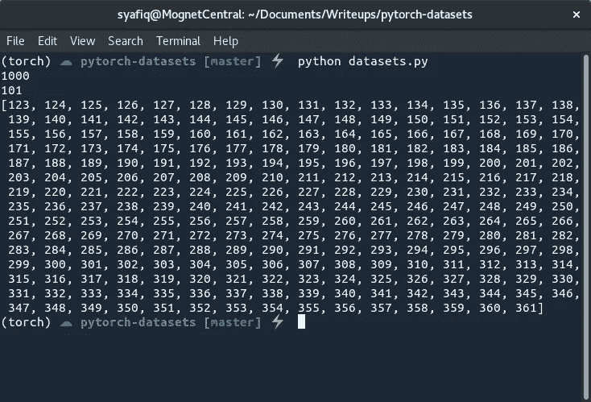
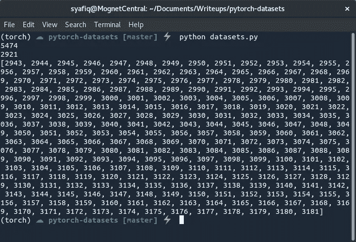
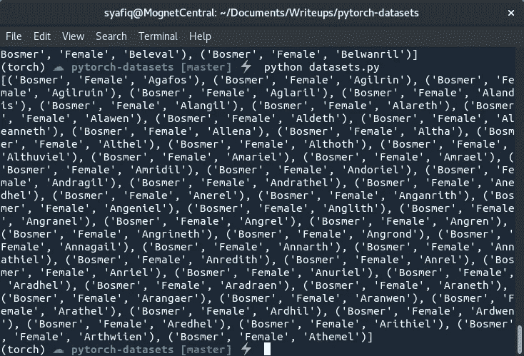
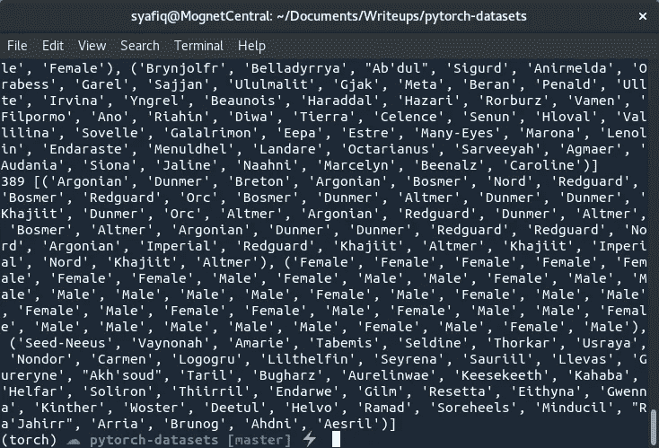
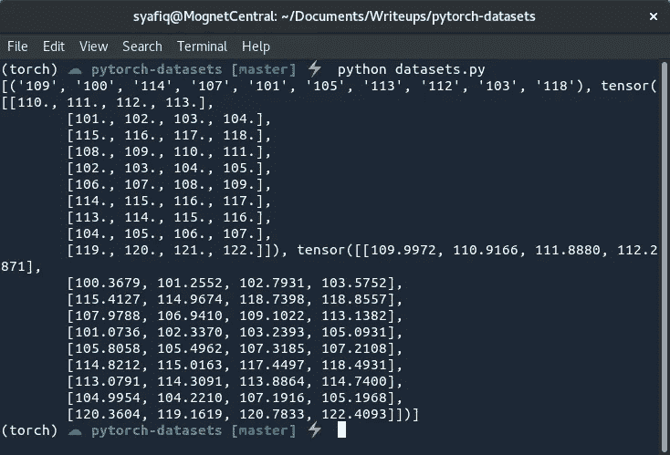
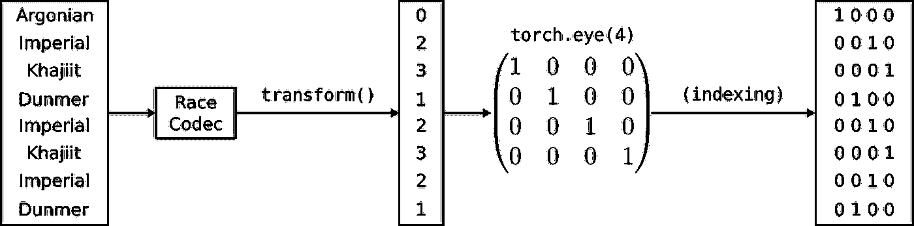
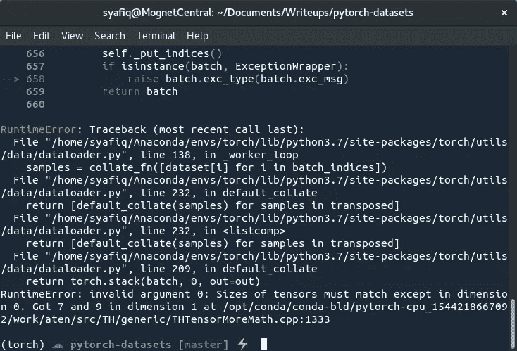
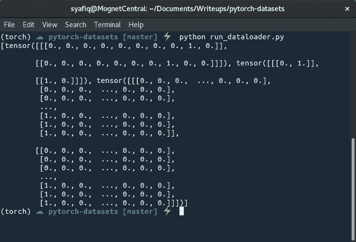

# 在 PyTorch 中构建高效的自定义数据集

> 原文：<https://towardsdatascience.com/building-efficient-custom-datasets-in-pytorch-2563b946fd9f?source=collection_archive---------0----------------------->

## 了解 Dataset 类的来龙去脉，利用干净的代码结构，同时最大限度地减少培训期间管理大量数据的麻烦。


Managing data for neural network training can be hard at “scale”.

PyTorch 最近出现在我的圈子里，尽管我已经习惯了 Keras 和 TensorFlow 一段时间，但我还是不得不尝试一下。令人惊讶的是，我发现它非常令人耳目一新和可爱，尤其是 PyTorch 具有 Pythonic API、更固执己见的编程模式和一组很好的内置实用函数。我特别喜欢的一个功能是能够轻松地创建一个定制的`Dataset`对象，然后可以使用内置的`DataLoader`在训练模型时提供数据。

在本文中，我将从头开始探索 PyTorch `Dataset`对象，目标是创建一个数据集来处理文本文件，以及如何为某项任务优化管道。我们首先通过一个玩具示例来回顾`Dataset`实用程序的基础知识，然后逐步完成真正的任务。具体来说，我们希望创建一个管道来输入《上古卷轴(TES)》系列中角色名字的名字、这些角色名字的种族以及名字的性别，作为一个热张量。你可以在[我的网站](http://syaffers.xyz/#datasets)上找到这个数据集。

# `Dataset`级的基础知识

PyTorch 让您可以自由地对`Dataset`类做任何事情，只要您覆盖了两个子类函数:

*   返回数据集大小的`__len__`函数，以及
*   `__getitem__`函数从给定索引的数据集中返回一个样本。

数据集的大小有时可能是一个灰色区域，但它等于整个数据集中的样本数。所以如果你有一万个单词(或者数据点，图片，句子等。)在您的数据集中，`__len__`函数应该返回 10，000。

## 一个最小的工作示例

让我们首先通过创建一个从 1 到 1000 的所有数字的`Dataset`来模拟一个简单的数据集。我们将它恰当地命名为`NumbersDataset`。

The first iteration of the numbers dataset.



Humble beginnings: printing the contents of the numbers dataset.

很简单，对吧？首先，当我们初始化`NumbersDataset`时，我们立即创建一个名为`samples`的列表，它将存储 1 到 1000 之间的所有数字。`samples`这个名字是随意的，所以你可以随意使用任何你觉得舒服的名字。被覆盖的函数是不言自明的(我希望！)并对构造函数中启动的列表进行操作。如果您运行该文件，您将会看到输出的值 1000、101 和一个介于 122 和 361 之间的列表，它们分别是数据集的长度、数据集中索引 100 处的数据值以及索引 121 和 361 之间的数据集切片。

## 扩展数据集

让我们扩展这个数据集，以便它可以存储区间`low`和`high`之间的所有整数。

The second iteration of the numbers dataset with a user-defined range.



The outputs of a slice of the user-defined numbers dataset.

代码上面的代码应该打印 5474，2921 和 2943 到 3181 之间的数字列表。通过编辑构造函数，我们现在可以随心所欲地设置数据集的任意低值和高值。这个简单的改变表明了我们可以从 PyTorch `Dataset`级获得什么样的里程。例如，我们可以生成多个不同的数据集并处理这些值，而不必像在 NumPy 中那样考虑编写新的类或创建许多难以理解的矩阵。

## 从文件中读取数据

让我们进一步扩展`Dataset`类的功能。PyTorch 与 Python 标准库的接口非常优雅，这意味着您不必担心集成您已经了解并喜爱的特性。在这里，我们会

*   使用基本的 Python I/O 和一些静态文件创建一个全新的`Dataset`，
*   收集 TES 角色的名字(数据集可在我的网站上[获得)，这些名字被分成种族文件夹和性别文件，以填充`samples`列表，](http://syaffers.xyz/#datasets)
*   通过在`samples`列表中存储一个元组来跟踪每个名字的种族和性别，而不仅仅是名字本身。

作为参考，TES 字符名称数据集具有以下目录结构:

```
.
|-- Altmer/
|   |-- Female
|   `-- Male
|-- Argonian/
|   |-- Female
|   `-- Male
... (truncated for brevity)
`-- Redguard/
    |-- Female
    `-- Male
```

每个文件都包含由换行符分隔的 TES 角色名，所以我们必须逐行读取每个文件，以获取每个种族和性别的所有角色名。

The first iteration of the TES names dataset

让我们浏览一下代码:我们首先创建一个空的`samples`列表，并通过浏览每个种族文件夹和性别文件并读取每个文件中的名称来填充它。种族、性别和姓名存储在一个元组中，并追加到`samples`列表中。运行该文件应该会打印出 19491 和`('Bosmer', 'Female', 'Gluineth')`(但可能会因计算机而异)。让我们来看看如果我们将数据集分割成一个批处理会是什么样子:

```
# change the main function to the following:if __name__ == '__main__':
    dataset = TESNamesDataset('/home/syafiq/Data/tes-names/')
    print(dataset[10:60])
```



The output of a slice of the dataset samples containing a name, gender, and race.

正如您所料，它的工作方式与典型的列表完全一样。总结本节，我们刚刚将标准 Python I/O 引入 PyTorch 数据集，我们不需要任何其他特殊的包装器或助手，只需要纯 Python。事实上，我们还可以包括其他库，如 NumPy 或 Pandas，并通过一点巧妙的操作，让它们与 PyTorch 配合良好。让我们暂时就此打住，看看在训练循环的情况下，如何有效地遍历数据集。

# 用`DataLoader`流动数据

虽然`Dataset`类是系统包含数据的好方法，但是*似乎*在一个训练循环中，我们将需要索引或切片数据集的`samples`列表。这并不比我们对典型的列表或 NumPy 矩阵所做的更好。PyTorch 没有走这条路，而是提供了另一个名为`DataLoader`的实用函数，它充当了一个`Dataset`对象的数据馈送器。我在这里看到的并行是 Keras 中的数据生成器`flow`函数，如果你熟悉的话。`DataLoader`接受一个`Dataset`对象(以及任何扩展它的子类)和几个其他可选参数(在 [PyTorch DataLoader 文档](https://pytorch.org/docs/stable/data.html#torch.utils.data.DataLoader)中列出)。在这些参数中，我们可以选择混洗数据，确定批量大小和并行加载数据的工作人员数量。下面是一个在枚举循环中流经`TESNamesDataset`的简单例子。

```
# change the main function to the following:if __name__ == '__main__':
    from torch.utils.data import DataLoader
    dataset = TESNamesDataset('/home/syafiq/Data/tes-names/')
    dataloader = DataLoader(dataset, batch_size=50, shuffle=True, num_workers=2) for i, batch in enumerate(dataloader):
        print(i, batch)
```

当您看到批量打印出来的洪流时，您可能会注意到每个批量都是一个三元组列表:第一个元组是一群种族，第二个元组是性别，最后一个元组是姓名。



A torrent of names, genders, and races streamed from the dataset… in a strange ordering?

等等，这不是我们之前分割数据集时的样子！这是怎么回事？事实证明，`DataLoader`以一种系统的方式加载数据，这样我们就可以垂直地而不是水平地堆叠数据。这对于张量的流动批次特别有用，因为张量垂直堆叠(即在第一维中)以形成批次。此外，`DataLoader`还为您处理了数据的混洗，因此在输入数据时，不需要混洗矩阵或跟踪索引。

## 流动张量和其他类型

为了进一步探索不同类型的数据是如何通过`DataLoader`流动的，我们将更新我们之前模拟的数字数据集，以产生两对张量:数据集中每个数字的 4 个后继值的张量，以及相同的后继张量，但添加了一些随机噪声。为了抛出一个曲线球，我们还想返回数字本身，但不是作为一个张量，而是作为一个 Python 字符串。总之，`__getitem__`函数将在一个元组中返回三个不同种类的数据项。

The third iteration of the numbers dataset now with multiple data output types.

请注意，我们没有更改数据集构造函数，而是更改了`__getitem__`函数。PyTorch 数据集的良好实践是，您要记住数据集将如何随着越来越多的样本而扩展，因此，我们不希望在运行时在内存中的`Dataset`对象中存储太多的张量。相反，我们将在遍历样本列表时形成张量，牺牲一点速度来换取内存。我将在接下来的章节中解释这是如何有用的。



Different data types flowing together without breaking a sweat.

看看上面的输出，虽然我们新的`__getitem__`函数返回了一个巨大的字符串和张量元组，但是`DataLoader`能够识别数据并相应地对它们进行堆栈。字符串化的数字形成一个元组，其大小与加载程序配置的批处理大小相同。对于这两个张量，`DataLoader`将它们垂直堆叠成一个大小为`10x4`的张量。这是因为我们将批量大小配置为 10，而从`__getitem__`函数返回的两个张量的大小为 4。

一般来说，加载程序会尝试将一批一维张量堆叠成二维张量，将一批二维张量堆叠成三维张量，依此类推。在这一点上，我恳求你认识到这对其他机器学习库中的传统数据处理产生的改变生活的影响，以及解决方案看起来有多干净。太不可思议了！如果你不同意我的观点，那么，至少你现在知道另一种方法，你可以在你的工具箱里。

# 完成 TES 数据集代码

让我们回到 TES 地名数据集。看起来初始化函数有点脏(至少对我的标准来说是这样，应该有办法让代码看起来更好。还记得我说过 PyTorch API 是 Pythonic 式的吗？那么，没有什么可以阻止你在数据集中声明其他的实用函数，或者甚至是为初始化创建内部函数。为了清理 TES 地名数据集代码，我们将更新`TESNamesDataset`代码以实现以下功能:

*   更新构造函数以包含字符集，
*   创建内部函数来初始化数据集，
*   创建一个效用函数，将名义变量转换成一个热张量，
*   创建一个实用函数，将一个样本转换为一组三个代表种族、性别和姓名的单热张量。

为了使实用函数工作良好，我们将从`scikit-learn`库获得一些帮助来编码名义值(即我们的种族、性别和姓名数据)。具体来说，我们将需要`LabelEncoder`类。由于我们正在对代码进行大规模更新，我将在接下来的几个小节中解释这些变化。

The second iteration of the TES names dataset with major additions and updates.

## 构造函数初始化拆分

这里有相当多的变化，所以让我们一点一点来看。从构造函数开始，您可能已经注意到它没有任何文件处理逻辑。我们已经将这个逻辑移到了`_init_dataset`函数中，并清理了构造函数。此外，我们还添加了一些空的编解码器，将名义值从原始字符串转换成整数，然后再转换回来。样品列表也是一个空列表，将在`_init_dataset`功能中填充。构造函数还接受了一个名为`charset`的新参数。顾名思义，它只是一个字符串，可以让`char_codec`将字符转换成整数。

文件处理功能已经增加了几个集合，以便在遍历文件夹时捕获种族和性别等独特的名义值。如果您没有结构良好的数据集，这可能很有用；例如，如果阿贡人有另一组性别不可知论者的名字，我们将有一个名为“未知”的文件，这将被放入性别组，而不管其他种族是否存在“未知”性别。在所有的名字都被存储后，我们将初始化编解码器，使其适合我们的角色集中的种族、性别和角色的唯一值。

## 效用函数

添加了两个实用函数:`to_one_hot`和`one_hot_sample`。`to_one_hot`在应用一个看似不合适的`torch.eye`函数之前，使用数据集的内部编解码器首先将一个值列表转换为一个整数列表。这实际上是一个简单的方法，可以快速地将一个整数列表转换成一个热点向量。`torch.eye`函数创建一个任意大小的单位矩阵，其对角线上的值为 1。如果对矩阵行进行索引，那么在该索引处会得到一个值为 1 的行向量，这就是一键向量的定义！



A smaller example of converting from raw strings into race categories as one-hot encoded vectors.

因为我们需要将三个值转换成张量，所以我们将在相应数据的每个编解码器上调用`to_one_hot`函数。这在`one_hot_sample`函数中进行组合，该函数将一个*单样本*转换成一个张量元组。种族和性别被转换成一个二维张量，它实际上是一个扩展的行向量。名字也被转换成二维张量，但是包括名字的每个字符的一个热行向量。

## `__getitem__`通话

最后，`__getitem__`函数已经更新，只在给定样本的种族、性别和名称的情况下调用`one_hot_sample`函数。注意，我们不需要在`samples`列表中预先准备张量，而是仅当调用`__getitem__`函数时，即当`DataLoader`流数据时，才形成张量。当您在训练期间有成千上万的样本要处理时，这使得数据集非常具有可扩展性。

你可以想象这个数据集是如何用于视觉训练的。数据集将有一个文件名列表和图像目录的路径，让`__getitem__`函数只读取图像文件，并及时将它们转换成张量用于训练。通过向`DataLoader`提供适当数量的工作器来并行处理多个图像文件，可以使运行速度更快。 [PyTorch 数据加载教程](https://pytorch.org/tutorials/beginner/data_loading_tutorial.html)更详细地介绍了图像数据集和加载器，并用用于计算机视觉目的的`torchvision`包(通常与 PyTorch 一起安装)补充了数据集，制作了图像处理管道(如白化、归一化、随机移位等)。)非常容易构造。

回到这篇文章。数据集检查完毕，看起来我们已经准备好将它用于训练…

# …但我们不是

如果我们试图使用批处理大小大于 1 的`DataLoader`来传输数据，我们将会遇到一个错误:



A mismatch made in data tensor heaven.

你们中精明的人可能已经看到了这一点，但事实是，文本数据很少以固定长度从一个样本到另一个样本。因此，`DataLoader`试图批量处理多个不同长度的名字张量，这在张量格式中是不可能的，因为在 NumPy 数组中也是如此。为了说明这个问题，考虑这样一种情况，当我们将像“John”和“Steven”这样的名字堆叠到一个单个热矩阵中时。“John”翻译成大小为`4xC`的二维张量,“Steven”翻译成大小为`6xC`的二维张量，其中 C 是字符集的长度。`DataLoader`试图将这些名字分批放入一个三维张量`2x?xC`(想象一下堆叠大小为`1x4xC`和`1x6xC`的张量)。由于第二维度不匹配，`DataLoader`出现错误，无法继续。

## 可能的解决方案

为了补救这一点，这里有两种方法，每一种都有其优点和缺点。

*   将批处理大小设置为 1，这样就不会遇到错误。如果批量大小为 1，单个张量不会与任何其他(可能)不同长度的张量堆叠在一起。然而，当执行训练时，这种方法受到影响，因为神经网络在单批梯度下降时收敛非常慢。另一方面，当批处理不重要时，这有利于快速测试时数据加载或沙箱化。
*   通过用空字符填充或截断来固定统一的名称长度。截断长名称或用虚拟字符填充短名称允许所有名称都是格式良好的，并且具有相同的输出张量大小，使得批处理成为可能。缺点是，根据手头的任务，虚拟字符可能是有害的，因为它不代表原始数据。

出于本文的目的，我将选择第二个选项，以表明您只需要对整个数据管道进行很少的更改就可以实现这一点。请注意，这也适用于任何不同长度的顺序数据(尽管有各种方法来填充数据，请参见 NumPy 中的[选项](https://docs.scipy.org/doc/numpy-1.15.0/reference/generated/numpy.pad.html)和 PyTorch 中的)。在我的用例中，我选择用零填充名称，所以我更新了构造函数和`_init_dataset`函数:

```
...     def __init__(self, data_root, charset, length):
        self.data_root = data_root
        self.charset = charset + '\0'
        self.length = length ... with open(gender_filepath, 'r') as gender_file:
            for name in gender_file.read().splitlines():
                if len(name) < self.length:
                    name += '\0' * (self.length - len(name))
                else:
                    name = name[:self.length-1] + '\0'
                self.samples.append((race, gender, name)) ...
```

首先，我向构造函数引入一个新参数`length`，它将所有传入名称的字符数固定为这个值。我还在字符集中添加了`\0`作为填充短名字的虚拟字符。接下来，更新了数据集初始化逻辑。不足固定长度的名称简单地用`\0` s 填充，直到满足长度要求。超过固定长度的名字会被截短，最后一个字符用一个`\0`替换。交换是可选的，取决于手头的任务。

如果您现在尝试流动这个数据集，您应该得到您最初预期的结果:一个格式良好的张量以期望的批量流动。下图显示了一批大小为 2 的张量，但请注意有三个张量:



Working data flow of all categorical variables converted into one-hot representations and well-formed via padding.

*   堆叠的种族张量，十个种族之一的一键编码版本，
*   堆叠的性别张量，也是针对数据集中存在的两种性别中的每一种进行的单热编码，以及
*   堆叠的名字张量，应该是最后一个维度的`charset`的长度，第二个维度的名字长度(固定大小后)，第一个维度的批量大小。

# 数据分割实用程序

PyTorch 内置了所有这些功能，非常棒。现在可能出现的问题是，如何进行验证甚至测试集，以及如何在不弄乱代码库并尽可能保持代码干爽的情况下执行。测试数据集的一种方法是为训练数据和测试数据提供不同的`data_root`,并在运行时保留两个数据集变量(此外，还有两个数据加载器)，特别是如果您想在训练后立即进行测试。

相反，如果您想从训练集创建验证集，可以使用 PyTorch 数据实用程序中的`random_split`函数轻松处理。`random_split`函数接收一个数据集和一个列表中子集的期望大小，并以随机顺序自动分割数据，以生成较小的`Dataset`对象，这些对象可立即用于`DataLoader`。这里有一个例子。

Create validation sets by splitting your custom PyTorch datasets easily with built-in functions.

事实上，您可以在任意的时间间隔进行分割，这对于折叠的交叉验证集来说非常强大。我对这种方法唯一的不满是，你不能定义百分比分割，这很烦人。至少从一开始就清楚地定义了子数据集的大小。另外，请注意，您需要为每个数据集使用单独的`DataLoader`,这肯定比管理两个随机排序的数据集并在一个循环中进行索引要干净。

# 结束语

我希望这篇文章能让您对 PyTorch 中的`Dataset`和`DataLoader`实用程序有所了解。结合干净的 Pythonic API，它使得编码更加令人愉快，同时还提供了一种有效的处理数据的方式。我认为 PyTorch 开发人员的易用性已经深深植根于他们的开发哲学中，在我的工作场所使用 PyTorch 之后，我就再也没有回头使用过 Keras 和 TensorFlow。我不得不说，我确实想念 Keras 模型附带的进度条和`fit` / `predict` API，但这是一个小挫折，因为最新的 [PyTorch 现在与 TensorBoard](https://pytorch.org/docs/stable/tensorboard.html) 接口，带回了一个熟悉的工作环境。然而，目前 PyTorch 是我未来深度学习项目的首选。

我鼓励以这种方式构建自己的数据集，因为它弥补了我以前在管理数据方面的许多混乱的编程习惯。在复杂的情况下，`Dataset`实用程序是救命稻草。我记得必须管理属于单个样本但来自三个不同 MATLAB 矩阵文件的数据，并且需要正确地切片、归一化和转置。如果没有`Dataset`和`DataLoader`的组合，我无法理解管理它的努力，特别是因为数据是巨大的，没有简单的方法将它们组合成一个 NumPy 矩阵而不使任何计算机崩溃。

最后，查看一下 [PyTorch 数据实用程序文档页面](https://pytorch.org/docs/stable/data.html),其中有其他的类和函数可以探索，这是一个小而有价值的实用程序库。你可以在我的 GitHub 上找到 TES 名字数据集的代码，我已经在 PyTorch 中创建了一个 [LSTM 名字预测器和数据集。让我知道这篇文章是否有帮助或不清楚，如果你想在未来更多的这种类型的内容。](https://github.com/syaffers/tes-names-rnn)