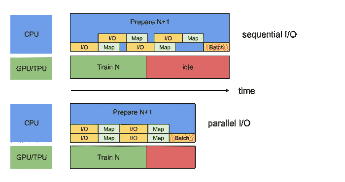
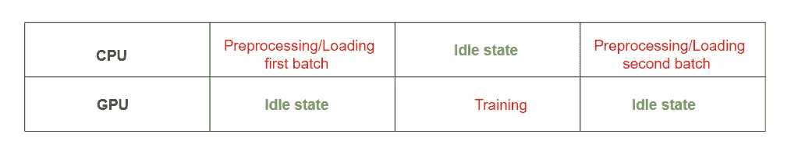
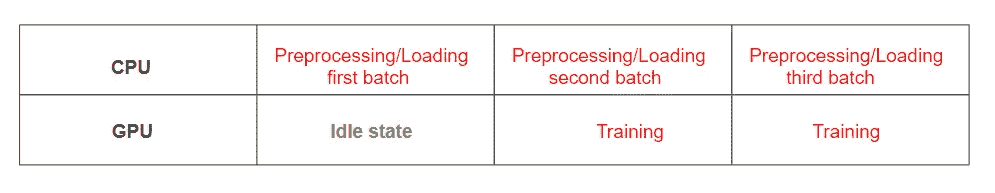
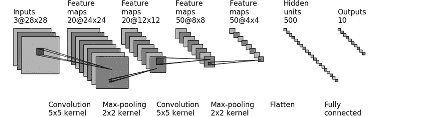

# 使用 TensorFlow 构建高效的数据管道

> 原文：<https://towardsdatascience.com/building-efficient-data-pipelines-using-tensorflow-8f647f03b4ce?source=collection_archive---------2----------------------->

拥有高效的数据管道对于任何机器学习模型都是至关重要的。在这篇博客中，我们将学习如何使用 TensorFlow 的数据集模块`tf.data`来构建高效的数据管道。



[https://www.tensorflow.org/guide/performance/datasets](https://www.tensorflow.org/guide/performance/datasets)

## 动机

大多数关于 TensorFlow 的介绍性文章都会向您介绍将数据输入模型的`feed_dict`方法。`feed_dict`在单线程中处理输入数据，当数据在 CPU 上加载和处理时，GPU 保持空闲，当 GPU 正在训练一批数据时，CPU 保持空闲状态。TensorFlow 的开发者建议不要在相同数据集的训练或重复验证过程中使用这种方法。



`tf_data`通过异步预取下一批数据来提高性能，使 GPU 无需等待数据。您还可以并行处理数据集的预处理和加载过程。



在这篇博文中，我们将介绍`Datasets`和`Iterators`。我们将学习如何从源数据创建数据集，将转换应用到数据集，然后使用迭代器消费数据。

# 如何创建数据集？

Tensorflow 提供了各种方法来从 numpy 数组、文本文件、CSV 文件、张量等创建数据集。让我们看看下面的几种方法

*   **from_tensor_slices:** 它接受单个或多个 numpy 数组或张量。使用此方法创建的数据集一次只会发出一个数据。

```
# source data - numpy array
data = np.arange(10)# create a dataset from numpy array
dataset = tf.data.Dataset.from_tensor_slices(data)
```

对象`dataset`是一个 tensorflow 数据集对象。

*   **from_tensors:** 它也接受单个或多个 numpy 数组或 tensor。使用此方法创建的数据集将一次发出所有数据。

```
data = tf.arange(10)
dataset = tf.data.Dataset.from_tensors(data)
```

3. **from_generator:** 创建一个数据集，其元素由函数生成。

```
def generator():
  for i in range(10):
    yield 2*i

dataset = tf.data.Dataset.from_generator(generator, (tf.int32))
```

# 数据集上的操作

*   **批处理:**将数据集的连续元素合并成一个批处理。当您想要训练较小批次的数据以避免内存不足错误时，这很有用。

```
data = np.arange(10,40)# create batches of 10
dataset = tf.data.Dataset.from_tensor_slices(data).batch(10)# creates the iterator to consume the data 
iterator = dataset.make_one_shot_iterator()
next_ele = iterator.get_next()with tf.Session() as sess:
  try:
    while True:
      val = sess.run(next_ele)
      print(val)
  except tf.errors.OutOfRangeError:
    pass
```

您可以跳过创建迭代器并打印数据集元素的代码。我们将在本博客的后面部分详细了解迭代器。输出是:

```
[10 11 12 13 14 15 16 17 18 19] 
[20 21 22 23 24 25 26 27 28 29] 
[30 31 32 33 34 35 36 37 38 39]
```

*   **Zip:** 通过压缩数据集来创建数据集。在具有要素和标注并且需要提供要素和标注对来训练模型的情况下非常有用。

```
datax = np.arange(10,20)
datay = np.arange(11,21)datasetx = tf.data.Dataset.from_tensor_slices(datax)
datasety = tf.data.Dataset.from_tensor_slices(datay)dcombined = tf.data.Dataset.zip((datasetx, datasety)).batch(2)
iterator = dcombined.make_one_shot_iterator()
next_ele = iterator.get_next()with tf.Session() as sess:
  try:
    while True:
      val = sess.run(next_ele)
      print(val)
  except tf.errors.OutOfRangeError:
    pass
```

输出是

```
(array([10, 11]), array([11, 12])) 
(array([12, 13]), array([13, 14])) 
(array([14, 15]), array([15, 16])) 
(array([16, 17]), array([17, 18])) 
(array([18, 19]), array([19, 20]))
```

*   **重复:**用于重复数据集。

```
dataset = tf.data.Dataset.from_tensor_slices(tf.range(10))
dataset = dataset.repeat(count=2)
iterator = dataset.make_one_shot_iterator()
next_ele = iterator.get_next()with tf.Session() as sess:
  try:
    while True:
      val = sess.run(next_ele)
      print(val)
  except tf.errors.OutOfRangeError:
    pass
```

输出是

```
0 1 2 3 4 5 6 7 8 9 0 1 2 3 4 5 6 7 8 9
```

*   **Map:** 用于变换数据集的元素。如果您希望在将原始数据输入到模型中之前对其进行转换，这将非常有用。

```
def map_fnc(x):
  return x*2;data = np.arange(10)
dataset = tf.data.Dataset.from_tensor_slices(data)
dataset = dataset.map(map_fnc)iterator = dataset.make_one_shot_iterator()
next_ele = iterator.get_next()with tf.Session() as sess:
  try:
    while True:
      val = sess.run(next_ele)
      print(val)
  except tf.errors.OutOfRangeError:
    pass
```

输出是

```
0 2 4 6 8 10 12 14 16 18
```

# 创建迭代器

我们已经学习了创建数据集和应用各种转换的各种方法，但是我们如何消费数据呢？Tensorflow 提供了`Iterators`来做到这一点。

迭代器不知道数据集中存在的元素数量。它有一个`get_next`函数，用于在 tensorflow 图中创建一个操作，当在一个会话上运行时，它将从迭代器返回值。一旦数据集用尽，就会抛出一个`tf.errors.OutOfRangeError`异常。

我们来看看 TensorFlow 提供的各种`Iterators`。

*   **一次性迭代器:**这是迭代器最基本的形式。它不需要显式初始化，只对数据迭代一次，一旦用完，就无法重新初始化。

```
data = np.arange(10,15)#create the dataset
dataset = tf.data.Dataset.from_tensor_slices(data)#create the iterator
iterator = dataset.make_one_shot_iterator()
next_element = iterator.get_next()
with tf.Session() as sess:
  val = sess.run(next_element)
  print(val)
```

*   **可初始化迭代器:**这个迭代器要求你通过运行`iterator.initialize.`显式初始化迭代器。你可以定义一个`tf.placeholder`，并在每次调用初始化操作时动态地传递数据给它。

```
# define two placeholders to accept min and max value
min_val = tf.placeholder(tf.int32, shape=[])
max_val = tf.placeholder(tf.int32, shape=[])data = tf.range(min_val, max_val)dataset = tf.data.Dataset.from_tensor_slices(data)iterator = dataset.make_initializable_iterator()
next_ele = iterator.get_next()
with tf.Session() as sess:

  **# initialize an iterator with range of values from 10 to 15**
  sess.run(iterator.initializer, feed_dict={min_val:10, max_val:15})
  try:
    while True:
      val = sess.run(next_ele)
      print(val)
  except tf.errors.OutOfRangeError:
    pass

  **# initialize an iterator with range of values from 1 to 10**
  sess.run(iterator.initializer, feed_dict={min_val:1, max_val:10})
  try:
    while True:
      val = sess.run(next_ele)
      print(val)
  except tf.errors.OutOfRangeError:
    pass
```

*   **可重新初始化的迭代器:**这个迭代器可以从结构相同的不同 Dataset 对象初始化。每个数据集都可以通过自己的转换管道。

```
def map_fnc(ele):
  return ele*2min_val = tf.placeholder(tf.int32, shape=[])
max_val = tf.placeholder(tf.int32, shape=[])
data = tf.range(min_val, max_val)#Define separate datasets for training and validation
train_dataset =  tf.data.Dataset.from_tensor_slices(data)
val_dataset = tf.data.Dataset.from_tensor_slices(data).map(map_fnc)#create an iterator 
iterator=tf.data.Iterator.from_structure(train_dataset.output_types    ,train_dataset.output_shapes)train_initializer = iterator.make_initializer(train_dataset)
val_initializer = iterator.make_initializer(val_dataset)next_ele = iterator.get_next()
with tf.Session() as sess:

  # initialize an iterator with range of values from 10 to 15
  sess.run(train_initializer, feed_dict={min_val:10, max_val:15})
  try:
    while True:
      val = sess.run(next_ele)
      print(val)
  except tf.errors.OutOfRangeError:
    pass

  # initialize an iterator with range of values from 1 to 10
  sess.run(val_initializer, feed_dict={min_val:1, max_val:10})
  try:
    while True:
      val = sess.run(next_ele)
      print(val)
  except tf.errors.OutOfRangeError:
    pass
```

*   **Feedable 迭代器:**可以用来在不同数据集的迭代器之间切换。当您有不同的数据集，并且您想要对数据集使用哪个迭代器有更多的控制时，这很有用。

```
def map_fnc(ele):
  return ele*2min_val = tf.placeholder(tf.int32, shape=[])
max_val = tf.placeholder(tf.int32, shape=[])data = tf.range(min_val, max_val)
train_dataset = tf.data.Dataset.from_tensor_slices(data)
val_dataset = tf.data.Dataset.from_tensor_slices(data).map(map_fnc)train_val_iterator = tf.data.Iterator.from_structure(train_dataset.output_types , train_dataset.output_shapes)
train_initializer = train_val_iterator.make_initializer(train_dataset)
val_initializer = train_val_iterator.make_initializer(val_dataset)test_dataset = tf.data.Dataset.from_tensor_slices(tf.range(10,15))
test_iterator = test_dataset.make_one_shot_iterator()handle = tf.placeholder(tf.string, shape=[])
iterator = tf.data.Iterator.from_string_handle(handle, train_dataset.output_types, train_dataset.output_shapes)
next_ele = iterator.get_next()with tf.Session() as sess:

  train_val_handle = sess.run(train_val_iterator.string_handle())
  test_handle = sess.run(test_iterator.string_handle())

  # training
  sess.run(train_initializer, feed_dict={min_val:10, max_val:15})
  try:
    while True:
      val = sess.run(next_ele, feed_dict={handle:train_val_handle})
      print(val)
  except tf.errors.OutOfRangeError:
    pass

  #validation
  sess.run(val_initializer, feed_dict={min_val:1, max_val:10})
  try:
    while True:
      val = sess.run(next_ele, feed_dict={handle:train_val_handle})
      print(val)
  except tf.errors.OutOfRangeError:
    pass

  #testing
  try:
    while True:
      val = sess.run(next_ele, feed_dict={handle:test_handle})
      print(val)
  except tf.errors.OutOfRangeError:
    pass
```

我们已经学习了各种迭代器。让我们将这些知识应用于一个实际的数据集。我们将使用 LeNet-5 模型训练著名的 MNIST 数据集。本教程不会深入讨论实现 LeNet-5 模型的细节，因为这超出了本文的范围。

# LeNet-5 模型

让我们从 tensorflow 库中导入 MNIST 数据。MNIST 数据库包含 60，000 幅训练图像和 10，000 幅测试图像。每个图像的大小为 28*28*1。对于 LeNet-5 型号，我们需要将其大小调整为 32*32*1。

```
from tensorflow.examples.tutorials.mnist import input_data
mnist = input_data.read_data_sets("MNIST_data/", reshape=False, one_hot = True)X_train, y_train = mnist.train.images, mnist.train.labels
X_val, y_val = mnist.validation.images, mnist.validation.labels
X_test, y_test = mnist.test.images, mnist.test.labelsX_train = np.pad(X_train, ((0,0), (2,2), (2,2), (0,0)), 'constant')
X_val =   np.pad(X_val, ((0,0), (2,2), (2,2), (0,0)), 'constant')
X_test =  np.pad(X_test, ((0,0), (2,2), (2,2), (0,0)), 'constant')
```



Ref: [https://www.researchgate.net/figure/Structure-of-LeNet-5_fig1_312170477](https://www.researchgate.net/figure/Structure-of-LeNet-5_fig1_312170477)

让我们定义模型的正向传播。

```
def forward_pass(X):
    W1 = tf.get_variable("W1", [5,5,1,6], initializer = tf.contrib.layers.xavier_initializer(seed=0))
    # for conv layer2 W2 = tf.get_variable("W2", [5,5,6,16], initializer = tf.contrib.layers.xavier_initializer(seed=0)) Z1 = tf.nn.conv2d(X, W1, strides = [1,1,1,1], padding='VALID')
    A1 = tf.nn.relu(Z1)
    P1 = tf.nn.max_pool(A1, ksize = [1,2,2,1], strides = [1,2,2,1], padding='VALID') Z2 = tf.nn.conv2d(P1, W2, strides = [1,1,1,1], padding='VALID')
    A2= tf.nn.relu(Z2)
    P2= tf.nn.max_pool(A2, ksize = [1,2,2,1], strides=[1,2,2,1], padding='VALID') P2 = tf.contrib.layers.flatten(P2)

    Z3 = tf.contrib.layers.fully_connected(P2, 120)
    Z4 = tf.contrib.layers.fully_connected(Z3, 84)
    Z5 = tf.contrib.layers.fully_connected(Z4,10, activation_fn= None) return Z5
```

让我们定义模型操作

```
def model(X,Y):

    logits = forward_pass(X)
    cost = tf.reduce_mean( tf.nn.softmax_cross_entropy_with_logits_v2(logits=logits, labels=Y)) optimizer = tf.train.AdamOptimizer(learning_rate=0.0009)
    learner = optimizer.minimize(cost) correct_predictions = tf.equal(tf.argmax(logits,1),   tf.argmax(Y,1)) accuracy = tf.reduce_mean(tf.cast(correct_predictions, tf.float32))

    return (learner, accuracy)
```

我们现在已经创建了模型。在决定为我们的模型使用迭代器之前，让我们看看机器学习模型的典型要求是什么。

1.  **批量训练数据:**数据集可能非常庞大。为了防止出现内存不足的错误，我们需要小批量地训练数据集。
2.  **在数据集的 n 次传递中训练模型:**通常，您希望在数据集的多次传递中运行训练模型。
3.  **在每个时期验证模型:**您需要在每个时期验证您的模型，以检查您的模型的性能。
4.  **最后，在看不见的数据上测试你的模型:**在模型被训练之后，你想要在看不见的数据上测试你的模型。

让我们看看每个迭代器的优缺点。

*   **一次性迭代器:**数据集一旦用完就无法重新初始化。为了训练更多的历元，您需要在输入迭代器之前重复数据集。如果数据量很大，这将需要巨大的内存。它也没有提供任何验证模型的选项。

```
epochs = 10 
batch_size = 64 
iterations = len(y_train) * epochstf.reset_default_graph()
dataset = tf.data.Dataset.from_tensor_slices((X_train, y_train))# need to repeat the dataset for epoch number of times, as all the data needs
# to be fed to the dataset at once
dataset = dataset.repeat(epochs).batch(batch_size)
iterator = dataset.make_one_shot_iterator()X_batch , Y_batch = iterator.get_next()(learner, accuracy) = model(X_batch, Y_batch)with tf.Session() as sess:
  sess.run(tf.global_variables_initializer())

  total_accuracy = 0
  try:
    while True:
      temp_accuracy, _ = sess.run([accuracy, learner])
      total_accuracy += temp_accuracy

  except tf.errors.OutOfRangeError:
    pass

print('Avg training accuracy is {}'.format((total_accuracy * batch_size) / iterations ))
```

*   **可初始化的迭代器:**可以在训练数据集和验证数据集之间动态改变数据集。然而，在这种情况下，两个数据集需要通过相同的转换管道。

```
epochs = 10 
batch_size = 64tf.reset_default_graph()X_data = tf.placeholder(tf.float32, [None, 32,32,1])
Y_data = tf.placeholder(tf.float32, [None, 10])dataset = tf.data.Dataset.from_tensor_slices((X_data, Y_data))
dataset = dataset.batch(batch_size)
iterator = dataset.make_initializable_iterator()X_batch , Y_batch = iterator.get_next()(learner, accuracy) = model(X_batch, Y_batch)with tf.Session() as sess:
  sess.run(tf.global_variables_initializer())
  for epoch in range(epochs):

    # train the model
    sess.run(iterator.initializer, feed_dict={X_data:X_train, Y_data:y_train})
    total_train_accuracy = 0
    no_train_examples = len(y_train)
    try:
      while True:
        temp_train_accuracy, _ = sess.run([accuracy, learner])
        total_train_accuracy += temp_train_accuracy*batch_size
    except tf.errors.OutOfRangeError:
      pass

    # validate the model
    sess.run(iterator.initializer, feed_dict={X_data:X_val, Y_data:y_val})
    total_val_accuracy = 0
    no_val_examples = len(y_val)
    try:
      while True:
        temp_val_accuracy = sess.run(accuracy)
        total_val_accuracy += temp_val_accuracy*batch_size
    except tf.errors.OutOfRangeError:
      pass

    print('Epoch {}'.format(str(epoch+1)))
    print("---------------------------")
    print('Training accuracy is {}'.format(total_train_accuracy/no_train_examples))
    print('Validation accuracy is {}'.format(total_val_accuracy/no_val_examples))
```

*   **可重新初始化的迭代器:**这个迭代器通过使用两个独立的数据集克服了可初始化迭代器的问题。每个数据集都可以通过自己的预处理管道。迭代器可以使用`tf.Iterator.from_structure`方法创建。

```
def map_fnc(X, Y):
     return X, Yepochs = 10 
batch_size = 64tf.reset_default_graph()X_data = tf.placeholder(tf.float32, [None, 32,32,1])
Y_data = tf.placeholder(tf.float32, [None, 10])train_dataset = tf.data.Dataset.from_tensor_slices((X_data, Y_data)).batch(batch_size).map(map_fnc)val_dataset =  tf.data.Dataset.from_tensor_slices((X_data, Y_data)).batch(batch_size)iterator = tf.data.Iterator.from_structure(train_dataset.output_types, train_dataset.output_shapes)X_batch , Y_batch = iterator.get_next()
(learner, accuracy) = model(X_batch, Y_batch)train_initializer = iterator.make_initializer(train_dataset)
val_initializer =  iterator.make_initializer(val_dataset)with tf.Session() as sess:
  sess.run(tf.global_variables_initializer())
  for epoch in range(epochs):

    # train the model
    sess.run(train_initializer, feed_dict={X_data:X_train, Y_data:y_train})
    total_train_accuracy = 0
    no_train_examples = len(y_train)
    try:
      while True:
        temp_train_accuracy, _ = sess.run([accuracy, learner])
        total_train_accuracy += temp_train_accuracy*batch_size
    except tf.errors.OutOfRangeError:
      pass

    # validate the model
    sess.run(val_initializer, feed_dict={X_data:X_val, Y_data:y_val})
    total_val_accuracy = 0
    no_val_examples = len(y_val)
    try:
      while True:
        temp_val_accuracy = sess.run(accuracy)
        total_val_accuracy += temp_val_accuracy*batch_size
    except tf.errors.OutOfRangeError:
      pass

    print('Epoch {}'.format(str(epoch+1)))
    print("---------------------------")
    print('Training accuracy is {}'.format(total_train_accuracy/no_train_examples))
    print('Validation accuracy is {}'.format(total_val_accuracy/no_val_examples))
```

*   **Feedable 迭代器:**这个迭代器提供了在各种迭代器之间切换的选项。您可以创建一个可重新初始化的迭代器，用于训练和验证。对于需要一遍数据集的推断/测试，可以使用一次性迭代器。

```
epochs = 10 
batch_size = 64tf.reset_default_graph()X_data = tf.placeholder(tf.float32, [None, 32,32,1])
Y_data = tf.placeholder(tf.float32, [None, 10])train_dataset = tf.data.Dataset.from_tensor_slices((X_data, Y_data)).batch(batch_size)
val_dataset =  tf.data.Dataset.from_tensor_slices((X_data, Y_data)).batch(batch_size)test_dataset =  tf.data.Dataset.from_tensor_slices((X_test, y_test.astype(np.float32)).batch(batch_size)handle = tf.placeholder(tf.string, shape=[])
iterator = tf.data.Iterator.from_string_handle(handle, train_dataset.output_types, train_dataset.output_shapes)
X_batch , Y_batch = iterator.get_next()
(learner, accuracy) = model(X_batch, Y_batch)train_val_iterator = tf.data.Iterator.from_structure(train_dataset.output_types, train_dataset.output_shapes)
train_iterator = train_val_iterator.make_initializer(train_dataset)
val_iterator = train_val_iterator.make_initializer(val_dataset)
test_iterator = test_dataset.make_one_shot_iterator()with tf.Session() as sess:
  sess.run(tf.global_variables_initializer())
  train_val_string_handle = sess.run(train_val_iterator.string_handle())
  test_string_handle = sess.run(test_iterator.string_handle())

  for epoch in range(epochs):

    # train the model
    sess.run(train_iterator, feed_dict={X_data:X_train, Y_data:y_train})
    total_train_accuracy = 0
    no_train_examples = len(y_train)
    try:
      while True:
        temp_train_accuracy, _ = sess.run([accuracy, learner], feed_dict={handle:train_val_string_handle})
        total_train_accuracy += temp_train_accuracy*batch_size
    except tf.errors.OutOfRangeError:
      pass

    # validate the model
    sess.run(val_iterator, feed_dict={X_data:X_val, Y_data:y_val})
    total_val_accuracy = 0
    no_val_examples = len(y_val)
    try:
      while True:
        temp_val_accuracy, _ = sess.run([accuracy, learner], feed_dict={handle:train_val_string_handle})
        total_val_accuracy += temp_val_accuracy*batch_size
    except tf.errors.OutOfRangeError:
      pass

    print('Epoch {}'.format(str(epoch+1)))
    print("---------------------------")
    print('Training accuracy is {}'.format(total_train_accuracy/no_train_examples))
    print('Validation accuracy is {}'.format(total_val_accuracy/no_val_examples))

  print("Testing the model --------")

  total_test_accuracy = 0
  no_test_examples = len(y_test)
  try:
    while True:
        temp_test_accuracy, _ = sess.run([accuracy, learner], feed_dict={handle:test_string_handle})
        total_test_accuracy += temp_test_accuracy*batch_size
  except tf.errors.OutOfRangeError:
    pass

  print('Testing accuracy is {}'.format(total_test_accuracy/no_test_examples))
```

感谢阅读博客。本博客中使用的代码示例可以在这个 [jupyter 笔记本](https://github.com/animesh-agarwal/Datasets-and-Iterators/blob/master/DataSet_and_Iterators.ipynb)中找到。

如果你有任何问题或者你有任何改进这个博客的建议，请在下面留下你的评论。

## 参考

*   [https://www . tensor flow . org/API _ docs/python/TF/data/Iterator # from _ string _ handle](https://www.tensorflow.org/api_docs/python/tf/data/Iterator#from_string_handle)
*   [https://www.tensorflow.org/guide/datasets](https://www.tensorflow.org/guide/datasets)
*   [https://docs . Google . com/presentation/d/16 khntqslt-yuj 3 w8 gix-eEH6t _ avfeqochqgrfpad 7 u/edit # slide = id . g 254d 08 e 080 _ 0 _ 141](https://docs.google.com/presentation/d/16kHNtQslt-yuJ3w8GIx-eEH6t_AvFeQOchqGRFpAD7U/edit#slide=id.g254d08e080_0_141)
*   [https://github.com/tensorflow/tensorflow/issues/2919](https://github.com/tensorflow/tensorflow/issues/2919)