# 使用 Amazon Rekognition 构建韩国流行偶像标识符

> 原文：<https://towardsdatascience.com/building-k-pop-idol-identifier-with-amazon-rekognition-92302442d763?source=collection_archive---------6----------------------->

## 人脸识别简明指南

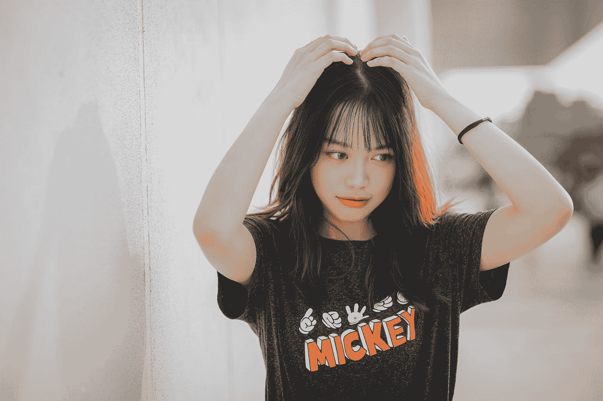

Photo by [Bach Tran](https://unsplash.com/@bachtran2000?utm_source=medium&utm_medium=referral) on [Unsplash](https://unsplash.com?utm_source=medium&utm_medium=referral)

从头开始构建数据科学模型是一项相当大的工作。有许多元素组成一个单一的模型，涉及许多步骤，并且需要许多迭代来创建一个像样的模型。尽管完成这些步骤肯定会帮助您更深入地理解模型中使用的算法，但有时您没有足够的时间来完成所有的试验和错误，特别是当您有一个紧迫的截止日期要满足时。

图像识别是机器学习中的一个领域，已经被许多科技巨头如谷歌、亚马逊、微软深入探索。在图像处理的所有功能中，可能讨论最多的是面部识别。关于这项技术的伦理方面有很多争论，但这超出了本文的范围。我将简单地分享我在 Amazon Rekognition 上的尝试，希望你能从这篇文章中有所收获。

写这篇文章的冲动始于我在他们的网络界面上玩了一下亚马逊的 Rekognition 演示。它提供许多有用的服务，如“对象和场景检测”、“面部识别”、“面部分析”和“名人识别”。我试了几张图，一切都很顺利，直到我到了“名人识别”。在我尝试使用韩国明星的照片之前，名人识别起初似乎还不错。韩国明星的认知度表现明显下降。有时它给我正确的答案，有时它不能识别，有时它给我错误的名字。

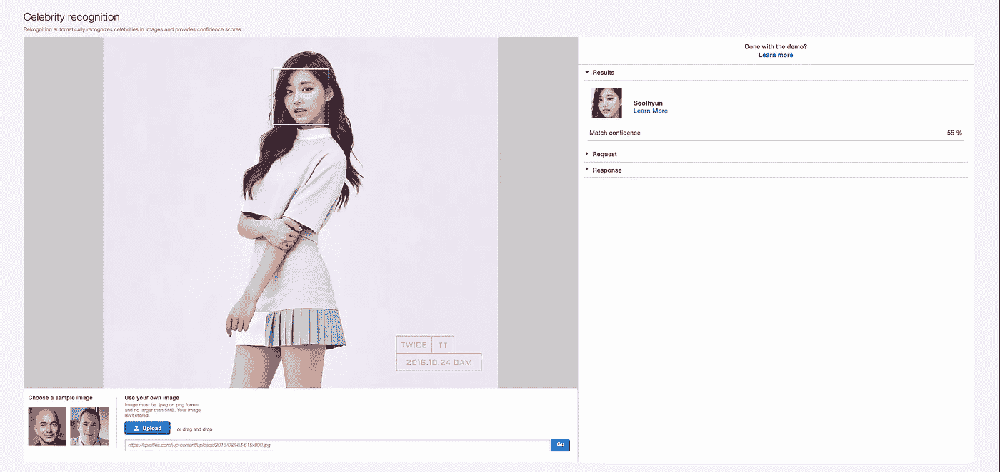

顺便说一下，上面的照片是周子瑜来自一个名为 Twice 的组合，这是我最喜欢的 K-pop 女子组合，我不能接受亚马逊承认这张照片是 Seolhyun(她是另一个名为 AOA 的组合的成员)。

所以我决定使用 Amazon Rekognition 编写一个简单的 Python 脚本，它可以准确地检测两次。

*   除了你可以在文章中找到的简短代码块，我会在文章末尾附上整个 Jupyter 笔记本的链接。
*   这篇文章基于教程“[使用 Amazon Rekognition](https://aws.amazon.com/blogs/machine-learning/build-your-own-face-recognition-service-using-amazon-rekognition/) 构建自己的人脸识别服务”，但对原始代码进行了修改，以适应该项目的特定目的。

# 使用 Amazon Rekognition 进行人脸检测

要运行 Jupyter 笔记本中的以下步骤，有几个先决条件。

1.  亚马逊 AWS 帐户
2.  使用 AWS CLI 配置的 AWS 凭据
3.  Boto3 的最新版本

让我们首先从导入一些将直接用于下一步的包开始。

```
import boto3
from PIL import Image%matplotlib inline
```

现在我们需要一个我们想要处理的图像。我选择了与上面的 web 界面演示相同的图像，我们将把这个图像发送给 Rekognition API 以获得其图像识别的结果。(图片也可以在我将在本文末尾分享的 Github 链接中找到。)我们来快速看一下图像。

```
display(Image.open('Tzuyu.jpeg'))
```

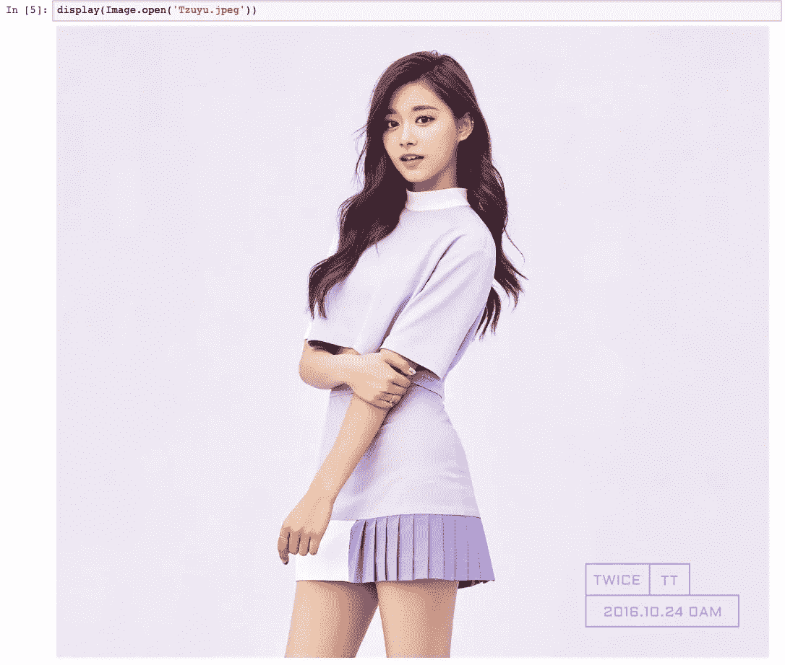

我们可以要求 Rekognition 执行的最基本的任务是用给定的图像进行面部识别，这只需要几行代码就可以完成。

```
import iorekognition = boto3.client('rekognition')image = Image.open("Tzuyu.jpeg")
stream = io.BytesIO()
image.save(stream,format="JPEG")
image_binary = stream.getvalue()rekognition.detect_faces(
Image={'Bytes':image_binary},
    Attributes=['ALL']
)
```

您可以将图像作为内存中的二进制文件对象直接从您的本地机器发送到 rekognition，或者将您的图像上传到 S3，并在调用 rekognition.detect_faces()时将您的桶和密钥详细信息作为参数给出。在上面的例子中，我直接从本地机器发送二进制对象。您将从上面的调用中得到的响应将会很长，包含您可以从 Rekognition 的 detect_faces 函数中得到的所有信息。

```
{'FaceDetails': [{'AgeRange': {'High': 38, 'Low': 20},
   'Beard': {'Confidence': 99.98848724365234, 'Value': False},
   'BoundingBox': {'Height': 0.1584049016237259,
    'Left': 0.4546355605125427,
    'Top': 0.0878104418516159,
    'Width': 0.09999311715364456},
   'Confidence': 100.0,
   'Emotions': [{'Confidence': 37.66959762573242, 'Type': 'SURPRISED'},
    {'Confidence': 29.646778106689453, 'Type': 'CALM'},
    {'Confidence': 3.8459930419921875, 'Type': 'SAD'},
    {'Confidence': 3.134934186935425, 'Type': 'DISGUSTED'},
    {'Confidence': 2.061260938644409, 'Type': 'HAPPY'},
    {'Confidence': 18.516468048095703, 'Type': 'CONFUSED'},
    {'Confidence': 5.1249613761901855, 'Type': 'ANGRY'}],
   'Eyeglasses': {'Confidence': 99.98339080810547, 'Value': False},
   'EyesOpen': {'Confidence': 99.9864730834961, 'Value': True},
   'Gender': {'Confidence': 99.84709167480469, 'Value': 'Female'},
   'Landmarks': [{'Type': 'eyeLeft',
     'X': 0.47338899970054626,
     'Y': 0.15436244010925293},
    {'Type': 'eyeRight', 'X': 0.5152773261070251, 'Y': 0.1474122554063797},
    {'Type': 'mouthLeft', 'X': 0.48312342166900635, 'Y': 0.211111381649971},
    {'Type': 'mouthRight', 'X': 0.5174261927604675, 'Y': 0.20560002326965332},
    {'Type': 'nose', 'X': 0.4872787892818451, 'Y': 0.1808750480413437},
    {'Type': 'leftEyeBrowLeft',
     'X': 0.45876359939575195,
     'Y': 0.14424000680446625},
    {'Type': 'leftEyeBrowRight',
     'X': 0.4760720133781433,
     'Y': 0.13612663745880127},
    {'Type': 'leftEyeBrowUp',
     'X': 0.4654795229434967,
     'Y': 0.13559915125370026},
    {'Type': 'rightEyeBrowLeft',
     'X': 0.5008187890052795,
     'Y': 0.1317606270313263},
    {'Type': 'rightEyeBrowRight',
     'X': 0.5342025756835938,
     'Y': 0.1317359358072281},
    {'Type': 'rightEyeBrowUp',
     'X': 0.5151524543762207,
     'Y': 0.12679456174373627},
    {'Type': 'leftEyeLeft', 'X': 0.4674917757511139, 'Y': 0.15510375797748566},
    {'Type': 'leftEyeRight',
     'X': 0.4817998707294464,
     'Y': 0.15343616902828217},
    {'Type': 'leftEyeUp', 'X': 0.47253310680389404, 'Y': 0.1514900177717209},
    {'Type': 'leftEyeDown',
     'X': 0.47370508313179016,
     'Y': 0.15651680529117584},
    {'Type': 'rightEyeLeft',
     'X': 0.5069678425788879,
     'Y': 0.14930757880210876},
    {'Type': 'rightEyeRight',
     'X': 0.5239912867546082,
     'Y': 0.1460886150598526},
    {'Type': 'rightEyeUp', 'X': 0.5144344568252563, 'Y': 0.1447771191596985},
    {'Type': 'rightEyeDown',
     'X': 0.5150220394134521,
     'Y': 0.14997448027133942},
    {'Type': 'noseLeft', 'X': 0.4858757555484772, 'Y': 0.18927086889743805},
    {'Type': 'noseRight', 'X': 0.5023624897003174, 'Y': 0.1855706423521042},
    {'Type': 'mouthUp', 'X': 0.4945952594280243, 'Y': 0.2002507448196411},
    {'Type': 'mouthDown', 'X': 0.4980264902114868, 'Y': 0.21687346696853638},
    {'Type': 'leftPupil', 'X': 0.47338899970054626, 'Y': 0.15436244010925293},
    {'Type': 'rightPupil', 'X': 0.5152773261070251, 'Y': 0.1474122554063797},
    {'Type': 'upperJawlineLeft',
     'X': 0.46607205271720886,
     'Y': 0.15965013206005096},
    {'Type': 'midJawlineLeft',
     'X': 0.47901660203933716,
     'Y': 0.21797965466976166},
    {'Type': 'chinBottom', 'X': 0.5062429904937744, 'Y': 0.24532964825630188},
    {'Type': 'midJawlineRight',
     'X': 0.5554487109184265,
     'Y': 0.20579127967357635},
    {'Type': 'upperJawlineRight',
     'X': 0.561174750328064,
     'Y': 0.14439250528812408}],
   'MouthOpen': {'Confidence': 99.0997543334961, 'Value': True},
   'Mustache': {'Confidence': 99.99714660644531, 'Value': False},
   'Pose': {'Pitch': 1.8594770431518555,
    'Roll': -11.335309982299805,
    'Yaw': -33.68760681152344},
   'Quality': {'Brightness': 89.57070922851562,
    'Sharpness': 86.86019134521484},
   'Smile': {'Confidence': 99.23001861572266, 'Value': False},
   'Sunglasses': {'Confidence': 99.99723815917969, 'Value': False}}],
 'ResponseMetadata': {'HTTPHeaders': {'connection': 'keep-alive',
   'content-length': '3297',
   'content-type': 'application/x-amz-json-1.1',
   'date': 'Sun, 19 May 2019 08:45:56 GMT',
   'x-amzn-requestid': '824f5dc3-7a12-11e9-a384-dfb84e388b7e'},
  'HTTPStatusCode': 200,
  'RequestId': '824f5dc3-7a12-11e9-a384-dfb84e388b7e',
  'RetryAttempts': 0}}
```

从上面 detect_faces 调用的示例响应中可以看出，它不仅具有图片中人脸位置的包围盒信息，还具有更高级的特征，如情绪、性别、年龄范围等。

# 比较面孔

有了 Amazon Rekognition，你可以对比两张图片中的人脸。例如，如果我将一张周子瑜的图片设置为我的源图片，然后发送一张两倍于我的目标图片的集体照，Rekognition 会在目标图片中找到与源图片最相似的人脸。下面是我将使用的两次集体照。

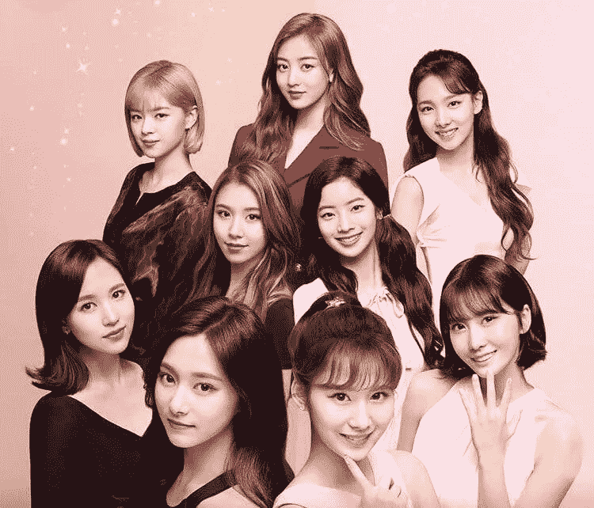

即使对人类来说也可能很难，尤其是如果你不是亚洲人(或者不是 Twice 粉丝)。你可以猜猜照片中的周子瑜是谁。作为一个韩国人，同时也是两次粉丝，我知道答案，但让我们看看 Rekognition 能从这张照片中找到周子瑜有多好。

```
sourceFile='Tzuyu.jpeg'
targetFile='twice_group.jpg'

imageSource=open(sourceFile,'rb')
imageTarget=open(targetFile,'rb')response = rekognition.compare_faces(SimilarityThreshold=80,
                              SourceImage={'Bytes': imageSource.read()},
                              TargetImage={'Bytes': imageTarget.read()})
response['FaceMatches']
```

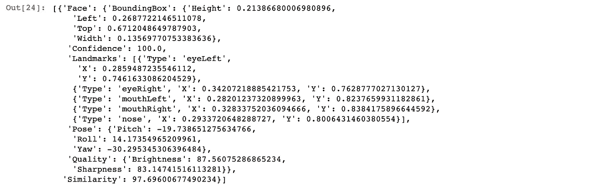

上面 compare_faces 的响应还会输出组图中所有不匹配人脸的信息，这可能会变得相当长，所以我只是输出 Rekognition 通过指定 response['FaceMatches']找到的匹配。看起来像是从一组照片中找到了一张相似度在 97%左右的匹配脸。有了边界框信息，让我们检查 Rekognition 指的是周子瑜的哪张脸。

顺便说一下，BoundingBox 部分中的值是整个图像大小的比率。因此，为了用 BoundingBox 中的值绘制方框，需要通过乘以实际图像高度或宽度的比率来计算方框中每个点的位置。您可以在下面的代码片段中找到如何做到这一点。

```
from PIL import ImageDrawimage = Image.open("twice_group.jpg")
imgWidth,imgHeight  = image.size  
draw = ImageDraw.Draw(image)
box = response['FaceMatches'][0]['Face']['BoundingBox']
left = imgWidth * box['Left']
top = imgHeight * box['Top']
width = imgWidth * box['Width']
height = imgHeight * box['Height']
points = (
            (left,top),
            (left + width, top),
            (left + width, top + height),
            (left , top + height),
            (left, top))
draw.line(points, fill='#00d400', width=2)display(image)
```

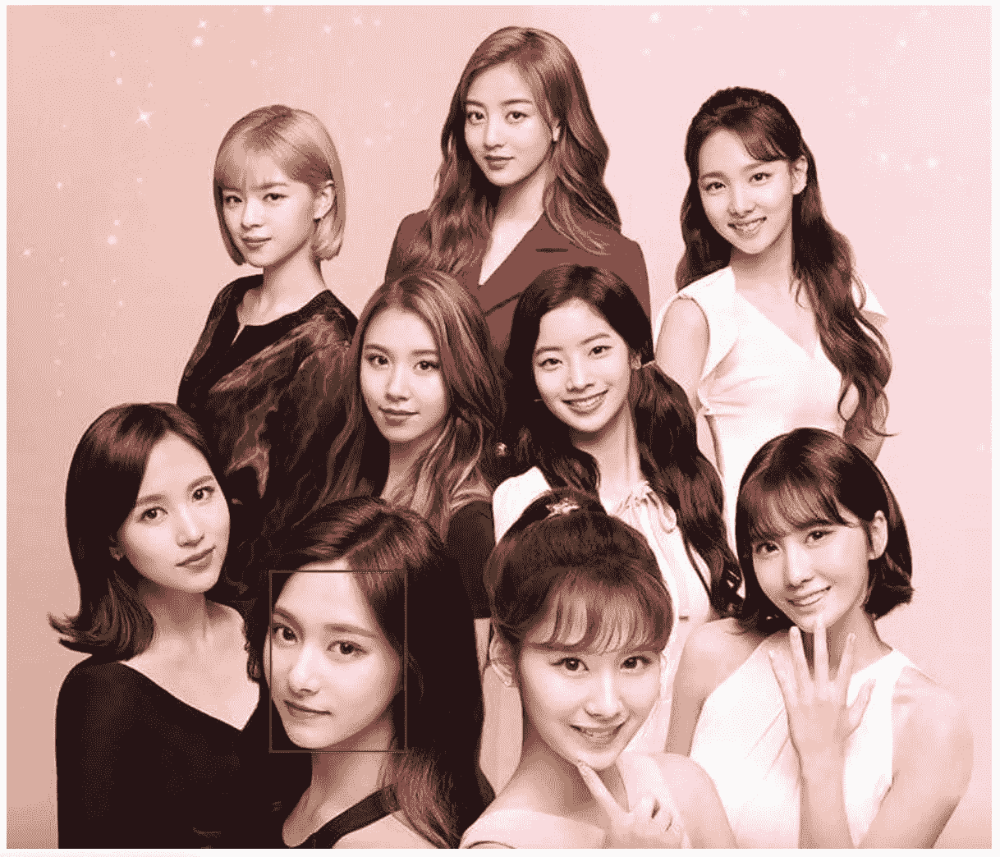

是啊！干得好，雷科尼提翁！那确实是周子瑜！

# 正在创建收藏

现在我们可以从一张图片中检测人脸，从目标图片中找到与源图片最相似的人脸。但是，这些都是一次性调用，我们需要更多的东西来存储每个成员的脸和他们的名字的信息，以便当我们发送两次新的图片时，它可以检索数据并检测每个成员的脸并显示他们的名字。为了实现这一点，我们需要使用亚马逊所谓的“[基于存储的 API 操作](https://docs.aws.amazon.com/rekognition/latest/dg/how-it-works-storage-non-storage.html)”。这种类型的操作有两个亚马逊特有的术语。“集合”是一个虚拟空间，Rekognition 在其中存储有关检测到的人脸的信息。使用集合，我们可以“索引”人脸，这意味着检测图像中的人脸，然后将信息存储在指定的集合中。重要的是，Rekognition 存储在集合中的信息不是实际的图像，而是由 Rekognition 的算法提取的特征向量。让我们看看如何创建一个集合并添加索引。

```
collectionId='test-collection'
rekognition.create_collection(CollectionId=collectionId)
```

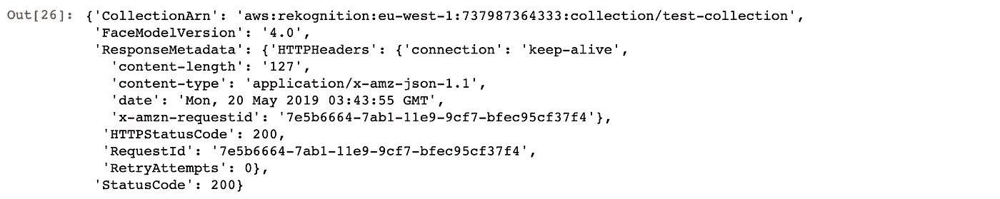

是的。就这么简单。由于这是我们刚刚创建的新集合，因此集合中没有存储任何信息。但是，让我们仔细检查一下。

```
rekognition.describe_collection(CollectionId=collectionId)
```

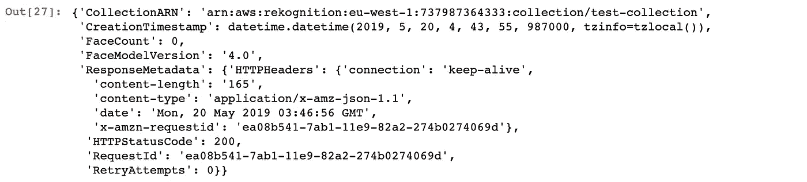

在上面的响应中，您可以看到“FaceCount”为 0。如果我们索引任何人脸并将该信息存储在集合中，这种情况将会改变。

# 索引面

使用 Rekognition 为人脸建立索引同样简单，只需一行代码。

```
sourceFile='Tzuyu.jpeg'   
imageSource=open(sourceFile,'rb')rekognition.index_faces(Image={'Bytes':imageSource.read()},ExternalImageId='Tzuyu',CollectionId=collectionId)
```

从上面的代码，你可以看到我正在传递 ExternalImageId 参数，并给它的值字符串“周子瑜”。稍后，当我们试图从一张新照片中识别周子瑜时，Rekognition 将搜索与任何索引人脸相匹配的人脸。正如您将在后面看到的，当索引一个面时，Rekognition 会给它一个唯一的面 ID。但是，当在新图片中找到匹配的人脸时，我想显示“周子瑜”这个名字。为此，我使用 ExternalImageId。现在，如果我们检查我们的集合，我们可以看到 1 张脸被添加到集合中。

```
rekognition.describe_collection(CollectionId=collectionId)
```

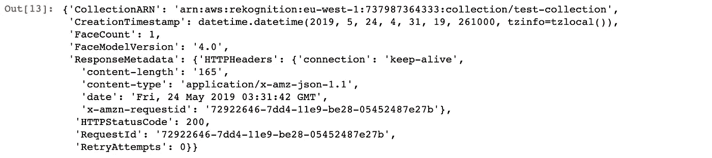

# 通过图像搜索面孔

现在，随着周子瑜的脸在我们的集合中被编入索引，我们可以向 Rekognition 发送一张新的看不见的照片，并找到匹配的脸。但是 search_faces_by_image 函数的一个问题是只能检测一张脸(图像中最大的)。因此，如果我们想发送两次的团体照片，并从那里找到周子瑜，我们将需要做一个额外的步骤。下面我们先用 detect_faces 检测图片中的所有人脸，然后有了每个人脸的包围盒信息，我们再逐个调用 search_faces_by_image。首先让我们检测每张脸。

```
imageSource=open('twice_group.jpg','rb')
resp = rekognition.detect_faces(Image={'Bytes':imageSource.read()})
all_faces = resp['FaceDetails']
len(all_faces)
```


Rekognition 从群组图片中检测到 9 张人脸。很好。现在让我们裁剪每个面，并逐个调用 serach_faces_by_image。

```
image = Image.open("twice_group.jpg")
image_width,image_height  = image.sizefor face in all_faces:
    box=face['BoundingBox']
    x1 = box['Left'] * image_width
    y1 = box['Top'] * image_height
    x2 = x1 + box['Width'] * image_width
    y2 = y1 + box['Height']  * image_height
    image_crop = image.crop((x1,y1,x2,y2))

    stream = io.BytesIO()
    image_crop.save(stream,format="JPEG")
    image_crop_binary = stream.getvalue()response = rekognition.search_faces_by_image(
            CollectionId=collectionId,
            Image={'Bytes':image_crop_binary}                                       
            )
    print(response)
    print('-'*100)
```

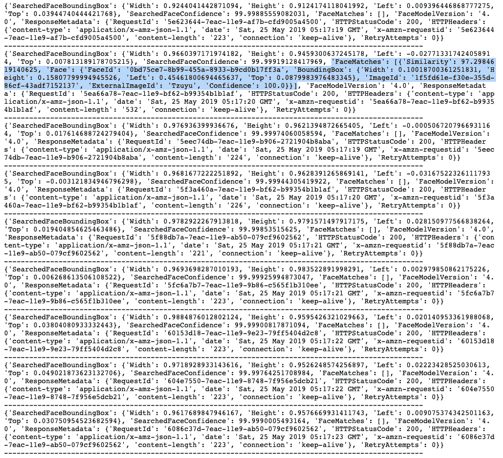

在我们进行的 9 次 search_faces_by_image 调用中，Rekognition 找到了一个与我们的集合中的索引人脸相匹配的人脸。我们只索引了周子瑜的一张脸，所以它从组图中找到的是周子瑜的脸。让我们用边界框和名称在图像上显示它。对于名称部分，我们将使用我们在索引面部时设置的 ExternalImageId。顺便说一下，从 search_faces_by_image 响应来看，‘face matches’部分是一个数组，如果从集合中找到多个匹配，那么它会显示所有匹配。根据 Amazon 的说法，这个数组是按照相似性得分排序的，相似性最高的排在最前面。我们将通过指定数组的第一项来获得最高分的匹配。

```
from PIL import ImageFont
import ioimage = Image.open("twice_group.jpg")
image_width,image_height  = image.size 

for face in all_faces:
    box=face['BoundingBox']
    x1 = box['Left'] * image_width
    y1 = box['Top'] * image_height
    x2 = x1 + box['Width'] * image_width
    y2 = y1 + box['Height']  * image_height
    image_crop = image.crop((x1,y1,x2,y2))

    stream = io.BytesIO()
    image_crop.save(stream,format="JPEG")
    image_crop_binary = stream.getvalue()response = rekognition.search_faces_by_image(
            CollectionId=collectionId,
            Image={'Bytes':image_crop_binary}                                       
            )

    if len(response['FaceMatches']) > 0:
        draw = ImageDraw.Draw(image)
        points = (
                    (x1,y1),
                    (x2, y1),
                    (x2, y2),
                    (x1 , y2),
                    (x1, y1))
        draw.line(points, fill='#00d400', width=2)
        fnt = ImageFont.truetype('/Library/Fonts/Arial.ttf', 15)
        draw.text((x1,y2),response['FaceMatches'][0]['Face']['ExternalImageId'], font=fnt, fill=(255, 255, 0))
        display(image)
```

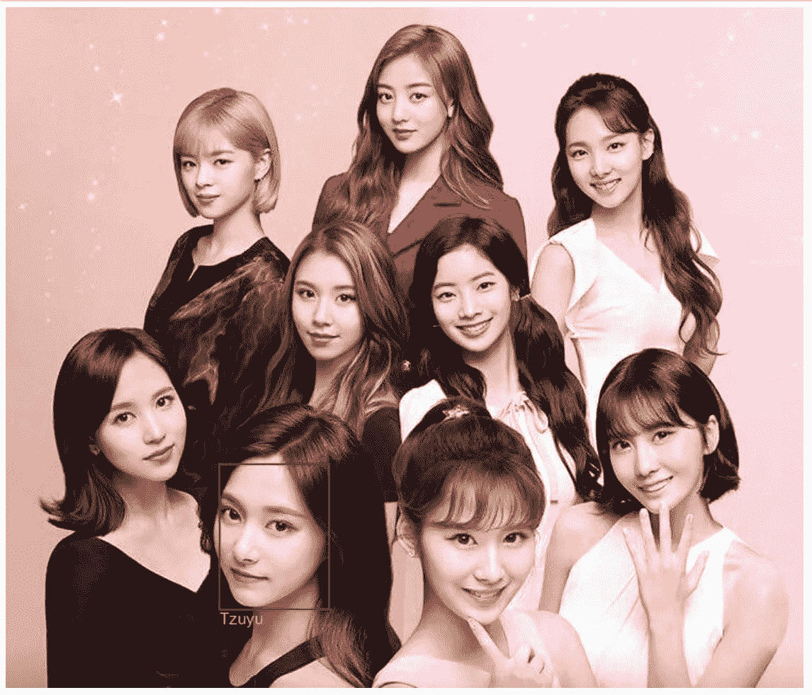

万岁！又是正确答案！

# 两次识别所有组成员

现在，让我们扩展项目，从组图片中识别所有成员。为了做到这一点，我们首先需要索引所有成员的脸(有 9 个成员)。我为每个成员准备了 4 张照片。我按照 Christian Petters 写的[亚马逊教程](https://aws.amazon.com/blogs/machine-learning/build-your-own-face-recognition-service-using-amazon-rekognition/)的逻辑添加了同一个人的多张图片。根据 Petters 的说法，“为每个人添加多个参考图像大大提高了一个人的潜在匹配率”，这具有直观的意义。从我将在最后分享的 Github 链接中，你会找到这个项目中使用的所有图片。

```
collectionId='twice'
rekognition.create_collection(CollectionId=collectionId)
```

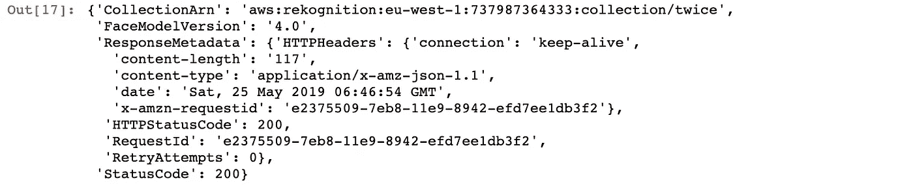

```
import ospath = 'Twice'for r, d, f in os.walk(path):
    for file in f:
        if file != '.DS_Store':
            sourceFile = os.path.join(r,file)
            imageSource=open(sourceFile,'rb')
            rekognition.index_faces(Image={'Bytes':imageSource.read()},ExternalImageId=file.split('_')[0],CollectionId=collectionId)
rekognition.describe_collection(CollectionId=collectionId)
```


好的。似乎所有 36 张照片都被编入了我们的“两次”收藏。现在是检查最终结果的时候了。可以增强 Rekognition 来识别两次的每个成员吗？

```
from PIL import ImageFontimage = Image.open("twice_group.jpg")
image_width,image_height  = image.size 

for face in all_faces:
    box=face['BoundingBox']
    x1 = box['Left'] * image_width
    y1 = box['Top'] * image_height
    x2 = x1 + box['Width'] * image_width
    y2 = y1 + box['Height']  * image_height
    image_crop = image.crop((x1,y1,x2,y2))

    stream = io.BytesIO()
    image_crop.save(stream,format="JPEG")
    image_crop_binary = stream.getvalue()response = rekognition.search_faces_by_image(
            CollectionId=collectionId,
            Image={'Bytes':image_crop_binary}                                       
            )

    if len(response['FaceMatches']) > 0:
        draw = ImageDraw.Draw(image)
        points = (
                    (x1,y1),
                    (x2, y1),
                    (x2, y2),
                    (x1 , y2),
                    (x1, y1))
        draw.line(points, fill='#00d400', width=2)
        fnt = ImageFont.truetype('/Library/Fonts/Arial.ttf', 15)
        draw.text((x1,y2),response['FaceMatches'][0]['Face']['ExternalImageId'], font=fnt, fill=(255, 255, 0))display(image)
```

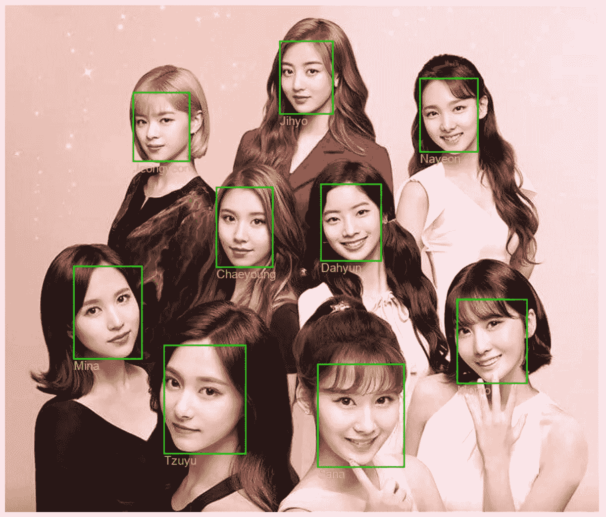

是啊！可以的！它正确地识别了所有成员！

感谢您的阅读。你可以从下面的链接中找到 Jupyter 笔记本和用于这个项目的图片。

https://github.com/tthustla/twice_recognition