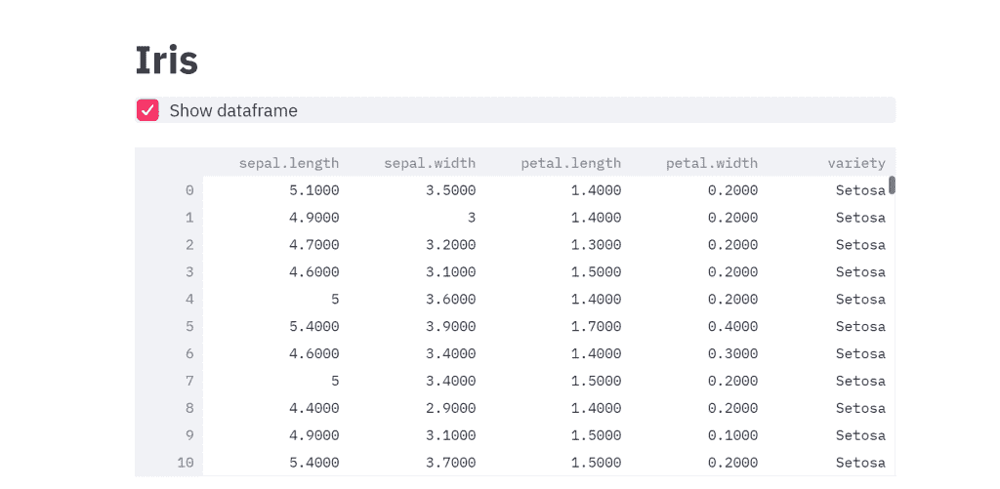
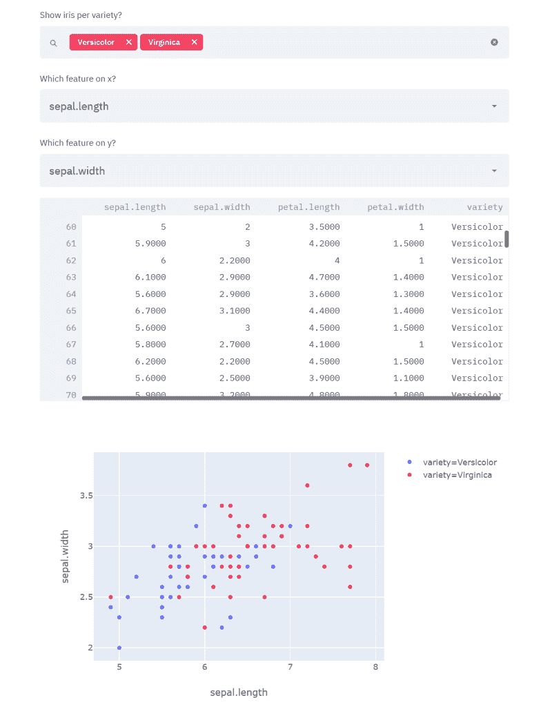
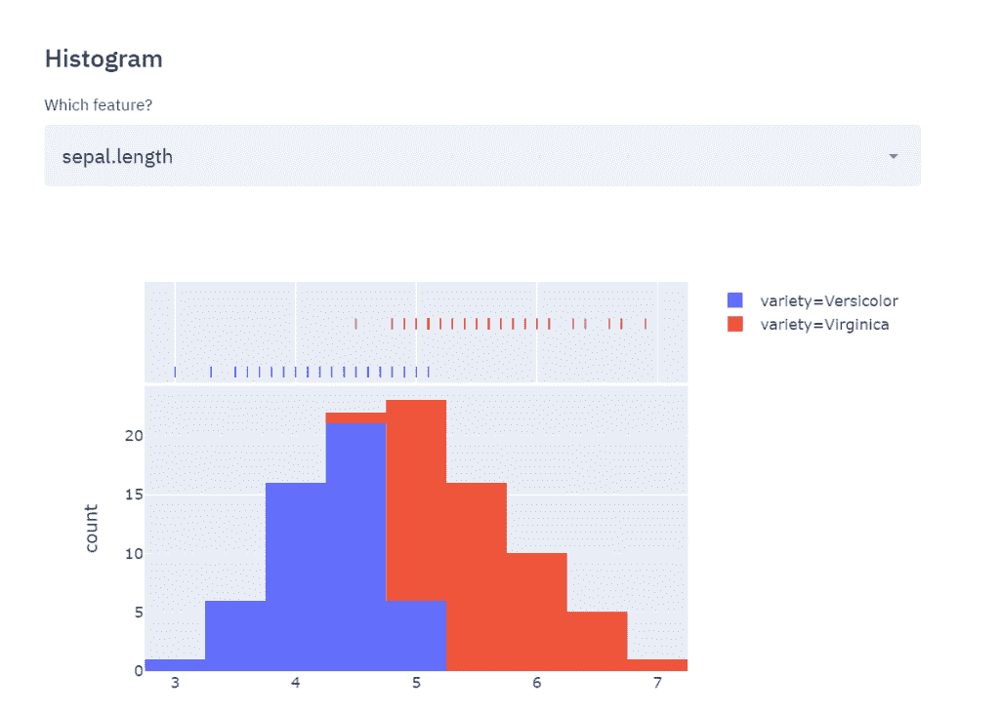
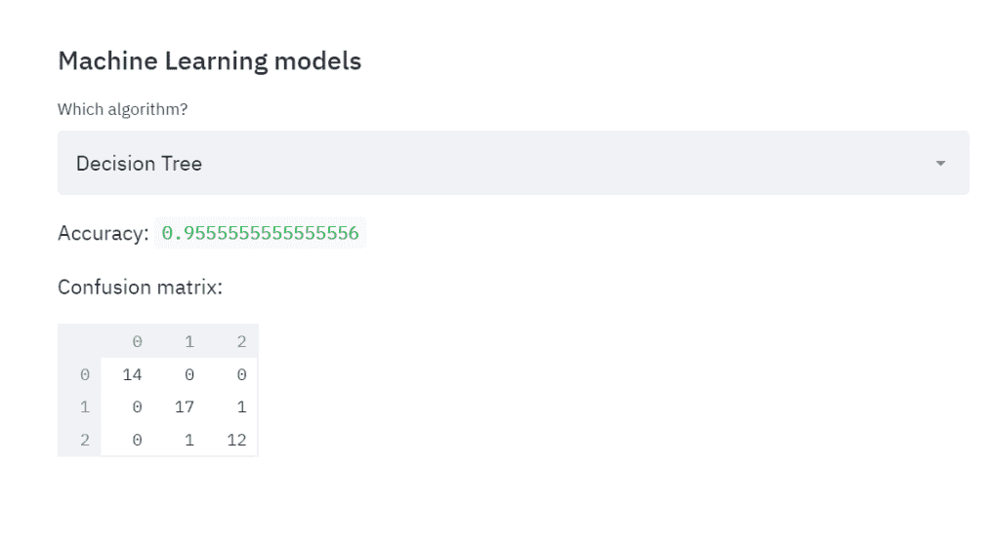
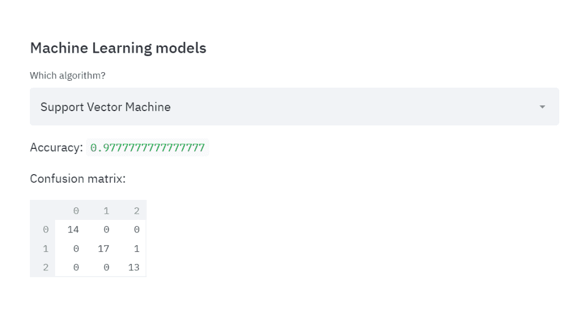

# 使用 Streamlit 构建机器学习应用

> 原文：<https://towardsdatascience.com/building-machine-learning-apps-with-streamlit-667cef3ff509?source=collection_archive---------19----------------------->


[Streamlit](https://streamlit.io/docs/) 是一个开源的 Python 库，可以轻松构建漂亮的机器学习应用。你可以通过 *pip* 在你的终端上轻松安装它，然后开始用 Python 编写你的网络应用。

在这篇文章中，我将展示一些关于 Streamlit 的有趣功能，构建一个以检查数据为目的的应用程序，并在其上构建 ML 模型。为此，我将使用非常基本的 Iris 数据集，并对其进行一些分类。然而，如果你对这个工具更高级的潜力感兴趣，我建议你阅读[这个教程](https://streamlit.io/docs/tutorial/create_a_data_explorer_app.html)。

说到这里，让我们开始构建我们的应用程序。我将把我所有的代码写在一个名为 iris.py 的文件中，这样我就可以通过 *streamlit iris.py* 从我的终端运行它。

最后，我的应用程序的完整代码如下:

```
import streamlit as st
import pandas as pd
import numpy as np
import plotly.express as px
import seaborn as sns
import matplotlib.pyplot as plt
import plotly.graph_objects as gost.title('Iris')df = pd.read_csv("iris.csv")if st.checkbox('Show dataframe'):
    st.write(df)st.subheader('Scatter plot')species = st.multiselect('Show iris per variety?', df['variety'].unique())
col1 = st.selectbox('Which feature on x?', df.columns[0:4])
col2 = st.selectbox('Which feature on y?', df.columns[0:4])new_df = df[(df['variety'].isin(species))]
st.write(new_df)
# create figure using plotly express
fig = px.scatter(new_df, x =col1,y=col2, color='variety')
# Plot!st.plotly_chart(fig)st.subheader('Histogram')feature = st.selectbox('Which feature?', df.columns[0:4])
# Filter dataframe
new_df2 = df[(df['variety'].isin(species))][feature]
fig2 = px.histogram(new_df, x=feature, color="variety", marginal="rug")
st.plotly_chart(fig2)st.subheader('Machine Learning models')from sklearn.model_selection import train_test_split
from sklearn.tree import DecisionTreeClassifier
from sklearn.metrics import confusion_matrix
from sklearn.svm import SVCfeatures= df[['sepal.length', 'sepal.width', 'petal.length', 'petal.width']].values
labels = df['variety'].valuesX_train,X_test, y_train, y_test = train_test_split(features, labels, train_size=0.7, random_state=1)alg = ['Decision Tree', 'Support Vector Machine']
classifier = st.selectbox('Which algorithm?', alg)
if classifier=='Decision Tree':
    dtc = DecisionTreeClassifier()
    dtc.fit(X_train, y_train)
    acc = dtc.score(X_test, y_test)
    st.write('Accuracy: ', acc)
    pred_dtc = dtc.predict(X_test)
    cm_dtc=confusion_matrix(y_test,pred_dtc)
    st.write('Confusion matrix: ', cm_dtc)elif classifier == 'Support Vector Machine':
    svm=SVC()
    svm.fit(X_train, y_train)
    acc = svm.score(X_test, y_test)
    st.write('Accuracy: ', acc)
    pred_svm = svm.predict(X_test)
    cm=confusion_matrix(y_test,pred_svm)
    st.write('Confusion matrix: ', cm)
```

现在，让我们检查每段代码。首先，一旦导入了所需的包，我想设置我的应用程序的标题并导入我的数据:

```
import streamlit as st
import pandas as pd
import numpy as np
import plotly.express as px
import seaborn as sns
import matplotlib.pyplot as plt
import plotly.graph_objects as gost.title('Iris')df = pd.read_csv("iris.csv")
```

现在我想要第一个选项，它允许用户决定是否显示整个数据集。我可以用下面的语法做到这一点(以及许多其他交互小部件):

```
if st.checkbox('Show dataframe'): 
     st.write(df)
```

尽管天真，我们已经可以启动我们的婴儿应用程序，并在 localhost:8501:



如您所见，我决定显示我的数据集，但是，在任何时候，我都可以通过取消选中该框来隐藏它。

现在让我们转向一些可视化工具。假设我想要散点图我的数据，有可能选择那些我感兴趣的要素和标签。

```
species = st.multiselect('Show iris per variety?', df['variety'].unique())
col1 = st.selectbox('Which feature on x?', df.columns[0:4])
col2 = st.selectbox('Which feature on y?', df.columns[0:4])new_df = df[(df['variety'].isin(species))]
st.write(new_df)
fig = px.scatter(new_df, x =col1,y=col2, color='variety')st.plotly_chart(fig)
```



正如你所看到的，在我选择的例子中，物种杂色和海滨锦鸡儿的特征是萼片长度和萼片宽度，但我可以随时改变它们，并实时更新我的所有图表。

现在，我想用同样的逻辑添加一个直方图，显示任何特征的分布。此外，我想有可能绘制出每个特征的 3 个条件分布，相对于以前选择的品种。因此:

```
feature = st.selectbox('Which feature?', df.columns[0:4])
# Filter dataframe
new_df2 = df[(df['variety'].isin(species))][feature]
fig2 = px.histogram(new_df, x=feature, color="variety", marginal="rug")
st.plotly_chart(fig2)
```



这两个物种和我上面选的是一样的，而且，我可以随时改变它们。

现在让我们进入最后一部分，即训练实时 ML 算法，并让用户决定应用哪一种算法。为此，我将在 S [支持向量机](https://medium.com/swlh/support-vector-machine-from-scratch-ce095a47dc5c)和 D [决策树](https://medium.com/analytics-vidhya/visualizing-decision-tree-with-r-774f58ac23c)这两种分类算法之间进行选择。对于每一个问题，我会让我的应用程序打印准确性(正确分类的数量/观察总数)和混淆矩阵:

```
from sklearn.model_selection import train_test_split
from sklearn.tree import DecisionTreeClassifier
from sklearn.metrics import confusion_matrix
from sklearn.svm import SVCfeatures= df[['sepal.length', 'sepal.width', 'petal.length', 'petal.width']].values
labels = df['variety'].valuesX_train,X_test, y_train, y_test = train_test_split(features, labels, train_size=0.7, random_state=1)alg = ['Decision Tree', 'Support Vector Machine']
classifier = st.selectbox('Which algorithm?', alg)
if classifier=='Decision Tree':
    dtc = DecisionTreeClassifier()
    dtc.fit(X_train, y_train)
    acc = dtc.score(X_test, y_test)
    st.write('Accuracy: ', acc)
    pred_dtc = dtc.predict(X_test)
    cm_dtc=confusion_matrix(y_test,pred_dtc)
    st.write('Confusion matrix: ', cm_dtc)elif classifier == 'Support Vector Machine':
    svm=SVC()
    svm.fit(X_train, y_train)
    acc = svm.score(X_test, y_test)
    st.write('Accuracy: ', acc)
    pred_svm = svm.predict(X_test)
    cm=confusion_matrix(y_test,pred_svm)
    st.write('Confusion matrix: ', cm)
```



那么，如果我选择 SVM:



因此，我们能够以一种非常用户友好的方式即时比较两个分类器的性能。

Streamlit 是一个非常强大的工具，特别是如果您想要提供一种交互式的方式来理解您的分析结果:它允许实时可视化您的数据，并有可能过滤它们，它允许有意义的表示。

在这里，我向您展示了使用 Streamlit 可以实现的非常基本的实现，因此，如果您想更深入地研究这个工具，我推荐您进一步阅读参考资料。

**参考文献**:

*   [https://streamlit.io/docs/](https://streamlit.io/docs/)
*   [https://streamlit.io/docs/tutorial/index.html](https://streamlit.io/docs/tutorial/index.html)

*原载于 2019 年 10 月 22 日*[*http://datasciencechalktalk.com*](https://datasciencechalktalk.com/2019/10/22/building-machine-learning-apps-with-streamlit/)*。*