# 构建预测抗生素耐药性的机器学习模型

> 原文：<https://towardsdatascience.com/building-machine-learning-models-for-predicting-antibiotic-resistance-7640046a91b6?source=collection_archive---------21----------------------->

DPhoto by [Markus Spiske](https://unsplash.com/@markusspiske?utm_source=unsplash&utm_medium=referral&utm_content=creditCopyText) on [Unsplash](https://unsplash.com/collections/4353513/my-first-collection/a193056e4c3aeb1aa7eb2b4b2c608dc8?utm_source=unsplash&utm_medium=referral&utm_content=creditCopyText)

## 我第一次向计算机科学学生介绍用 ML 预测抗生素耐药性的研讨会的回顾

这个月，我在罗马尼亚的克卢日纳波卡为大约 25 名计算机科学学生举办了一个研讨会。该研讨会是为期两天的生物学中的 ML 研讨会的一部分，由罗马尼亚生物信息学协会[组织。](http://www.rsbi.ro)

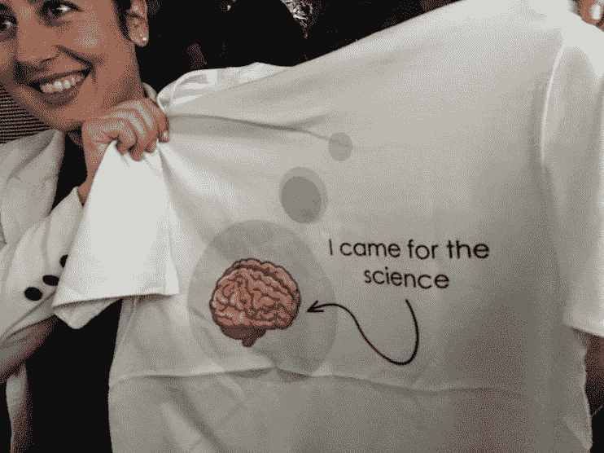

Cluj-Napoca, Romania

根据之前的民意调查，计算机科学专业的理学学士、理学硕士和博士学生对学习 ML 在医学和生物学中的应用非常感兴趣。大多数参加会议的学生在本科学习期间学习了机器学习算法，但对学习更多关于生物信息学/生物学的知识感兴趣。

我在研讨会中的角色是就预测抗生素耐药性的 ML 发表一个小时的演讲，然后为一部分学生举办两个小时的实践研讨会。我的目的是向学生介绍 ML 在鉴定抗生素耐药细菌中的应用，并让他们思考我们用于 ML 的标准方法在应用于细菌基因组数据时的一些当前局限性，以及超越这些局限性的方法。

## 问题简介

对治疗没有反应的细菌感染越来越令人担忧。目前，抗生素耐药性感染每年导致 70 多万人死亡，到 2050 年，预计将有 1000 万人死于抗生素耐药性感染，除非我们对开发和使用抗生素的方式做出重大改变。

从全基因组序列预测抗生素耐药性的机器学习算法可以提高我们识别和遏制新耐药菌株的能力。在不久的将来，有可能在采集样本后的几个小时内对引起感染的细菌的 DNA 进行测序，然后分析这些 DNA 序列数据，以预测哪些抗生素可以成功用于治疗感染。

耐药性在*淋病奈瑟菌*，导致淋病的细菌是一个特别大的问题，淋病感染对所有可用的抗生素都具有耐药性，这在世界各地都有出现。淋病是欧洲第二常见的性传播感染(STI)，仅次于衣原体。淋病感染率正在上升，英国 2017-2018 年报告的病例增加了 26%。

许多被感染的人没有任何症状，这有助于感染的传播。如果不进行治疗，这种感染会导致男性和女性不孕，或导致危及生命的宫外孕。患有淋病的母亲所生的婴儿可能会发生眼部感染，如果不治疗，会导致永久性失明。

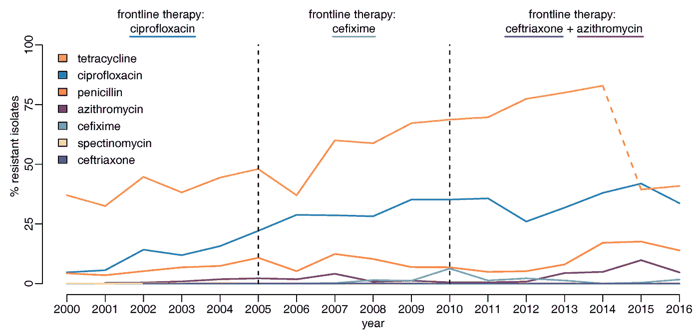

Increasing resistance to the antibiotics we use to treat gonorrhoea. Image from [Whittles et al. 2018](https://www.mdpi.com/2079-6382/7/3/60).

过去，病人用一种叫做环丙沙星的抗生素治疗。医生现在已经停止用这种抗生素治疗感染，因为对这种药物的耐药性变得太普遍，导致治疗失败。直到最近，推荐的治疗是两种药物——头孢曲松和阿奇霉素。但是，由于担心对阿奇霉素耐药性的上升，阿奇霉素已从英国的治疗建议中删除。目前在英国，患者仅接受头孢曲松的治疗。

2018 年 2 月，报告了有史以来第一例对所有常用治疗方法产生耐药性的病例，今年，英国两名女性在没有离开该国的情况下感染了这种疾病，这表明耐药性将持续存在。

 [## 男人得了“世界上最严重的”超级淋病

### 英国一名男子感染了世界上“有史以来最严重”的超级淋病。他在英国有固定的伴侣，但是…

www.bbc.co.uk](https://www.bbc.co.uk/news/health-43571120) 

多年来，由于耐药性增加，许多药物已经从治疗建议中删除，但这些抗生素中的每一种仍然可以用于治疗一些感染，这意味着如果我们可以自信地预测抗生素耐药性，我们可以重新使用这些抗生素。

## 研讨会的形式

参加研讨会的每个人也参加了我的演讲，我的演讲向人们介绍了我们对抗生素耐药性细菌感染日益增长的担忧，以及如何将机器学习算法构建到护理点诊断中，以帮助减少或消除抗生素耐药性的传播。

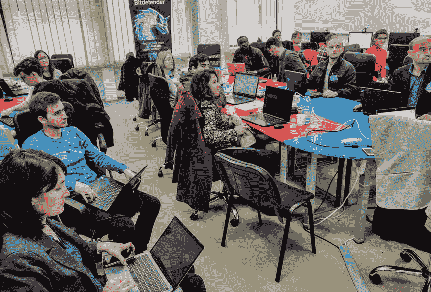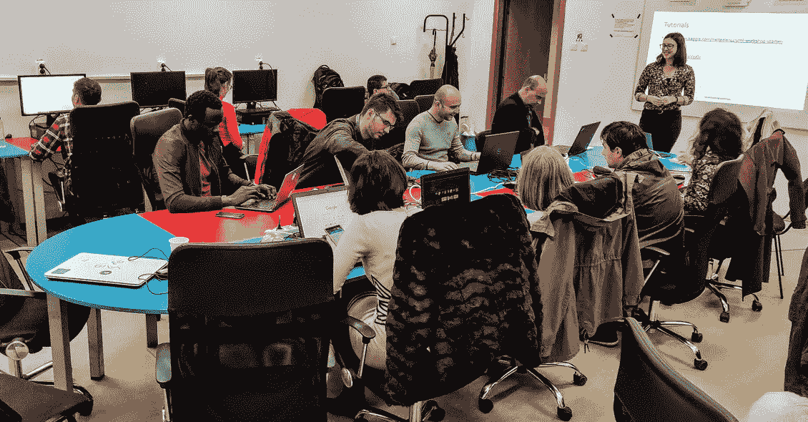

该研讨会旨在让人们亲自查看数据，并使用它来构建机器学习算法。由于之前没有设计过研讨会，我不确定在 2 个小时的时间内需要准备多少材料，所以我设计了一个简单的活动，后续工作有多个选项，让参与者做他们感兴趣的事情。

我使用 [Kaggle](http://kaggle.com) 运行研讨会，因为它允许我上传数据，并通过一个简单的界面访问数据，这允许包含额外的信息以给出数据上下文。我创建了一个入门笔记本，带领参与者阅读和查看数据，然后构建一些简单的模型并评估他们的表现。

## 培训用数据

在这个实验中，我们使用了 unitigs，我们收集的菌株共有的 DNA 片段。这些是通过提取不同细菌的 DNA 产生的，我们在对它们的基因组测序后将这些 DNA 拼凑在一起，然后将其分解为不同的 31 个字符的单词。这些词然后被组合成一个德布鲁因图(DBG)。该图是通过识别内部重叠的单词拼凑而成的，并且出现在相同的样本中。

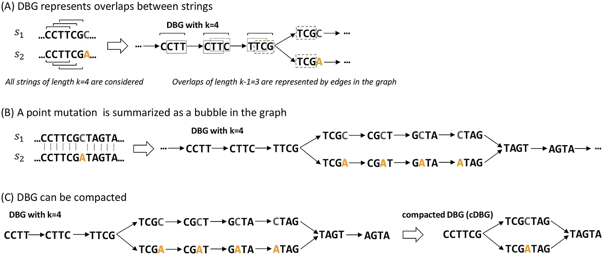

要了解更多关于 unitigs 的信息，请阅读本文:

 [## 一种快速和不可知的细菌全基因组关联研究方法:弥合…

### 作者摘要全基因组关联研究(GWAS)有助于探索癌症表型变异的遗传基础

journals.plos.org](https://journals.plos.org/plosgenetics/article?id=10.1371/journal.pgen.1007758) 

这个过程让我们能够以一种高效的方式来表现这些不同细菌之间的异同。这种差异可能是个体突变，插入或删除的 DNA 片段，或其他称为质粒的遗传元素，它们可以在细菌之间传递并传播抗生素耐药性。

通常，在处理 unitigs 时，变量的数量可能在 50-500 万之间，但出于练习的目的，我首先进行了一项关联研究，以确定与耐药性显著相关的 unitigs，从而加快分析速度。

对于包含 3，971 个样本的数据集，过滤后得到 8，873 个与环丙沙星耐药性高度相关的单位免疫球蛋白和 515 个与阿奇霉素耐药性显著相关的单位免疫球蛋白。

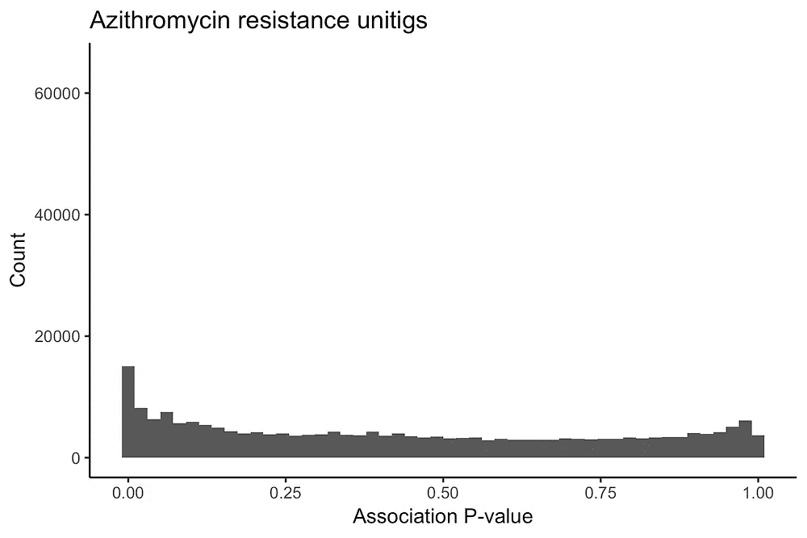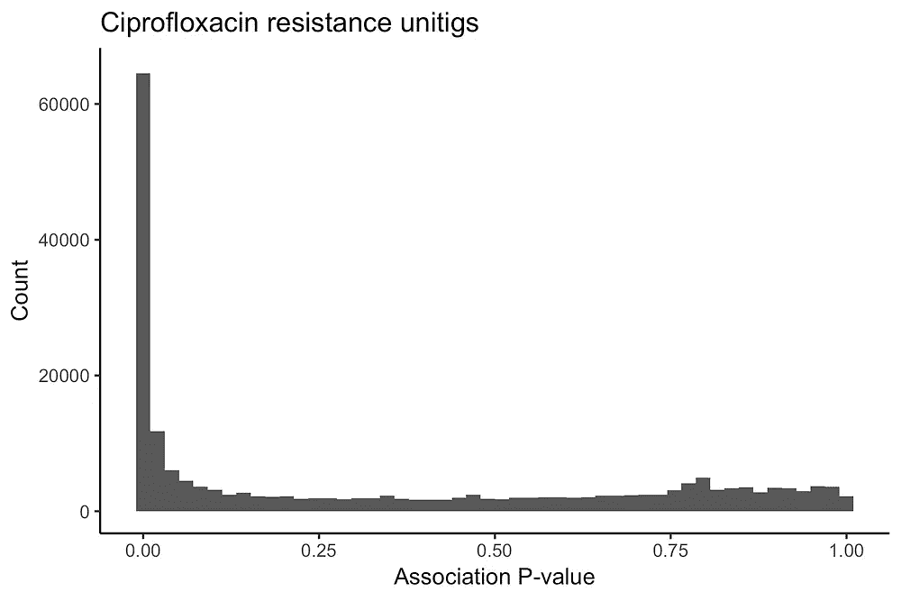

Strength of association between unitigs and resistance for the full set of 584,362 unitigs.

## 模型结构

我们研究了四种不同的模型类型:

*   弹性净逻辑回归
*   支持向量机
*   XGBoost
*   随机森林

我们还观察了两种阻力曲线:

*   阿奇霉素耐药性
*   环丙沙星耐药性

我整理了一个简单的模型训练笔记本，将数据分成五份进行交叉验证，并在每一份内对可能的超参数进行网格搜索，再次使用五份交叉验证。

使用这个函数，我们可以跨数据集比较不同模型类型的性能。

参与者对下一步有几个选择。在后续部分中，他们可以做的其他事情有:

*   看看你的模型学到了什么，这是否符合我们现有的抗生素耐药性知识
*   检查收集更多样本是否有可能提高算法的性能
*   探索更多的超参数，并尝试建立更准确的模型
*   尝试一些其他模型类型
*   预测对另一种抗生素的耐药性
*   尝试其他交叉验证和取样技术，以弥补抗药性样本的稀少(类别不平衡)
*   看一些关于抗生素耐药性和机器学习的文章

## 模型性能和学习

在我们测试的更复杂的 ML 方法中，阿奇霉素(AZM)的预测性能很高。虽然模型类型的表现非常相似，但随机森林在小得多的样本量下了解到了阻力。

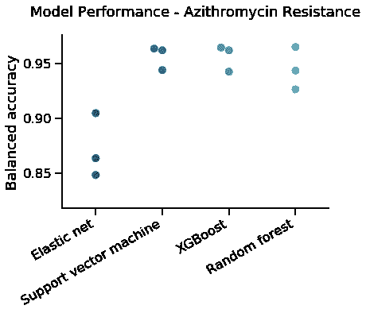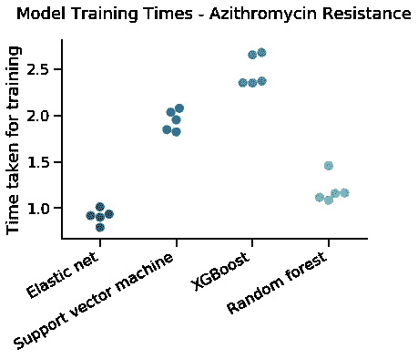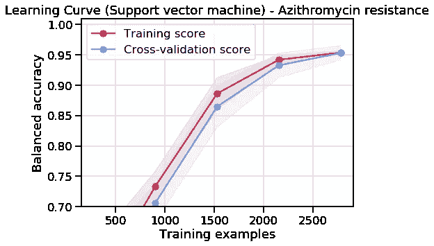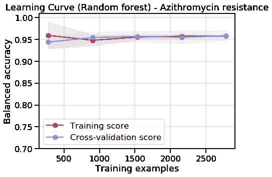

在训练结束时，两个模型都学会了寻找相同的 unitig，该 unitig 包含 23S 核糖体 RNA 中的一个突变，该突变负责大多数高水平的 AZM 抗性。

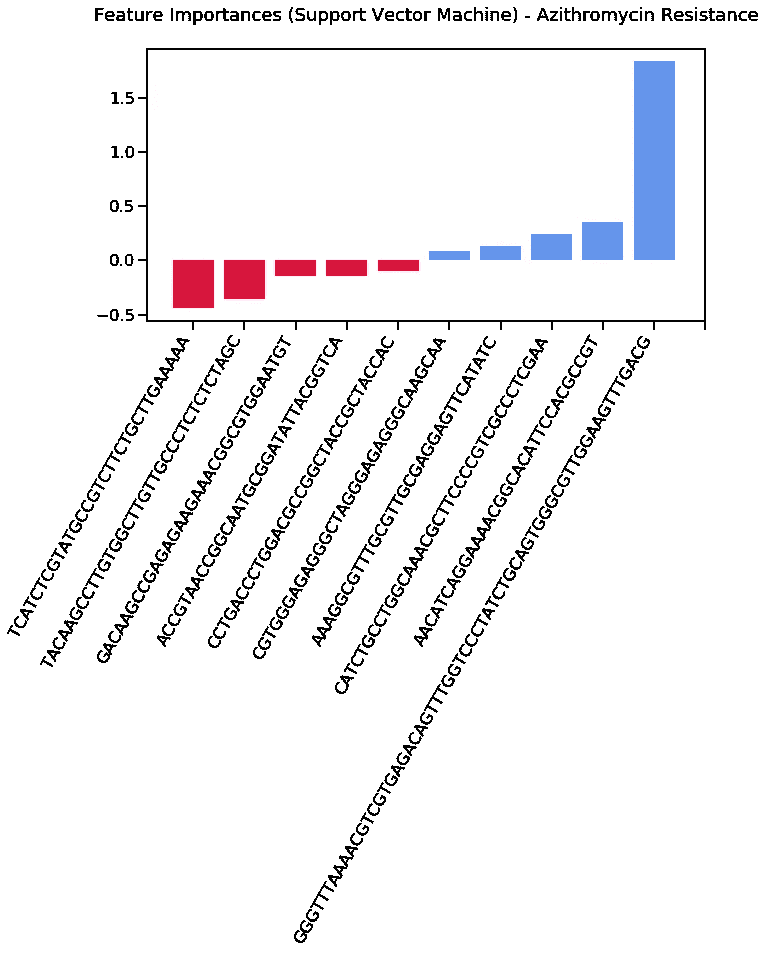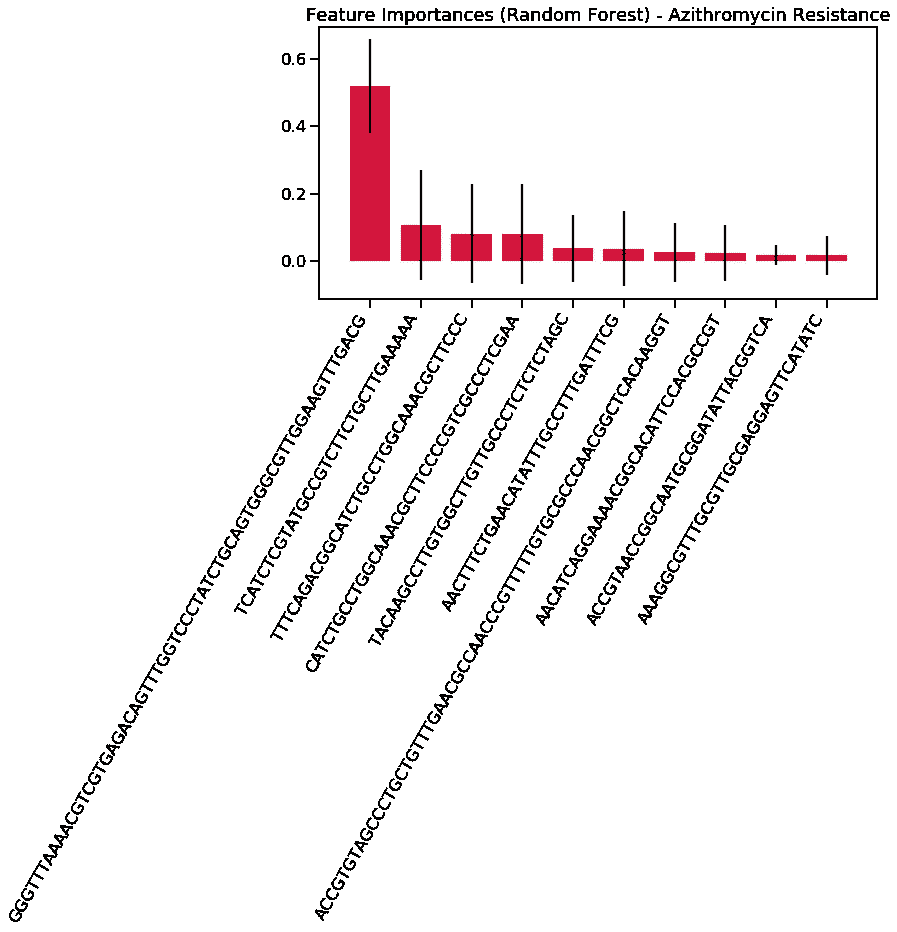

环丙沙星耐药性通常可以通过寻找导致绝大多数耐药性的一个或两个突变来预测任何物种。从这个意义上来说，它们是容易建立的模型，但是 ML 模型有时很难建立一个没有无关信息的模型。

下面，我们可以看到，随机森林找到了一个很好的解决问题的方法，但 SVM 似乎有过度适应。这两种模型看起来都不会从更多样本的收集中获得特别的好处。

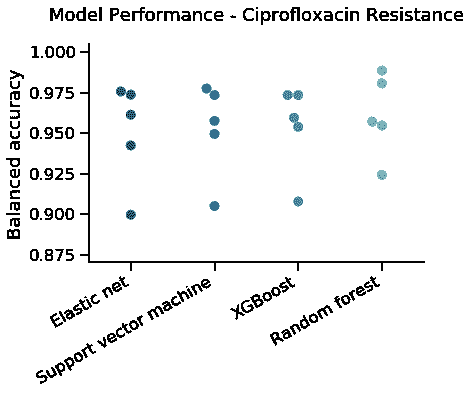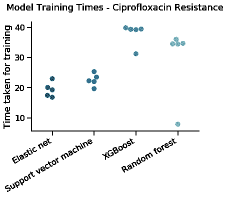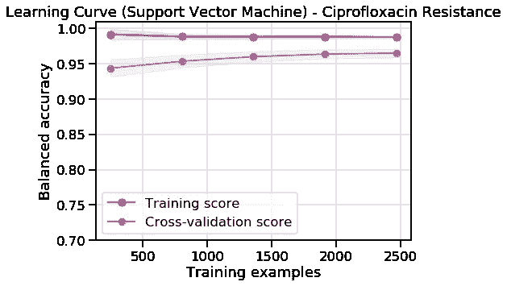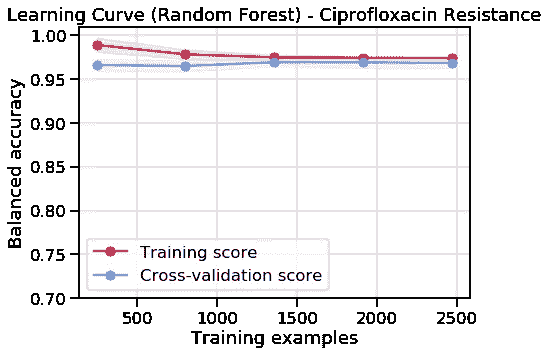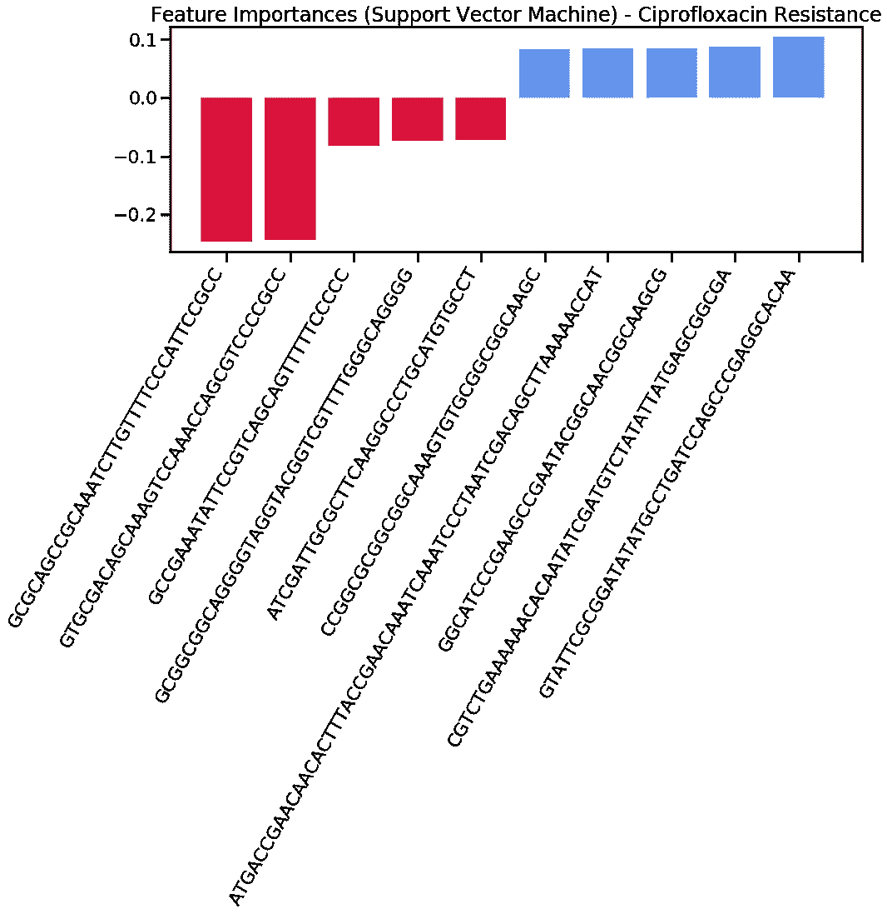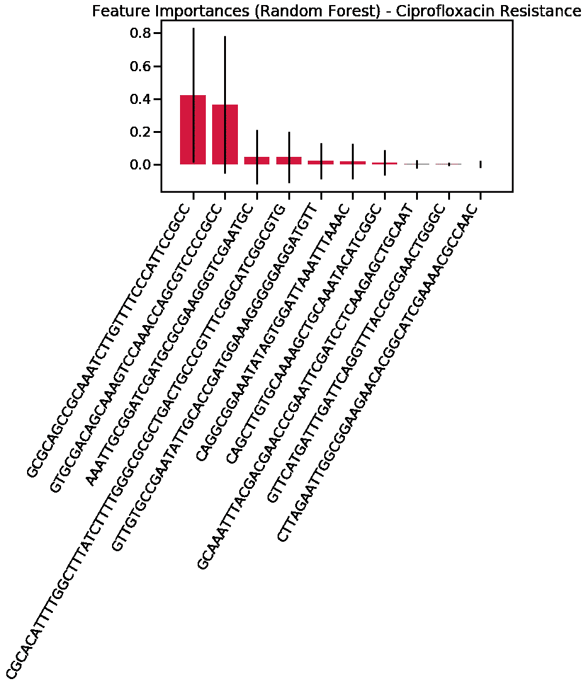

当我研究模型所了解的内容时，我失望地看到，尽管两个模型都非常准确，但我们知道驱动耐药性的主要突变并没有被这两个模型选为首要特征，这表明模型已经找到了一种准确预测耐药性的替代解决方案，不涉及实际的耐药机制。

这是该领域 ML 中一个相对常见的问题——变量如此之多，样本如此之少，以至于在数据中可能形成虚假的关联。这种高性能可能是由于模型识别了标记主要抗性菌株家族的单位，而不是真正的抗性机制。对此进行诊断的最佳方法是查看统一群在分离株的系统发育树上的位置。

## 你自己试试吧

这个工作坊完全是在 Kaggle 上进行的，所以你可以亲自尝试一下。

## 未来的工作

我主要是通过在 Kaggle 上跟随人们的笔记本来学习如何建立 ML 模型，所以我希望在这个领域工作的其他人会发现数据集和工作簿是对这个主题的很好的介绍。

现在我已经有了一个研讨会的起点，我计划随着时间的推移对它进行改进，并在更多的环境中运行它，特别是为那些没有太多机器学习经验的人。

我还想探索在出版物中包含笔记本的更新/扩充版本的可能性，让其他人容易地复制和调整分析。