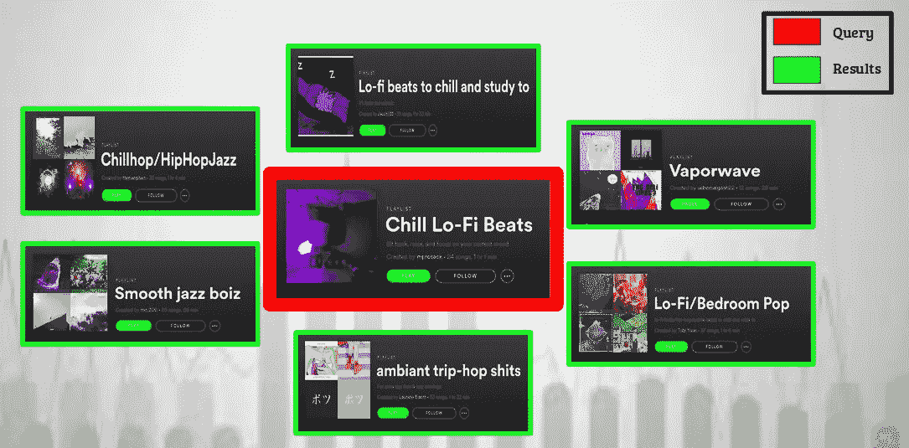
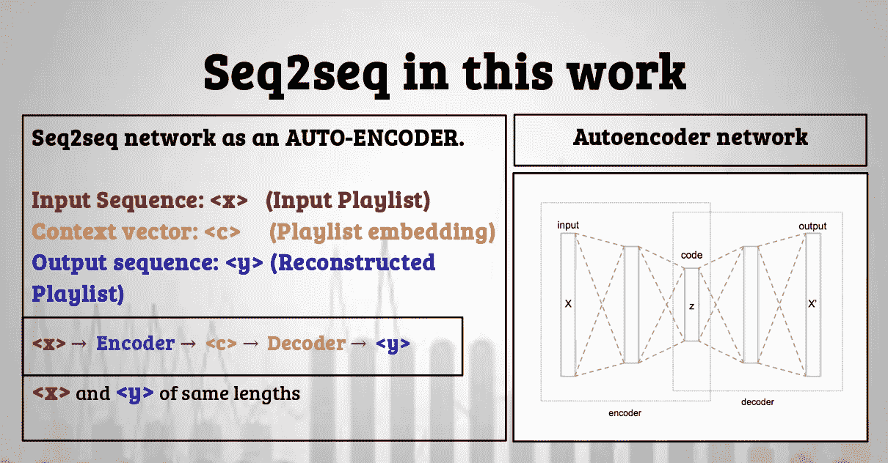
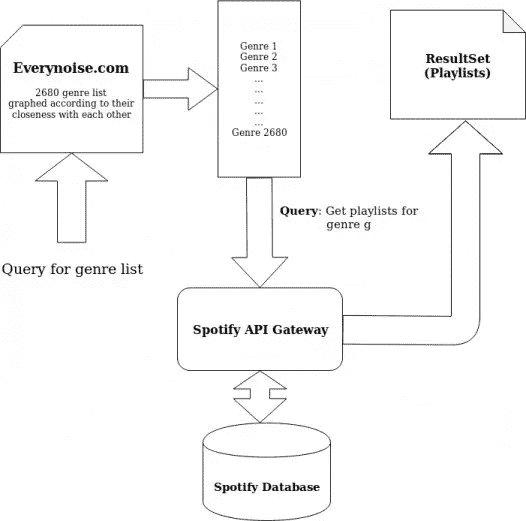
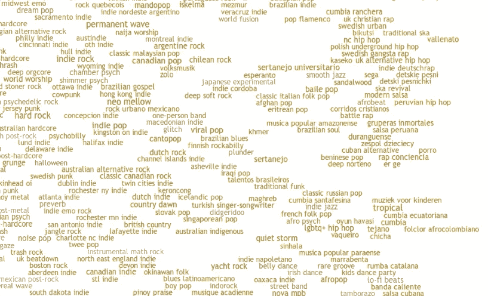
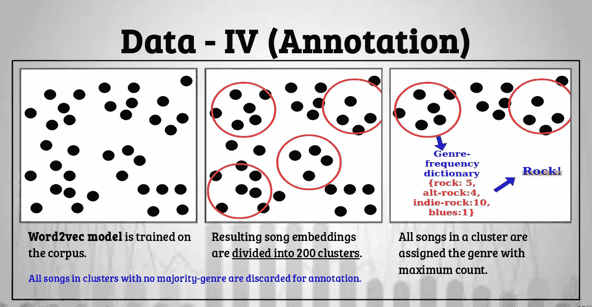
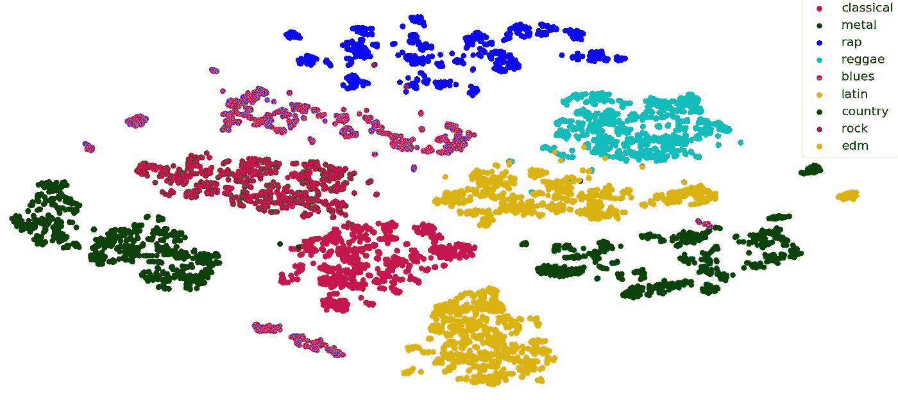
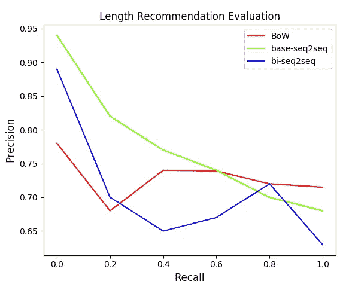
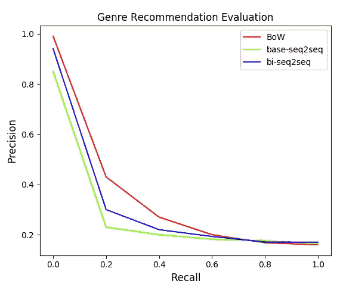

# 构建音乐播放列表推荐系统

> 原文：<https://towardsdatascience.com/building-music-playlists-recommendation-system-564a3e63ef64?source=collection_archive---------20----------------------->

## 内容摘自我们题为“音乐播放列表的表示、探索和推荐”的论文

Photo by [Mariah Ashby](https://unsplash.com/@mariahashby?utm_source=unsplash&utm_medium=referral&utm_content=creditCopyText) on [Unsplash](https://unsplash.com/search/photos/playlist?utm_source=unsplash&utm_medium=referral&utm_content=creditCopyText)

# 快速小结

## 目标

这项工作的目标是以一种捕捉播放列表的真正本质的方式来表示播放列表，即诸如类型、流派、种类、顺序和播放列表中歌曲数量的信息，并且可以用于诸如播放列表发现和推荐的任务。

## 贡献

*   **使用 sequence-2-sequence 学习为播放列表构建推荐引擎**。
*   **使用基于推荐的评估任务对作品**进行评估。
*   **为这部作品收集了 100 万个 Spotify 播放列表**和 1300 万首歌曲。

## 应用程序

**播放列表发现/推荐引擎**

我们的系统可以用于播放列表发现和推荐。给定查询播放列表，系统从数据库返回与输入播放列表最相似的播放列表。

Image displaying the usage for our playlist recommendation engine. The system returns playlists most similar to the query playlist.

# 开发人员友好的大纲

以下是我们建议方法的简要概述:

1.  使用 [Spotify 开发者 API](https://developer.spotify.com/) 和 everynoise.com 下载播放列表数据。
2.  通过去除噪声(稀有歌曲、重复歌曲、异常播放列表等)来过滤数据。)
3.  在数据上训练 sequence-2-sequence⁹模型以学习播放列表嵌入。
4.  注释数据(歌曲和播放列表)的流派信息。
5.  使用我们建议的评估任务评估嵌入。
6.  通过用学习到的播放列表嵌入填充 KD 树来构建推荐引擎，并通过利用最近邻方法来检索搜索结果。

# 介绍

如今，播放列表已经成为我们音乐聆听体验的重要组成部分。仅在 Spotify 上就有超过 30 亿条。每个时刻、每个心情、每个季节等等都有播放列表。数百万首歌曲唾手可得，如今的用户已经习惯了:

1.立即满足他们的音乐需求。
2。一段漫长的经历。

推荐引擎服务于第一个方面，而播放列表处理这种变化行为的第二个方面，使得播放列表推荐对于用户和音乐公司来说都极其重要。

# 什么是播放列表，我为什么要关心它？

> "播放列表是一组应该一起听的歌曲，通常有明确的顺序."

从用户和音乐研究者的角度来看，播放列表在今天是极其重要的。从用户的角度来看，播放列表是发现新音乐和艺术家的有效方式。从研究者的角度来看，重要的是要理解音乐是通过听来消费的，播放列表使这种听的体验正式化。播放列表是一个可以被发现和推荐的单元组件，就像艺术家、歌曲和专辑一样。

> “从研究人员的角度来看，重要的是要理解音乐是通过听来消费的，播放列表使这种听的体验正式化”

# 那么问题出在哪里？

如前所述，由于播放列表的使用迅速增加，播放列表推荐对当今的音乐服务至关重要。然而，在过去的几年里，从研究的角度来看，播放列表推荐已经变得类似于播放列表 prediction/creation⁷ ⁸和 continuation⁵ ⁶，而不是播放列表发现。然而，播放列表发现形成了整个播放列表推荐管道的重要部分，因为它是帮助用户发现平台上现有播放列表的有效方式。

# 探索是这个游戏的名字

我们的工作旨在以一种可以用来发现和推荐现有播放列表的方式来呈现播放列表。我们使用序列到序列 learning⁹来学习播放列表的嵌入，在没有任何监督的情况下捕捉它们的语义。然后，这些固定长度的嵌入可以用于推荐目的。

# 方法背后的直觉

## 为什么是序列对序列学习？

选择序列对序列学习背后的主要直觉是，播放列表可以被解释为句子，歌曲可以被解释为句子中的单词。在过去的几年里，序列对序列学习已经被广泛地用于学习有效的句子嵌入，例如神经机器翻译⁰.我们利用播放列表:歌曲::句子:单词的关系，并从自然语言处理领域的研究中获得灵感，以嵌入句子的方式对播放列表嵌入进行建模。

> 我们利用播放列表:歌曲::句子:单词的关系，并从自然语言处理的研究中获得灵感，以嵌入句子的方式对播放列表嵌入进行建模。

# 序列对序列学习

名称**序列到序列学习**的核心意思是训练网络接受序列并输出序列。因此，网络不是预测单个单词，而是输出整个句子，这可能是外语翻译，或者是语料库中的下一个预测句子，或者甚至是同一个句子，如果网络像自动编码器一样被训练的话。

对于这项工作，我们使用 seq2seq 框架作为[自动编码器](https://en.wikipedia.org/wiki/Autoencoder)，其中网络的任务是重建输入播放列表，并在这样做的过程中，学习输入播放列表的紧凑表示，它捕获播放列表的属性。

The overall concept of using seq2seq network like an autoencoder.

## Seq2seq 型号

我们将[注意力技术](https://lilianweng.github.io/lil-log/2018/06/24/attention-attention.html)用于本工作中使用的 seq2seq 模型，以学习播放列表嵌入，该播放列表嵌入捕获播放列表中歌曲之间的长期依赖性，因为播放列表的长度相对较长(50-1000 首歌曲)。我们用 seq2seq 模型的两种变体进行实验:

1.单向 seq2seq 网络
2。双向 seq2seq 网络

**双向 seq2seq** 网络不同于单向网络，因为使用了[双向 RNN](https://en.wikipedia.org/wiki/Bidirectional_recurrent_neural_networks) ，这意味着隐藏状态是在两个相反方向读取序列的前向 RNN 和后向 RNN 的串联。这允许网络为解码器捕捉更多上下文信息以预测输出符号。

# 数据:管理、过滤和注释

## 需要

对于这项工作，我们需要一个播放列表(句子)列表，每个播放列表由一个歌曲(单词)列表组成。为了以最简单的形式解决这个问题，我们只需要播放列表 id 和与适当的播放列表 id 对应的歌曲 id。

## 数据集创建

我们使用 [Spotify Web API](https://developer.spotify.com/documentation/web-api/) 下载数据。为了收集足够多的术语来查询 Spotify 系统，我们使用[everynoise.com](http://everynoise.com/)。这个互动网站包含了大约 2600 多种音乐类型的列表，根据它们之间的关系用图表表示出来，每种类型都有一个音频示例。我们解析这个网站主页上的数据，得到所有流派的列表。然后，对于每个流派，我们使用 Spotify Web API 下载播放列表(以及相应的歌曲信息)。整个流程如图 1 所示。

Fig 1: Data download workflow

以下是下载数据的详细信息:

*   **100 万个播放列表**
*   130 万艺术家。
*   **1300 万首曲目**
*   300 万首独特曲目
*   三百万张专辑
*   **2680 流派**

## 数据过滤

我们按照[1]的方法，通过移除稀有曲目和异常播放列表(歌曲数量少于 10 首或多于 5000 首)来进行数据清理。这样就剩下 **755k 个唯一播放列表**和**240 万首唯一曲目**。

## 注释

**问题:流派，流派遍地**

虽然这一步对于培训部分不是直接需要的，但是对于评估阶段却是至关重要的。**这一步的目的是给播放列表标上合适的流派**。目前可用的信息存在某些问题:

1. **Spotify 提供艺术家的流派信息，但不提供歌曲。**将歌曲流派标记为艺术家流派并不完全正确，因为艺术家可以拥有不同流派的歌曲。

2.**将歌曲指定为与播放列表**相同的流派，这将是有问题的，而播放列表又是从获取它的查询项中导出的。走这条路的问题是与它相关的主观性。提供了这种细粒度的注释，从分类的角度来看，软摇滚、80 年代摇滚、经典摇滚、摇滚会有什么区别？

因此，我们需要将类型(输出标签)的数量从 2680 减少到一个更容易管理的数量。

## 拟议解决方案

Data annotation workflow

1.为了解决这个问题，我们在我们的语料库上训练了一个 word2vec 模型来获得歌曲嵌入，该模型通过歌曲在语料库中的共现来捕获歌曲的语义特征(如流派)。

2.所得的歌曲嵌入然后被聚类成 200 个聚类(任意选择的数目，以试图保持注释过程的可行性和所形成的聚类的大小之间的平衡。期望更小的簇大小和更少的注释时间)。

3.对于每个集群:

艺术家流派应用于每首相应的歌曲，并创建一个流派频率(计数)字典。具有 17 首歌曲聚类的样本流派计数字典看起来像{摇滚:5，独立摇滚:3，蓝调:2，软摇滚:7}

从该字典中，具有明显多数的风格被指定为该群中所有歌曲的风格。

不具有明显流派优势的群集中的所有歌曲都被丢弃以进行注释。

基于所观察到的数据中的流派分布，并且作为将子流派(例如软摇滚)聚类成父流派(例如摇滚)的结果，最终选择用于注释聚类的流派是:

> 摇滚、金属、蓝调、乡村、雷鬼、拉丁、电子、嘻哈古典。

为了验证我们的方法，我们在由带注释的歌曲嵌入组成的数据集上训练了一个分类器。通过在训练时将训练集和测试集分开，我们实现了 94%的测试准确率。

t-SNE plot for genre-annotated songs, with 1000 sampled songs for each genre

**对于播放列表类型注释**，只有注释了所有歌曲的播放列表才会被考虑进行注释。此外，只有那些 70%以上的歌曲在一个流派上一致的播放列表才被分配流派。

# 估价

由于我们工作的目的是学习可用于推荐的播放列表嵌入，我们使用推荐任务来评估嵌入的质量。

## 推荐任务

本质上具有内在主观性的推荐最好通过具有用户标记的数据来评估。然而，在没有这种带注释的数据集的情况下，我们通过测量由嵌入模型创建的播放列表空间在何种程度上是相关的来评估我们提出的方法，就风格的相似性和紧密放置的播放列表的长度信息而言。

我们使用 Spotify ANNOY 库的近似最近邻算法来用播放列表嵌入填充树结构。随机选择查询播放列表，并将搜索结果与查询的播放列表在类型和长度信息方面进行比较。有九种可能的类型标签。为了比较长度，创建了十个输出类(跨越范围{30…250}，对应于大小为 20 的容器。考虑每个查询的平均 100 个精度值。

## 基线比较

为了评估我们提出的技术的性能，我们还需要某种基线性能。作为我们的基线模型，我们实验了词袋模型⁴的加权变体，它使用加权平均方案来获得句子嵌入向量，然后使用[奇异值分解(SVD)来修改它们。](https://en.wikipedia.org/wiki/Singular_value_decomposition)与传统平均相比，这种生成句子嵌入的方法被证明是一种更强的基线。

# 结果

如下图所示，推荐任务捕获了一些关于不同模型捕获不同特征的有效性的有趣见解。首先，**高精度值证明了播放列表嵌入空间**的相关性，这是推荐系统的首要期望。此外，BoW 模型比 seq2seq 模型更好地捕捉体裁信息，而 seq2seq 模型更好地捕捉长度信息，这表明了不同模型对不同任务的适用性。

# 应用程序

这项工作的直接应用之一是播放列表的推荐引擎。给定一个查询，系统将从语料库中推荐/检索相似的播放列表。在推荐任务部分中讨论的树数据结构可以直接用于这个目的。给定一个查询播放列表，它的 k 个最近邻居将是与其最相似的项目，并且将是系统推荐。我们的工作演示可以在视频中看到。

Recommendation System Demo video

仅此而已。我们提出了一种基于 seq2seq 的播放列表嵌入学习方法，该方法可用于播放列表发现和推荐等任务。我们的方法还可以通过集成基于内容的(歌词、音频等)来扩展用于学习甚至更好的播放列表表示。)歌曲嵌入模型，以及用于通过使用变化的序列模型来生成新的播放列表。

在本文中，有更多的评估技术来评估关于编码信息的播放列表嵌入的质量，这超出了本文的范围。我将在另一篇文章中讨论这个问题。

下次见！

页（page 的缩写）s——这是[论文](https://arxiv.org/abs/1907.01098)的链接。

# 参考

[1][https://news room . spotify . com/2018-10-10/庆祝 Spotify 发现十年/](https://newsroom.spotify.com/2018-10-10/celebrating-a-decade-of-discovery-on-spotify/)

[2] Keunwoo Choi、George Fazekas 和 Mark Sandler。使用在轨道内转换上训练的 rnn 的播放列表生成算法。arXiv 预印本 arXiv:1606.02096，2016

[3]菲尔兹、本和保罗·拉梅尔。"通过自动点唱机寻找路径——播放列表教程，ISMIR . "伊斯米尔，乌得勒支(2010 年)。

[4]德穆伊杰和维海格。"学习音乐播放列表的偏好设置。"人工智能 97.1–2(1997):245–271。

[5]青-陈为、保罗·拉梅尔、马库斯·舍德尔和哈米德·扎马尼。Recsys 挑战赛 2018:自动音乐播放列表延续。第 12 届 ACM 推荐系统会议论文集，527-528 页。ACM，2018

[6] Maksims Volkovs，Himanshu Rai，Cheng，Ga Wu，Yichao Lu 和 Scott Sanner。大规模自动播放列表延续的两阶段模型。《2018 年美国计算机学会推荐系统挑战赛论文集》第 9 页。ACM，2018

[7]安德烈亚·安德里奇和戈弗雷多·豪斯。基于跟踪用户收听习惯的自动播放列表生成。多媒体工具和应用，29(2):127–151，2006。

[8]贝丝·洛根。基于内容的播放列表生成:探索性实验。InISMIR，2002 年。

[9] lya Sutskever、Oriol Vinyals 和 Quoc V Le。用神经网络进行序列间学习。神经信息处理系统进展，第 3104–3112 页，2014 年。

[10] Dzmitry Bahdanau、Kyunghyun Cho 和 Yoshua Bengio。通过联合学习对齐和翻译的神经机器翻译. arXiv 预印本 arXiv:1409.0473，2014。

[11] Mikolov，Tomas 等，“向量空间中单词表示的有效估计” *arXiv 预印本 arXiv:1301.3781* (2013)。

[12]沈艳芳莉莉艾。音乐盒:导航你的音乐空间。麻省理工学院博士论文，2008 年

[13] Bernhardsson，e .,“骚扰:C++/Python 中的近似最近邻，针对内存使用和加载/保存到磁盘进行了优化”*GitHub*T8*https://GitHub。**com/Spotify/airy*(2017)。

[14]阿罗拉、桑吉夫、梁和马腾宇。"一个简单但难以击败的句子嵌入基线."(2016).