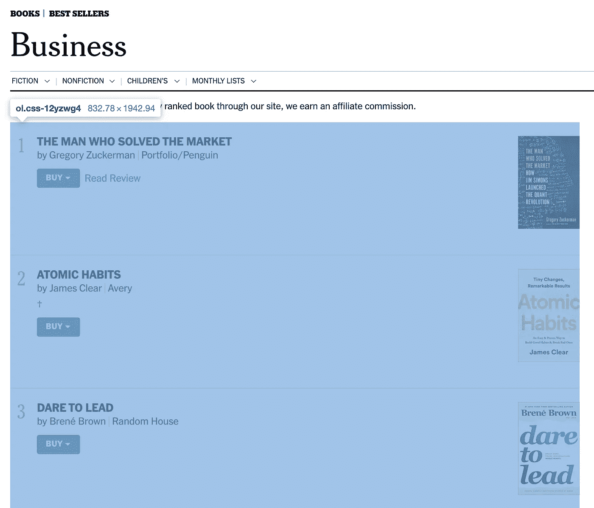
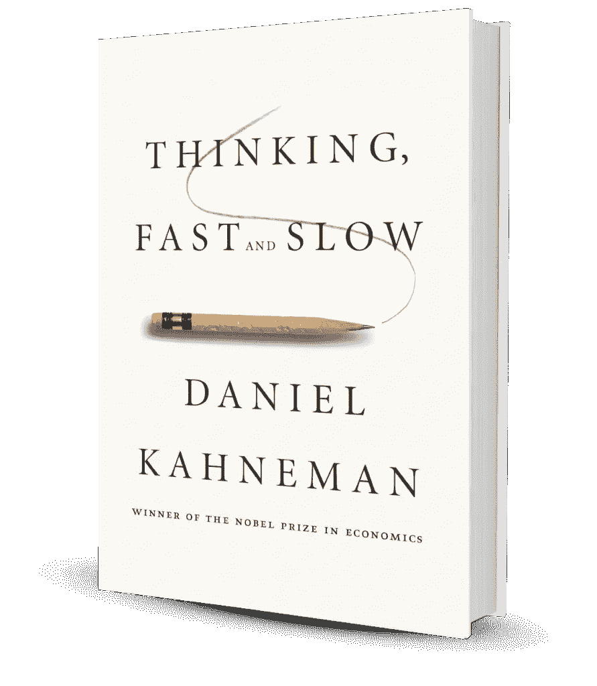

# 用一个简单的 Python 脚本构建我的 2020 阅读清单

> 原文：<https://towardsdatascience.com/building-my-2020-reading-list-with-a-simple-python-script-b610c7f2c223?source=collection_archive---------13----------------------->

## 使用 Requests 和 BeautifulSoup，我提取了《纽约时报》畅销书(商业主题)列表来充实我的阅读列表

# 新年决心:2020 年 12 本书

我承认在过去的几年里我没有读太多的书。随着 2012 年 MOOC(大规模开放在线课程)的发展，我大部分业余时间都在 Coursera、edX 和 LinkedIn 上学习。MOOC 上的许多内容很好地阐述了知识(如编程技术、统计概念等)，这对我早期的职业成长有很大帮助；然而，我总觉得只用 MOOC 少了些什么，但我不知道是什么。

今天，在 2019 年底，在读完《动力:关于激励我们的令人惊讶的真相》并开始享受《关于困难的困难:在没有简单答案的情况下创业》后，非常神奇的是(对我来说)，阅读书籍，将它们放在手边，可以引发大量的思考，也有助于连接许多随机的想法。这些心理活动加强了理解，并引导一个人的思想深入到文本本身之外。这是一种如此独特的体验，是我过去在任何 MOOC 平台上都无法理解的！于是我下定决心，定下一个新年决心:2020 年读 12 本书。


Photo by [Sincerely Media](https://unsplash.com/@sincerelymedia?utm_source=unsplash&utm_medium=referral&utm_content=creditCopyText) on [Unsplash](https://unsplash.com/s/photos/book?utm_source=unsplash&utm_medium=referral&utm_content=creditCopyText)

那么我应该优先考虑哪些书呢？鉴于我的特定领域和职业方向，我喜欢在第一个“阅读年”更多地关注商业和领导力方面。除了博学的朋友推荐的几本好书(例如《关于困难的困难》、《万亿美元蔻驰》)，我仍然缺少与商业和领导力相关的好书。于是我向著名的《纽约时报畅销书》求助:如果一本书卖得这么好，有资格上榜，那它一定有值得一读的见解。

# 太多的书是“纽约时报畅销书”

我打开《纽约时报》上最近的商业列表([链接](https://www.nytimes.com/books/best-sellers/business-books/))后，它显示了 10 本书的书名，而且这个列表每个月都会改变！如果我已经阅读了其中的大部分，并且只是从列表中进行增量选择，那就太好了，但显然这不是我的情况，那么如何从所有历史“畅销书”中优先选择几本呢？我试着在谷歌上搜索类似“纽约时报畅销书排行榜”的东西，但它没有返回任何有意义的结果:也许没有人像我一样有特殊的需求。我试图用历史数据来支持我的第一年阅读清单，而其他人可能已经阅读了其中的大部分:(

尽管如此，我还是不想放弃，仅仅从最近的榜单中随机挑选几本肯定不是我的风格:我想用硬核数据来支持我的选择，我想知道纽约时报畅销书排行榜历史上最受欢迎的书；然而，这些数据分散在多个网页上，不便于阅读。面对这样的挑战，数据科学家会怎么做？嗯，他/她要写一些代码。我的目标很明确，获得所有历史性的纽约时报畅销书排行榜(商业话题)，然后评估这些书，建立我的 2020 年阅读清单。

# 有趣的部分:使用 Python 进行 web 分析

我的工作流程非常简单明了；它有三个步骤。

## 第一步。了解 web 组件

我检查了两件事:

1.  所有月份中 URL 的命名是否一致
2.  是否可以一致引用所有 URL 中的 web 元素。

对于纽约时报网站，所有的 URL 都具有类似[https://www . nytimes . com/books/best-sellers/2019/08/01/business-books/](https://www.nytimes.com/books/best-sellers/2019/08/01/business-books/)的结构，年份和月份是唯一的变量。检查过了！

对于 web 元素，每个月的前 10 个列表组织在一个有序列表(“ol”)中，类名为“css-12yzwg4”。内容以类名“css-xe4cfy”保存在 div(“div”)内部，每本书都是内容的一项。书名有“h3”标签，类名“css-5pe77f”，图书作者有“p”标签，类名“css-hjukut”。检查过了！



Web element: the top 10 list for each month is organized inside an ordered list (“ol”) with class name “css-12yzwg4”

现在我们得到了所有的关键元素布局，它们在所有的 URL 上都是一致的，这对于继续下一步是个好消息。

## 第二步。编写脚本来自动下载

我已经有一段时间没有使用 Requests/BeautifulSoup 了，所以从其他人的作品中借鉴一下也不错。在“python requests beautifulsoup”上搜索，我找到了一篇不错的文章可以参考:[https://www . digital ocean . com/community/tutorials/how-to-work-with-web-data-using-requests-and-beautiful-soup-with-python-3](https://www.digitalocean.com/community/tutorials/how-to-work-with-web-data-using-requests-and-beautiful-soup-with-python-3)。

我的代码流非常简单:

1.  使用请求加载页面 URL
2.  使用 BeautifulSoup 解析出所需的元素
3.  使用 Pandas Dataframe 保存结果。

([代码链接](https://github.com/PanWu/NYTimeList/blob/master/get_nylist.py))

```
# This scripts aims to get all book names on historic New York Time Best Sellers (Business section)
# The purpose is to:
#   1\. help to compile my reading list in 2020
#   2\. serve as reference to use Python for simple web analytics# One interesting finding:
#   1\. no best seller list for 2015-08, maybe a bug in New York Times systemimport requests
import pandas as pd
from bs4 import BeautifulSoupnylist = pd.DataFrame()# the earliest list is 2013/11/01, so the starting year is 2013
for the_year in range(2013, 2020):
    for the_month in range(1, 13):# one need to get the URL pattern first, and then use Requests package to get the URL content
        url = '[https://www.nytimes.com/books/best-sellers/{0}/{1}/01/business-books/'.format(the_year,](https://www.nytimes.com/books/best-sellers/{0}/{1}/01/business-books/'.format(the_year,) str(the_month).zfill(2))
        page = requests.get(url)
        print(" --  try: {0}, {1} -- ".format(the_year, str(the_month).zfill(2)))# ensure proper result is returned
        if page.status_code != 200:
            continue# one may want to use BeautifulSoup to parse the right elements out
        soup = BeautifulSoup(page.text, 'html.parser')
        # the specific class names are unique for this URL and they don't change across all URLs
        top_list = soup.findAll("ol", {"class": "css-12yzwg4"})[0].findAll("div", {"class": "css-xe4cfy"})
        print(the_year, the_month, len(top_list))# loop through the Best Seller list in each Year-Month, and append the information into a pandas DataFrame
        for i in range(len(top_list)):
            book = top_list[i].contents[0]
            title = book.findAll("h3", {"class": "css-5pe77f"})[0].text
            author = book.findAll("p", {"class": "css-hjukut"})[0].text
            review = book.get("href")
            # print("{0}, {1}; review: {2}".format(title, author, review))
            one_item = pd.Series([the_year, the_month, title, author, i+1, review], index=['year', 'month', 'title', 'author', 'rank', 'review'])
            nylist = nylist.append(one_item, ignore_index=True, sort=False)# write out the result to a pickle file for easy analysis later.
nylist.to_pickle("nylist.pkl")
nylist.to_csv("nylist.csv", index=False)
```

## 第三步。分析数据以发现真知灼见

现在，我们已经将所有畅销书(商业)标题数据保存在数据框架中，我做了一些快速探索，发现了以下事实:

*   从 2013 年 11 月到 2019 年 12 月，共有 189 本书上榜，其中 92 本只在榜单上出现过一次。
*   名单中提及最多的 5 本书是:《思考，快与慢》(58)、《局外人》(51)、《习惯的力量》(45)、《勇气》(29)和《极端所有权》(25)。
*   如果只关注每月第一畅销书，提及最多的 5 本书是:《坏血》(7)、《敢于领导》(7)、《木兰花的故事》(7)、《向前一步》(5)和《局外人》(5)。



“Thinking, Fast and Slow” shows up more than 58 times in the New York Times Best Seller (Business) list, between Nov 2013 to Dec 2019

注意。纽约时报网站上没有 2015 年 8 月的数据，我认为这应该是他们需要解决的一个问题。

# 我的阅读清单上增加了六本书

上面的统计数据提供了很好的见解，然后我查看了他们各自的评论，以理解高层次的概念。虽然我认为所有的书都很棒，但鉴于我的时间有限，我在 2020 年的阅读清单中增加了以下 6 本书:

*   丹尼尔·卡内曼的《思考，快与慢》
*   约翰·卡雷鲁的《坏血》
*   布琳·布朗的《敢于领导》
*   “极端所有权”，作者乔科·威林克和叶小开·巴宾
*   查尔斯·杜希格的《习惯的力量》
*   《向前一步》，雪莉·桑德伯格和内尔·斯科维尔合作

# 最后

这是一个使用 Python 解决实际问题的简单演示。编码工作花了我大约一个小时，而写这篇文章要花更长的时间……这里有一些事情你可能会觉得有帮助:

*   历史悠久的《纽约时报》畅销书排行榜([链接](https://github.com/PanWu/NYTimeList/blob/master/nylist.csv))可能对你准备阅读清单有所帮助
*   如果你也尝试用 Python 做基本的网络分析，代码([链接](https://github.com/PanWu/NYTimeList/blob/master/get_nylist.py))可能会有帮助
*   这一过程可能会揭示数据科学家在面临这样的挑战时是如何思考的

享受阅读，祝你新年快乐！